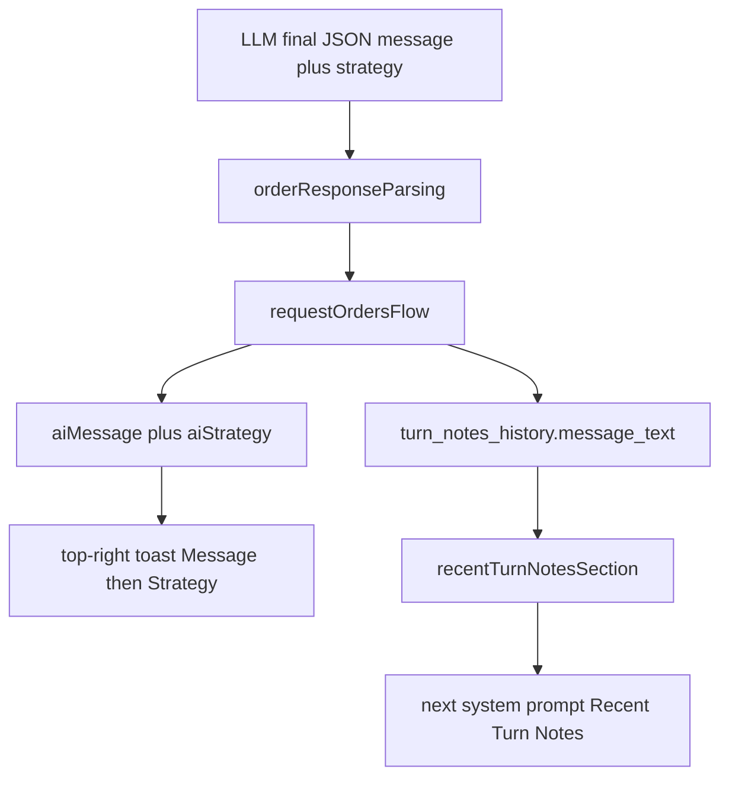

# AI Commander Message (Taunt/Threat) — Execution Plan

This document defines a reliability-first implementation for a one-line in-character commander Message (taunt/threat) generated in the same final JSON as Strategy, shown above Strategy in the top-right toast, persisted on turn notes, and re-injected into later prompts.

**Audience:** Coding agent or developer implementing the feature end-to-end.  
**Primary objective:** Maximum reliability, clarity, and independently verifiable increments.  
**Do not** put this document’s internal section or checklist labels into product code, comments, configuration, or other version-controlled artifacts.

---

## 1. Goal, scope, and done criteria

### 1.1 Goal

1. The opponent LLM emits a one-line in-character taunt/threat to the human player in the same final JSON as `"strategy"`, at approximately the same length.
2. The top-right toast (`#ai-strategy-toast`) shows two labeled sections when content exists: **Message** on top, **Strategy** below. Titles match the lower-right toast (bold block `<strong>` with trailing colon). Body is plain text (no bullets, no extra indent).
3. Empty sections are hidden. The toast shows if either field is non-empty after trim; both empty hides (clears a stale previous toast).
4. Message is persisted on `turn_notes_history` and re-injected into later prompts under Recent Turn Notes the same way as Strategy.

### 1.2 Explicitly out of scope

1. Changing lower-right `#map-toast` layout or loss reporting.
2. Hard length truncation of Message or Strategy.
3. A migration framework for existing saves (destructive `user_version` bump, same as prior schema changes).
4. Hand-editing `static/renderer.js` (regenerate with `npm run build:renderer`).
5. Touching `ai_pending_orders.strategy_text` (pending air/ferry/embark JSON, not player-facing strategy).

### 1.3 Definition of done

1. Locked behaviors in Section 2 are implemented.
2. All listed seams (prompt, parse, persist, prompt injection, IPC, toast) carry Message as a sibling of Strategy.
3. Happy-path and essential-failure tests for new contracts pass.
4. New/updated non-override methods have orienting comments.
5. `npm test`, `build:main`, and `build:renderer` succeed.

---

## 2. Locked behavior contract

| Rule | Behavior |
|------|----------|
| Voice | In-character enemy commander addressing the human player; psychological taunt/threat; do not reveal real orders, hex codes, unit ids, or operational intent. |
| Toast order | Message on top, Strategy below. |
| Empty toast sections | Hidden, like the lower-right toast. Show if either field is non-empty after trim. |
| Toast body | Plain text under titles; no bullets; no extra indent. Titles: same `<strong style="display:block">Title:</strong>` as lower-right. |
| JSON / parse / flow | Field name `message` beside `strategy`. Soft `"<one-line>"`. Missing/non-string coerces to `''`; parse does not fail. |
| IPC | `aiMessage` beside `aiStrategy`; `precomputedAiMessage` beside `precomputedAiStrategy`. Omit when empty after trim. |
| DB | `message_text` beside `strategy_text` on `turn_notes_history`. |
| Prompt history | Recent Turn Notes always emit `- Message:` then `- Strategy:`, using `(none)` when empty. Message-only turns are not suppressed. |
| Schema | `EXPECTED_USER_VERSION` 13 → 14; destructive recreate of in-progress saves. |
| Coaching | New `- Your message is:` block is about the JSON `"message"` field. Do not confuse with static doctrine `- Your strategy is:`. |

### 2.1 Naming map

- JSON / parse / `RequestAiOrdersResult` / `afterResolution` return: `message` (alongside `strategy`)
- IPC to renderer: `aiMessage` (alongside `aiStrategy`)
- Ready payload cache: `precomputedAiMessage` (alongside `precomputedAiStrategy`)
- DB: `message_text` (alongside `strategy_text`)
- Toast / prompt labels: `Message` and `Strategy`

---

## 3. Architecture

Existing strategy path stays intact. Message is a sibling at every seam.

---

## 4. Implementation increments

File-size: `readyTypes.ts` and `readyHandler.ts` are already over 1000 lines; `requestOrdersFlow.ts` is near 1000. Make small additive diffs; do not rewrite those files. `upsertTurnStrategyNote` uses a required `texts` object so `strategyText` and `messageText` cannot be swapped.

Regression watchlist:

- Post-consult `if (aiStrategy) show else hide` would hide a message-only toast. Call `showAiStrategyToast({ message, strategy })`; empty both → hide.
- `buildJsonAssistantRepairSchema` must include `"message":"..."` before `"strategy"`.
- Parse `obj.message` on the **orders envelope**, never the chat completion wrapper.
- Upsert always writes both columns; callers always pass both `texts` keys (values may be `null`).
- `gameIpcHandlers` assigns `aiMessage` independently of `aiStrategy`.
- Every `precomputedAiStrategy = null` also clears `precomputedAiMessage`.
- Matrix test asserts the exact strict-schema sentence; update it with the contract.
- Existing parse fixtures without `"message"` must still parse (`message === ''`).
- `hidePlanningChromeToasts` stays hide-only; later shows still work.

### Increment 1 — Prompt contract and parse

1. `promptContracts.ts`: submit header and strict schema include `"message"` (string) before `"strategy"`; field coaching sentence; example `message` first in the object (strategic: `You will not find safety in delay.`; tactical: `This close, hesitation is already a casualty.`).
2. `promptText.ts`: every submit-JSON nudge lists `"message"` as well as `"strategy"`.
3. `buildJsonAssistantRepairSchema`: prepend `"message":"..."`.
4. `openRouterBuildSystemPrompt.ts`: `COACHING_MESSAGE_BLOCK` immediately after `COACHING_STRATEGY_BLOCK` in both tactical and strategic context.
5. `orderResponseParsing.ts`: coerce `message` like `strategy` (trim; non-string/null → `''`).
6. Types: `message?: string` beside `strategy` on parse result, `RequestAiOrdersResult`, flow types, example payload.
7. Tests: `promptContracts.test.ts`, `orderResponseParsing.test.ts`, `openRouter.matrix.test.ts` (exact schema string + `- Your message is:`).

**Verify:** `npm test`. No toast or DB change yet.

### Increment 2 — Persist `message_text`

1. Schema: `message_text TEXT` on `turn_notes_history`.
2. `EXPECTED_USER_VERSION` 13 → 14.
3. `TurnNoteRow.messageText`; `upsertTurnStrategyNote(..., texts: { strategyText, messageText })` writes both columns on insert and conflict; debug log `hasStrategy` / `hasMessage`.
4. `getRecentTurnNotes` selects `message_text`.
5. `upsertTurnLossNote` does not mention `message_text`.
6. All call sites pass the `texts` object (`messageText: null` when the caller does not yet have a message).
7. Tests: merge with losses, loss upsert does not wipe message, strategy+message upsert does not wipe losses, window/tactical-clear still pass.

**Verify:** `npm test`.

### Increment 3 — Recent Turn Notes injection

1. `formatTurnBlock`: `- Message:` then `- Strategy:` then losses; `(none)` when empty.
2. `rowHasPromptContent`: non-empty `messageText` counts as content.
3. Tests: losses-only shows both `(none)` lines; message-only is kept with `Strategy: (none)`; empty turns still suppressed; tactical still uses `Turn N:`.

**Verify:** `npm test`.

### Increment 4 — Consultation write and return value

1. `requestOrdersFlow.ts`: `markSuccessfulConsultation` writes both texts; success return includes `message: parsed.message`.
2. `afterResolution.ts`: map `message: result.message` on strategic and tactical success returns.
3. Debug logs: `hasMessage` boolean.

**Verify:** `npm test`.

### Increment 5 — Shared toast section model

1. `src/shared/aiStrategyToastContent.ts`: titles `Message` / `Strategy`; `buildAiStrategyToastSections`; `hasAiStrategyToastContent`. Omit empty/whitespace; Message first.
2. `src/shared/aiStrategyToastContent.test.ts`.
3. Do not change `showAiStrategyToast` yet.

**Verify:** `npm test`.

### Increment 6 — Toast render + IPC + call sites

1. Export `appendMapToastSectionHeader`. `showAiStrategyToast(content: AiStrategyToastFields)`: empty → `hideAiStrategyToast`; else title + plain body spans, ` ` between sections. Drop unused `modelName`.
2. IPC: `aiMessage` / `precomputedAiMessage` beside existing strategy fields. Mapping helper `optionalConsultToastFields`. Independent overwrite in `gameIpcHandlers`. Clear `precomputedAiMessage` wherever strategy cache is cleared.
3. All toast call sites: `showAiStrategyToast({ message: payload.aiMessage, strategy: payload.aiStrategy })`.
4. Prefer `CommitHumanTacticalDraftOrdersIpcResult` over the inline commit-result cast in `readyHandler.ts`.

**Verify:** `npm test`, `npm run build:main`, `npm run build:renderer`.

### Increment 7 — End-to-end verification

1. `npm test` and `npm run build:renderer`.
2. Manual strategic and tactical: section order, title style, plain body, empty-section hide, dismiss / auto-hide, planning hide.
3. Next prompt includes Recent Turn Notes `- Message:` and `- Strategy:`.
4. New DB at `user_version` 14.
