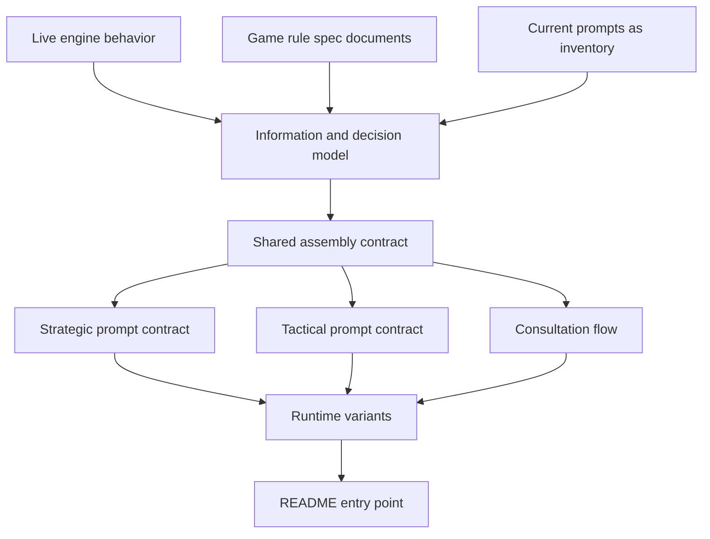

# AI commander prompt spec — execution plan

> **For agentic workers:** Implement this plan task-by-task. Do not commit or push. Do not put this document's task labels into the spec files you write (or into product code, comments, or config).

**Goal:** Create one canonical spec package that coding agents can maintain prompt-generating code against, covering the full consultation and every locked runtime variant, so prompt churn stops being driven by tribal knowledge and stale copy.

**Location:** the finished package lives at `doc/ai-commander-prompts/`. The create-under-`ai-commander-prompts/` steps below are historical.

**Architecture:** Exactly nine markdown files under `ai-commander-prompts/`. README is the only entry point. Long chapters stay in their file; do not split or add appendices. The spec is both (1) the information and decision model a weak model needs and (2) the assembly contract for every message the model sees. **All rules and heuristics live in the system prompt.** User and repair messages only give this-consult submit instructions and must not add, weaken, or contradict a rule.

**Out of scope:** Prompt-generating code, tests, and runtime behavior. A later plan will align code to this spec.

## Locked decisions

- Spec documents only. No code or test edits.
- Spec nature: information/decision model **and** section/assembly contract (headings, table columns, include/omit, JSON/tools, **every consultation message**).
- Authority order: **live engine first**, then game-rule documents in this directory. Current prompt text is an **inventory of what we already tell the model**, not truth. Add information the engine already provides when a weak model needs it, even if today's prompts omit it. Do not invent new game systems.
- Coaching is **required system-prompt content**. Rewrite against engine truth. Improve on today's heuristics when the engine supports a clearer, more actionable rule.
- **Coaching home:** the system prompt owns every rule and heuristic. The initial user message, malformed-completion corrective user message, and parse-repair user message only tell the model how to submit **this consult**. They must not add, weaken, or contradict a system rule. If today's user text contains extra rules (production doctrine, tempo, Best Options copy, scouting, etc.), the inventory flags them; later files move the rule into the system contract or drop it if `engine-false`. User text may point at a system section ("use the briefing / submit JSON") without restating the rule.
- **Full consultation is in scope:** system prompt, initial user message, tool-result wrapping, malformed-completion corrective user messages, and parse-repair user messages. Chat transport, API keys, and max-token retry policy are out of scope except where they change **text the model sees**.
- **Every runtime variant below must have an explicit contract** (not "same as default unless you infer it"): fog on vs off; tool groups off (memory, standing orders, production, planning/assessment); roster composition (no air, no naval, no observed enemies, empty Best Options, orderless-only); every `scenarioId` the engine supports; game-size / unit-cap and huge-roster behavior; every-turn vs event-driven consults and tactical post-beat consult vs skipped beat.
- Tactical shape comes from **current code**, never from `debug-last-tactical-prompt.txt` (stale). `debug-last-strategic-prompt.txt` and `debug-last-user-prompt.txt` are current **examples of output shape**, not authority.
- The spec package must be usable without this execution plan.

## Quality bar (the spec is not done until all six hold)

1. **Complete.** Every engine snapshot field, every assembled heading, and every consultation role is mapped to a requirement or an explicit exclusion. Every locked variant has a row. No `TBD` / `TODO` / "usually."
2. **Correct.** Facts, legal actions, stats, and coaching match live engine symbols. When engine and an older spec document disagree, the prompt spec follows the engine and records the mismatch.
3. **Consistent.** System JSON contract, initial user message, repair schema, and tool-result encoding agree. User/repair text contains no independent rules. Strategic vs tactical legal actions do not leak. Tables that must share a definition (Suggested Destination vs Best Options approach) name the same engine helper.
4. **Regression-resistant.** Empty, cap, fog, no-air, no-tools, missing `scenarioId`, Large rosters, skipped tactical consults, briefing-absent, overlapping home regions, occupied destinations, `hold_fire` vs tempo, and face-crossing distances are specified so a later implementer cannot "fix" one case by breaking another.
5. **Addresses stated needs.** A weak model can decide from the contracted information; coding agents have one place to change prompt behavior; the spec is derived from current prompts and existing spec documents but is **not limited** by them.
6. **Complies with repo rules.** Spec lives under `.spec/`. No plan/task identifiers in the spec package. No commits. No product-code edits. The package is exactly the nine files listed below; chapters may be long.

## Spec package (create these files; no other new files)

- `ai-commander-prompts/README.md`
- `ai-commander-prompts/source-inventory.md`
- `ai-commander-prompts/information-decision-model.md`
- `ai-commander-prompts/assembly-contract.md`
- `ai-commander-prompts/strategic-prompt.md`
- `ai-commander-prompts/tactical-prompt.md`
- `ai-commander-prompts/consultation-flow.md`
- `ai-commander-prompts/variants.md`
- `ai-commander-prompts/crosswalk.md`

Do not name files after this plan's tasks. Item IDs in the spec must be domain names (`HEX_IDENTITY`, `TEMPO_RANGED_SHOT`), not plan labels.

First implementation step: copy this execution plan to `ai-commander-prompt-spec-execution-plan.md` (body only; omit Cursor frontmatter). Then create the package files.

## Global constraints for the executing agent

- Never commit or push.
- Never edit `src/`, tests, or existing game-rule spec files in this work. (README may *list* older prompt-content specs as superseded; do not rewrite those files here.)
- Never treat `debug-last-tactical-prompt.txt` as a source of required sections or wording.
- When engine and a spec rule disagree: the spec states the **engine behavior** as the prompt contract, and records the mismatch in `source-inventory.md` as a noted defect. Do not paper it over.
- Include/omit rules must be binary (always / when condition / never). No "usually" or "as appropriate."
- Stats, ranges, move budgets, caps, and legal actions must cite the engine symbol (for example `getRange` in `../src/main/combatConstants.ts`, `RANGED_RANGE_BY_UNIT_TYPE` in `../src/shared/tacticalRanges.ts`, `getMaxUnitsPerType` in `../src/shared/gameSize.ts`), not copied prompt prose.
- Fog/visibility: only information the opponent commander is allowed to have under current engine fog rules.
- UI inventory is bounded: include a human-visible fact only when it affects **legal orders or win conditions** and already has an engine/module symbol. Do not catalog renderer layout, tooltips-as-chrome, or map styling.
- Do not use `devleopment-plan-v3.3.md` as prompt authority (historical architecture).
- No silent truncation of unit rows, hex lists, or legal actions unless the spec states the cap, the sort, and what the model is told about the remainder (Attention Flags cap 5 is this pattern; Unit Status is not).
- Keep prose concrete. Prefer numbered contracts over narrative. Audience is a future coding agent. Do not add files to the package. Long files are required over extra files.

## Required source set (read these; do not wander)

**System assembly:**

- `../src/main/openrouter/openRouterBuildSystemPrompt.ts`
- `../src/main/openrouter/promptText.ts` (`getInitialUserMessage`, preambles, tool guidance)
- `../src/main/openrouter/promptContracts.ts`
- `../src/main/openrouter/openRouterToolCatalog.ts`
- `../src/main/openrouter/briefingSections.ts`
- `../src/main/openrouter/scenarioGoals.ts`
- `../src/main/openrouter/formatTacticalBriefing.ts`
- Assessments module imported by `formatTacticalBriefing`
- `../src/main/briefingFormatter.ts`
- `../src/main/briefing/map/briefing-map-section.ts`
- `../src/main/precomputation.ts`
- Possible-actions / Best Options modules under `../src/main/openrouter/` (`possibleUnitActions*`)
- Standing-order and memory injection: `../src/main/tools/tool5StandingOrders*` and `../src/main/tools/tool4Memory*`

**Consultation flow:**

- `../src/main/openrouter/requestOrdersFlow.ts`
- `../src/main/openrouter/openRouterToolResultHex.ts`
- `../src/main/openrouter/malformedCompletionRetry.ts`
- `../src/main/openrouter/orderResponseParsing.ts` (`buildJsonAssistantRepairSchema`)
- `../src/main/openrouter/openRouterToolGroups.ts` (`getToolFlags`)

**Engine state and variants:**

- `../src/shared/ipc/gameStateTypes.ts`
- `../src/shared/tacticalBattleTypes.ts`
- `../src/main/combatConstants.ts`
- `../src/shared/tacticalRanges.ts`
- `../src/shared/gameSize.ts`
- `../src/main/tools/tempoRuleAttacks.ts`
- `../src/main/game-db/scenarioState.ts`
- `../src/main/callbackEvaluation.ts` (callback event vocabulary)
- Occupancy / unoccupied dest helpers used by Best Options and standing-order suggestions (search `getValidDestinationsUnoccupied`, `pickApproachHexesTowardNearestEnemy`)
- Face-crossing / pentagon hop behavior in path and distance tools; `h3-face-crossing-distances.md` as inventory then engine check
- Event-driven consult entry points: `runEventDrivenAfterResolutionConsultation`, `runEventDrivenAfterTacticalBeatConsultation`

**Shape examples (not authority):** `../debug-last-strategic-prompt.txt`, `../debug-last-user-prompt.txt`

**Game-rule specs (authority only after engine):** `combat-rules-v3.md`, `game-size-unit-caps.md`, `h3-face-crossing-distances.md`, `tempo-rule-enforcement.md`, `orderless-unit-destination-suggestions.md`, `naval-transport-briefing-embark-rules.md`, `assess-unit-omniscient-grid-proximity.md`, plus completed prompt-parity notes used as **inventory**: `completed/tactical-prompt-section-parity-execution-plan.md`, `completed/strategic-tactical-prompt-disparity-fixes.md`

---

### Task 1: Source inventory and discrepancy log

**Files:** Create `ai-commander-prompts/source-inventory.md`

**Produces:** Catalogs later tasks consume. No prompt-contract claims yet except "this currently appears."

Use this bullet shape everywhere (no unnamed blobs):

- Section catalog: `heading` | `builder` | `include condition in code` | `empty-state` | `dump match: yes/no`
- Engine catalog: `symbol` | `meaning` | `prompt: present/partial/absent`
- Coaching catalog: `quoted claim` | `where it appears (system/user/tool-guidance)` | `engine-true/false/unverifiable` | `symbol checked`
- Discrepancy: `claim` | `engine` | `spec doc if any` | `prompt` | `spec will follow: engine`

Write these sections, in this order:

1. **Authority reminder** (engine, then game-rule specs, prompt copy is inventory). State that the stale tactical debug dump is not a source.
2. **Strategic section catalog.** Walk `formatBriefing` and `buildSystemPromptForTools`. For every heading currently emitted, record: heading string, builder function, include condition as observed in code, empty-state behavior. Cross-check headings against `../debug-last-strategic-prompt.txt` and list dump-only or code-only extras.
3. **Tactical section catalog.** Walk `formatTacticalBriefing` and the tactical branches of `buildSystemPromptForTools` / `promptText.ts` / `promptContracts.ts` only. Same fields as strategic. Do not open the stale tactical dump except to write one sentence: not used.
4. **Consultation-message catalog.** For each of: initial user (`getInitialUserMessage` **every branch**), each `role: 'tool'` wrapper (`openRouterToolResultHex`), malformed-completion corrective user (`malformedCompletionRetry.ts`), parse-repair user (`requestOrdersFlow` + `buildJsonAssistantRepairSchema`). Record: when it is appended, whether tools are enabled on that call, and whether the text states any **rule** (yes/no). If yes, quote it; those quotes must later move into the system contract or be dropped. Cross-check the initial user example against `../debug-last-user-prompt.txt`.
5. **Engine information catalog.** One bullet per field or computed surface from `GameStateSnapshot`, `PrecomputationResult`, `TacticalBattleSnapshot`, combat constants, home-region helpers (including overlap/intersection), production, callback **event names**, Best Options / possible-actions, occupancy, WEGO resolution order, `hold_fire` vs tempo sweep, game size, scenario, fog, operational-map legend tokens, and legal-order/win-condition UI facts that have an engine symbol. For each: symbol/path, what it means, whether today's prompt mentions it (`present` / `partial` / `absent`).
6. **Variant-gate catalog.** Where code branches on: `fogOfWarEnabled`; `getToolFlags` / `enabledToolNames`; opponent air/naval presence; empty human roster; empty Best Options; orderless units; `scenarioId`; `gameSize`; event-driven vs every-turn; tactical battle present vs absent; briefingOverride present vs absent; tool-limit warning. Each gate: symbol, prompt files affected.
7. **Coaching claim catalog.** Quote every heuristic in preamble, user message, tools guidance, tempo/Best Options/air-ferry/standing-order/production copy. Tag each `engine-true`, `engine-false`, or `unverifiable` with the symbol you checked.
8. **Discrepancy log.** Engine vs spec docs vs prompt. Each row: claim, engine behavior, spec-doc claim if any, prompt claim, which one this new spec will follow (always engine). **Must include these if they still disagree:** `combat-rules-v3.md` unit caps vs live `getMaxUnitsPerType` / `game-size-unit-caps.md`; combat-rules tactical turn structure vs current beat consult; any WEGO phase-order mismatch between prompt copy and the resolver.

**Verify (must all pass before Task 2):**

- Every `#` / `##` / `###` heading in `debug-last-strategic-prompt.txt` appears in the strategic catalog.
- Every section `formatTacticalBriefing` pushes appears in the tactical catalog.
- Every `GameStateSnapshot` field is in the engine catalog.
- Consultation catalog has at least the four message kinds listed above.
- Variant-gate catalog includes all six locked variant families.
- Known live issues appear if present in code: tempo rule, orderless suggested destination, naval embark, omniscient grid proximity, tactical infantry range vs strategic melee-only, production caps by game size, occupancy of Best Options dests, `hold_fire` skipping tempo, overlapping home-region hexes, face-crossing distances.
- Every `getInitialUserMessage` branch is listed. Every callback event name from `callbackEvaluation.ts` is in the engine catalog.

---

### Task 2: Information and decision model

**Files:** Create `ai-commander-prompts/information-decision-model.md`

**Consumes:** Task 1 catalogs.

Write:

1. **Commander jobs.** Numbered list of decisions a weak model must make each strategic turn and each tactical beat, including jobs that only arise in a locked variant (fog-on scouting, all-at-cap production, no-air, event-driven callback choice, skipped-beat meaning "engine will not ask you"). Cover at least: win progress; **WEGO resolution order** (what can fire and still move this period); what to shoot this period vs `hold_fire`; where each unit should be next **without occupying illegal/occupied dests**; standing orders vs one-step moves (strategic); production vs caps; air ferry vs strike; naval embark/move; when to call tools vs copy Best Options; callbacks from the engine vocabulary; JSON `message`/`strategy`; overlapping home-region hexes when present.
2. **Visibility contract.** Fog on vs fog off vs tactical full-battle visibility. What enemy units, hexes, production, and infrastructure the commander may be told. Cite engine flags (`fogOfWarEnabled`, `visibleHexes`, `exploredHexes`, stale intel) and the omniscient grid-hop honesty line when that gate is true.
3. **Information items.** One item per fact the prompt may carry. Each item: domain id, one-sentence meaning, engine source symbol, visibility constraint, which commander jobs it supports, `strategic` / `tactical` / `both` / `consult-only`, and `required` / `conditional` / `exclude` (binary condition or exclusion reason). Conditional items must name the variant gate from Task 1.
4. **Gaps to include.** Items `absent` or `partial` in today's prompts but `required` because a weak model cannot do a listed job without them.
5. **Explicit exclusions.** Hidden human-private state, raw H3, lat/lng as orders, player-facing unit labels, strategic-only production in tactical, developer-only flags that are not a production consult path (for example tactical light-precompute unless it changes text the model sees in production), and so on.

**Verify:**

- Every Task 1 engine-catalog row is an information item or an explicit exclusion.
- Every commander job cites at least one required or conditional item.
- No item invents data the engine does not already compute or store.
- No plan-task identifiers in the file.

---

### Task 3: Shared assembly contract

**Files:** Create `ai-commander-prompts/assembly-contract.md`

**Consumes:** Tasks 1–2.

Write:

1. **Identity and coordinates.** Briefing hex codes only; never invent codes; never emit raw H3 or lat/lng in orders; unit ids as in the snapshot; tactical ids are `parent:slot`; home-region lists stay on the strategic registry. Tool **results** must also be code-first (`openRouterToolResultHex.ts`).
2. **Shared system-prompt skeleton** (logical order, exact heading strings where shared). Preamble → briefing body → coaching block → air/naval when applicable → available tools → JSON contract + example.
3. **Include/omit matrix** for every shared or mode-gated **system** section. Each row: section, strategic rule, tactical rule, empty-state text or "omit when empty." Lift current code conditions, then adjust only where Task 1 marked `engine-false`.
4. **Tools vs JSON writes.** Reads may be tools; writes are JSON-only. List each tool by name, when it appears (including "never in tactical" for the assessment and estimation tools). Best Options "copy don't re-plan" rule. Empty tools section text.
5. **Shared JSON envelope.** `message`, `strategy`, `orders`, `callbacks`; optional tails by flag. Specify the **contract**, pointing at `promptContracts.ts` as current implementation. Tactical forbids `assign_order` / `cancel_order` for sub-unit ids. Repair schema in Task 6 must not contradict this envelope.
6. **Shared coaching** both modes need (strategy surfaces/gaps, message/psych-warfare, WEGO "shot does not spend the move"). This is **system-prompt** content only. If today's string is `engine-false`, write the corrected rule.

**Verify:**

- Every include/omit cell is binary.
- Heading strings that must match generated prompts are quoted exactly.
- Tactical and strategic both have a defined value for every shared section.
- Shared coaching is specified as system-prompt content only.
- Every Task 2 required item names a carrier section (detail may wait for Tasks 4–5).

---

### Task 4: Strategic prompt contract and coaching

**Files:** Create `ai-commander-prompts/strategic-prompt.md`

**Consumes:** Tasks 1–3.

Write the full strategic **system** contract:

1. **Section-by-section layout** in emit order, including preamble sentences that are not headings. For each: purpose, required facts (Task 2 ids), table columns if any, include/omit, empty-state, what a weak model should do with it.
2. **Table column contracts** for Unit Status, Attention Flags (severity-sort, cap 5, and what happens to units past the cap), Best Options (action types; occupancy; copy-into-JSON mapping), Supplemental Hex Intelligence, Production (caps from `gameSize`, all-at-cap queues), Standing Order Status, Units Without Standing Orders (Suggested Destination vs Best Options share one engine definition), Air Operations, Naval Transport (`canEmbarkAtHex`), Active Callbacks, Scenario Objective / home-region bullets.
3. **Strategic JSON.** All legal actions and invalid-output rules the prompt must state (no march to current hex; air cannot march/patrol/pursue; infantry no strategic ranged_attack; one shot per unit from turn-start range).
4. **Required strategic coaching** (rewritten, **system prompt only**): win paths; WEGO resolution order (air/ranged/move/ferry/melee as the engine actually runs it); tempo (and that the engine also sweeps misses except `hold_fire`); copy Best Options by action type; occupied dests are illegal; assign orders to every orderless unit using Suggested Destination; idle air ferry; naval land-target routing; scouting when no enemy observed; production when queues empty; overlapping home hexes when present; do not reveal ops in `message`. Drop Task 1 `engine-false` claims. Add missing engine-true heuristics a weak model needs.
5. **Weak-model join rules.** The model must not be required to join distant tables to act. If two tables must stay consistent, name the shared helper.

**Verify:**

- Every Task 2 item tagged `strategic` + `required` has exactly one primary section.
- Every Task 1 `engine-false` strategic coaching claim is absent as a requirement.
- Column lists are complete enough for later header-cell contract tests.
- No tactical-only rules leaked.

---

### Task 5: Tactical prompt contract and coaching

**Files:** Create `ai-commander-prompts/tactical-prompt.md`

**Consumes:** Tasks 1–3. Compare to Task 4 only to state differences.

Write the full tactical **system** contract from **current code**:

1. **Battle framing.** Strategic turn + tactical beat; local goal (not region win text); sub-unit ids; res4 codes; MP/terrain as implemented; infantry **has** tactical ranged_attack per `RANGED_RANGE_BY_UNIT_TYPE`; air strike-anywhere-in-battle vs strategic ferry.
2. **Section-by-section layout** from `formatTacticalBriefing` plus tactical preamble/tools/JSON. Always-omit: production, memory, standing orders/assign_order, scenario objective, home-region progress, Unit Roster, assessment and estimation tools. Conditional air/naval when typed sub-units exist. Add Task 2 gaps only when the engine already provides the fact in battle.
3. **Tactical tables.** Unit Status without standing-order column; Attention Flags cap 5; Best Options this-beat dests; Active Callbacks with sub-unit ids. Prompt-visible callback replace-each-consult and clear-on-battle-end. Engine stash/restore is out of the prompt unless the model must know it.
4. **Tactical JSON.** Legal actions this beat; forbidden assign/cancel; no production/memory tails.
5. **Required tactical coaching.** Tempo per beat; copy Best Options; standing orders do not move sub-units; ferry/strike exclusivity if engine-true in battle; terrain/MP honesty.

**Verify:**

- File does not rely on `debug-last-tactical-prompt.txt`.
- Every Task 2 item tagged `tactical` + `required` has a primary section.
- Every Task 3 shared section has a tactical adaptation or explicit omit.
- Forbidden strategic markers from `tacticalPromptProjection.ts` are listed as must-not-appear.
- No region-vs-region win paragraph required in tactical.

---

### Task 6: Consultation flow

**Files:** Create `ai-commander-prompts/consultation-flow.md`

**Consumes:** Tasks 1–5.

Contract every message the model sees after the system prompt:

1. **Conversation shape.** Ordered roles for a normal consult: system, initial user, then zero or more (assistant tool_calls + tool results), then assistant JSON. State that the system prompt is not rewritten mid-consult.
2. **Initial user message.** One contract per `getInitialUserMessage` branch (planning on/off, briefing present/absent, tactical vs strategic, memory/orders/production flags). **Submit-only:** point at the briefing and name the JSON fields to emit. Do not restate combat stats, tempo, win conditions, embark rules, or other heuristics. If today's branch restates a rule, the contract here is the submit-only replacement; the rule itself must already live in Tasks 3–5. User text must not contradict the system JSON envelope (same fields, same forbidden actions).
3. **Tool-result messages.** Outbound JSON is briefing-code-first via `openRouterToolResultHex.ts`. List which tools are rewritten and which geo keys. Failures/errors: what the model is told (engine string, not a new invented format). Tool results are facts, not new rules.
4. **Malformed-completion retry.** Budget (`MALFORMED_COMPLETION_RETRY_LIMIT`). When a corrective user message is appended (final retry only). Content intent of `buildMalformedCompletionCorrectiveMessage`. Tools still available on those retries unless code says otherwise.
5. **Parse-repair user message.** One extra call, `tool_choice: 'none'`. Schema from `buildJsonAssistantRepairSchema` must include `message` before `strategy`, match tactical/strategic optional tails, and omit production in tactical. "JSON only, no fences, never a top-level array." Repair must not teach new game rules.
6. **Non-text outcomes.** If retries fail, there is no further prompt contract (consultation fails). Do not invent a fallback prompt.

**Verify:**

- Every Task 1 consultation-message catalog row has a contract here.
- Every Task 1 user-message **rule** quote is either represented in Tasks 3–5 system coaching or explicitly dropped as `engine-false`. None remain as user-only rules.
- No user/repair schema field is absent from Tasks 4–5 JSON contracts or present here but forbidden there.
- Tactical repair does not advertise `productionOrders` or `assign_order`.

---

### Task 7: Runtime variants

**Files:** Create `ai-commander-prompts/variants.md`

**Consumes:** Tasks 3–6.

One subsection per locked family. Each variant row: gate (engine symbol), what changes in **system**, **user**, **tools**, **JSON**, **coaching**, and empty-state. Unchanged surfaces say `unchanged` (do not omit the row).

Required families:

1. **Fog.** On: path/radius scan, no omniscient honesty line, stale intel if engine merges it, scouting when no observed enemies. Off + res1: omniscient grid hops per `assess-unit-omniscient-grid-proximity.md` checked against engine. Tactical: fog-off snapshots still use res4 scan (do not treat fog-off as omniscient).
2. **Tool groups off.** Memory, standing orders, production, planning/assessment each independently. When planning is off: fallback adjacent-cells path if `fallbackMovementEnabled`. User message branches in Task 6 must be cited, not re-specified incompatibly. Tactical production/memory stay off even if UI flags would enable them strategically.
3. **Roster composition.** No opponent air: omit air ops, air JSON fields, air coaching. No opponent naval: omit sealift, naval plan_route suffix, naval coaching. No observed enemies: scouting directive; Unit Status nearest-enemy empty form. Empty Best Options: dests come from `plan_route` only; say so. Orderless-only: Suggested Destination still required for every listed march-capable unit.
4. **Scenarios.** Document every `scenarioId` the engine currently types or persists (today: `region_vs_region` only, optional on the snapshot). For `region_vs_region`: full home-region / win-path blocks. For missing or unknown id: omit Scenario Objective and home-region progress; do not reuse region-vs-region sentences. A new scenario later is a spec change, not silent reuse.
5. **Game size and huge rosters.** Caps from `parseGameSize(state.gameSize)` / `getMaxUnitsPerType`; never hardcode Small. Production "all at cap" uses those caps. Unit Status lists **every** opponent unit the engine includes (no silent roster cap). Attention Flags remain capped at 5 with the remainder still in Unit Status. Large size is the regression case for token volume; if the spec requires extra grouping, it must be explicit and engine-supported, not an invented summary.
6. **Consult policy.** Every-turn vs event-driven: what changes in prompt text (callback meaning, replace-full-list) vs what only changes **whether** a consult runs. Tactical post-beat consult vs skipped beat: skipped beat has **no** prompt; the spec must say the model is not asked and must not assume standing orders will act. Tool-limit warning from the previous turn when that flag is set.

Also list **orthogonal combos that must not fight** (minimum): fog-on + no observed enemies; Large + no air; tactical + production flag ignored; event-driven + empty callbacks; briefingOverride absent (no precomputed briefing); `hold_fire` + legal shot (tempo sweep skip); overlapping home-region hexes; occupied Best Options dest.

**Verify:**

- All six families have rows; every row names system/user/tools/JSON/coaching.
- No variant silently truncates a roster or legal action list unless the cap is stated here and in the mode file.
- No variant reintroduces Task 1 `engine-false` coaching.

---

### Task 8: Entry point, crosswalk, and quality freeze

**Files:**

- Create `ai-commander-prompts/README.md`
- Create `ai-commander-prompts/crosswalk.md`

**README must include:**

- Purpose: stable source of truth for prompt-generating code.
- Authority order (locked wording).
- How a coding agent should use the package (README → model → assembly → mode file → consultation-flow → variants).
- TOC with relative links to the other eight files.
- **Supersession:** older spec documents whose *prompt-content* claims this package now owns. Game-rule docs remain mechanics references unless they conflict with engine (those stay in the discrepancy log).
- Out of scope: parser implementation, tempo sweep **code**, UI, transport retries.

**Crosswalk must include:**

- Every Task 2 information item → primary spec file + section heading.
- Every Task 1 strategic heading → strategic-prompt.md or explicit drop reason.
- Every Task 1 tactical heading from **code** → tactical-prompt.md or explicit drop reason.
- Every Task 1 consultation message → consultation-flow.md.
- Every Task 1 variant gate → variants.md.
- Gap list: required items today's prompts omit.
- Open engine-vs-rules defects.

**Quality freeze (fix in place; this is the Task 8 definition of done):**

- Search the package for `TBD`, `TODO`, `usually`, `as appropriate`, task/phase labels, and stale-tactical-dump citations used as authority.
- Confirm no file contradicts another on include/omit, legal actions, or JSON fields (system vs user vs repair).
- Confirm user/repair contracts in consultation-flow.md contain no independent rules.
- Confirm every locked variant family has a variants.md subsection.
- Confirm a stranger could implement prompt assembly **and** consultation messages from this package without this execution plan.
- Confirm spec files contain no plan identifiers and live only under `ai-commander-prompts/` plus the execution-plan copy.
- Confirm the package has exactly nine files and no appendices.

**Verify:**

- README links resolve.
- Crosswalk has no unmatched Task 2 required items.
- Package contains exactly the nine files listed above.

---

## What this plan does not do

It does not change prompt-generating code, contract tests, or game rules. After the spec is approved, a separate plan should (1) implement missing required facts in the **system** prompt, (2) delete `engine-false` coaching, (3) strip extra rules out of user/repair text, (4) align tool wrapping with the consultation contract, and (5) add contract tests keyed to this package's headings, include/omit matrix, and variant rows.
