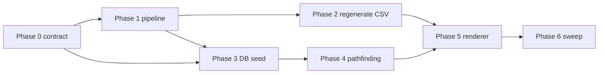

# Coastal terrain — execution plan

This document guides implementation of a **`coastal` pipeline terrain type** driven by an **ocean polygon shapefile** vs each **H3 cell polygon** (with interior **biome stack** from area-sampled land cover + topo), and end-to-end support in the Electron app (schema, passability, pathfinding, tools, renderer).

**Audience:** A coding agent or developer implementing the feature in phases. Each phase should be **independently verifiable**, or verifiable using outputs of earlier phases only.

---

## 1. Goals

1. **Pipeline:** Classify each H3 cell (res1 base CSV **and** res4 exception generation) using **ocean shapefile ∩ H3 polygon** plus **interior** biomes:
   - Load owner-supplied **ocean / water polygons** (e.g. bathy = 0), dissolve to one geometry, reproject to WGS84 if needed.
   - For each cell, build **H3 boundary polygon**; test **ocean `covers` cell** in **EPSG:3857** → **`ocean`**; **`intersects` but not `covers`** → **`coastal`**; **disjoint** → **interior biome stack** from area-sampled classes **1–12** and topography (`arctic` → `forest` → `mountain` → `desert` → `land`).

2. **Application:** Persist passability and display kind consistently:
   - **`terrain_kind`** (CSV + DB + IPC): includes `coastal` alongside existing pipeline kinds.
   - **`terrain`** (DB + IPC): **`land` \| `water` \| `coastal`**.

3. **Quality:** Deterministic, documented math; tests; Python `TERRAIN_ENUM` and TypeScript `PIPELINE_TERRAIN_KINDS` stay aligned.

### 1.1 Data contract (avoid implementer confusion)

- **`terrain_res1_base.csv` column `terrain`:** pipeline **kind** (`ocean` \| `coastal` \| `land` \| `forest` \| …), **not** the DB passability column.
- **SQLite `hexes.terrain`:** **passability** tri-state `land` \| `water` \| `coastal` (derived via `pipelineTerrainToPassability` at seed time).
- **SQLite `hexes.terrain_kind`:** same value as CSV **kind** (renderer / tools).

---

## 2. Locked product decisions (owner-approved)

| ID | Decision | Value |
|----|----------|--------|
| A | **Interior biomes** | **Sum of means** for classes **1–11** (and full **1–12** set in `CellFeatures`) at **area** sample points inside the cell; used **only** when **no** boundary edge qualifies as a water edge. |
| B | **Ocean / coastal** | Shapefile geometry **`covers`** cell → `ocean`; **`intersects`** but not **`covers`** → `coastal`; else interior (row A). Path: `InputRasterSet.root` / `ocean_shapefile_name`. |
| C | **Movement** | **Land and naval** units may **enter and traverse** `coastal` hexes. |
| D | **Naval spawn** | Naval starting positions may use **`water` or `coastal`** (same eligibility for “is this hex OK for a ship?”). |
| E | **Naval routing helpers** | “Nearest water” / traversability for naval includes **`water` + `coastal`** (consistent with C/D). |
| F | **Pipeline label** | **Flat `coastal`** in the mixed band (no forest/mountain overlay on that cell for v1). |
| G | **res4** | **`terrain_res4_exceptions.csv`** uses the **same** ocean-mask and interior rules as res1. |
| H | **DB upgrades** | **No migration path required** (no shipping installs yet). Updating `getFullDdl()` + checks is enough; optional `EXPECTED_USER_VERSION` bump for dev DBs is acceptable without migration logic. |
| I | **Combat** | **No** coastal combat or range modifiers in this work. |
| J | **Land-unit spawn** | Infantry / armor may start on **`land` or `coastal`** passability hexes; **never** on **`water`** only. |

**Implementation note:** Interior branch still uses **sum(means 1–11)** clamped to \[0, 100\] as **`effective_land_fraction_pct`** for documentation/QA; it does **not** gate ocean/coastal once edge rules are primary.

**Ocean mask / edge cases (lock before classify):**

1. **Invalid or empty ocean union** after load → fail phase 1 / fail fast at pipeline start.
2. **No usable land-cover for interior** (empty `landcover` after sampling) → **`nodata_fallback`** (still `ocean` unless product changes default); ocean/coastal from mask still applies when landcover exists.
3. **EPSG:3857 predicates** reduce antimeridian issues vs raw geographic `covers`/`intersects`.

**LLM / UX:** Briefings and pathfinding hints should mention **`coastal`** where terrain is described (recommended one-line clarity).

### 2.1 Implementation standards (repository user rules)

Apply on all touched code:

- **Logging:** New/updated **public** backend methods: **debug** on invocation, **error** on caught exceptions, **trace** on non-mutating getters; use existing logging APIs.
- **Comments:** Orienting block comments on **new/updated public, non-overriding** methods (contract / when to use / results & errors).
- **Tests:** **Happy paths + essential failures** only; no implementation-detail over-testing; drop tests superseded by these rules.

### 2.2 Calibration targets (`calibrate.py`) — owner-approved starting point

Add **`coastal`** to the calibration distribution fit. **Starting `TARGET_GLOBAL_PCT`** (percent of res1 cells, must sum to **100**):

| Key | % | Note |
|-----|---|------|
| `ocean` | **56** | Heuristic under **edge-water** rules. **Tunable** from QA CSV. |
| `coastal` | **14** | Heuristic; **tune** after full generate from `terrain_counts_res1.csv`. |
| `arctic` | **2** | Unchanged from prior baseline. |
| `forest` | **9** | Unchanged. |
| `mountain` | **7** | Unchanged. |
| `desert` | **5** | Unchanged. |
| `land` | **7** | Slight bump vs prior **6** so row sums to **100** with new ocean/coastal. |

Extend **`weights`** with **`"coastal": 1.0`** (or similar). Optionally add a soft penalty if `dist["coastal"]` drifts far from target (mirror the existing ocean drift penalty pattern). Document in `calibrate.py` that targets are **heuristic** until refreshed from QA CSV.

---

## 3. Phase 0 — Contract freeze (documentation + enums only)

**Objective:** Agree CSV/DB/TS contracts so later phases do not thrash.

**Tasks:**

1. Add **`coastal`** to Python `TERRAIN_ENUM` in `scripts/terrain_pipeline/config.py` (and any lists that enumerate all kinds).
2. Add **`coastal`** to `PIPELINE_TERRAIN_KINDS` in `src/shared/pipelineTerrain.ts`.
3. Document **land fraction = sum of means for classes 1–11** in `classifier.py` (and a one-line pointer in `pipelineTerrain.ts` if useful).
4. **`pipelineTerrainToPassability`:** `ocean` → `water`, `coastal` → `coastal`, else → `land`. Introduce **`PassabilityTerrain`**: `'land' | 'water' | 'coastal'`.

**Verification:** Typecheck/build and Python test discovery run.

**Exit criteria:** Enums and types compile; §2 treated as source of truth.

---

## 4. Phase 1 — Pipeline: ocean shapefile, area sampling 1–12, coastal label

**Objective:** Implement classification **before** regenerating production CSVs.

**Tasks:**

1. **Extend raster sampling** so every land-cover class **1–12** is included in `CellFeatures.landcover` / pipeline phase that builds features (mirror `config.InputRasterSet.landcover_by_class`).
2. Implement **`ocean_mask`**: load shapefile (Fiona), dissolve, optional CRS→4326, **`prepare_ocean_geometry_for_predicates`** (project to 3857 once), **`ocean_relation_for_cell_polygons`** per cell.
3. **`classify_cell` ordering:**
   - No usable landcover → `nodata_fallback`.
   - Else: **`in_ocean`** → **`ocean`**; **`coastal_band`** → **`coastal`**; **`land`** → interior biome stack from `CellFeatures`.
4. **`ClassifierThresholds`:** interior knobs only; ocean path is geometric.
5. **`calibrate.py`:** **§2.2** (`TARGET_GLOBAL_PCT`, weights); search **interior** thresholds only.
6. **res4 path** in `pipeline.py`: same `classify_cell` / same features (per G).
7. **PostgreSQL / staging DDL (keep two sources aligned):**
   - Update **`scripts/terrain_pipeline/sql/001_stage_schema.sql`** so every `CHECK (... IN (...))` listing pipeline kinds includes **`coastal`**.
   - Update **`pipeline.py`** embedded `CREATE TABLE` strings for **`terrain_res1_base`** / **`terrain_res4_exceptions`** if they add or change **`CHECK`** constraints to match the SQL reference file. **Today** those Python DDL strings may omit `CHECK`; if the implementer adds them for parity, the existing **`DROP TABLE IF EXISTS … terrain_res1_base`** (and exceptions) before **`CREATE`** in **`_stage_base_table`** / **`_stage_exceptions_table`** repaves tables on each full **`run`** — **no manual DBA step** for that path.
8. **PostgreSQL manual drop/reapply (dev / broken partial state):** Use when someone applied old DDL by hand, experiments left conflicting objects in **`terrain_gen`**, or you want a one-shot clean slate:
   1. Connect to the configured DB (default **`agent_wars_1`** on `localhost`, see `DbConfig` in `config.py`).
   2. Execute:  
      `DROP SCHEMA IF EXISTS terrain_gen CASCADE;`
   3. Recreate by running **`python -m scripts.terrain_pipeline.cli run`** (from phase 1 validate through completion — phase 2 **`ensure_schema`** recreates **`terrain_gen`** and repopulates), **or** run the contents of **`001_stage_schema.sql`** in `psql`/GUI **then** run the pipeline if your workflow depends on that file being applied first.

   **Extensions:** `DROP SCHEMA … CASCADE` does **not** remove `postgis` / `h3` extensions; they remain at the database level.

9. **Tests:** synthetic shapefile + `covers` / `intersects` predicates; classifier with `ocean_relation`; **raw sum &gt; 100** still clamps in `effective_land_fraction_pct`.

**Verification:** `python -m unittest scripts.terrain_pipeline.tests` green; `npm run terrain:validate`; optional partial pipeline run; after first full generate, compare QA counts to **§2.2** and adjust targets if calibration is used.

**Exit criteria:** Deterministic tests green; orienting comments on public helpers.

---

## 5. Phase 2 — Regenerate data artifacts

**Objective:** Produce authoritative CSV + metadata **after** Phase 1 is merged.

**Tasks:**

1. Full pipeline: `python -m scripts.terrain_pipeline.cli run --verbose`.
2. Refresh `terrain_res1_base.csv`, `terrain_res4_exceptions.csv`, metadata, QA outputs, fixtures as needed.

**Verification:** CSV validates against world H3 list; spot-check map.

**Exit criteria:** App loads CSV; metadata lists new thresholds and enum.

---

## 6. Phase 3 — Database + seeding (no migration)

**Objective:** Persist `coastal` on new databases.

**Tasks:**

1. Extend **`hexes.terrain`** `CHECK` to **`'land', 'water', 'coastal'`**.
2. Extend **`hexes.terrain_kind`** for **`'coastal'`**.
3. **No migration:** Per H, do **not** implement v2→v3 data migration. Optionally bump **`EXPECTED_USER_VERSION`** so old local dev DBs fail validation and use existing recovery/fresh create; document “delete userData DB if stuck.”
4. **`seedHexesFromTerrainCsv`:** three-valued passability from pipeline kind.
5. **`seedUnits`:** Naval candidate hexes = **`water` or `coastal`** (D). Land-unit candidate hexes = **`land` or `coastal`** (J); exclude **`water`**.
6. Logging per project rules.

**Verification:** `gameDb` tests with `resetGameForNewMatch`; naval spawns on `water`/`coastal`; land spawns on `land`/`coastal` only; **no** land unit on `water`.

**Exit criteria:** Fresh DB + seed tests green.

---

## 7. Phase 4 — Pathfinding + movement validation

**Objective:** `coastal` is dual-domain (C); naval helpers treat coastal like water (E).

**Tasks:**

1. **`pathfinding.ts`:** `isPassableTerrain` — land domain: `land` or `coastal`; water domain: `water` or `coastal`.
2. Update **`findPath`**, **`getReachableHexes`**, **`getDistanceAndTurns`**.
3. **`tool1Pathfinding.ts`:** **`nearestWaterHexTo`**, **`nearestReachableWaterHexTo`**, and related logic: treat **`water` and `coastal`** as acceptable for naval “water” adjacency/distance (E). **`planRouteNoPathHint`:** handle `coastal` in messages.
4. **`gameActions.ts`**, **`openRouter.ts`**, **`renderer.ts`:** land units → `land` + `coastal`; naval → `water` + `coastal`.
5. **`tool2Assessment.ts`:** `passableBy`, neighbor land/water counts, and any `terrain === 'water'` / `'land'` branching must treat **`coastal`** per C/E (dual-domain or explicit rules documented in code).
6. **`tool5StandingOrders.ts`:** Hex filtering for standing orders uses the same passability rules as pathfinding (today it compares to `'water'` / `'land'` only — update so **`coastal`** is not misclassified).
7. Any other **`PassableDomain`** or terrain string checks found in Phase 6 grep.

**Verification:** Unit tests for land and naval paths through `coastal`; update **`tool1Pathfinding.test.ts`** hints if error strings change; add or adjust **tool2/tool5** tests only for essential contracts.

**Exit criteria:** All pathfinding and validation tests green.

---

## 8. Phase 5 — Renderer + IPC + static bundle

**Objective:** Distinct visuals for `coastal`; IPC documents `terrain`.

**Tasks:**

- **`terrainVisualStyles.ts`:** `terrainKindFillStyle` / pattern / **legend swatch** paths must handle **`coastal`** (see `terrainKindLegend` or equivalent).
- **`renderer.ts`:** Fallback when `terrainKind` missing — map `terrain === 'coastal'` to display **`coastal`**, not `land`.
- **`ipcTypes.ts`:** Comment or narrow types documenting `hexes[].terrain` values.
- **Rebuild renderer bundle:** `npm run build:renderer` (see `package.json`; output is `static/renderer.js`).

**Verification:** Manual smoke on coastal cells; lint/typecheck.

---

## 9. Phase 6 — Regression sweep + docs

**Tasks:**

1. Grep / review (non-exhaustive list): **`pathfinding.ts`**, **`tool1Pathfinding.ts`**, **`tool2Assessment.ts`**, **`tool5StandingOrders.ts`**, **`gameActions.ts`**, **`openRouter.ts`**, **`renderer.ts`**, **`gameDb.ts`** (`seedUnits`, `getGameState`), **`terrainPassability.ts`**, **`terrainRes1Csv.ts`**, **`briefingFormatter.ts`** (if terrain strings), **`hexGrid.ts` / `worldLeafletMap.ts`** if they branch on terrain.
2. Update **`scripts/terrain_pipeline/README.md`** (classification + enum).
3. Update **`terrainRes1Csv.test.ts`** expectations for `pipelineTerrainToPassability('coastal')`.

**Verification:** Full **`npm test`**; **`npm run terrain:test`** for Python.

---

## 10. Dependency graph (summary)

---

## 11. Risk register

| Risk | Mitigation |
|------|------------|
| Sum of means 1–11 vs physical “% land pixels” | Document metric in code; optional QA compare to `100 - mean(12)` on samples. |
| Sum &gt; 100 or odd totals | **Clamp** to [0, 100] before banding (§2 implementation note); test one synthetic &gt;100 case. |
| Too many/few coastal hexes | Tunable edge majority / class-12 floor / samples per edge; QA count CSVs after pipeline run. |
| **PostgreSQL / DDL drift** | Keep **`001_stage_schema.sql`** and **`pipeline.py`** staging **`CREATE`** in sync; use **`DROP SCHEMA terrain_gen CASCADE`** + rerun pipeline per Phase 1 §7–8 if the dev DB is messy. |

---

*End of plan.*
