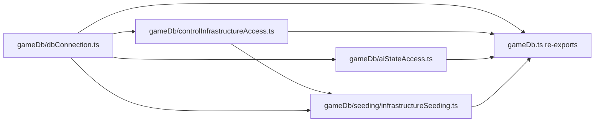

# Codebase Consolidation Execution Plan

The executing agent follows this plan phase by phase, in order.

## Goal

Ten behavior-preserving refactors. Each one removes verified duplication or brings a file that is over the 1000-line hard limit back under it. Nothing in this plan changes gameplay, UI text, log text, IPC channels, SQL, LLM tool names, or persisted data.

Current files over the hard limit, by `(Get-Content <file>).Count`:

- `src/renderer/renderer.ts`: 3278 lines (not targeted here; see the deferred list)
- `src/main/gameActions/gameActionsCore.ts`: 1808 lines (Phase 8)
- `src/main/gameDb.ts`: 1553 lines (Phase 7)
- `src/renderer/gameplay/readyHandler.ts`: 1262 lines (Phase 10)
- `src/shared/ipc/readyTypes.ts`: 1213 lines (Phase 5)
- `src/renderer/core/state.ts`: 1153 lines (deferred)

## Ground Rules (Apply to Every Phase)

1. **Behavior preservation.** Do not change any user-visible string, log message text, IPC channel string, LLM tool name, SQL statement, `game_config` key, or persisted JSON key. When code moves, cut and paste it verbatim. Do not "improve" moved code.
2. **One phase at a time.** Finish a phase's verification before starting the next. If verification fails and the cause isn't clear after two focused attempts, stop and report the failing command and output. Do not revert files you didn't change in this phase.
3. **Never commit or push.** The user reviews every change.
4. **No plan identifiers in code.** Never write "Phase N", "Step N", or this plan's name in code, comments, tests, or docs.
5. **Naming** (`doc/naming-conventions-contract-v1.md`):
   - Files and directories use camelCase.
   - Exported functions use camelCase; exported types use PascalCase.
   - The only allowed role suffixes are `Handler`, `Helpers`, `Guards`, `Adapter`, `Pipeline`, `Core`, and `Types`. Never use `Utils`, `Impl`, `Manager`, `Service`, `Processor`, `Controller`, or `Facade`.
   - Use the exact new file names given in this plan.
6. **Orienting comments.** Every new or changed declaration needs a real block comment in this format. Do not use the boilerplate "Supports maintainability by documenting why X exists" text.

```ts
/**
 * One-sentence summary of what this does.
 *
 * Purpose: Why it exists.
 * When to use: Which callers or situations.
 * Expected outcome: What it returns or changes.
 * Exceptions: What it throws, or "None".
 */
```

   Declarations that move without changes keep their existing comment verbatim, including the boilerplate ones. Do not mass-rewrite comments on moved code. A declaration whose value or body changes counts as updated and gets a real comment; examples are the constants reassigned in the H3 constants phase and functions rewritten on top of a new helper.

   When a deletion makes a comment reference a removed symbol, rewrite the comment to describe current behavior. Never write "formerly" or "moved from".

   If a moved block has a comment sitting above the wrong declaration, attach it to the declaration it describes.
7. **Logging.**
   - Main process (`src/main/logger.ts`): new public functions call `logDebug`. Read-only getter-style functions call `logTrace`. Every `catch` calls `logError`.
   - On hot paths, such as the connection accessors in the `gameDb` split, a trace call takes only a short string and no payload object.
   - Moved functions keep their existing log calls unchanged.
   - Shared code (`src/shared`) must not import the logger, Electron, or Node built-ins.
   - Renderer code keeps its existing `console.error` pattern in `catch` blocks.
8. **Mutability.** Use `const` unless a binding is reassigned. Use `readonly` for properties that are never written after construction.
9. **Size and arguments.** No new file over 600 lines. No new function with more than 6 named parameters; use a parameter object instead.
10. **No import cycles.** A new module must never value-import from the module that re-exports it. `import type` is allowed, because `scripts/check-circular-deps.cjs` ignores type-only imports. The cycle baseline `scripts/circular-deps-baseline.json` is empty, so any new value cycle fails.
11. **Tests.** Cover only happy paths and essential failures of the new or changed contracts.
    - Pure relocations and connection plumbing need no new tests; the existing suites already exercise them.
    - Renderer code has no runtime unit tests, so renderer phases rely on source-contract tests, the typecheck baseline, and manual smoke checks.
    - Do not add new source-text assertions; they test implementation details.
    - When extending an existing test file, follow its style. Some files use `node:test` and `test(...)`; others, such as `src/main/pathfinding.test.ts`, use plain functions called from a `run()` at the bottom.
    - New test files use `node:test` with `node:assert/strict`.
12. **Living docs.** When a phase adds a module that a `doc/ux/*.md` "Code Entry Points" list should name, add it there in the same phase.

## Verification Toolkit

Run these from the repo root (PowerShell):

- Full gate: `npm test`. This rebuilds native modules for Node, then runs `build:main`, `lint`, `naming:check`, `check:renderer-types`, and every `dist/**/*.test.js`.
- Before `npm test` in any phase that moves or deletes files, run `npm run clean:dist`. Otherwise stale compiled tests can still run.
- Focused test: `npm run build:main` then `node dist/main/<path>.test.js`. Run `npm run rebuild:native:node` once first.
- Cycles: `npm run check:circular`
- Renderer bundle: `npm run build:renderer`
- Renderer types: `npm run check:renderer-types`. The error count must not grow past `scripts/renderer-typecheck-baseline.json`.
- Line count: `(Get-Content <path>).Count`
- Symbol search: `rg -n "\bSymbolName\b" src scripts eslint-rules`
- Multi-line shape search: `rg -U -n "<pattern with \s*>" src`

### Manual Smoke Checks (Agent-Attempted)

The agent attempts each phase's manual checks itself, and reports what it couldn't verify.

1. Start the app in the background with debug logging: `$env:AGENT_WARS_LOG_LEVEL='debug'; npm start`. `npm start` rebuilds the native module for Electron; the next `npm test` rebuilds it for Node again, which is expected.
2. Wait for startup, then read the terminal output. **Pass** means the window process stays up, there are no uncaught exceptions, and there are no `logError` lines that weren't present in a Phase 0 launch. Do the same launch once in Phase 0 to record the baseline log noise.
3. Where a check needs evidence, look for the specific debug or trace log lines named in the phase (for example, terrain loader `logDebug` lines in Phase 3, and `gameDb initDatabase: opened existing` in Phase 7).
4. Stop only the process you started. Kill it by the PID returned when you launched it; never kill other Electron or Node processes.
5. Interactive steps (clicking, hovering, playing a turn) can't be driven reliably. List each one in the phase report as "Not verified (needs human)", with the exact steps, so the user can run them in one batch at the end.
6. A failed startup check blocks the next phase, the same as a failed automated gate.

## Phase 0: Baseline

1. Run `git status --short` and record the output. If the tree isn't clean, stop and ask the user how to proceed.
2. Run `npm test`, `npm run check:circular`, and `npm run build:renderer`. All three must pass. If any fails, stop and report; do not start Phase 1.
3. Record the line counts of the six files listed under Goal.
4. Do one baseline app launch, following Manual Smoke Checks steps 1–4. Record which `logError` lines, if any, appear on a normal startup, so later phases can tell new errors from existing noise.

## Phase 1: Remove Dead Code

**Goal:** delete exports that have zero callers.

Before deleting each symbol, re-run the symbol search. If you find any hit other than its own definition and comments in the same file, skip that symbol and report it. For whole-file deletions, also search for the file stem (for example `rg -n "openRouterKeyAffordability" src scripts`) to catch path references and test manifests.

Delete:

- `applyHumanTacticalMarchOrders` in `src/main/tacticalBattle/tacticalBattleSession.ts`, around line 400. Then rewrite the comments near lines 310 and 337 that mention it.
- The whole file `src/main/openRouter/openRouterKeyAffordability.ts`.
- The whole file `src/main/openRouter/openRouterToolLoopContext.ts`.
- `computeGridDistanceSafe` in `src/main/gameActions/gridRange.ts`, around line 25. Then reword the comment in `src/shared/h3GridRangePure.ts` around line 30 so it no longer names it.
- `tacticalMarchReachableAlongRes4Footprint` in `src/main/tacticalBattle/tacticalRulesAdapter.ts`, around line 41.
- `bulletizeToastLines` in `src/renderer/openRouter/openRouterUiHelpers.ts`, around line 214.
- `getRepresentativeSelectedUnitIdsByOrigin` in `src/renderer/gameplay/tacticalOrders.ts`, around line 24.

Make module-private (remove only the `export` keyword):

- `cancelHumanStrategicMarchOrdersForParentUnit` in `gameActionsCore.ts`
- `buildHumanMarchPreviewStateCacheKey` in `src/main/gameActions/humanMarchPreviewComputationContext.ts`

Remove any imports that become unused.

**Verify:** `npm run clean:dist`, `npm test`, `npm run check:circular`, `npm run build:renderer`. No manual check is needed.

## Phase 2: One Shared Pair of H3 Resolution Constants

**Goal:** stop redeclaring `1` and `4` as private constants in a dozen files.

1. Create `src/shared/h3Resolutions.ts` with orienting comments and no imports:

```ts
export const STRATEGIC_H3_RESOLUTION = 1;
export const TACTICAL_H3_RESOLUTION = 4;
```

2. Replace the local declarations below with imports, and rename uses inside each file to the shared names.
   - `src/main/tacticalBattle/computeTacticalBattleSnapshot.ts` lines 35–36
   - `src/main/tacticalBattle/tacticalSpatialAdapter.ts` line 4
   - `src/main/briefing/map/hexCoordinates.ts` lines 20–21
   - `src/main/briefing/map/hexCodeTranslator.ts` lines 18 and 20
   - `src/shared/hexLlmCodeAssignment.ts` lines 18 and 25
   - `src/shared/orderPreviewSlowTerrainTooltip.ts` line 38
   - `src/shared/tacticalMarchHoverPreview.ts` line 31
   - `src/renderer/rendering/infrastructureOverlayState.ts` line 11

3. Keep these existing exported names, but assign them from the shared constants:
   - `src/renderer/core/constants.ts`: `export const WORLD_H3_RESOLUTION = STRATEGIC_H3_RESOLUTION;` and `export const DETAIL_H3_RESOLUTION = TACTICAL_H3_RESOLUTION;`. The names stay because `mapKeyboardPanWiringContract.test.ts` string-matches them.
   - `src/main/terrainMetadataLoad.ts`: `METADATA_PARENT_RESOLUTION` and `METADATA_CHILD_RESOLUTION`.
   - `src/main/mapData.ts`: `H3_RESOLUTION`.
   - `src/main/unitOrigin/unitBirthOrigin.ts`: `const BIRTH_CELL_RESOLUTION = TACTICAL_H3_RESOLUTION;`

4. Every reassigned constant in step 3 is an updated declaration, so replace its boilerplate comment with a real one. In `hexCodeTranslator.ts`, delete the one-line `/** ... matches hex-coordinates */` comments together with the local constants they describe.
5. Out of scope: numeric literals inside calls (for example `cellToParent(x, 1)`), and `DEFAULT_CLUSTER_THRESHOLD_DEG` in `hexGridProjection.ts`.
6. The values don't change. `mapData.H3_RESOLUTION` feeds the prompt text that `openRouterMatrix.test.ts` checks, so it must still evaluate to `1`.

**Verify:** `npm test`, `npm run build:renderer`, `npm run check:circular`. Manual: none.

## Phase 3: One JSON File Reader for Terrain Packs

**Goal:** replace five identical read, parse, log, and rethrow blocks.

1. Create `src/main/jsonFileHelpers.ts` with orienting comments:

```ts
export function readJsonFileOrThrow(absPath: string, logContext: string): unknown {
  logTrace('jsonFileHelpers readJsonFileOrThrow', { absPath });
  try {
    return JSON.parse(fs.readFileSync(absPath, 'utf8')) as unknown;
  } catch (err) {
    logError(`${logContext}: read/parse failed`, err);
    throw err;
  }
}
```

2. Replace the `let parsed; try { ... } catch { ... }` block at each site below with `const parsed = readJsonFileOrThrow(absPath, '<existing prefix>');`. The prefix must be exactly the text before `: read/parse failed` in today's message.
   - `terrainMetadataLoad.ts` around lines 818–824. The prefix is `'terrainMetadataLoad loadTerrainRes1MetadataFromPath'`.
   - `terrainMetadataLoad.ts` around lines 838–844 (the Res4 variant).
   - `terrainNamingLoad.ts` around lines 705–711 and 725–731.
   - `terrainLandMassLoad.ts` around lines 423–429.

3. Leave alone: `weatherPackLoad.ts`, and the `parse...Json(text)` functions in the road/rail loaders.
4. Remove `fs` imports that become unused.
5. Add `src/main/jsonFileHelpers.test.ts` with two cases:
   - A valid temp JSON file returns the parsed object.
   - A missing path throws.
   Use `node:test`, `node:assert/strict`, and `os.tmpdir()`.

**Verify:** `npm test`.

Manual (agent): do a startup check. With debug logging on, the terrain loader `logDebug` lines appear (for example `terrainMetadataLoad loadTerrainRes1MetadataFromPath`), and no `read/parse failed` error appears.

Needs human: the world map renders terrain, and hex tooltips show place names.

## Phase 4: IPC Type Consolidation (Type-Only)

**Goal:** stop re-declaring the same shapes, and make the compiler check the preload bridge against `GameApi`.

### Name the Kill-Edge Shape

1. Create `src/shared/ipc/combatResultTypes.ts` containing `export type KillEdge = { victimId: string; killerIds: string[] };`.
2. Add `export * from './combatResultTypes';` to `src/shared/ipc/index.ts`.
3. Find every inline copy with `rg -n "\{ victimId: string; killerIds: string\[\] \}" src`. There are about 40 copies in 14 files. Also run `rg -U -n "victimId: string;\s*killerIds: string\[\];?\s*\}" src` to catch copies that span lines. Replace each one with `KillEdge`, using `import type`. Inside `src/shared/ipc`, import from `./combatResultTypes`, not from the barrel.
4. Replace the private alias `TacticalKillEdge` in `src/shared/tacticalToastKillSlice.ts` with `KillEdge`.
5. For `TacticalKillLedgerRow` in `src/main/tacticalBattle/tacticalAirStrikeUnits.ts`: if it is exported and imported elsewhere, redefine it as `= KillEdge`. Otherwise replace it with `KillEdge`.
6. Leave variants that use `readonly` arrays unchanged.

### Use the Existing Named Order Types

1. In `readyTypes.ts`, `TacticalOpponentPlanPayload` (lines 188–194) should use `MovementOrder[]` and `RangedAttackOrder[]`. The shapes are identical.
2. In `gameApiTypes.ts`, extract `export type CommitHumanTacticalDraftOrdersIpcPayload` from the inline payload around lines 282–291. It should use `MovementOrder`, `RangedAttackOrder`, `AirStrikeOrder`, `FerryOrder`, `EmbarkOrder`, and `TacticalOpponentPlanPayload`. Replace the inline `import('./readyTypes').TacticalOpponentPlanPayload` with a top-level `import type`.
   - Keep every field and every `?` optional marker exactly as it is today.
   - Make `GameApi.commitHumanTacticalDraftOrders` take the new type.
   - All five order interfaces were checked and match the inline shapes field for field.

### Check the Preload Bridge Against `GameApi`

1. In `src/main/preload.ts`, change `const gameApi = { ... };` to `const gameApi = { ... } satisfies GameApi;`, using `import type`.
2. Replace the inline commit payload (lines 395–404) with `CommitHumanTacticalDraftOrdersIpcPayload`.
3. Fix any errors by editing only the preload type annotations. Never change runtime code, the `IPC_GAME` or `IPC_OPENROUTER` literal maps, or channel strings. The sandbox requires these local copies, and `preloadIpcChannelParity.test.ts` guards them.
4. If an error suggests `GameApi` itself is wrong, stop and report.

**Verify:** `npm test` and `npm run build:renderer`. The renderer type error count must not grow.

Manual (agent): do a startup check, with no `gameApi`-related renderer errors in the terminal.

Needs human: click Ready once.

## Phase 5: Split `readyTypes.ts` (Type-Only)

**Goal:** bring `src/shared/ipc/readyTypes.ts` under 1000 lines.

1. Move each declaration together with its preceding `/** */` block. Find declarations by name, not by line number.
   - New `src/shared/ipc/tacticalPlaybackTypes.ts`: `TacticalPlaybackMarchMove` and `TacticalCommitResolutionPlayback`.
   - New `src/shared/ipc/consultationPushTypes.ts`: `TacticalOpponentPlanPayload`, `TacticalPostBeatConsultFields`, `TacticalPostBeatConsultMergeSource`, `NotifyResolutionPlaybackCompletePayload`, and `PostResolutionConsultationPushPayload`.
   - New `src/shared/ipc/meleeInterceptTypes.ts`: `MeleeCandidateRow` and `ResolveMeleeInterceptIpcPayload`.
2. Add one `export *` line for each new file to `src/shared/ipc/index.ts`.
3. Cross-references between `readyTypes.ts` and the new files use `import type` only.
4. Do not re-export moved names from `readyTypes.ts`, because duplicate `export *` names can cause TS2308 ambiguity errors. Instead, update every direct importer that `rg -n "readyTypes'|readyTypes\(|import\('.*readyTypes'\)" src` lists.
   - This includes the import list in `gameApiTypes.ts` and the top-level import added there in Phase 4.
   - Search `preload.ts` again too; Phase 4 should already have removed its inline `import(...)`.
   - Importers that only need names still in `readyTypes.ts` stay unchanged.

**Verify:** `npm test`, `npm run check:circular`, `npm run build:renderer`. `readyTypes.ts` must be under 1000 lines (about 800 expected). Manual: none (type-only).

## Phase 6: Shared Breadth-First Search in `src/main/pathfinding.ts`

**Goal:** `findPath` and `getReachableHexes` each contain two copies of the same queue, parent-map, and `gridDisk` neighbor walk (lines 111–145, 156–188, 214–230, and 241–256).

1. **Characterization tests first.** Add them to `src/main/pathfinding.test.ts`, which today only covers `partitionPathByTurn`. Follow that file's style: plain `assert` functions registered in its `run()` at the bottom. Use the `'water'` domain with every hex mapped to terrain `'water'`; per `terrainIsPassableForDomain` in the same file, water passes `'water'` and `'coastal'`. Build hex sets with `gridDisk` from `h3-js` around a fixed res1 cell.
   - `findPath` on a fully passable `gridDisk` set returns a path that starts at the origin, ends at the destination, and has length `gridDistance + 1`. Every step must be a grid neighbor.
   - `findPath` returns `null` when the destination is blocked or not in the hex set.
   - `getReachableHexes` on a fully passable radius-2 disk returns all 19 cells. With one blocked cell, that cell is excluded.
   - Add land-domain cases only if `src/main/testSupport/strategicLandChainFixtures.ts` provides a usable land-mass fixture.

   Run the tests against the current code. They must pass before you refactor.
2. Add two private helpers:
   - `breadthFirstHexSearch(originH3, canEnter: (fromH3, toH3) => boolean, options: { stopAtH3?: string; onGridDiskError?: (err: unknown) => void })`. It returns the parent map. Map keys are inserted in visit order.
   - `rebuildPathFromParents(parentByH3, destinationH3): string[]`.
3. **Exactness requirements:**
   - Keep FIFO `queue.shift()` order and `gridDisk` neighbor order, so tie-breaking between equal paths is identical.
   - Stop when the dequeued cell equals `stopAtH3`.
   - Skip `n === current` and cells already visited.
   - `findPath` keeps `logError('pathfinding findPath: gridDisk threw', err)`. `getReachableHexes` stays silent on errors.
   - The land predicate is `hexSet.has(to) && !blocked?.has(to) && canLandUnitTraverseEdge(from, to, landMass)`. The other domains use the existing `passable(to)`.
   - `getReachableHexes` returns `new Set(parent.keys())`.
   - All early returns before the search stay as they are.

**Verify:** the focused run of `pathfinding.test.ts` passes before and after the refactor, and `npm test` passes. Existing callers of these functions are also covered by `src/main/tools/pathfinding.test.ts` and `src/main/oneStepMoveDestinations.test.ts`.

Manual (agent): do a startup check.

Needs human: in a strategic turn, hover a land march several hexes away and a naval march. The route previews should look the same as before.

## Phase 7: Split `gameDb.ts` Around One Connection Module

**Goal:** about 20 inline `{ run, getOne, getAll }` or `{ hasDb: () => db !== null, ... }` literals collapse to one ops object, and `gameDb.ts` drops under 1000 lines. Its public API stays the same.



1. **Create `src/main/gameDb/dbConnection.ts`.**
   - Move into it from `gameDb.ts`: `let db`, `closeDbHandle`, `run`, `getOne`, and `getAll`.
   - Export `closeDbHandle`, `run`, `getOne`, and `getAll`. Their bodies and comments stay verbatim.
   - Add `getDbHandle()`, `setDbHandle(next)`, `hasDbHandle()`, and `export const gameDbOps: GuardedDbOps = { hasDb: hasDbHandle, run, getOne, getAll };`. `GuardedDbOps` comes from `gameDb/dbOps.ts`.
   - Logging: `setDbHandle` calls `logDebug` with `{ open: next !== null }`. `getDbHandle` and `hasDbHandle` call `logTrace` with a short string and no payload, because they sit on hot paths.
   - Only `gameDb.ts` and the new `gameDb/*Access.ts` and `gameDb/seeding/infrastructureSeeding.ts` modules may import `dbConnection.ts`. Other code keeps using the `gameDb.ts` API.
   - In `gameDb.ts`:
     - `db = X` becomes `setDbHandle(X)`.
     - `if (!db)` and `db === null` become `!hasDbHandle()`.
     - `isDbReady()` returns `hasDbHandle()`.
     - In `createFreshGameDatabaseAt`, use `const database = new Database(path); setDbHandle(database);` and call `applyGameDbPragmas`, `exec`, and `pragma` on `database` in the original order.
2. **Use `gameDbOps` everywhere.** Replace every inline ops literal, `getAiStateDbOps()`, the `ops` inside `getFogDeps()`, and the literal passed to `resolveUnitBirthOrigin` with `gameDbOps`. Delete `getAiStateDbOps`.
   - Checkpoint: run `npm test` here.
3. **Move the control and infrastructure facades** to `src/main/gameDb/controlInfrastructureAccess.ts`. That is everything from `getHexController` (around line 931) through `getRes4TerrainOverridesForRendererFromGame` (around line 1226), including `runInfrastructureStartupConsistencyPass` and `ensureRes1InfrastructureSyncTriggers`. Every function in this block was checked: each one only delegates or calls another function in the same block.
   - Export `runInfrastructureStartupConsistencyPass` from the new module so `gameDb.ts` can import it, but do not re-export it from `gameDb.ts`.
   - `isDbReady` (around line 1228) stays in `gameDb.ts`.
   - The comment for `updateRes4FeatureOverrideRow` (around line 1170) is orphaned above `insertRes4FeatureOverrideRubbleRow`'s comment, and `updateRes4FeatureOverrideRow` (around line 1194) has no comment directly above it. When moving, place that comment directly above `updateRes4FeatureOverrideRow`.
4. **Move the infrastructure seeding code** to `src/main/gameDb/seeding/infrastructureSeeding.ts`: `INFRASTRUCTURE_SYNC_TRIGGER_NAMES`, `seedHexesFromTerrainMetadata`, `seedInfrastructureStateFromMetadata`, `backfillInfrastructureStateFromMetadataIfMissing`, `getInfrastructureSeedRowsFromMetadata`, the two `insert...` helpers, and their interfaces. Export the three functions that `gameDb.ts` calls.
   - Replace `if (db === null) return;` with `if (!gameDbOps.hasDb()) return;`.
   - Replace bare `run` and `getAll` calls with the functions imported from `dbConnection.ts`.
   - Import `ensureRes1InfrastructureSyncTriggers` and `reconcileRes1InfrastructureCountsFromRes4Overrides` from `controlInfrastructureAccess.ts`.
5. **Move the AI-state and turn-notes facades** to `src/main/gameDb/aiStateAccess.ts`. That is `setAiToolLimitExceededLastTurn` through `clearTacticalTurnNotes`.
6. **Re-export** every previously public name from `gameDb.ts` with named `export { ... } from` lines. Add `import` lines for the ones `gameDb.ts` uses internally. No new module may import from `../gameDb` or `../../gameDb`.

**Verify:** `npm run clean:dist`, `npm test` (covers `gameDb.test.ts`, `snapshotDbParity.test.ts`, `turnStateReads.test.ts`, and the seeding tests), and `npm run check:circular`. `gameDb.ts` should land under 1000 lines (about 800 expected).

Manual (agent): do a startup check. The debug log shows `gameDb initDatabase: opened existing`, or a fresh create, with no new `logError` lines.

Needs human:
- New Game seeds units and city production buttons.
- Play one Ready turn.
- If an OpenRouter key is configured, let the AI plan one turn.

## Phase 8: Strategic Order Validation Helpers and `gameActionsCore.ts` Split

**Goal:** remove the four copies of the owned-unit lookup and the three copies of the group-validator preamble, and bring `gameActionsCore.ts` under 1000 lines. The public API through `src/main/gameActions.ts` (`export *`) stays unchanged.

1. **Create `src/main/gameActions/ownedUnitGuards.ts`** with:
   - `loadOwnedStrategicUnit(unitId, { allowedPlayer, displayLabelForUnit, wrongOwnerReason? })`, returning `{ ok: true; unit: { player; unit_type; h3_index } } | { ok: false; failure: { valid: false; reason } }`.
   - `hasEnemyUnitsAtHex(h3Index, ownPlayer): boolean`.

   The reasons must match today's text exactly:
   - `'Database not initialized'`
   - `` `Unit not found: ${label(unitId)}` ``
   - `wrongOwnerReason ?? `Unit must belong to ${allowedPlayer}``

   Both functions use `logTrace`. Apply them in:
   - `validateOrder`: pass `wrongOwnerReason: 'Only human units can receive orders'`.
   - `validateRangedAttack`, in `gameActionsCore.ts`.
   - `validateAirStrikeOrder` and `validateFerryOrder`, in `src/main/gameActions/airValidation.ts`.

   Keep the order of checks identical in each function. Each validator still runs its own `logDebug` or `logTrace` line first, exactly where it does today.

   Add `src/main/gameActions/ownedUnitGuards.test.ts` with three cases: own unit returns `ok`, wrong owner returns the default reason, and unknown id returns the "Unit not found" reason. Use `withTempGameDb` from `src/main/testSupport/withTempGameDb.ts`. It calls `resetGameForNewMatch()`, so human and opponent units exist; read them through `getGameState().units`, the same way `src/main/gameActionsMultiSelect.test.ts` does.
2. **Create `src/main/gameActions/gameActionsTypes.ts`.** Move `SubmitOrdersResult` and `HumanStandingOrderView` there, and re-export them from core with `export type { ... } from`.
3. **Create `src/main/gameActions/strategicOrderValidation.ts`.**
   - Move into it: `effectiveHexPassabilityTerrain`, `getMovementTerrainForH3`, `getUniqueNonEmptyIds`, `humanPerspectiveStateSnapshot`, `validateOrder`, `validateRangedAttack`, and the three `validateGroup*Target` functions.
   - Add a private `validateGroupTarget({ logName, unitIds, emptySelectionReason, validateTactical, validateStrategicUnit })`. It holds the shared db-ready check, unique-ids check, tactical-snapshot branch, strategic label loop, and the `catch` that calls `logError(`${logName}: exception`, err)`.
   - Each public group validator keeps its own `logDebug` call verbatim. Its tactical callback returns exactly what it returns today:
     - Ranged: `... as SubmitOrdersResult`.
     - Air strike: `check.success ? { success: true } : check`.
     - Ferry: returns the result directly.
   - Core imports what it still uses (`validateOrder`, `humanPerspectiveStateSnapshot`, `getUniqueNonEmptyIds`). Export `HUMAN_PLAYER_ID` from the new module and import it in core. Core re-exports the public validators.
4. **Create `src/main/gameActions/humanTacticalDraftCommit.ts`.** Move `sanitizeOpponentTacticalDraftForReadyCommit` and `commitHumanTacticalDraftOrders` there (about lines 733–1230) and re-export them from core. `sanitizeOpponentTacticalDraft.test.ts` keeps working through the re-export.
5. **Rules for moved code.**
   - New modules never value-import from `./gameActionsCore` or `../gameActions`.
   - If moved code needs a constant that is private to core, define it in the new module that uses it.
   - If more than one new module needs it, export it from `strategicOrderValidation.ts`.

**Verify:** `npm run clean:dist`, `npm test` (covers `gameActionsMultiSelect.test.ts`, `tacticalGroupRangedTargetValidation.test.ts`, `sanitizeOpponentTacticalDraft.test.ts`, `orderResponseParsing.test.ts`, and `gameIpcHandlers.test.ts`), and `npm run check:circular`. `gameActionsCore.ts` must be under 1000 lines (about 800 expected).

Import cycles were checked: every new module imports only what `gameActionsCore.ts` already imports, plus `airValidation.ts` and `ownedUnitGuards.ts`. So a cycle can only appear if one imports core or the barrel.

Manual (agent): do a startup check.

Needs human:
- Strategic: an invalid march shows the same reason text. Group ranged, strike, and ferry targeting each give one valid and one invalid result.
- Tactical: commit a beat with a march and a ranged attack.

## Phase 9: Small Renderer Helpers

**Goal:** remove three small duplications in the renderer.

1. **Cancel helper.** In `src/renderer/gameplay/tacticalOrders.ts`, `cancelRangedForUnit` and `cancelAirStrikeForUnit` (lines 188–222) differ only in which array and mode flag they clear.
   - Add a private `finishTargetingDraftCancel(unitId, deps)`. It drops the unit's embark draft during a battle, then calls `refreshHoverRoutePreview`, `updateSidebar`, `updatePendingOrdersSidebar`, `updateRangedSidebar`, `refreshStackCalloutIfOpen`, and `redraw`, in that order.
   - Each public function filters its own array, clears its own flag, and then calls the helper.
   - Today the embark filter runs before the flag is cleared. Running it after is safe, because both are synchronous writes to `S` with nothing reading in between. The order of the refresh calls must stay exactly as listed.
   - Leave `cancelFerryForUnit` unchanged. Its refresh set is different.
2. **"None" placeholder.** Create `src/renderer/gameplay/sidebarListHelpers.ts` with `appendMutedPlaceholder(container: HTMLElement, text: string): void`. It creates a `span` with that text and class `chrome-muted`. Use it at:
   - `sidebarSupport.ts` lines 444–447 and 489–492
   - `tacticalOrders.ts` lines 262–265 and 285–288
   Pass `'None'` explicitly at each call site.
3. **Game-state refresh helper.** In `src/renderer/core/stateSnapshot.ts`, add an exported `refreshGameStateFromMain(deps: Pick<RefreshBuildQueueDeps, 'applyGameStateSnapshot'>, applyOptions, failureMessage: string)`.
   - It keeps the existing guard on `window.gameApi?.getGameState`, the `try` block, and `console.error(failureMessage, err)`.
   - Rewrite `refreshGameStateAfterBuildQueueChange` and `refreshGameStateAfterSealiftChange` on top of it. Their option objects and error strings stay identical.
   - Keep the public names, because `rendererConsolidation.test.ts` line 382 checks `refreshGameStateAfterSealiftChange`.

**Verify:** `npm run build:renderer`, `npm run check:renderer-types`, and `npm test` (covers `rendererConsolidation.test.ts`).

Manual (agent): do a startup check.

Needs human:
- Cancel a ranged row and a strike row, both in strategic planning and in a tactical battle.
- Empty Movement, Ranged, and Strike lists show a muted "None".
- A build-queue edit redraws the map.
- A sealift embark followed by a debark updates the selection.

## Phase 10: Ready Handler Consolidation and Split

**Goal:** `handleReadyButtonClick` repeats the turn-update toast and the deferred-notify scheduling for tactical commits (around lines 911–983) and strategic Ready (around lines 1128–1202). The file is also over the hard limit.

1. **Move the deps interface.** Move the whole `export interface ReadyHandlerDeps { ... }` declaration and its comment (starting at line 51, about 360 lines) to `src/renderer/gameplay/readyHandlerTypes.ts`, along with the type-only imports it needs. Add `import type` and `export type { ReadyHandlerDeps } from './readyHandlerTypes';` to `readyHandler.ts` so importers don't change.
2. **Create `src/renderer/gameplay/readyResolutionAnnouncements.ts`.**
   - Move into it: `deriveCombatVisibilityClassification`, `buildTacticalCommitReadyResultForToast`, `buildPopupTurnLossSummary`, `formatHexCount`, and `buildCombatActivityFallbackBullets`. Also move the `CombatVisibilityClassification` interface and the `CombatActivityFallbackSource` type.
   - **Timing constraint:** `deriveCombatVisibilityClassification` reads `S.pendingRangedAttacks` and `S.pendingAirStrikes`, and the tactical path clears those arrays (around line 890) before calling it.
     - Keep both call sites exactly where they are today.
     - Never move the visibility call into the new announce helper or reorder it relative to those writes.
   - Keep `buildReadyPayload` and `rollbackReadyToolCounts` in `readyHandler.ts`. A source test pins `rollbackReadyToolCounts` there.
   - Add `announceResolutionTurnUpdate(args, deps)`. Its arguments are `{ readySlice, visibility, killToastFormatter, extraKills? }`, and `deps` is `Pick<ReadyHandlerDeps, 'showMapToast' | 'appendOpenRouterLog' | 'formatUnknownBattleAnnouncement'>`.
   - Its body is the shared block in its current order: loss summary, fallback bullets, consolidated update text, toast and log, then the unknown-battle continent toast.
   - Spread `extraKills` into `buildPopupTurnLossSummary` only when it is defined. The tactical path passes `killsByMelee` and `killsByAirStrike`; the strategic path passes nothing.
   - Each caller still builds its own `killToastFormatter` and visibility classification. Type the formatter as `ReturnType<ReadyHandlerDeps['buildKillToastFormatterBundle']>`.
   - The tactical caller keeps its outer `if (playback && S.gameState && needsResolutionPlayback)` guard, and calls the helper inside it.
   - Add `scheduleResolutionPlaybackCompleteNotify(send, needsPlayback)`. It wraps the existing enqueue-or-drop-then-send branch.
3. **Replace both duplicated blocks** in `handleReadyButtonClick`.
   - In the tactical commit, the `getGameState` refresh (around lines 895–909) uses `refreshGameStateFromMain` from Phase 9 with the same options and message. Make this change only if the deps type is compatible; otherwise leave it.
   - Strategic-only state writes stay in place: `pendingDeferredStrategicPostResolutionConsult` and the `deferredResolutionConsultNotifySent = false` reset.
4. **Retarget the source-contract tests** to the new module.
   - `src/main/rendererConsolidation.test.ts` around lines 562–564: `from './turnUpdateSummary'`, `buildConsolidatedTurnUpdateToastMessage({`, and `buildPopupTurnLossSummary({`.
   - `src/main/readyHandlerSourceContracts.test.ts`: the `collectUnknownBattleContinentNames` assertion. Keep its negative assertion, applied to both files.
   - Leave the `rollbackReadyToolCounts` test unchanged.
5. **Living docs.** Add `src/renderer/gameplay/readyResolutionAnnouncements.ts` to the "Code Entry Points" list in `doc/ux/resolution-playback.md`.

**Verify:** `npm run build:renderer`, `npm run check:renderer-types`, `npm test`. `readyHandler.ts` should land under 1000 lines (about 650 expected).

Manual (agent): do a startup check.

Needs human:
- A strategic Ready turn with losses shows one consolidated toast.
- Fogged combat shows the unknown-battle toast.
- A tactical commit with casualties shows its toast.
- With AI Run on, the Ready button re-enables after playback (deferred consult notify).
- A melee intercept turn still resolves.

## Wrap-Up

1. `npm run clean:dist` and `npm test`, plus `npm run check:circular` and `npm run build:renderer`.
2. Do one final startup check.
3. Record final line counts next to the Phase 0 numbers.
4. Report every skipped item and its reason.
5. Give the user one consolidated "Not verified (needs human)" checklist that gathers the interactive steps from every phase, grouped by screen (strategic map, tactical battle, sidebar, Ready flow), so they can run it in a single session.

## Deliberately Deferred (Not Part of This Plan)

- **`renderer.ts` passthrough wrappers and "contract anchor" comments.** Removing them means broad retargeting of `rendererConsolidation.test.ts`, and the file would still be over 1000 lines. This needs its own plan.
- **Deduplicating playback paint in `drawGameScene`.** Visual regressions are likely, and draw order is test-pinned.
- **Splitting `rendererSharedState` (`state.ts`).** esbuild requires one mutable object, and every `S.*` site would change.
- **Build-queue popup chrome, build/tactical entry overlay sharing, and double-click strike/ranged commit paths.** Payoff is moderate and verification is UI-only.
- **Main-process candidates:** shared tool-group resolution in `gameIpcHandlers.ts`, human vs opponent tactical march validation, the air-strike victim pick, reusing `safeParseJson`, a theater split of `possibleUnitActions.ts`, and sharing tool-group ids and unit-type unions.
- **Intentionally parallel strategic and tactical implementations.** These include the combat estimation theaters, air-strike resolvers, and `tacticalRes4GridDistance`. Merging them would change semantics.
