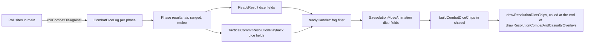

# Combat Dice Chips and Tactical Battles Dialog: Execution Plan


## Goal

1. During resolution playback, flash a small "dice chip" under each stack that rolled. The chip shows what the dice were compared with (die face against hit number) and the outcome. Chips are drawn above every other playback animation.
2. Center the Tactical Battles dialog (the Fight/Ignore list in `meleeInterceptModal.ts`) on the visible map instead of the whole window. Widen it 20% and give all of the extra width to the Hex column.

## Decisions Already Made (do not revisit)

- Chips are always on. There is no setting.
- The playback timeline does not change. Each phase's chips stay up from the start of that phase's lightning beat to the end of its casualty beat (about 1 to 2 seconds).
- Chips are drawn after every other playback layer on the overlay canvas: lightning, shot lines, casualty marks, and moving units.
- A chip hangs from the token of the stack that rolled, not from the target:
  - Air phase: all rolls (strike, anti-air, infrastructure counter-fire) anchor on the strike target hex, where playback already draws the striker.
  - Ranged phase: direct fire anchors on the shooter's hex. Return fire anchors on the returning defender's hex.
  - Melee phase: both sides anchor on the melee hex.
- Strategic fog: drop any roll whose anchor hex is not visible after the turn or is listed as an unknown combat or casualty hex. Tactical battles have full visibility, so nothing is filtered there.
- Chips are hidden while strategic units are hidden by the res4 zoom (`shouldHideStrategicMapUnitsForRes4Zoom`).
- The dialog's dimmed backdrop still covers the whole window, so the right panel stays blocked as it is today. Only the panel moves.

## Rules for Every Step

- Never commit or push.
- Never put step numbers, this plan's name, or any other plan wording in code, comments, logs, tests, or docs.
- Finish each step's Verify list before starting the next step. If a check fails and the fix is not obvious inside that step's files, stop and report instead of changing other files.
- Every new or changed field, function, type, and constant gets an orienting JSDoc comment. See `src/main/combatDice.ts` for the style. Lint (`eslint-rules/require-orienting-block.cjs`) rejects a comment unless:
  - it is a single `/** ... */` block placed immediately before the declaration
  - its first line is a plain summary sentence with no label
  - it has at least 5 non-empty lines
  - it has non-empty `When to use:`, `Expected outcome:`, and `Exceptions:` lines
  - it has `Purpose:` for functions, classes, and top-level interfaces, or `Contract:` for interface members (property and method signatures)

  Lint only checks top-level functions, interfaces, interface members, classes, class members, and enum members. Constants, type aliases, and type-literal members still need the same comment format, because the house rules require it.
- The code blocks in this plan use short `//` notes for brevity. Turn each one into a full orienting block when writing the code.
- Logging in main-process code uses `logDebug`, `logTrace`, and `logError` from `src/main/logger.ts`. Tactical files use the existing `tacticalLogMutate` (debug), `tacticalLogQuery` (trace), and `tacticalLogError` wrappers instead.
  - Every new or changed public function logs at debug when called, with enough detail to troubleshoot (counts, ids, hexes, thresholds).
  - Getter-style functions that change nothing log at trace.
  - Caught exceptions log at error. This plan adds no new `try`/`catch`.
  - Per-die debug logs are fine. The default level is `info`, and `logDebug` returns at once below its threshold, so normal play pays almost nothing. Real resolution rolls tens to a few hundred dice per turn. The Monte Carlo estimator does not call the per-engagement functions.
- Use `const`/`readonly` wherever a value or field is not reassigned.
- File names are camelCase. Allowed role suffixes are `Handler`, `Helpers`, `Guards`, `Adapter`, `Pipeline`, `Core`, and `Types`. Never use `Utils` or `Impl`. See `doc/naming-conventions-contract-v1.md`.
- File size: put new logic in the new files this plan names, and keep edits to existing files to the lines described. Several touched files are already between 600 and 1000 lines (`combatResolution.ts`, `tacticalStrategicOrderPhases.ts`, `tacticalBattleSession.ts`, `readyTypes.ts`, `readyHandler.ts`), and `airStrikeResolution.ts` will cross 600. That small growth is accepted. No touched file may reach 1000 lines. Do not touch `src/renderer/renderer.ts` at all.
- The renderer type check (`npm run check:renderer-types`) compares `file|code|message` entries against `scripts/renderer-typecheck-baseline.json` and also fails when the total count grows. `resolutionCombatOverlays.ts` already has 11 baseline entries of `'anim' is possibly 'null'`, so any new unguarded use of `anim` there fails the gate. Never edit the baseline file. Fix the code instead.
- Tests cover happy paths and essential failures only, using `node:test` and `node:assert/strict` like `src/shared/resolutionPlaybackPhase.test.ts`. The renderer has no unit tests; keep its drawing code thin and put logic in `src/shared`.
- Recording dice must never change combat outcomes or how many times the RNG is drawn. Every existing `rollDie()` call becomes exactly one helper call that makes exactly one draw. Short-circuit guards stay in front of the roll (for example `canReturnFire && ...`).

## Verification Commands

- `npm run build:main`, `npm run build:renderer`, `npm run lint`, and `npm run check:renderer-types` are fast checks.
- `npm test` is the full gate. It rebuilds the native module for Node, builds main, lints, runs `naming:check` and the renderer type check, then runs every `*.test.js` under `dist/main` and `dist/shared`.
- `npm start` runs the app. It rebuilds the native module for Electron first, so run it after `npm test` when you need a manual check.

## Data Flow



---

## Step 1: Tactical Battles Dialog Placement and Width

Independent of the dice work.

Files:
- `src/renderer/gameplay/meleeInterceptModal.ts`
- `static/overlayChrome.css` (`.melee-intercept-*` rules near line 409)
- New: `src/renderer/map/visibleMapFrame.ts`
- `doc/ux/tactical-battles-list.md`

Work:
1. Create `visibleMapFrame.ts` exporting `attachFrameToVisibleMap(frame: HTMLElement): () => void`.
   - It reads `document.getElementById('canvas-container')?.getBoundingClientRect()` and sets the frame's `left`, `top`, `width`, and `height` in px. If the container is missing or has zero area, it covers the window: `0`, `0`, `innerWidth`, `innerHeight`.
   - It runs once right away. When the container exists, it re-runs on `ResizeObserver` callbacks for the container. It also re-runs on the window `resize` event, because the container can move without changing size.
   - It returns a detach function that disconnects the observer and removes the `resize` listener. Calling the detach function twice is harmless.
   - The renderer has no logger, so this file does not log, matching the rest of `src/renderer/map`.
2. In `openMeleeInterceptModal`:
   - Change the overlay inline style to only `position:fixed;inset:0;z-index:8000;background:rgba(0,0,0,0.35);`, dropping the flex, padding, and overflow parts.
   - Add a `div.melee-intercept-frame`. Replace `overlay.appendChild(panel)` with `frame.appendChild(panel); overlay.appendChild(frame);`.
   - Declare `let detachFrame: (() => void) | null = null;` just before `const cleanup`. Add `detachFrame?.();` to `cleanup()`, then `detachFrame = null;`.
   - Right after `document.body.appendChild(overlay)`, add `detachFrame = attachFrameToVisibleMap(frame);`. The early `reject` path for a missing `document.body` never attaches, so nothing leaks.
   - Replace the colgroup widths `['2.75rem', '50%', '25%', '25%']` with `['2.75rem', '', '20%', '20%']`. An empty string means no width is set, so in `table-layout: fixed` the Hex column takes all remaining width. This also removes today's over-100% column total.
     - Review note: `8rem` summaries were tried first. They took most of the table at the 800px minimum window (Hex 128px, down from about 237px before this change). `min(8rem, 20%)` does not work, because fixed tables fall back to equal widths for it. `20%` gives 125px summaries at full width and 86px at the minimum, where Hex keeps 213px.
3. CSS:
   - New `.melee-intercept-frame`: `position: fixed; display: flex; align-items: center; justify-content: center; padding: 12px; box-sizing: border-box; pointer-events: none;`. The `pointer-events: none` is required: backdrop clicks must still reach the overlay so the existing `ev.target === overlay` Ignore handler fires.
   - `.melee-intercept-panel`:
     - Replace `max-width: min(520px, 92vw)` with `max-width: 655px`, `max-height: calc(100vh - 28px)` with `max-height: 100%`, and `margin: 12px auto 24px` with `margin: 0`.
     - Add `box-sizing: border-box; pointer-events: auto;`. Keep `width: 100%` and the existing flex column, `min-height: 0`, and `overflow: hidden`, so `.melee-intercept-scroll` still scrolls long lists inside the panel.
     - 655px is 1.2 × the current outer width of 546px: a 520px content-box max-width plus 24px padding and 2px border. With `border-box`, the 655px includes padding and border.
     - The `92vw` cap is no longer needed, because the frame's 12px padding keeps the panel inside the map area.
     - `max-height: 100%` resolves against the frame's px height, which `attachFrameToVisibleMap` always sets.
4. Docs: in `tactical-battles-list.md`, replace "The dialog covers the window." with: the dimmed backdrop covers the window, and the panel is centered on the visible map area and follows it when the window resizes. Add `src/renderer/map/visibleMapFrame.ts` to Code Entry Points.

Verify:
- `npm run build:renderer`, `npm run lint`, `npm run check:renderer-types`.
- Manual (`npm start`):
  - End a turn with a melee candidate and the Tactical battles checkbox checked.
  - The panel is centered horizontally and vertically over the map, not over the map plus the right panel.
  - The Hex column is clearly wider, and Human and AI look about the same width as before (each about 125px at full width).
  - The table has no horizontal scrollbar, and long hex descriptions still wrap or clip as they do today.
  - On a narrow window (map area under 655px wide) the panel shrinks to fit inside the map with 12px margins. A long list scrolls inside the panel, and the Fight and Ignore controls stay reachable.
  - A backdrop click, Escape, and Ignore all still resolve as Ignore. Fight still works.
  - Resizing the window keeps the panel centered on the map.

---

## Step 2: Dice Types, Recording Helper, Ranged and Melee Recording

Files:
- New: `src/shared/ipc/combatDiceTypes.ts`, plus an `export * from './combatDiceTypes';` line in `src/shared/ipc/index.ts`.
- New: `src/main/combatDiceRecording.ts`
- `src/main/combatResolution.ts`
- `src/main/combatResolution.test.ts`

Work:
1. `combatDiceTypes.ts` (type-only):

```ts
export type CombatDiceRollKind =
  | 'airStrike' | 'antiAir' | 'infrastructureCounterFire'
  | 'ranged' | 'returnFire' | 'meleeAttack' | 'meleeDefense';
export type CombatDiceInfrastructureType = 'urban' | 'airport' | 'seaport';
export interface CombatDiceRoll {
  readonly kind: CombatDiceRollKind;
  readonly player: string | null;          // null only for infrastructureCounterFire
  readonly unitType: string | null;        // null only for infrastructureCounterFire
  readonly infrastructureType?: CombatDiceInfrastructureType; // only for infrastructureCounterFire
  readonly anchorH3Index: string;          // hex whose token the chip hangs from
  readonly face: number;                   // 1..COMBAT_DIE_SIDES
  readonly threshold: number;              // hit when face <= threshold
}
export interface CombatDicePlaybackFields {
  readonly airStrikeDiceRolls?: readonly CombatDiceRoll[];
  readonly rangedDiceRolls?: readonly CombatDiceRoll[];
  readonly meleeDiceRolls?: readonly CombatDiceRoll[];
}
```

2. `combatDiceRecording.ts`:
   - `export type CombatDiceRollSink = (roll: CombatDiceRoll) => void;`
   - `export type CombatDiceRollContext = Omit<CombatDiceRoll, 'face' | 'threshold'>;`
   - `export interface CombatDiceLog { readonly rolls: CombatDiceRoll[]; readonly sink: CombatDiceRollSink; }`
   - `export function createCombatDiceLog(): CombatDiceLog`. It logs `logDebug('createCombatDiceLog')` once, and its sink pushes onto `rolls`.
   - `export function rollCombatDieAgainst(rollDie: () => number, threshold: number, context: CombatDiceRollContext, sink?: CombatDiceRollSink): boolean`.
     - It draws exactly one face with `rollDie()`, builds `const roll: CombatDiceRoll = { ...context, face, threshold }`, calls `sink?.(roll)`, and returns `face <= threshold`.
     - It logs `logDebug('rollCombatDieAgainst', { ...roll, hit, recorded: sink !== undefined })`.
     - Its comment must state that `threshold` is computed before the draw. That is safe because threshold inputs are table lookups that never draw from the RNG.
     - Its comment must also state that the sink only observes, and that the function draws once whether or not a sink is given.
3. `combatResolution.ts`:
   - Add `onRoll?: CombatDiceRollSink` to `ResolveOneRangedEngagementOptions`.
   - In `resolveOneRangedEngagement`, an attacker roll becomes `rollCombatDieAgainst(rollDie, attackHitThreshold(u), { kind: 'ranged', player: u.player, unitType: u.unitType, anchorH3Index: u.h3Index }, options?.onRoll)`.
   - A return-fire roll becomes `canReturnFire && rollCombatDieAgainst(rollDie, attackHitThreshold(u), { kind: 'returnFire', player: u.player, unitType: u.unitType, anchorH3Index: u.h3Index || defenderHexH3 }, options?.onRoll)`.
   - `resolveOneMeleeEngagement` gains an optional 4th parameter `onRoll?: CombatDiceRollSink`.
     - Attacker rolls use kind `meleeAttack` against `attackHitThreshold(u)`, and defender rolls use `meleeDefense` against `defenseHitThreshold(u)`. Both anchor on `u.h3Index`, which is the melee hex in `runMeleePhase` and the res4 cell in tactical melee.
     - It has no log today. Add `logDebug('resolveOneMeleeEngagement', { attackerCount, defenderCount, attackerHits, defenderHits })` after the rolls, and update its orienting comment to mention `onRoll`.
   - Update the orienting comment of `resolveOneRangedEngagement` and of `ResolveOneRangedEngagementOptions.onRoll` the same way.
   - Add `diceRolls?: CombatDiceRoll[]` to `CombatResolutionResult`. It is optional so hand-built results elsewhere stay valid. Its contract says `runRangedPhase` and `runMeleePhase` always set it, in roll order.
   - In both phase functions, create one `createCombatDiceLog()` and pass its sink to every engagement call, including the three-or-more-sides loop in `runMeleePhase`. Return `diceRolls: log.rolls`, and add `diceRollCount` to the existing `runRangedPhase complete` and `runMeleePhase complete` debug logs.
   - Existing callers that pass no sink stay unchanged, including `src/main/tools/combatEstimation.test.ts`.
4. Tests, added to `combatResolution.test.ts`:
   - Draw-count contract: call `resolveOneRangedEngagement` with a scripted die that returns `[3, 15]` in order and counts its calls. Use one attacker and one return-fire-capable defender, and pass `onRoll` collecting into an array. Assert:
     - the die was called exactly 2 times
     - the recorded faces are `[3, 15]` with kinds `['ranged', 'returnFire']`
     - the anchors are the attacker's and the defender's `h3Index`
     - the removal ids equal those from a second call with the same scripted die and no `onRoll`
   - Melee kinds: `resolveOneMeleeEngagement` with one unit per side and `onRoll` records one `meleeAttack` and one `meleeDefense` roll. Each threshold equals `attackHitThreshold` or `defenseHitThreshold` for that unit.
   - Phase wiring: in one existing `runRangedPhase` scenario and one existing `runMeleePhase` scenario, `diceRolls` is non-empty, and every roll's `anchorH3Index` is a hex from that scenario.

Verify: `npm test`. Every existing combat test passes with no edits. They lock outcomes for fixed dice, which proves recording changed nothing.

---

## Step 3: Air Strike and Tactical Recording

Files:
- `src/main/gameActions/airStrikeResolution.ts`
- `src/main/tacticalBattle/tacticalAirStrikeUnits.ts`
- `src/main/tacticalBattle/tacticalStrategicOrderPhases.ts`
- `src/main/tacticalBattle/tacticalMeleeApply.ts`
- `src/main/tacticalBattle/tacticalBattleSession.ts`
- Tests in `src/main/gameDb.test.ts`, `src/main/tacticalBattle/tacticalMeleeApply.test.ts`, and optionally `tacticalStrategicOrderingAlignment.test.ts`

Work:
1. Strategic air (`airStrikeResolution.ts`):
   - Add `readonly diceLog: CombatDiceLog` to `AirStrikePhaseAccumulator`, and set it with `createCombatDiceLog()` in the only literal (`const acc: AirStrikePhaseAccumulator = {` near line 486). Keeping it on `acc` avoids adding parameters to helpers that already take 6 or 7. No test or fixture builds an `AirStrikePhaseResult` literal, so the new required `diceRolls` field breaks nothing.
   - The attack roll (`const attackHit = rollDie() <= attackHitThreshold({...})`) becomes `rollCombatDieAgainst` with `{ kind: 'airStrike', player: attacker.player, unitType: attacker.unit_type, anchorH3Index: order.targetH3Index }`.
   - In `resolveAirStrikeAgainstUnits`, the anti-air roll `if (rollDie() > attackHitThreshold({...})) continue;` becomes `if (!rollCombatDieAgainst(...)) continue;` with `{ kind: 'antiAir', player: defender.player, unitType: defender.unit_type, anchorH3Index: targetH3Index }`.
   - In `resolveAirStrikeAgainstInfrastructure`, the counter-fire roll uses `{ kind: 'infrastructureCounterFire', player: null, unitType: null, infrastructureType: order.targetType, anchorH3Index: order.targetH3Index }` with `INFRASTRUCTURE_COUNTER_FIRE_THRESHOLD[order.targetType]`.
   - Add `diceRolls: acc.diceLog.rolls` to the returned object. `AirStrikePhaseResult` picks it up through `ReturnType`.
2. Tactical air strikes on units (`tacticalAirStrikeUnits.ts`): add `readonly onRoll?: CombatDiceRollSink` to `TacticalAirStrikeOnUnitsInput`. The attack roll is `airStrike` and the counter-fire rolls are `antiAir`, all anchored on `targetH3Index`.
3. Tactical air and ranged phase (`applyTacticalAirStrikeThenRangedPhaseOnBattle`):
   - Create `airDiceLog` and `rangedDiceLog`, and pass `airDiceLog.sink` to `resolveTacticalAirStrikeAgainstUnitsOnSubUnits`.
   - The infrastructure strike attack roll (`if (rollDie() > attackHitThreshold({ unitType: 'air', ...`) is `airStrike`, anchored on `s.targetH3Index`. The infrastructure counter-fire roll is `infrastructureCounterFire` with `infrastructureType: s.targetType`.
   - After `runRangedPhase`, append `rangedResult.diceRolls ?? []` to `rangedDiceLog.rolls`.
   - The infrastructure-only ranged roll (`rangedOrdersInfraOnly` loop) is `ranged`, anchored on `atk.h3Index`.
   - Add `airStrikeDiceRolls: CombatDiceRoll[]` and `rangedDiceRolls: CombatDiceRoll[]` to `TacticalAirRangedPhaseAccum` and to its return object. Fix every compile error from object literals typed as that type.
4. Tactical melee (`tacticalMeleeApply.ts`): add `meleeDiceRolls: CombatDiceRoll[]` to the return type and to both return statements, set to `meleeResult.diceRolls ?? []`.
5. `tacticalBattleSession.ts` (`applyHumanTacticalDraftBeatInStrategicOrder`, success result type near line 432): add `airStrikeDiceRolls: CombatDiceRoll[]` and `rangedDiceRolls: CombatDiceRoll[]` beside `airStrikePlaybackStrikeHexes`, and pass them through from `acc` in the success return (near line 528). `meleePack` already carries `meleeDiceRolls` through its `ReturnType`.
6. Logging (add counts to existing logs; add no new log lines except the one below):
   - `resolveAirStrikePhase` has only an entry log (`logDebug('resolveAirStrikePhase', ...)`). Add one `logDebug('resolveAirStrikePhase complete', { diceRollCount, removedCount })` just before its return.
   - Add `airDiceRollCount` and `rangedDiceRollCount` to `tacticalLogMutate('applyTacticalAirStrikeThenRangedPhaseOnBattle complete', ...)`.
   - Add `diceRollCount` to both `tacticalLogMutate('applyTacticalMeleeAfterSupportOrders ...')` calls.
   - Per-die detail already comes from `rollCombatDieAgainst`.
7. Tests (one assertion each, no new fixtures):
   - In the existing `resolveAirStrikePhase` test in `gameDb.test.ts`, the first roll is an `airStrike` roll anchored on the target hex.
   - In the existing melee case in `tacticalMeleeApply.test.ts` that records a melee hex, `meleeDiceRolls` is non-empty and every roll anchors on that cell.
   - Only if `tacticalStrategicOrderingAlignment.test.ts` already has an air-vs-units case: its `airStrikeDiceRolls[0].kind` is `airStrike`.

Verify: `npm test`.

---

## Step 4: Carry Dice to the Renderer Payloads

Files:
- `src/shared/ipc/readyTypes.ts`: change `ReadyResult` to `export interface ReadyResult extends CombatDicePlaybackFields`.
- `src/shared/ipc/tacticalPlaybackTypes.ts`: change `TacticalCommitResolutionPlayback` to `CombatDicePlaybackFields & { ... }`.
- `src/main/gameActions/meleeInterceptReadyFinalize.ts`
- `src/main/ipc/readyIpcResolutionMapping.ts`
- `src/main/gameActions/humanTacticalDraftCommit.ts`

Work:
1. `finalizeReadyTurnAfterMelee`:
   - Add `airStrikeDiceRolls`, `rangedDiceRolls`, and `meleeDiceRolls` to the returned `ReadyResult`. Read them from `airStrikeResult.diceRolls`, `rangedResult.diceRolls ?? []`, and `meleeResult.diceRolls ?? []`, and omit each when empty, matching the neighboring fields.
   - Add the three counts to the existing `logDebug('finalizeReadyTurnAfterMelee', ...)`.
   - The melee-intercept resume path needs no change. Its pause snapshot already stores `rangedResult` and `airStrikeResult` in memory, and the snapshot is never persisted.
2. `readyIpcResolutionMapping.ts`: add the three keys to `ReadyResolutionIpcMirrorSource` and copy them in `pickReadyResolutionIpcMirrorFields`.
3. `humanTacticalDraftCommit.ts`:
   - Add the three fields to `tacticalResolutionPlayback`, omitted when empty: `support.airStrikeDiceRolls`, `support.rangedDiceRolls`, and `meleePack.meleeDiceRolls`.
   - Add the three counts to the existing `logDebug('gameActions commitHumanTacticalDraftOrders playback', ...)`.

Verify:
- `npm test`.
- Manual: `npm start`, play one turn with a ranged attack, and one tactical beat with melee. The main debug log shows non-zero dice counts on the two log lines above.

---

## Step 5: Pure Chip Model in Shared Code

Files: new `src/shared/combatDiceChips.ts` and `src/shared/combatDiceChips.test.ts`.

Exports (each with an orienting comment):
- `COMBAT_DICE_CHIP_MAX_LINES = 4`
- `COMBAT_DICE_ROW_MAX_FACES = 3`
- `COMBAT_DICE_FADE_IN_MS = 150`
- `COMBAT_DICE_FADE_OUT_MS = 250`
- `type CombatDiceChipTag = 'ATK' | 'DEF' | 'RET' | 'AA'`. The tag for a kind is:
  - `ATK` for `airStrike`, `ranged`, and `meleeAttack`
  - `DEF` for `meleeDefense`
  - `RET` for `returnFire`
  - `AA` for `antiAir` and `infrastructureCounterFire`
- `interface CombatDiceChipRow`, all fields readonly: `tag`, `kind`, `player`, `unitType`, `infrastructureType?`, `threshold`, `rollCount`, `hitCount`, and `faces`. `faces` is sorted ascending, holds every face when `rollCount <= COMBAT_DICE_ROW_MAX_FACES`, and is empty otherwise, meaning the row is shown as a tally.
- `interface CombatDiceChip { readonly anchorH3Index: string; readonly rows: readonly CombatDiceChipRow[]; readonly hiddenRowCount: number; }`
- `isCombatDiceHit(roll)`: `face <= threshold`.
- `buildCombatDiceChips(rolls: readonly CombatDiceRoll[]): CombatDiceChip[]`:
  - Make one chip per anchor, in order of each anchor's first roll.
  - Within a chip, group rows by kind, player, unitType, infrastructureType, and threshold.
  - Sort rows by:
    - kind: `airStrike`, `ranged`, `meleeAttack`, `returnFire`, `meleeDefense`, `antiAir`, `infrastructureCounterFire`
    - then player: `human`, `opponent`, then `null`
    - then unitType: infantry, armor, naval, air
    - then threshold, highest first
  - When there are more rows than `COMBAT_DICE_CHIP_MAX_LINES`, keep the first `MAX_LINES - 1` rows and set `hiddenRowCount` to the rest. The drawn chip therefore never exceeds `MAX_LINES` lines, counting the "+N more" line.
- `combatDiceWindowForPhase(phase: ResolutionPlaybackPhase, which: 'airStrike' | 'ranged' | 'melee'): { startMs: number; endMs: number }`:
  - `airStrike`: from `airStrikeCombatStart` to `airStrikeReturnStart`
  - `ranged`: from `rangedCombatStart` to `movementStart`
  - `melee`: from `meleeCombatStart` to `totalMs`
- `combatDiceChipOpacity(elapsedMs, startMs, endMs): number`:
  - 0 outside `[startMs, endMs)`, and 0 for an empty window
  - a linear ramp up over `FADE_IN`
  - a linear ramp down over the last `FADE_OUT`
  - when the window is shorter than both ramps together, take the minimum of the two ramps
- `pickPlaybackDiceRolls(source: CombatDicePlaybackFields, visibility?: { visibleHexes: ReadonlySet<string>; unknownHexes: ReadonlySet<string> }): CombatDicePlaybackFields`:
  - When `visibility` is given, keep only rolls whose anchor is visible and not unknown.
  - Omit each array that ends up empty.

Tests (happy paths plus the essential edges):
- A single roll gives a row whose faces hold that roll.
- Five same-group rolls give a tally row with `faces` empty and the correct `hitCount`.
- Different thresholds or players split rows, and `ATK` rows come before `DEF` rows.
- Six rows give 3 visible rows and `hiddenRowCount` 3.
- Opacity is 0 before and after the window, 1 mid-window, and ramps at the edges.
- The visibility filter drops hidden and unknown anchors and omits empty arrays.

Verify: `npm test`.

---

## Step 6: Renderer Animation State and Wiring

Files:
- `src/renderer/core/state.ts` (1162 lines, over the hard limit)
- New: `src/renderer/core/resolutionMoveAnimationTypes.ts`
- `src/renderer/gameplay/readyHandler.ts`

Work:
1. Move the `ResolutionMoveAnimationState` type (state.ts lines 34 to 218) unchanged into `resolutionMoveAnimationTypes.ts`, bringing the imports it needs. In `state.ts`, import it for local use and re-export it with `export type { ResolutionMoveAnimationState } from './resolutionMoveAnimationTypes';` so existing imports keep working. Keep the type's existing orienting comment and member comments. Run `npm run build:renderer` and `npm run check:renderer-types` before changing anything else. `state.ts` has no baseline entries, and baseline entries carry no line numbers, so the move must leave the type-check count unchanged. If the count changes, undo the move and find out why before going on. `state.ts` should end up under 1000 lines.
2. Change the moved type to `(CombatDicePlaybackFields & { ...existing fields... }) | null`. Import `CombatDicePlaybackFields` from `../../shared/ipcTypes`, as the renderer already does for other IPC types. The type keeps its name, so the existing baseline message `Argument of type 'ResolutionMoveAnimationState' ...` stays identical.
3. Wire `readyHandler.ts`. Grep for `S.resolutionMoveAnimation = {` to find both builders.
   - Strategic builder (near line 525): spread `...pickPlaybackDiceRolls(readyResult, { visibleHexes, unknownHexes: new Set([...unknownCombatHexes, ...unknownCasualtyHexes]) })`. `visibleHexes`, `unknownCombatHexes`, and `unknownCasualtyHexes` are already in scope there.
   - Tactical builder (near line 234): spread `...pickPlaybackDiceRolls(playback)` with no visibility, because tactical battles are fully visible.
   - Neither playback trigger needs a change. Every phase that rolls dice also sets a field that already starts playback: air strike attempts, ranged combat hexes, or melee combat hexes.

Verify: `npm run build:renderer`, `npm run lint`, `npm run check:renderer-types`, `npm test`. Nothing is visible yet.

---

## Step 7: Draw the Chips

Files:
- New: `src/renderer/rendering/combatDiceChipDrawing.ts`
- `src/renderer/rendering/unitDrawing.ts`
- `src/renderer/rendering/resolutionCombatOverlays.ts` (one call line, one import, and a comment update)

Work:
1. In `unitDrawing.ts`, export `drawUnitTypeGlyph(ctx, centerX, centerY, unitType: string, sizePx: number, player?: string): boolean`.
   - It returns false for a type that is not one of `infantry`, `armor`, `naval`, or `air`.
   - Otherwise it calls the existing private `drawUnitSvgIcon` with `fitScaleMultiplier = sizePx / (UNIT_RADIUS * 2 * TOKEN_ICON_FIT_RATIO)` and returns its result, which is false while the image is still loading.
2. In `combatDiceChipDrawing.ts`, add module constants with orienting comments:
   - font: `'bold 10px system-ui, sans-serif'`
   - layout: row height 14, padding 4 horizontal and 3 vertical, gap 3, corner radius 3, mini-token radius 6, glyph size 10
   - background `#1b2838` at alpha 0.92, border `#5a7090`
   - text `#f4f6f8`, tag `#b7c4d4`, hit `#86efac`, miss `#8aa0b8`
   - mini-token stroke by player: human `#7dcec8`, opponent `#f0b4c8`
   - infrastructure labels: urban `City`, airport `Airport`, seaport `Port`
3. Export `drawResolutionDiceChips(ctx, width, height, anim: NonNullable<ResolutionMoveAnimationState>, elapsedMs): void`:
   - Get `phase` from `buildResolutionPlaybackState(anim, elapsedMs)`.
   - For each of `airStrike`, `ranged`, and `melee`:
     - Take that phase's roll array from `anim`. Compute the opacity with `combatDiceChipOpacity` and `combatDiceWindowForPhase`, and skip the phase when the opacity is 0 or there are no rolls.
     - Build chips with `buildCombatDiceChips`, memoized in a module `WeakMap` keyed by the roll array.
     - Sort the chips by anchor screen y, ascending, and draw each one with `ctx.save()`, `globalAlpha = opacity`, and `ctx.restore()`.
   - Each row is drawn left to right:
     - the tag text
     - a mini token, which is a circle in `PLAYER_COLORS[player]` with the player stroke and `drawUnitTypeGlyph` inside it, falling back to the `UNIT_TYPE_LABELS` letter while the glyph is loading. Infrastructure rows draw the label text instead of a token.
     - then either each face (hit color for `face <= threshold`, miss color otherwise) or a tally `hits/rolls` with the hit count in the hit color
     - then `≤` and the threshold in the text color
   - When `hiddenRowCount > 0`, add a final line `+N more` in the tag color.
   - Chip width is the widest row measured with `ctx.measureText`, plus horizontal padding.
   - Position: `x = center.x - w / 2`, `y = center.y + UNIT_RADIUS - 2`, with `center = hexCenterPx(anchorH3Index)` from `../map/mapHelpers`, the same helper the lightning and casualty overlays use. Clamp into `[2, width - w - 2]` horizontally and `[2, height - h - 2]` vertically. When `w` or `h` is larger than the canvas, clamp to 2.
   - The renderer has no logger, so this file does not log, like the other `src/renderer/rendering` drawing modules.
4. Call it from the end of `drawResolutionCombatAndCasualtyOverlays` in `resolutionCombatOverlays.ts`, after the casualty block, as its last statement:

```ts
if (anim && !shouldHideStrategicMapUnitsForRes4Zoom()) {
  drawResolutionDiceChips(ctx, width, height, anim, elapsed);
}
```

   - Both `drawGameScene` branches (tactical and strategic) already call `drawResolutionCombatAndCasualtyOverlays` as their final playback draw, after shot lines, moving units, lightning, and casualties. Drawing the chips last inside it therefore puts them above every animation, with no change to `renderer.ts`.
   - `shouldHideStrategicMapUnitsForRes4Zoom()` (from `../map/terrainView`) is always false during a tactical battle, so tactical chips always draw.
   - The explicit `anim &&` guard is required. The parameter type includes `null`, and an unguarded use adds a new type-check error that fails the baseline gate.
   - Update the function's orienting comment. The summary line and `Expected outcome` now mention that dice chips are drawn last, above every other playback layer. `When to use` should say it must stay the final playback draw call in each `drawGameScene` branch.

Verify:
- `npm run build:renderer`, `npm run lint`, `npm run check:renderer-types`, `npm test`.
- Manual (`npm start`):
  - Ranged: an armor adjacent to an enemy, then Ready. An `ATK` chip appears under the shooter, and a `RET` chip appears under the target when the target could fire back. Chips sit above the lightning, the shot lines, and the casualty X, and fade before movement starts.
  - Melee: one chip under the contested hex with an `ATK` row and a `DEF` row in the two player colors.
  - Air strike on units: the chip on the target hex shows the striker's `ATK` row and any `AA` rows that rolled. An airport strike shows an `AA Airport` row.
  - A stack of four or more of one type shows a tally such as `2/5 ≤3`.
  - With fog on, no chip appears on a hex outside vision.
  - Zoomed in to the res4 view on the strategic map, no chips appear.
  - A tactical battle beat shows chips on the res4 cells.
  - Chips never block clicks: map gestures behave as they do today during playback.
- Review note: the live check showed that the build markers and tactical entry magnifiers, both DOM buttons above the canvas, covered the top row of chips on their hexes. The owner chose to hide both marker layers while chips show. `areResolutionDiceChipsShowing` in `combatDiceChipDrawing.ts` uses the same phase windows and res4 zoom rule as the drawing, and `syncBuildEntryButton` and `syncTacticalEntryButton` hide their layers while it returns true. Playback redraws every frame, so the markers return as the chips fade. A tactical entry marker can't be clicked during that time.

---

## Step 8: Documentation

Update in place:
- `doc/ux/resolution-playback.md`:
  - Under Information Displayed, describe dice chips: where they anchor in each phase, what the rows contain, the tally rule, and the "+N more" line.
  - Under Invariants, add that chips never appear on a hidden or unknown hex, never change timing, and never take input.
  - Add the new files to Code Entry Points.
- `doc/combat-rules-v3.md` §13.1 and §13.2: one line each saying the dice chips sit on top of every other playback layer from lightning through casualties.
- `doc/ux/map-overlays.md`: add dice chips wherever playback overlays are listed.
- `doc/ui-style-guide.md`: add the dice hit and miss colors and the chip chrome to the palette, pointing to `combatDiceChipDrawing.ts`.
- `doc/ux/tactical-battles-list.md`: already updated in Step 1; re-read it for consistency.

Verify:
- Proofread every changed doc, and check that none mentions this plan's steps.
- Final whole-change check:
  - `npm test` passes.
  - `git status` shows no change to `src/renderer/renderer.ts` or `scripts/renderer-typecheck-baseline.json`.
  - Search the changed files for this plan's file name and for "Step " so no plan wording leaked in.
  - Leave every change uncommitted for review.
