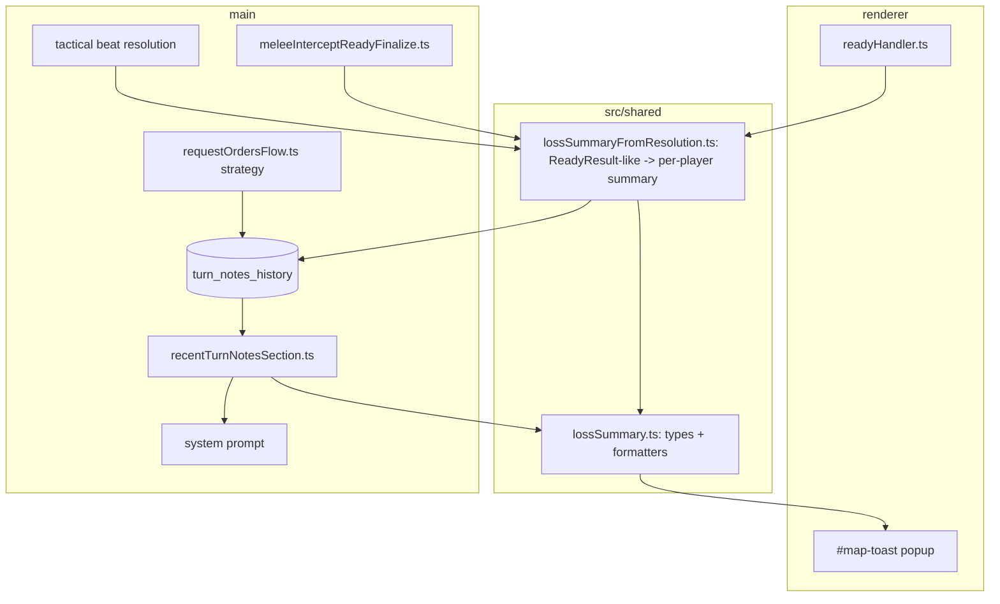

# Consolidated Loss Reporting and Recent-Turn Prompt Notes

Deliverable: write this plan to `.spec/consolidated-loss-reporting-execution-plan.md` (per user rule 5), then implement in phases.

## Confirmed design decisions (from user)
- Tactical notes are scoped per tactical battle: history resets when a new battle starts. First tactical notes appear on the 2nd tactical beat.
- Popup gains a bold `Other` section for non-loss lines (deployment, caps, hexes lost, air-strike infrastructure destroyed, engagement fallbacks); hidden when empty, like the loss sections.
- Prompt: ADD the new 3-turn notes section and REMOVE the existing `Losses Since Last Consultation` table; use the engine's full loss record (no fog) for prompt summaries.
- Popup section order: `Human Losses`, then `AI Losses`, then `Other` (each bold header, hidden when empty).
- When a turn/beat resolves with no losses and no `Other` content, suppress the popup entirely (no toast), matching current skip-when-empty behavior.
- DB schema change is destructive by design: bump `EXPECTED_USER_VERSION` 11 -> 12; existing in-progress saved games reset on next launch via the established recover-by-recreate path (no migration framework added), consistent with all prior schema changes in this repo.

## Assumptions (stated; easy to change)
- "Entries" in a loss line are the destroyed (victim) units belonging to that player. <=5 entries -> list display names; >5 -> grouped counts `N Naval, N Air, N Armored, N Infantry` (only groups > 0, in that order).
- Popup keeps existing fog-of-war filtering for enemy/AI losses (human losses always shown; enemy losses only when observed via `deriveCombatVisibilityClassification`). Prompt uses the full record.
- Cause mapping is five buckets: `Ranged attack` = direct fire, `Melee attack`, `Return fire`, `Air strike`, and `Other losses` = catch-all for any destroyed unit not attributable to the prior four (e.g. transport cargo lost at sea, stranded air from invalid base). The five buckets form a complete partition of removed units, so no loss is dropped. Display order: Ranged attack, Melee attack, Return fire, Air strike, Other losses (Other losses last).

## Cause sources
- Ranged attack: `ReadyResult.killsByDirectFire` (strategic) / `playback.killsByDirectFire` (tactical).
- Return fire: `killsByReturnFire`.
- Melee attack: strategic = `kills` minus direct minus return; tactical = `playback.killsByMelee`.
- Air strike: `airStrikeRemovedUnits` (strategic) / `playback.killsByAirStrike` + `airStrikeRemovedUnits` (tactical).
- Other losses: every removed unit in `removedUnits` not already claimed by one of the four causes above (computed as set difference over the full `removedUnits` + `airStrikeRemovedUnits` union).
- Victim `player`/`unitType`/`displayName` resolved from the union of `removedUnits` + `airStrikeRemovedUnits` snapshots (`RemovedUnitSnapshot` in `src/shared/ipc/readyTypes.ts`).

## Architecture flow

## Phase 1 - Shared loss-summary model and formatters (pure, unit-tested)
- New file `src/shared/lossSummary.ts`:
  - `LostUnit { unitType: 'naval'|'air'|'armor'|'infantry'; displayName: string }`.
  - `PlayerLossSummary { ranged: LostUnit[]; melee: LostUnit[]; returnFire: LostUnit[]; airStrike: LostUnit[]; other: LostUnit[] }`.
  - `TurnLossSummary { human: PlayerLossSummary; ai: PlayerLossSummary }`.
  - `formatLossEntries(units: LostUnit[]): string` - list display names when `units.length <= 5`; else grouped counts in order Naval, Air, Armored, Infantry, omitting zero groups (label map: armor->"Armored", naval->"Naval", air->"Air", infantry->"Infantry").
  - `formatPlayerLossLinesMultiline(summary): { causeLabel, text }[]` - one entry per non-empty cause, labels `Ranged attack`, `Melee attack`, `Return fire`, `Air strike`, `Other losses` (display order: Ranged, Melee, Return fire, Air strike, Other losses).
  - `formatPlayerLossInline(summary): string` - same lines joined with `; ` (for prompt), empty string when no losses.
  - `playerHasAnyLoss(summary): boolean` (true when any of the five buckets is non-empty).
  - Threshold constant `LOSS_ENTRY_LIST_MAX = 5`.
- Tests `src/main/lossSummary.test.ts`: <=5 list vs >5 grouping; group ordering and zero-group omission; empty-cause suppression; `Other losses` line present and last; inline vs multiline; armor->Armored label.

## Phase 2 - Shared normalizer (resolution result -> TurnLossSummary)
- New file `src/shared/lossSummaryFromResolution.ts`:
  - `buildTurnLossSummary(args)` where args carry the four kill-edge arrays, the removed-unit snapshots (`removedUnits`, `airStrikeRemovedUnits`), a `resolveDisplayName(unitId): string`, a `resolveUnitMeta(unitId): { player, unitType } | undefined`, and an optional `isVictimVisible(unitId): boolean` predicate (default: always true). Human victims always counted; enemy victims filtered by predicate when provided.
  - Partitions every removed unit into exactly one bucket: air strike > direct fire (ranged) > return fire > melee > `other` (catch-all for any remaining removed unit, e.g. transport cargo / stranded air). No removed unit is dropped.
  - Returns `TurnLossSummary` keyed by player ('human' vs other => ai).
- Tests `src/main/lossSummaryFromResolution.test.ts`: cause classification precedence (air > direct > return > melee), human/ai split, fog predicate filters only enemy, and a removed unit with no kill edge / not air -> `other` bucket.

## Phase 3 - Popup consolidation (renderer)
- Update `src/renderer/gameplay/turnUpdateSummary.ts` `buildTurnUpdateBullets` to emit a structured result rather than flat bullets, OR add `buildConsolidatedTurnUpdateSections(...)` returning ordered sections: `Human Losses`, `AI Losses`, `Other`. Keep existing non-loss producers (`formatDeployedUnitsLine`, deployment cap, hexes lost, air-strike INFRASTRUCTURE part) and route them into `Other`; move air-strike UNIT losses into the loss sections via Phase 2.
- Section order: `Human Losses`, `AI Losses`, `Other`. Suppress any empty section; if all three are empty, suppress the toast entirely (do not call `showMapToast`).
- Header rendering: extend `bulletizeToastLines`/`showMapToast` in `src/renderer/openRouter/openRouterUiHelpers.ts` to support bold non-bullet section headers and indented sub-bullets. Define a small marker contract (e.g. lines beginning with `##` are bold headers, other lines are bullets) and render headers via `<strong>` without a leading bullet.
- `readyHandler.ts` (both strategic ~1085-1112 and tactical-commit ~823-860 paths): build the human/ai `TurnLossSummary` (strategic from `ReadyResult`; tactical via existing `buildTacticalCommitReadyResultForToast` + `tacticalKillEdgesForStrategicStyleTurnUpdate`), pass enemy-visibility predicate from `deriveCombatVisibilityClassification`, and compose sections. Replace the current `Direct fire:`/`Return fire:`/melee lines.
- Verify: unit test the section builder; manual visual check of `#map-toast` after a strategic turn and a tactical beat with mixed losses.

## Phase 4 - Persistence: turn_notes_history table + DB APIs
- `src/main/game-db/schema.ts` `getFullDdl()`: add
  - `turn_notes_history(scope TEXT NOT NULL CHECK(scope IN ('strategic','tactical')), battle_id TEXT NOT NULL DEFAULT '', turn_number INTEGER NOT NULL, strategy_text TEXT, human_loss_json TEXT, ai_loss_json TEXT, PRIMARY KEY(scope, battle_id, turn_number))`.
- Add `'turn_notes_history'` to `GAME_DB_REQUIRED_TABLES` in `src/main/game-db/databaseValidation.ts`.
- Bump `EXPECTED_USER_VERSION` 11 -> 12 in `src/main/gameDb.ts`. Confirmed destructive: mismatch triggers `recoverCorruptDatabaseUiWithFs` -> `createFreshGameDatabaseAt` in `initDatabase`, resetting in-progress saves. No hand-written migration (matches repo precedent).
- New module `src/main/game-db/turnNotesHistory.ts`:
  - `upsertTurnStrategyNote(scope, battleId, turnNumber, strategyText)` (INSERT ... ON CONFLICT update strategy_text).
  - `upsertTurnLossNote(scope, battleId, turnNumber, humanLossJson, aiLossJson)`.
  - `getRecentTurnNotes(scope, battleId, beforeTurnNumber, limit=3): TurnNoteRow[]` (turn_number < beforeTurnNumber, ORDER BY turn_number DESC LIMIT, returned ascending).
  - `clearTacticalTurnNotes(battleId?)`.
  - Re-export from `gameDb.ts` barrel as needed.
- Tests `src/main/turnNotesHistory.test.ts` (in-memory DB): upsert merges strategy + losses into one row; recent query window and ordering; tactical clear; strategic/tactical isolation by scope+battle_id.

## Phase 5 - Wire writes
- Strategy capture in `src/main/openrouter/requestOrdersFlow.ts` inside/after `markSuccessfulConsultation` (~451): write `upsertTurnStrategyNote`.
  - Strategic: `scope='strategic'`, `battleId=''`, `turnNumber=state.turnNumber`.
  - Tactical: `scope='tactical'`, `battleId=tacticalBattle.battleId`, `turnNumber=tacticalBattle.tacticalTurnNumber` (the beat being planned). Store `parsed.strategy` or null.
- Loss capture (strategic) in `src/main/game-actions/meleeInterceptReadyFinalize.ts` near existing `addAiLossEventsSinceConsultation` (~297): build `TurnLossSummary` via Phase 2 (no fog), `upsertTurnLossNote('strategic','',turnNumber,...)`.
- Loss capture (tactical) at beat resolution where `TacticalCommitResolutionPlayback` is assembled (`src/main/game-actions/gameActionsCore.ts` ~1092-1115, or `tacticalBattleSession.ts` commit before `tacticalTurnNumber++` at ~524): `upsertTurnLossNote('tactical',battleId,beatNumberJustResolved,...)`.
- Reset tactical history on battle start in `src/main/tacticalBattle/tacticalBattleSession.ts` `startTacticalBattleForEnclosingRes1Hex` (~239-268): `clearTacticalTurnNotes()`.
- Logging per user rules: debug on each write/clear (ids + turn/beat), error on caught exceptions; getters use trace.
- Verify: drive a few turns and a tactical battle; confirm rows via a temporary read or test; confirm tactical clear at new battle.

## Phase 6 - Prompt section + remove old losses table
- New `src/main/briefing/recentTurnNotesSection.ts`:
  - `buildRecentTurnNotesSection({ scope, battleId, currentTurnNumber }): string` -> reads `getRecentTurnNotes(scope, battleId, currentTurnNumber, 3)`, parses loss JSON, formats per-turn block:
    - `Turn N:` then bullets: `Strategy: <text or (none)>`, `Human Losses: <inline>`, `AI Losses: <inline>` using `formatPlayerLossInline`. Note: both strategic and tactical scopes use `Turn N:` labels (decided post-implementation — tactical "beats" are user-facing "turns").
  - Suppression: skip a turn entry when strategy is empty/none AND both players have no losses; omit a `*Losses` bullet when that player has none; return empty string when no qualifying turns (handles first turn).
- Strategic injection: in `src/main/briefingFormatter.ts` `formatBriefing` (~480-481) REMOVE `Losses Since Last Consultation` heading + `buildLossesSinceLastConsultationTable`, insert `## Recent Turn Notes` from the new builder. Thread `currentTurnNumber=state.turnNumber`.
- Tactical injection: in `requestOrdersFlow.ts` tactical block (~370-386) append `## Recent Turn Notes` for `scope='tactical', battleId, currentTurnNumber=tacticalBattle.tacticalTurnNumber`. Both strategic and tactical use the same heading and `Turn N:` labels.
- Leave `ai_loss_events_since_consultation` writes/clears intact (now unused for display) to limit blast radius; note for later retirement.
- Tests `src/main/recentTurnNotesSection.test.ts`: per-turn formatting, `(none)` strategy, suppression of empty turns, player-line suppression, strategic vs tactical labels, 3-entry window.
- Verify: inspect `debug-last-system-prompt.txt` for a strategic turn (>=2) and a tactical beat (>=2); confirm first turn/beat shows no notes section.

## Phase 7 - End-to-end verification
- `npm test` (lint incl. orienting-comments rule + node tests), `npm run build:main`, `npm run build:renderer`.
- Manual spot-check checklist (run after pulling these changes):
  - [ ] Strategic turn with mixed losses: `#map-toast` shows **Human Losses**, **AI Losses**, **Other** with indented cause sub-bullets.
  - [ ] Tactical turn with losses: same popup layout; unit names match tactical sub-unit labels.
  - [ ] Turn with no losses and no Other content: no update toast.
  - [ ] `debug-last-system-prompt.txt` on strategic turn ≥2: `## Recent Turn Notes` with up to three prior turns.
  - [ ] `debug-last-system-prompt.txt` on tactical turn ≥2: `## Recent Turn Notes` scoped to current battle (uses `Turn N:` labels same as strategic).
  - [ ] New tactical battle clears prior turn notes; return to strategic resumes strategic note history.
  - [ ] Losses-only prior turn in prompt shows `Strategy: (none)` and omits empty `AI Losses` / `Human Losses` lines.

## Cross-cutting requirements
- Orienting comments: every new interface/field/function/module needs a valid Javadoc orienting block (the `orienting-comments/require-orienting-block` ESLint rule fails the build otherwise; inline `/** */` field comments are also checked). Follow `.spec/orienting-comments-style-contract-v1.md`.
- Logging: public/back-end mutators log at debug on entry with key ids; caught exceptions log at error; pure getters/formatters need no logging (renderer/shared formatters are pure).
- Tests: happy paths + essential failure/edge cases only; no DTO/boilerplate tests.
- Reuse: put formatters/normalizer in `src/shared` so popup (renderer) and prompt (main) share one implementation; reuse `unitDisplayNames.ts` for strategic display names and `RemovedUnitSnapshot.displayName` for tactical.
- File size <= 600 lines target; keep new modules small and focused.
- Do not commit or push.
