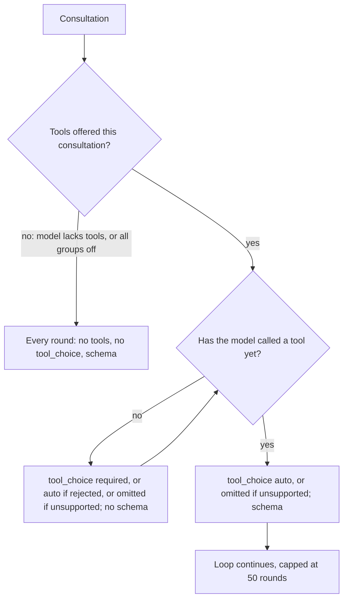

# Execution Plan: Reasoning-Level Labels and Consultation Round Shape

*Audience: implementing agents. Do every phase in order and run each phase's verification before starting the next. Do not commit or push. Do not copy this document's phase names or letters into code, comments, docs, log messages, or test names.*

*Line numbers are from before any edit. Find each edit by the quoted code or symbol. Within a file, numbers drift once earlier lines change.*

## Why

Two changes to make model execution more reliable and controllable:

1. **Model dropdown labels.** Each option lists every reasoning level the model offers, lowest first, abbreviated and separated by slashes, with the model's default level marked by `*`. Example: `GPT-X [$9.00/M, reasoning: Min/Low/Med*/High]`.
2. **Consultation round shape.** A consultation is a loop of up to 50 model rounds.
   - **Model supports tools and the consultation offers at least one tool:** every round before the first tool call sends `tool_choice: required` and **no** envelope schema. Every later round sends `tool_choice: auto` **with** the schema.
   - **Model does not support tools:** the consultation runs exactly as if the player had turned every tool group off. There are no tools in the prompt or the request, no `tool_choice`, and the schema goes on every round. OpenRouter routes only to providers that accept every parameter in the request, so sending `tools` or `tool_choice` to such a model can return a 404.
   - **Rejections:** the existing fallbacks stay as they are. A schema rejection (HTTP 400, 404, or 422) is retried once without the schema, and the model is remembered for the session. A `required` rejection is retried once with `auto`, and the model is remembered for the session.

Today the schema goes on every round, including the `required` round. Gemini rejects that combination, so it loses the schema for the whole session. After this change, it keeps the schema on its `auto` rounds.



## Decisions Already Made (Do Not Revisit)

- The 50-round loop stays. Only the per-round `tool_choice` and schema change.
- Unknown models (not in the model-list cache), and known models with no `supported_parameters` list, are treated as supporting `tools` and `tool_choice`. That keeps today's request shape for them.
- A model that lists `tools` but not `tool_choice` gets the tools with no `tool_choice` field. The provider default is `auto`.
- Once `required` is known to be rejected for a model, rounds before its first tool call send `auto` with **no** schema. This matches today's fallback.
- A model without tool support loses production orders, memory updates, and standing-order actions, because those envelope fields are gated by tool groups. This is accepted.
- The activity-log notice for a model without tool support appears once per model per app session. The debug log records it on every consultation.
- If a provider ignores `required` on a round before the first tool call and replies with the envelope as text, that text is parsed without the schema. The existing parse and one-repair path handles it. This is accepted.
- The dropdown label marks the default level with a trailing `*`. The reasoning-effort dropdown itself does not change.

## Repository Rules That Apply to Every Phase

- **Orienting comments.** Every new or changed function, interface, interface field, and module-level constant gets an orienting comment. The ESLint rule `orienting-comments/require-orienting-block` enforces the format:
  - a plain summary line first, which must not contain `Purpose:`, `Contract:`, or `When to use:`;
  - then `Purpose:`, `When to use:`, `Expected outcome:`, `Exceptions:`;
  - interface fields use `Contract:` in place of `Purpose:`. Copy the style of the neighbouring fields.

  When a function's behavior changes, rewrite the stale sentences in its existing comment. Don't just append to them.
- **Logging (main process only).** New exported main-process functions call `logDebug` when they change state or make a decision a reader would want in `debug.log`. Pure getters and resolvers call `logTrace`. Use `logDebug` / `logTrace` / `logError` from `src/main/logger.ts`. Files under `src/shared/` run in the renderer too and have no logger, so the shared helpers you add here must not log, which matches the existing shared helpers.
- **Immutability.** `const` everywhere possible, `readonly` on interface fields and parameter-object fields, `ReadonlyMap` / `readonly string[]` for constant tables, and `Object.freeze` for exported constant arrays and objects (the files you touch already do this).
- **Naming.** camelCase functions, PascalCase types. No `Utils` / `Impl`. Do not rename vendor strings such as `tool_choice`, `response_format`, `supported_parameters`, or `tools`.
- **Tests.** Only happy paths and essential failure cases, testing contracts, not implementation details. Keep each existing test file's style. Most of the files touched here use plain `function testX()` cases called from `run()`, while `requestOrdersFlowSupport.test.ts` uses `test()` from `node:test`. New test files use the `node:test` style. All use `node:assert/strict`.
- **File size.** Keep every file under 600 lines. [src/main/openRouter/requestOrdersToolLoop.ts](src/main/openRouter/requestOrdersToolLoop.ts) is already at 598, so the round-shape phase moves one helper out of it. The new round-shape logic goes in its own module instead of growing `requestOrdersFlowSupport.ts`.
- **No commit or push.**

## Verification Commands

- Fast loop for one phase: `npm run build:main`, then `node dist/<path>.test.js` for each test file named in that phase, then `npm run lint`.
- When a phase touches `src/shared/` or `src/renderer/`, also run `npm run build:renderer` and `npm run check:renderer-types`.
- Full gate: `npm test`. It rebuilds native modules for Node, builds main, and runs lint, `naming:check`, the renderer type check, and every test.

---

## Phase A: Model Dropdown Reasoning Labels

**Goal:** `formatModelOptionSuffix` lists the model's selectable levels as `reasoning: None/Low/Med*/High`. When the model has no level list, the old text stays.

### A1. Shared effort helpers

File: [src/shared/openRouterReasoningEffort.ts](src/shared/openRouterReasoningEffort.ts). Add these after `OPENROUTER_GATEWAY_REASONING_EFFORTS`, each with a full orienting comment:

```ts
const REASONING_EFFORT_ABBREVIATIONS: ReadonlyMap<string, string> = new Map([
  ['none', 'None'],
  ['minimal', 'Min'],
  ['low', 'Low'],
  ['medium', 'Med'],
  ['high', 'High'],
  ['xhigh', 'Xhigh'],
  ['max', 'Max'],
]);

export function capitalizeReasoningEffortName(effort: string): string {
  return effort.length === 0 ? effort : effort.charAt(0).toUpperCase() + effort.slice(1);
}

export function abbreviateReasoningEffort(effort: string): string {
  return REASONING_EFFORT_ABBREVIATIONS.get(effort) ?? capitalizeReasoningEffortName(effort);
}

export function sortReasoningEffortsAscending(efforts: readonly string[]): readonly string[] {
  const rank = (effort: string): number => OPENROUTER_GATEWAY_REASONING_EFFORTS.indexOf(effort);
  return [...efforts].sort((a, b) => rank(b) - rank(a));
}
```

Facts to state in the comments:
- `OPENROUTER_GATEWAY_REASONING_EFFORTS` is ordered highest first, so a larger index means a lower effort, and sorting by descending index gives lowest first.
- An unknown effort has index `-1`, so it sorts after every known effort. `Array.prototype.sort` is stable, so unknown efforts keep their API order among themselves.
- `abbreviateReasoningEffort` capitalizes an unknown effort, so a new vendor level still appears.

### A2. Reuse the capitalizer in the renderer

File: [src/renderer/openRouter/reasoningEffortSelect.ts](src/renderer/openRouter/reasoningEffortSelect.ts). Delete the local `capitalizeReasoningOptionName` and its comment (about lines 30-40). Import `capitalizeReasoningEffortName` from `../../shared/openRouterReasoningEffort` by adding it to the existing import block, and call it in `formatReasoningEffortOptionLabel`. The dropdown's text does not change.

### A3. Label formatting

File: [src/shared/openRouterModelDisplay.ts](src/shared/openRouterModelDisplay.ts). Import `abbreviateReasoningEffort`, `listSelectableReasoningEfforts`, `resolveDefaultReasoningEffort`, and `sortReasoningEffortsAscending` from `./openRouterReasoningEffort`. Change `formatReasoningStatusPart` to:

```ts
function formatReasoningStatusPart(model: OpenRouterModel): string | null {
  const efforts = listSelectableReasoningEfforts(model);
  if (efforts.length > 0) {
    const defaultEffort = resolveDefaultReasoningEffort(model);
    const labels = sortReasoningEffortsAscending(efforts).map(
      (effort) => `${abbreviateReasoningEffort(effort)}${effort === defaultEffort ? '*' : ''}`
    );
    return `reasoning: ${labels.join('/')}`;
  }
  // existing body unchanged from here: enabled/mandatory check, then `reasoning: <effort>` or `reasoning: default`
}
```

The `// existing body unchanged ...` line above is a placeholder for this document only. Keep the existing fallback code there and don't add that comment.

Rewrite its orienting comment. It must say:
- the list comes from `listSelectableReasoningEfforts`, so `none` is dropped when reasoning is mandatory, and `supported_efforts: null` means the full gateway list;
- the default level is marked `*`;
- a model with a level list shows it even when reasoning isn't on by default;
- without a list, the label falls back to the old phrase or is left out.

Also update the `formatModelOptionSuffix` comment's "Expected outcome" example.

File: [src/shared/ipc/openRouterTypes.ts](src/shared/ipc/openRouterTypes.ts). The `reasoning` field comment (about lines 103-110) and the `default_effort` / `default_enabled` / `mandatory` comments describe the old suffix rules. Update them so they say the suffix lists the selectable levels when known, and otherwise uses the `default_effort` / `default_enabled` / `mandatory` phrase. Find the `supported_efforts` field comment below them and make sure it names the suffix as a consumer.

### A4. Tests

- [src/shared/openRouterModelDisplay.test.ts](src/shared/openRouterModelDisplay.test.ts): the existing cases have no `supported_efforts` and must keep passing unchanged. Add `testReasoningLevelList` and call it from `run()`:
  - `{ supported_efforts: ['high', 'medium', 'low'], default_effort: 'medium' }` gives `' [reasoning: Low/Med*/High]'`. This also covers lowest-first order and no `default_enabled`.
  - `{ mandatory: true, supported_efforts: null, default_effort: 'high' }` gives `' [reasoning: Min/Low/Med/High*/Xhigh/Max]'`.
  - `{ supported_efforts: null }` gives `' [reasoning: None/Min/Low/Med/High/Xhigh/Max]'`.
  - With pricing `{ prompt: '0.000004', completion: '0.000005' }` and `{ supported_efforts: ['low', 'high'] }`, the result is `' [$9.00/M, reasoning: Low/High]'`.
- [src/shared/openRouterReasoningEffort.test.ts](src/shared/openRouterReasoningEffort.test.ts): add `testUnknownEffortLabelAndOrder` and call it from `run()`:
  - `abbreviateReasoningEffort('turbo')` returns `'Turbo'`;
  - `sortReasoningEffortsAscending(['turbo', 'high', 'none'])` deep-equals `['none', 'high', 'turbo']`.

**Verify:**
- `npm run build:main`
- `node dist/shared/openRouterModelDisplay.test.js` and `node dist/shared/openRouterReasoningEffort.test.js` both print "passed".
- `npm run lint`, `npm run build:renderer`, and `npm run check:renderer-types` pass.
- Search `src` for `capitalizeReasoningOptionName`. There should be zero matches.

---

## Phase B: Tool-Support Capabilities in the Request Profile

**Goal:** the request profile knows whether the model supports `tools` and `tool_choice`. Nothing reads the new fields yet, so request behavior is unchanged.

### B1. Capability checks

File: [src/main/openRouter/openRouterModelCapabilities.ts](src/main/openRouter/openRouterModelCapabilities.ts). Add these after `supportsStructuredOutputs`:

```ts
export function supportsToolCalling(model: OpenRouterModel | undefined): boolean {
  logTrace('openRouterModelCapabilities supportsToolCalling', { modelId: model?.id ?? null });
  const parameters = model?.supported_parameters;
  return parameters === undefined || parameters.includes('tools');
}

export function supportsToolChoice(model: OpenRouterModel | undefined): boolean {
  logTrace('openRouterModelCapabilities supportsToolChoice', { modelId: model?.id ?? null });
  const parameters = model?.supported_parameters;
  return parameters === undefined || parameters.includes('tool_choice');
}
```

Each comment must explain why a missing model or list counts as supported, unlike `supportsStructuredOutputs`. Wrongly reporting "no tools" would strip every tool and tool-gated envelope field from the consultation. Treating the case as supported keeps the request shape these models already get.

File: [src/shared/ipc/openRouterTypes.ts](src/shared/ipc/openRouterTypes.ts). The `supported_parameters` comment (about lines 75-82) currently says "an omitted list means no optional parameter is known to be supported." Change it to say that the schema check treats an omitted list as unsupported, and the `tools` / `tool_choice` checks treat it as supported.

### B2. Profile fields

File: [src/main/openRouter/ordersRequestProfile.ts](src/main/openRouter/ordersRequestProfile.ts):
- Add two fields to `OrdersRequestProfile`, after `structuredOutputs`, each with a `Contract:`-style comment:
  - `readonly toolCalling: boolean;` means the consultation may offer tools. When it's false, the flow consults with no tool groups enabled.
  - `readonly toolChoice: boolean;` means requests may carry `tool_choice`. When it's false, no `tool_choice` field is sent.
- Set both to `true` in `BASELINE_ORDERS_REQUEST_PROFILE`, and update that constant's "Expected outcome" sentence to mention tool support.
- In `resolveOrdersRequestProfile`, set `toolCalling: supportsToolCalling(model)` and `toolChoice: supportsToolChoice(model)` on the known-model branch. Add both to the `logDebug` payload.
- Import the two new functions from `./openRouterModelCapabilities`.

File: [src/main/openRouter/requestOrdersFlowDepsTypes.ts](src/main/openRouter/requestOrdersFlowDepsTypes.ts). Change the `resolveOrdersRequestProfile` comment summary (about line 101) to "Resolves the reasoning effort, structured-output support, tool support, and completion budget for a model."

### B3. Tests

[src/main/openRouter/ordersRequestProfile.test.ts](src/main/openRouter/ordersRequestProfile.test.ts): add `testToolSupportFollowsAdvertisedParameters` and call it from `run()`. Using `resolveOrdersRequestProfile` with `model: { id: 'm', supported_parameters: [...] }`:
- `['tools', 'tool_choice']` gives `toolCalling` true and `toolChoice` true;
- `['tools']` gives `toolCalling` true and `toolChoice` false;
- `['response_format']` gives `toolCalling` false and `toolChoice` false.

`testUnknownModelGetsBaseline` must keep passing unchanged.

**Verify:**
- `npm run build:main`
- `node dist/main/openRouter/ordersRequestProfile.test.js` and `node dist/main/openRouter/ordersChatRequestHelpers.test.js` both print "passed". The second one is unchanged, but it spreads the baseline profile, so it must still compile and pass.
- `npm run lint`.

---

## Phase C: Per-Request Schema Switch in `postOrdersChatRequest`

**Goal:** callers decide, request by request, whether the schema may be attached. Both existing callers pass `true`, so behavior is unchanged.

File: [src/main/openRouter/ordersChatRequestHelpers.ts](src/main/openRouter/ordersChatRequestHelpers.ts):
- Add `readonly attachResponseFormat: boolean;` to the `postOrdersChatRequest` args object. Make it required, not optional, so every caller has to decide.
- Destructure it, and change the schema decision to:
  `const useStructuredOutputs = attachResponseFormat && settings.responseFormat !== null && !isStructuredOutputsRejectedForModel(modelId);`
- Add `attachResponseFormat` to the existing `logDebug('ordersChatRequestHelpers postOrdersChatRequest', ...)` payload.
- Rewrite the function's "Expected outcome" sentence. It currently begins "When `responseFormat` is set and the model has not rejected it this session". The new rule is: when `attachResponseFormat` is true, `responseFormat` is set, and the model has not rejected it this session. Keep the rest of the sentence.
- Update the `OrdersChatRequestSettings.responseFormat` field comment. Its "Expected outcome" becomes: attached, with the response-healing plugin, to requests whose caller passes `attachResponseFormat: true`, unless the model rejected it this session.

Callers, both getting `attachResponseFormat: true` in this phase:
- [src/main/openRouter/requestOrdersToolLoop.ts](src/main/openRouter/requestOrdersToolLoop.ts), the `postOrdersChatRequest({ ... })` call at about line 406;
- [src/main/openRouter/requestOrdersRepairExchange.ts](src/main/openRouter/requestOrdersRepairExchange.ts), the call at about line 171.

Tests, in [src/main/openRouter/ordersChatRequestHelpers.test.ts](src/main/openRouter/ordersChatRequestHelpers.test.ts):
- Add `attachResponseFormat: true` to `postFor` and to every direct `postOrdersChatRequest({ ... })` call in the file. There are four, inside `testRequiredToolChoiceRetriesWithAuto` and `testFailedToolChoiceRetryDoesNotMarkModel`.
- Add `testSchemaWithheldWhenNotRequested` and call it from `run()`. With `structuredSettings('high')` and `attachResponseFormat: false`, expect exactly one post, no `response_format` key, no `plugins` key, and `reasoning` deep-equal to `{ effort: 'high' }`.

**Verify:**
- `npm run build:main`
- `node dist/main/openRouter/ordersChatRequestHelpers.test.js` prints "passed".
- `npm run lint`.

---

## Phase D: Round Shape in the Tool Loop and the Repair Call

**Goal:** the new per-round `tool_choice` and schema rule is in force for every model that supports tools. A consultation with no tools stops sending `tools: []` and `tool_choice`.

### D1. Pure round-shape resolver in a new module

Create [src/main/openRouter/orderFlowRoundShape.ts](src/main/openRouter/orderFlowRoundShape.ts). Give it a module header comment in the style of the top of `requestOrdersToolLoop.ts`, then `import { logTrace } from '../logger';` and the following, each with a full orienting comment:

```ts
export interface OrderFlowRoundShape {
  readonly toolChoice: 'required' | 'auto' | null;
  readonly attachResponseFormat: boolean;
}

function pickOrderFlowRoundShape(input: OrderFlowRoundShapeInput): OrderFlowRoundShape {
  const { toolCount, hasCalledTool, requiredToolChoiceRejected, toolChoiceSupported } = input;
  if (toolCount === 0) return { toolChoice: null, attachResponseFormat: true };
  const attachResponseFormat = hasCalledTool;
  if (!toolChoiceSupported) return { toolChoice: null, attachResponseFormat };
  if (hasCalledTool || requiredToolChoiceRejected) return { toolChoice: 'auto', attachResponseFormat };
  return { toolChoice: 'required', attachResponseFormat };
}

export function resolveOrderFlowRoundShape(input: OrderFlowRoundShapeInput): OrderFlowRoundShape {
  const shape = pickOrderFlowRoundShape(input);
  logTrace('orderFlowRoundShape resolveOrderFlowRoundShape', { ...input, ...shape });
  return shape;
}
```

Then delete the `OrderFlowToolChoice` type and `resolveOrderFlowToolChoice`, with their comments, from [src/main/openRouter/requestOrdersFlowSupport.ts](src/main/openRouter/requestOrdersFlowSupport.ts) (about lines 63-97).

`OrderFlowRoundShapeInput` is an exported interface, declared above the two functions, with four `readonly` fields: `toolCount: number`, `hasCalledTool: boolean`, `requiredToolChoiceRejected: boolean`, `toolChoiceSupported: boolean`. Give each field a `Contract:` comment.

Facts the comments must carry:
- `toolChoice: null` means "send no `tool_choice` field".
- Before the first tool call there is no schema, because the envelope isn't a legal answer on a `required` round, and some providers (Gemini) reject the schema combined with `required`.
- `required` on every round would forbid the envelope, and the loop would use up its round cap without producing orders. This sentence is in the old comment; keep it.
- The schema decision depends on `hasCalledTool`, not on the `tool_choice` actually sent. So a model that rejected `required` still gets no schema before its first tool call.
- Applies to every tool-loop round, including malformed-completion retries, but not to the repair call.

### D2. Tool loop wiring

File: [src/main/openRouter/requestOrdersToolLoop.ts](src/main/openRouter/requestOrdersToolLoop.ts):
- Imports: remove `resolveOrderFlowToolChoice` from the `./requestOrdersFlowSupport` import, and add `import { resolveOrderFlowRoundShape } from './orderFlowRoundShape';`.
- Replace the block from `const requiredToolChoiceRejected = ...` through the `postOrdersChatRequest({ ... })` call (about lines 397-415) with:

```ts
const roundShape = resolveOrderFlowRoundShape({
  toolCount: tools.length,
  hasCalledTool,
  requiredToolChoiceRejected: isRequiredToolChoiceRejectedForModel(modelId),
  toolChoiceSupported: requestSettings.profile.toolChoice,
});
logDebug('openRouter requestOrders: round request shape', {
  iteration,
  toolChoice: roundShape.toolChoice,
  attachResponseFormat: roundShape.attachResponseFormat,
  toolCount: tools.length,
  hasCalledTool,
});
const chatResponse = await postOrdersChatRequest({
  post: postOpenRouterChatWithTimeoutAndRetry,
  key,
  modelId,
  baseBody: {
    model: modelId,
    messages,
    max_tokens: completionMaxTokens,
    ...(tools.length > 0 ? { tools } : {}),
    ...(roundShape.toolChoice !== null ? { tool_choice: roundShape.toolChoice } : {}),
  },
  settings: requestSettings,
  attachResponseFormat: roundShape.attachResponseFormat,
  signal,
  onLog,
  requestLabel: 'requestOrders',
});
```

- In the `resolveMalformedCompletionRetry({ ... })` call, change `requireToolCall: toolChoice === 'required'` to `requireToolCall: roundShape.toolChoice === 'required'`.
- Update the `requestSettings` field comment on `RequestOrdersToolLoopArgs` (about lines 264-272). It currently says "Every round sends identical optional parameters." Replace that with: the reasoning option is identical on every round, and the schema is attached only on rounds that `resolveOrderFlowRoundShape` allows.
- **Keep the file under 600 lines.** The new block is about 11 lines longer than the one it replaces. To make room, move `summarizeToolCallNamesForAiLog` and its orienting comment (about lines 316-331) to [src/main/openRouter/requestOrdersFlowSupport.ts](src/main/openRouter/requestOrdersFlowSupport.ts), next to `logResponsePreview`. In the new location:
  - export it;
  - add `logTrace('requestOrdersFlowSupport summarizeToolCallNamesForAiLog', { toolCallCount: toolCalls.length, maxNames });` as its first line;
  - keep its body and signature unchanged.

  Then add it to the tool loop's existing `./requestOrdersFlowSupport` import. Don't take any other size-reduction step.

### D3. Repair call

File: [src/main/openRouter/requestOrdersRepairExchange.ts](src/main/openRouter/requestOrdersRepairExchange.ts):
- Add `readonly toolsOffered: boolean;` to `ParseRepairExchangeArgs` with a `Contract:` comment. It's true when the main loop sent a non-empty tool list.
- Change the repair `baseBody` to:
  `{ model: args.modelId, messages: repairMessages, max_tokens: repairMaxTokens, ...(sendNoneToolChoice ? { tool_choice: 'none' } : {}) }`
  where `const sendNoneToolChoice = args.toolsOffered && requestSettings.profile.toolChoice;`. Keep `attachResponseFormat: true`.
  Both conditions matter. A consultation without tools may be running a model that can't be routed with any `tool_choice`. A model that lists `tools` but not `tool_choice` can't take `none` either.
- Add `toolsOffered` and `sendNoneToolChoice` to the existing `logDebug('openRouter runParseRepairExchange', ...)` payload. The payload is built before the `const { ... } = args` line, so read `args.requestSettings.profile.toolChoice` there, or move the `logDebug` below the destructuring.
- Update the `modelId` field comment ("One extra completion with `tool_choice: 'none'`"), the `postOpenRouterChatWithTimeoutAndRetry` field comment ("Tools are omitted; `tool_choice` is `'none'`"), and the `requestSettings` field comment so they match: `none` only when tools were offered and the model accepts `tool_choice`, and the schema is always allowed on the repair call.

File: [src/main/openRouter/requestOrdersFlow.ts](src/main/openRouter/requestOrdersFlow.ts). In the `runParseRepairExchange({ ... })` call (about line 438), add `toolsOffered: tools.length > 0,`. In the same file, update two comments that say the schema is identical on every round:
- the `envelopeGates` comment (about lines 347-353): "The schema sent on every round" becomes "The schema sent on schema-eligible rounds";
- the `requestSettings` comment (about lines 361-367): it's resolved once per consultation, and the tool loop decides per round whether the schema is attached.

### D4. Tests

- [src/main/openRouter/requestOrdersFlowSupport.test.ts](src/main/openRouter/requestOrdersFlowSupport.test.ts): remove `resolveOrderFlowToolChoice` from the import, and delete the test `'tool choice is required until a tool has been called'` with its comment.
- Create [src/main/openRouter/orderFlowRoundShape.test.ts](src/main/openRouter/orderFlowRoundShape.test.ts) in the same style as `requestOrdersFlowSupport.test.ts`: a header comment, `node:assert/strict`, and `test` from `node:test`. Add one `test('round shape forces a schema-free tool call first, then allows the schema', ...)` with an orienting comment. Use `assert.deepEqual` on each case:

- 0 tools, not called, not rejected, supported: `{ toolChoice: null, attachResponseFormat: true }`
- 2 tools, not called, not rejected, supported: `{ toolChoice: 'required', attachResponseFormat: false }`
- 2 tools, called, not rejected, supported: `{ toolChoice: 'auto', attachResponseFormat: true }`
- 2 tools, not called, rejected, supported: `{ toolChoice: 'auto', attachResponseFormat: false }`
- 2 tools, not called, not rejected, unsupported: `{ toolChoice: null, attachResponseFormat: false }`
- 2 tools, called, not rejected, unsupported: `{ toolChoice: null, attachResponseFormat: true }`

**Verify:**
- `npm run build:main`
- `node dist/main/openRouter/orderFlowRoundShape.test.js`, `node dist/main/openRouter/requestOrdersFlowSupport.test.js`, `node dist/main/openRouter/ordersChatRequestHelpers.test.js`, and `node dist/main/openRouter/malformedCompletionRetry.test.js` all print "passed" or exit 0.
- `npm run lint` and `npm run check:circular` pass.
- Search `src` for `resolveOrderFlowToolChoice` and `OrderFlowToolChoice`. There should be zero matches.
- Search `src` for `function summarizeToolCallNamesForAiLog`. There should be exactly one match, in `requestOrdersFlowSupport.ts`.
- Count the lines in `requestOrdersToolLoop.ts`. It must be under 600, about 593 expected.

---

## Phase E: Consult Without Tools When the Model Lacks Tool Support

**Goal:** a model whose `supported_parameters` doesn't include `tools` is consulted with no tool groups enabled. The prompt, tool list, tool-name set, envelope gates, and parse flags then all agree, and the request carries no `tools` or `tool_choice`.

### E1. Once-per-session notice record

File: [src/main/openRouter/openRouterModelCapabilities.ts](src/main/openRouter/openRouterModelCapabilities.ts), following the pattern of the two rejection sets:
- Add a module-level `const noToolCallingNoticeModelIds = new Set<string>();` with an orienting comment. It holds the model ids whose activity-log notice about missing tool support has already been shown this session, and it's cleared only on app restart or by the test reset.
- Add:

```ts
export function recordNoToolCallingNoticeForModel(modelId: string): boolean {
  const firstThisSession = !noToolCallingNoticeModelIds.has(modelId);
  noToolCallingNoticeModelIds.add(modelId);
  logDebug('openRouterModelCapabilities recordNoToolCallingNoticeForModel', { modelId, firstThisSession });
  return firstThisSession;
}
```

  Its comment says it returns `true` only on the first call for a model id in this session, so the caller shows the notice once.
- In `resetOpenRouterModelCapabilitiesForTests`, add `noToolCallingNoticeModelIds.clear();`, and change its "Expected outcome" to name the notice set too.

Create [src/main/openRouter/openRouterModelCapabilities.test.ts](src/main/openRouter/openRouterModelCapabilities.test.ts) in the `node:test` style of `requestOrdersFlowSupport.test.ts`, with one test that has an orienting comment:
- after `resetOpenRouterModelCapabilitiesForTests()`, `recordNoToolCallingNoticeForModel('m')` returns `true`, then `false`;
- `recordNoToolCallingNoticeForModel('n')` returns `true`;
- after another reset, `'m'` returns `true` again.

### E2. Flow wiring

File: [src/main/openRouter/requestOrdersFlow.ts](src/main/openRouter/requestOrdersFlow.ts):
1. Move the line `const requestProfile = resolveOrdersRequestProfile?.(modelId) ?? BASELINE_ORDERS_REQUEST_PROFILE;` from about line 332 to just after the `if (opponentUnits.length === 0) { ... }` early return (about line 150), before `const hexList = ...`. Leave it nowhere else. Putting it after that early return means a turn with no opponent units makes no profile lookup and shows no notice.
2. Directly after it, add:

```ts
if (!requestProfile.toolCalling && (enabledToolNames === undefined || enabledToolNames.length > 0)) {
  logDebug('openRouter requestOrders: model does not support tool calls; consulting without tools', {
    modelId,
    droppedToolCount: enabledToolNames === undefined ? 'all' : enabledToolNames.length,
  });
  if (onLog && recordNoToolCallingNoticeForModel(modelId)) {
    onLog('This model does not support tool calls; planning without tools.');
  }
  enabledToolNames = [];
}
```

   Import `recordNoToolCallingNoticeForModel` from `./openRouterModelCapabilities`. `enabledToolNames` is already declared with `let` at about line 90. This block must run before `const flags = getToolFlags(enabledToolNames);` (about line 198), because everything downstream derives from `enabledToolNames`:
   - `getToolFlags`, so production, memory, and orders become false and fallback movement becomes true;
   - `enabledToolNameSet`;
   - `buildSystemPromptForTools`;
   - `buildToolDefinitions`, which returns `[]` for `[]`;
   - `envelopeGates` and the parse flags.
3. Rewrite the `requestOrdersFlow` orienting comment, which is boilerplate today ("Supports maintainability by documenting why..."). It needs a summary line, then:
   - Purpose: "Runs one AI consultation: builds the prompt, runs the tool loop, parses (with one repair), and applies the orders."
   - When to use: "Called by `requestOrders` with production deps, or by tests with fakes."
   - Expected outcome: "A success result with orders and telemetry, or a failure result. A model without tool support is consulted as if every tool group were off."
   - Exceptions: "None; failures and cancellation resolve as `{ success: false }`."

The flow wiring has no automated test. The flow has no fake-deps test harness, and building one isn't in scope. The pieces it depends on (`supportsToolCalling`, the notice record, and the round shape with zero tools) are covered. Phase G checks the wiring by hand.

**Verify:**
- `npm test` passes. This is the first full gate, and it must list and pass `openRouterModelCapabilities.test.js`.
- Read the edited region. `requestProfile` must be declared exactly once, after the opponent-units early return and before `getToolFlags`.

---

## Phase F: Living Documentation

Update each document in place. Keep the surrounding wording and tone.

1. [doc/hybrid-ai.md](doc/hybrid-ai.md), the first bullet under "Consult loop bounds" (line 43). Replace it with:
   "- At most `REQUEST_ORDERS_MAX_TOOL_ROUNDS` (**50**) tool rounds. While the consultation offers at least one tool, every round before the model's first tool call sends `tool_choice: required` and no envelope schema, and every later round sends `tool_choice: auto` with the schema, so the model can submit the envelope or call more tools. A provider that rejects `required` (Amazon Bedrock's Claude endpoint does) is retried once with `auto`, and that model stays on `auto` for the rest of the session; its rounds before the first tool call still carry no schema. A model whose `supported_parameters` lists `tools` but not `tool_choice` gets the tools with no `tool_choice`. A model that does not list `tools` is consulted as if every tool group were off, so it cannot submit production orders, memory updates, or standing-order actions. A consultation with no tools sends neither `tools` nor `tool_choice`, and carries the schema on every round. The repair call still refuses tools."
2. Same file, the "Request options" bullet (line 49). Replace everything from the start of the bullet up to "Each refusal is retried once without the rejected option." with:
   "- Request options are resolved once per consult (see [source-inventory.md](ai-commander-prompts/source-inventory.md) section 4.4). The saved reasoning effort goes on every request. For models that support structured outputs, a closed envelope schema plus response healing goes on every round after the first tool call, on every round of a consultation without tools, and on the repair call, but never on a round that sends `required`. Anthropic models get it too; their first schema request currently fails because the envelope schema exceeds Anthropic's schema limits, and they continue without it."
   Keep the rest of the bullet, from "Each refusal is retried once without the rejected option." to the end.
3. [doc/ai-commander-prompts/consultation-flow.md](doc/ai-commander-prompts/consultation-flow.md), section 4, item 5 (line 80). Replace it with:
   "5. **Tools remain enabled** on retries, with the same tool list. Until the model has called a tool, each round, including these retries, sends `tool_choice: required` and no schema; after that each round sends `auto` with the schema. A provider that rejects `required` is retried once with `auto`, and that model stays on `auto` for the rest of the session. A model that does not accept `tool_choice` gets none. The corrective message must not tell the model to stop using tools."
4. Same file, the paragraph after section 5's list (line 90). Replace its first sentence with:
   "When the model supports structured outputs and the developer flag `AGENT_WARS_DISABLE_STRUCTURED_OUTPUTS` is not set, the closed envelope schema and the response-healing plugin go on every tool round after the model's first tool call, on every round of a consultation that offers no tools, and on the repair call. Rounds before the first tool call send `tool_choice: required` without the schema, because the envelope is not a legal answer on those rounds."
   Delete the sentence "If that retry is refused because the endpoint rejects `tool_choice: required`, it is sent once more with `auto`." Schema rounds never send `required` now. Keep every other sentence.
   Same file, section 5, item 3 (line 86). Replace it with:
   "3. **Tools are disabled** for the repair call: no tool list is sent, and when the consultation offered tools and the model accepts `tool_choice`, tool use is explicitly refused with `tool_choice: none`. The model has one job, which is to re-emit the object."
5. [doc/ai-commander-prompts/source-inventory.md](doc/ai-commander-prompts/source-inventory.md):
   - Line 148, the table cell `yes (\`tool_choice: 'required'\` until a tool has been called, then \`'auto'\`)`. It becomes `yes (\`tool_choice: 'required'\` and no schema until a tool has been called, then \`'auto'\` with the schema)`.
   - Line 183. Replace the paragraph with:
     "Every tool round and the repair call go through `postOrdersChatRequest`. `resolveOrdersRequestProfile` (`ordersRequestProfile.ts`) resolves the consultation's options once, from the cached models list and the saved reasoning choice: reasoning effort, schema support, and whether the model accepts `tools` (`supportsToolCalling`) and `tool_choice` (`supportsToolChoice`, both in `openRouterModelCapabilities.ts`). `resolveOrderFlowRoundShape` (`orderFlowRoundShape.ts`) then picks each round's `tool_choice` and whether the schema is attached: before the first tool call, `required` and no schema; after it, `auto` with the schema; with no tools, neither `tools` nor `tool_choice`, and the schema. A provider that rejects `required` is retried once with `auto`, and that model stays on `auto` for the rest of the session. A model that does not accept `tool_choice` gets none. A model that does not accept `tools` is consulted with no tool groups enabled, so its prompt, tool list, and envelope gates match an all-tools-off consultation. The repair call sends no tool list, `tool_choice: 'none'` only when the consultation offered tools and the model accepts `tool_choice`, and the schema."
   - Line 186, the bullet beginning "`response_format` (`buildOrdersEnvelopeResponseFormat`". Replace the sentences from "so Anthropic currently answers the first schema request with HTTP 400." through "When that request succeeds, the model runs without the schema and without `required` for the rest of the session." with:
     "so Anthropic currently answers its first schema request, which is the first round after a tool call, with HTTP 400, and the model continues without the schema for the rest of the session. Amazon Bedrock, which has served Claude, separately rejects `tool_choice: required` on the first round, so that request is resent with `auto` and the model stays on `auto` for the session."
     Keep the rest of the bullet.
   - Line 194. "Models missing from the cached list get none of these options, so their request bodies are unchanged." becomes "Models missing from the cached list get no reasoning or schema options and are assumed to accept `tools` and `tool_choice`, so their request bodies are unchanged."
6. [doc/ux/ai-activity-log.md](doc/ux/ai-activity-log.md):
   - Line 18. Delete the sentence beginning "Gemini models also produce it once per session".
   - After line 19, add the bullet: "- An ordinary line, not an error line, reads \"This model does not support tool calls; planning without tools.\" the first time in a session that a model whose listing does not include tool support is consulted. Its consultations run as if every tool group were off."
7. [doc/ux/right-panel-model-tab.md](doc/ux/right-panel-model-tab.md), line 17. Replace it with:
   "- A model dropdown. It starts as \"— Select model —\" until models load. Each option shows the model name, then in brackets the combined prompt and completion price per million tokens and the model's reasoning levels, lowest first, abbreviated and separated by slashes, with the default level marked by an asterisk, for example `reasoning: None/Low/Med*/High`. Levels are abbreviated None, Min, Low, Med, High, Xhigh, and Max. A model that reports reasoning without listing levels shows `reasoning: <default level>` or `reasoning: default`."

**Verify:**
- Search `doc` for `resolveOrderFlowToolChoice`. There should be zero matches.
- Search `doc` for `Gemini`. No remaining sentence should say Gemini loses the schema because of `required`.
- Read each edited paragraph in context. It must read cleanly and must not contradict the paragraphs around it.

---

## Phase G: End-to-End Verification

In PowerShell, run `$env:AGENT_WARS_LOG_LEVEL = 'debug'; npm start`. `debug.log` is written to the repository root. Set an API key, and keep the AI activity log visible.

1. **Labels.** Refresh the model list. A reasoning model shows its levels lowest first, abbreviated, with `*` on its default, for example `reasoning: Min/Low/Med*/High`. A non-reasoning model shows only its price. The reasoning-effort dropdown still shows full names ("Medium (default)").
2. **Tool-capable model with structured outputs** (an OpenAI GPT model). Turn Run on and let one strategic consultation finish. In `debug.log`, the `ordersChatRequestHelpers postOrdersChatRequest` lines show:
   - round 1 with `toolChoice: "required"`, `attachResponseFormat: false`, `structuredOutputs: false`;
   - every round after the first tool call with `toolChoice: "auto"`, `attachResponseFormat: true`, `structuredOutputs: true`.

   Orders apply.
3. **Gemini.** Same check. The activity log no longer shows "Model rejected the structured JSON request" on round 1. If a provider rejects the schema on an `auto` round, that line appears once, the retry succeeds, and the consultation completes. This is the expected fallback. Note which happened in your summary.
4. **Anthropic (Claude).** The "Model rejected the structured JSON request" line appears once per session, on the first round after a tool call. If Claude is served by Bedrock, "Model rejected a required tool call" appears on round 1. Both are ordinary lines, and the consultation completes.
5. **Model without tool support.** To find one, run this in PowerShell:
   `(Invoke-RestMethod https://openrouter.ai/api/v1/models).data | Where-Object { $_.supported_parameters -notcontains 'tools' } | Select-Object -First 10 -ExpandProperty id`
   Select one of those models and let two consultations run. Expect:
   - the activity log line "This model does not support tool calls; planning without tools." on the first consultation only;
   - in `debug.log`, `ordersRequestProfile resolveOrdersRequestProfile` shows `toolCalling: false`;
   - every `postOrdersChatRequest` line shows `toolChoice: null`, and `structuredOutputs` is true when the model supports the schema;
   - no 404 "no endpoints found" error.
6. **All tool groups off on a tool-capable model.** Turn off every group on the Tools tab and run a consultation. Requests show `toolChoice: null` and `attachResponseFormat: true`, and the consultation completes.

---

## Rules Checklist for the Implementer

- Every new or changed function, interface, field, and constant has a complete orienting comment, and stale sentences in changed comments are rewritten. `npm run lint` enforces the format.
- New main-process functions log with `logTrace` (resolvers and getters) or `logDebug` (decisions). Shared helpers don't log.
- `const`, `readonly`, `ReadonlyMap`, and `Object.freeze` are used where the surrounding code uses them.
- Tests cover contracts only: label format, effort order and abbreviation, profile tool flags, the schema switch, the round shape, and the once-per-session notice record. No tests for log calls or comment text.
- Every touched source file stays under 600 lines.
- No phase names or letters from this document appear in code, comments, docs, log messages, or test names.
- No commit or push.
