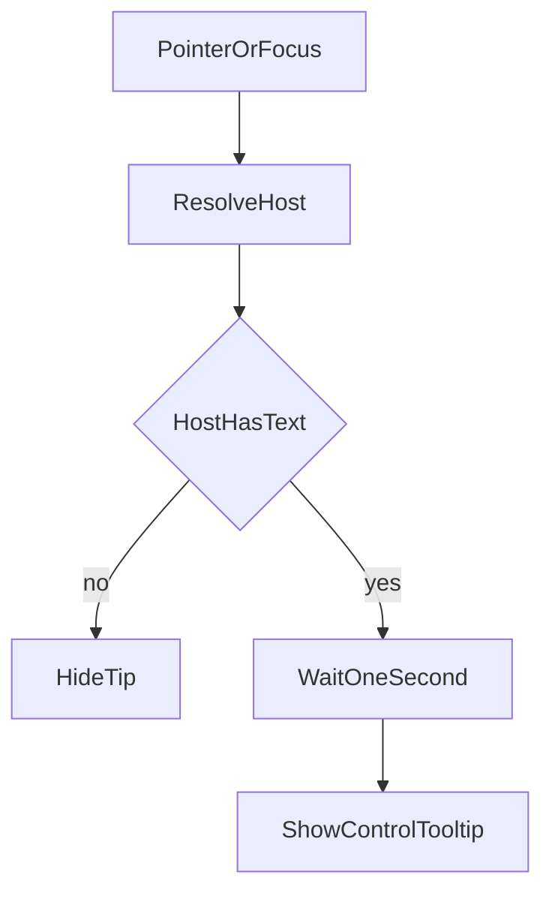

# Control Tooltips

> For the implementing agent: do the phases in order. Do not start a phase until the previous phase's typecheck, lint, and hover checks pass. Copy every tooltip sentence below exactly. Do not paraphrase. On execution, save this document to `.spec/control-tooltip-execution-plan.md` before changing product code. Do not copy phase names into that save's code, comments, or UX docs.

**Goal:** Every button, text field, checkbox, and dropdown that does not already have a tooltip explains, in one or two sentences, why the player would use it and what they can enter. The tip uses the existing gameplay tooltip chrome. Native browser `title` tips on these controls are removed.

**Architecture:** One shared element, `#control-tooltip`, uses the `.hex-tooltip` look. A single document listener in a new renderer module reads `data-control-tooltip` from the hovered or focused control. Call sites only set that attribute. They do not position or style the tip.



## Locked decisions

- Style matches `.hex-tooltip` in [static/overlayChrome.css](static/overlayChrome.css): same background, border, type, radius, and shadow. Add a `.control-tooltip` rule that only changes `max-width` to `20rem` and `z-index` to `8100`. Do not change the `180px` width or the z-index of `#hex-tooltip`, `#order-block-tooltip`, `#order-slower-tooltip`, `#model-description-tooltip`, or `#unit-origin-tooltip`. `8100` sits above the tactical battles overlay (`z-index: 8000` in [src/renderer/gameplay/meleeInterceptModal.ts](src/renderer/gameplay/meleeInterceptModal.ts)) and the new-game overlay (`7002`). `.hex-tooltip` already sets `pointer-events: none`. Keep that, so the tip does not sit under the cursor and flicker.
- Show after `HEX_DETAILS_TOOLTIP_DELAY_MS` (`1000`) from [src/renderer/core/constants.ts](src/renderer/core/constants.ts). Moving inside the same control does not restart the wait. Position is `clientX + TOOLTIP_OFFSET_PX`, `clientY + TOOLTIP_OFFSET_PX`, the same as [src/renderer/openRouter/modelDescriptionTooltip.ts](src/renderer/openRouter/modelDescriptionTooltip.ts). Do not add edge-flipping.
- Content is plain text via `textContent`. Never `innerHTML`.
- Remove every `title` attribute this plan replaces. A control must not show both a browser tip and this tip.
- `#openrouter-model` already has the model-description gameplay tooltip. Do not add `data-control-tooltip` to it, and do not change that tooltip.
- Radio buttons are out of scope. The Fight tip states that a row must be chosen.
- Skip these controls. Do not give them `data-control-tooltip`:
  - `#map-toast-dismiss`, `#ai-strategy-toast-dismiss`
  - Stack-callout close (`×`) in `showStackCallout` in [src/renderer/renderer.ts](src/renderer/renderer.ts)
  - Build-popup close (`×`) in [src/renderer/gameplay/buildQueuePopup.ts](src/renderer/gameplay/buildQueuePopup.ts) and [src/renderer/gameplay/buildQueueMultiPopup.ts](src/renderer/gameplay/buildQueueMultiPopup.ts)
  - Build-queue row remove (`x`) in those same two files
  - Sidebar order select (`+` or `-`) and cancel (`×`) in [src/renderer/gameplay/sidebarOrderRow.ts](src/renderer/gameplay/sidebarOrderRow.ts)
  - Stack-callout per-unit `+` / `-`, and `+ All` / `- All`, in `showStackCallout`
  - Melee-row radio inputs in [src/renderer/gameplay/meleeInterceptModal.ts](src/renderer/gameplay/meleeInterceptModal.ts)
- These still get tips, even though the glyph looks similar: the build-queue add button (`+`), the sealift debark button (`-`), and the worded Cancel controls (`#ranged-attack-btn` while it reads Cancel, and `#air-strike-cancel-btn`).

## Global constraints

- Do not commit or push.
- Do not put phase names, plan names, or this spec's filename into code, comments, tests, configuration, or lint messages.
- New exported functions and exported constants need an orienting comment in the existing shape: Purpose, When to use, Expected outcome, Exceptions.
- Exported constants are camelCase (`startGameButtonTooltipText`). Do not use UPPER_SNAKE. That form is reserved for frozen tables.
- Do not add functions to [src/renderer/renderer.ts](src/renderer/renderer.ts). It is already past the source-size limit. The only edits there are the build-marker attribute, the sealift host and attributes, and replacing the Run `title` assignments. Do not extract or reformat that file.
- Call `installControlTooltip()` once at the start of `wireInitCore` in [src/renderer/map/initCore.ts](src/renderer/map/initCore.ts). That file is already over the desirable size. Add the call only. Do not add helpers there.
- Do not log each hover. The renderer has no main-process logger. A missing `#control-tooltip` returns without throwing and without a log.
- Do not add a test file under `src/renderer`. `npm test` discovers tests only under `dist/main` and `dist/shared` after `build:main`. Do not move these UI sentences into `src/shared` so a test can see them. The hover checklist is the contract check.
- Every phase runs `npm run check:renderer-types`, `npm run lint`, and `npm run build:renderer`. Typecheck catches new errors. esbuild writes `static/renderer.js`, which is what the app loads. Do not hand-edit that file. Do not refresh `scripts/renderer-typecheck-baseline.json`. After Phase 1, also run `npm run check:circular`.
- Keep new files under 600 lines. Keep named parameters at or below six. The text catalog is its own module.
- Directories and TypeScript files under `src/` stay camelCase. No `Utils` or `Impl` suffix.
- Document listeners must not call `stopPropagation` or `preventDefault`.

## Shared behavior to implement in Phase 1

Add `#control-tooltip` in [static/index.html](static/index.html), as a sibling of `#model-description-tooltip`, outside `#canvas-container`. `setMainUIControlsEnabled` in [src/renderer/core/uiState.ts](src/renderer/core/uiState.ts) sets `pointer-events: none` on every canvas child except the new-game and annihilation overlays. A tip inside the canvas would be turned off with the map.

```html
<div id="control-tooltip" class="hex-tooltip control-tooltip hidden" aria-hidden="true"></div>
```

New modules:

- [src/renderer/chrome/controlTooltipText.ts](src/renderer/chrome/controlTooltipText.ts) exports one camelCase constant per sentence, plus `newGameButtonTooltipText(startGame: boolean)`, `runButtonTooltipText(enabled: boolean)`, `rangedButtonTooltipText(label: 'Ranged' | 'Cancel' | 'Strike')`, and `toolGroupTooltipText(groupId: string): string | null`. Unknown group ids return `null`. Callers import these. Do not paste a second copy of a sentence into a caller. Static HTML may repeat the same characters in the attribute.
- [src/renderer/chrome/controlTooltip.ts](src/renderer/chrome/controlTooltip.ts) exports `installControlTooltip(): void`.

`installControlTooltip` attaches capturing `pointerover`, `pointerout`, `pointermove`, `pointerdown`, `keydown`, `focusin`, `focusout`, and `change` on `document`. There is one timer and one current host. Entering a new host hides the tip and replaces the timer. `pointermove` inside the same host only repositions a visible tip.

Host resolution, in this order:

1. `closest('[data-control-tooltip]')` from the event target.
2. If the target is a `label` with a `for` id, use that element when it has the attribute.
3. If the target is inside a `label`, use the first descendant of that label that has the attribute.

A neighboring `<span>` is not a label. Where the caption is a span, the attribute goes on the element that wraps both the control and the caption, as specified per control below. Do not add a special case for tool-group cells.

Empty or missing text hides the tip. `pointerdown`, or a key that opens a native list (Space, Enter, Alt+ArrowDown, ArrowUp, ArrowDown), on a `select` inside the host hides the tip and suppresses it until the pointer leaves that host. A `change` on that select does the same, so the tip does not return on top of a list that just closed. `focusin` uses the same one-second wait. If the pointer is not inside the host, place the tip at the host's `getBoundingClientRect()` top-left plus `TOOLTIP_OFFSET_PX`, so a keyboard tip is not pinned to the corner. `focusout`, and a pointer leave whose related target is outside the host, hide the tip and cancel the wait.

When the timer fires, if `#order-block-tooltip` or `#order-slower-tooltip` lacks `hidden`, do not show the control tip. Do not hide those order tips. On a show that does proceed, call `clearTerrainTooltipTimer` and `hideTerrainTooltipVisual` from [src/renderer/map/terrainTooltipRes1State.ts](src/renderer/map/terrainTooltipRes1State.ts). That import is one-way. Do not hide `#model-description-tooltip` or `#unit-origin-tooltip`.

Disabled controls do not receive pointer events, and the event does not fall through to the parent. A disabled control shows a tip only when the attribute sits on an ancestor that still receives the pointer, and the disabled control has `pointer-events: none`. CSS, in [static/overlayChrome.css](static/overlayChrome.css):

```css
.control-tooltip-host { display: inline-flex; align-items: center; max-width: 100%; min-width: 0; vertical-align: middle; }
[data-control-tooltip] :is(button, input, select):disabled { pointer-events: none; }
```

Do not use `display: contents`. Do not set `pointer-events: none` on disabled controls outside `[data-control-tooltip]`.

Wrap with `.control-tooltip-host` only when the control can be disabled while its parent still receives hits:

- `#ready-btn`. `updateReadyButtonState` disables it during opponent planning while the sidebar is still live. The tip text does not change when the label becomes `AI:`.
- `#openrouter-run-btn` and `#openrouter-reasoning-effort`. See the grid note below.
- The sealift slot `select`.
- The Fight button.

Do not wrap controls whose disabled state happens only while a parent already has `pointer-events: none`, or controls that are shown and hidden with `style.display` or `.hidden`. Wrapping those leaves an empty host when the control is hidden. Put the attribute on the control itself for `#ranged-attack-btn`, `#air-strike-target-type`, and `#air-strike-cancel-btn`. Put the in-battle Exit Battle sentence on `#tactical-battle-hud`, which contains only that button. `syncTacticalExitButtonElementVisibility` hides the button with `.tactical-exit-btn.hidden` during annihilation; the HUD collapses with it, and the dialog button carries its own sentence. Put Keep building's sentence on its `label`. Put each tool group's sentence on `.openrouter-tool-cell`.

On show, set `role="tooltip"` and `aria-hidden="false"`. On hide, add `hidden`, set `aria-hidden="true"`, and clear `textContent`. Do not set `aria-describedby`. Leave existing `aria-label` values alone.

Grid warning for later phases: [static/shellChrome.css](static/shellChrome.css) uses `.openrouter-model-grid > button` for the stretch rule. `.openrouter-model-grid select` already matches a select inside a host. When wrapping `#openrouter-run-btn`, extend the `> button` rule so the host is `display: flex; align-self: stretch; min-width: 0` and the button inside is `width: 100%; height: 100%`. When wrapping `#openrouter-reasoning-effort`, the host is the grid item: `min-width: 0` and the select stays `width: 100%`. Do not wrap `#openrouter-model`, `#openrouter-refresh-models`, or `#openrouter-new-btn`.

## Tooltip sentences

Use these characters exactly. Each tip says what the player does and what changes, and it states a limit only when the player can hit it.

**New game overlay** in [static/index.html](static/index.html). None of these are disableable. Put the attribute on the control. Hovering the label must still resolve through step 2 or 3 above.

- `#new-game-human-region-select`: Pick your side's home region. The opponent may start in the same region.
- `#new-game-human-region-randomize`: Pick one of the listed regions at random for your side, including the region already shown.
- `#new-game-ai-region-select`: Pick the opponent's home region. It may be the same as yours.
- `#new-game-ai-region-randomize`: Pick one of the listed regions at random for the opponent, including the region already shown.
- `#new-game-size-select`: Set how many units each side may field. Small is the baseline, Medium doubles it, and Large triples it, without changing the map or the starting forces.
- `#new-game-country-bonus-select`: Choose Off, Low, or High. Low adds 2 and High adds 4 to a unit's attack or defense when it fights in the country where it was built.
- `#new-game-tech-bonus-select`: Choose Off, Low, or High. Advanced units gain 2 attack at either level, High also adds 2 defense, and Basic units gain nothing.
- `#new-game-terrain-bonus-select`: In a battle, Low adds 2 and High adds 4 when a unit fights on the terrain where it was built. Off adds nothing, and a unit that also gets the country bonus receives only the larger of the two.
- `#new-game-weather-bonus-select`: Choose Off to ignore weather. Low and High slow movement and cut some attacks for units that lack that weather, and High is the harsher penalty.
- `#new-game-fog-checkbox`: Leave this checked to hide places and enemy units you have not seen. Uncheck it to show the whole map for the next match.
- `#new-game-start-month`: Pick the month the match starts in. Each world-map turn advances one month, and a battle stays in the month that is current.
- `#new-game-start-month-randomize`: Pick a month at random, including the month already shown.
- `#new-game-btn` while it reads Start game: Start the match with the choices on this screen. If the start fails, the screen stays open.
- `#new-game-btn` while it reads New game: Start a new match with the choices on this screen. This clears your selection and the orders you had queued.

The button reads Start game in two places, and New game in one. Set the sentence beside each `textContent` assignment: the `noGame` and game-over branches of `updateGameOverUI` in [src/renderer/core/uiState.ts](src/renderer/core/uiState.ts), and `openNewGameOverlayFromModelTab` in [src/renderer/gameplay/newGame.ts](src/renderer/gameplay/newGame.ts), which sets Start game while a match is still loaded. The static attribute in HTML is the Start game sentence, so startup is correct before either function runs.

**Command bar.** Wrap `#ready-btn` only. Do not wrap `#ranged-attack-btn` or the air-strike controls.

- `#ready-btn`: End this planning step and play out the orders you have queued, on the world map or in a battle. It stays unavailable while the match is over, while the opponent is still planning, or while playback is already running.
- `#ranged-attack-btn` while it reads Ranged: Turn this on, then double-click the target on the map. The button then reads Cancel.
- `#ranged-attack-btn` while it reads Cancel: Stop aiming a ranged attack. Attacks already in the list stay there.
- `#ranged-attack-btn` while it reads Strike: Turn this on to aim an air strike. A target list and a Cancel button replace this button.
- `#air-strike-target-type`: Choose enemy units, production, airports, or seaports. Your next double-click uses that choice until you cancel.
- `#air-strike-cancel-btn`: Stop aiming an air strike and show Strike again. Strikes already in the list stay there.

Set the three `#ranged-attack-btn` sentences with `rangedButtonTooltipText` in `updateRangedSidebar` in [src/renderer/gameplay/tacticalOrders.ts](src/renderer/gameplay/tacticalOrders.ts), on the button, beside each `textContent` assignment. Do not change `style.display` handling.

**Right panel tabs and Model tab.** Remove the existing `title` attributes on refresh, Run, reasoning effort, and the tactical-battles checkbox.

- `#openrouter-tab-tools`: Show the tools the opponent can use, and turn each group on or off.
- `#openrouter-tab-model`: Show the API key, model, reasoning effort, and the controls for opponent planning and a new match.
- `#openrouter-key`: Enter your OpenRouter key, then click away or press Enter to save it. The key stays hidden after that; clear the field and leave it to forget the saved key.
- `#openrouter-refresh-models`: Load the model list again. If that fails, the message appears in the AI activity log.
- `#openrouter-run-btn` when disabled: Turn opponent planning on or off. Enter an API key and choose a model first.
- `#openrouter-run-btn` when enabled: Turn opponent planning on or off. On opens the Tools tab and can hold Ready until a plan exists; off cancels a plan that is still running.
- `#openrouter-new-btn`: Open the new-game screen during world-map planning. During a battle, or while a turn is playing back, the click does nothing.
- `#openrouter-reasoning-effort`: Choose how much reasoning this model uses. You only see levels this model offers, its default is marked, and the list stays unavailable when it has fewer than two.
- `#openrouter-tactical-battles`: Leave this checked if you want Ready to let you fight one melee. Uncheck it to skip that list and resolve melee as Ignore.

`#openrouter-run-btn` and `#openrouter-reasoning-effort` are disabled while the sidebar still receives hits. Wrap them and fix the grid selectors described above. The attribute goes on the host. In `syncOpenRouterRunToggleInteractable` in [src/renderer/renderer.ts](src/renderer/renderer.ts), replace both `runBtn.title = ...` assignments and the `removeAttribute('title')` path with `runButtonTooltipText` on the host. Do not put hover logic in that function. The catch path that disables Run uses the disabled sentence too.

Put the tactical-battles sentence on the wrapping `.openrouter-inline-checkbox`, so the checkbox and its label share one tip. That checkbox is not disableable.

**Tools tab.** In `renderOpenRouterToolsList` in [src/renderer/openRouter/openRouterRuntime.ts](src/renderer/openRouter/openRouterRuntime.ts), delete both `btn.title = ...` assignments. Set `data-control-tooltip` on the `.openrouter-tool-cell` from `toolGroupTooltipText(group.id)`. If that returns `null`, set no attribute. These buttons are not disableable. The caption is a `<span>`, so the cell has to carry the attribute.

- `precomputation`: Turn on a summary of units, hexes, and combat that is prepared before the model plans. The number counts uses since the last Ready, and the button stays pressed while this is on.
- `events`: Turn this on to stop a background plan every turn. One plan still runs when the match starts, when you turn Run on, or when you turn this on, and the number counts uses since the last Ready.
- `planning`: Let the opponent plan routes and measure distances. The number counts uses since the last Ready, and this does nothing when the model cannot use tools.
- `assessment`: Let the opponent inspect nearby units and hexes. The number counts uses since the last Ready, and this does nothing when the model cannot use tools.
- `estimation`: Let the opponent estimate the odds of a fight. The number counts uses since the last Ready, and this does nothing when the model cannot use tools.
- `memory`: Let the opponent read notes it has saved. The number counts uses since the last Ready, and this does nothing when the model cannot use tools.
- `orders`: Let the opponent look up standing orders. The number counts uses since the last Ready, and this does nothing when the model cannot use tools.
- `production`: Let the opponent read and change build queues on the world map, not during a battle. The number counts uses since the last Ready, and this does nothing when the model cannot use tools.

The button shows a count. Hovering the group name works because the name is inside the cell that carries the attribute.

**Map.**

- Terrain style `select` created in `renderTerrainLegend` in [src/renderer/rendering/terrainVisualStyles.ts](src/renderer/rendering/terrainVisualStyles.ts): Pick the terrain colors and the map picture under them. The choices are Default, Atlas, Wargame, and Scientific.
- Build-entry buttons in the template string in [src/renderer/renderer.ts](src/renderer/renderer.ts) (about line 1871): Click to open this hex's build queue. Shift-click adds or removes the hex when several queues are edited together, and the click does nothing during playback or while you are aiming an order.
- Tactical-entry buttons in [src/renderer/map/tacticalEntryLayer.ts](src/renderer/map/tacticalEntryLayer.ts): Click to start or resume the battle in this hex. That also stops world-map playback, and the click does nothing while you are aiming an order.

Remove `title="Tactical battle"` from the tactical-entry template. Keep the existing `aria-label`. These controls are recreated often, so the attribute must be in the template, not bound after the fact. They are not disableable.

**Build popup.** Add (`+`) gets a tip. Close and row remove do not. The count field accepts digits only and is clamped to 1 through 99 by `sanitizeBuildCountInputText` in [src/renderer/gameplay/buildQueuePopupFormatting.ts](src/renderer/gameplay/buildQueuePopupFormatting.ts).

Single-hex, in [src/renderer/gameplay/buildQueuePopup.ts](src/renderer/gameplay/buildQueuePopup.ts):

- Add button: Add a queue row. It starts as the first unit type this hex can build.
- Type `select`: Change what this row builds. Only types this hex can produce are listed, and a change the game rejects is restored.
- Count input: Enter how many to build, from 1 to 99, digits only. Other values are corrected, and a count the game rejects is restored.
- Keep building, on the `label` in `appendKeepBuildingCheckbox` in [src/renderer/gameplay/buildQueueKeepBuilding.ts](src/renderer/gameplay/buildQueueKeepBuilding.ts): After this queue finishes, keep building its last unit type. You can turn this on only when the hex has rows in the queue, or is already set to keep building.

The checkbox can be disabled. The attribute goes on the label, and the disabled-input CSS above must cover a disabled input inside `[data-control-tooltip]`, not only inside `.control-tooltip-host`. Add that selector in Phase 1 so this phase does not invent a second rule.

Multi-hex, in [src/renderer/gameplay/buildQueueMultiPopup.ts](src/renderer/gameplay/buildQueueMultiPopup.ts). `appendKeepBuildingCheckbox` already takes one args object. Add a required `tooltipText` field. Do not add a positional parameter.

- Add button: Add a row and copy it onto every selected hex. A hex that cannot build that type skips the row.
- Type `select`: Change the unit type for this row on every selected hex. A hex that cannot build the type skips it.
- Count input: Set how many to build on each selected hex, from 1 to 99, digits only. Other values are corrected, and a count the game rejects is restored.
- Keep building label: After each selected hex finishes its queue, keep building that hex's last unit type. You can change this only when every selected hex can, and it is checked only when every selected hex is already set to keep building.

**Sealift**, inside `addSlotControl` in [src/renderer/renderer.ts](src/renderer/renderer.ts). The `select` can be disabled. Wrap it in a host. The debark button is hidden when it cannot be used, so it is not a disableable-hover case. Put the attribute on the button.

- Slot `select`: Choose a land unit to load on this ship, or (none) to empty the slot. This applies immediately, not when you press Ready, and in a battle it also cancels marches for the units you changed.
- Debark button: Land the unit in this slot now. In a battle, that unit's march is cancelled too.

**Tactical battles and exit.**

- Fight, in [src/renderer/gameplay/meleeInterceptModal.ts](src/renderer/gameplay/meleeInterceptModal.ts). It starts disabled while the dialog still receives hits. Wrap it: Fight the row you selected as a battle, after the rest of this turn resolves. Select a row first; until you do, Fight does nothing.
- Ignore. Not disableable: Skip every melee this turn and continue. Press Escape, or click the dimmed area around this list, to do the same.
- `#tactical-battle-hud`, not a wrapper around the button: Leave the battle, bring back your world-map orders, and play that turn. The button does nothing while a battle turn is resolving or playing back.
- `#tactical-annihilation-exit-btn`. Not disableable: Close this result and leave the battle. The world-map turn then plays, as it does when you exit during the fight.

## Product documentation

Living UX docs stay in `doc/`. Add [doc/ux/control-tooltips.md](doc/ux/control-tooltips.md) and a routing row in [doc/ux-specification.md](doc/ux-specification.md). The new doc states the shared behavior (one-second dwell, gameplay chrome, plain text, the skip list) and then lists every control id or creation site with the sentence from this plan. Update, in the phase that touches them, any sentence that still describes a browser `title`:

- [doc/ux/right-panel-model-tab.md](doc/ux/right-panel-model-tab.md) (Run's "Set API key and model to enable", the tactical-battles tip, and the refresh control)
- [doc/ux/right-panel-tools-tab.md](doc/ux/right-panel-tools-tab.md) (precomputation and Events tips)
- [doc/ux/tactical-entry-markers.md](doc/ux/tactical-entry-markers.md) ("The marker's tip is Tactical battle")
- [doc/ux/right-panel-command-bar.md](doc/ux/right-panel-command-bar.md), [doc/ux/new-game-dialog.md](doc/ux/new-game-dialog.md), [doc/ux/build-popup.md](doc/ux/build-popup.md), [doc/ux/multi-hex-build-popup.md](doc/ux/multi-hex-build-popup.md), [doc/ux/stack-callout.md](doc/ux/stack-callout.md), [doc/ux/tactical-battles-list.md](doc/ux/tactical-battles-list.md), [doc/ux/tactical-battle-controls.md](doc/ux/tactical-battle-controls.md), and [doc/ux/terrain-legend.md](doc/ux/terrain-legend.md): one sentence pointing at `control-tooltips.md` for the control tips. Do not restate the sentences in those files.

## Phases

### Phase 1: Shared tip, Ready, and Start game

Files: [static/index.html](static/index.html) for `#control-tooltip` and the Start game attribute on `#new-game-btn`, [static/overlayChrome.css](static/overlayChrome.css), the two new modules, the `wireInitCore` call, and the Ready host. Add the shared-behavior section, the Start game sentence, and the Ready sentence to `doc/ux/control-tooltips.md`, plus the routing row. Do not add the other new-game controls yet.

Verify: `npm run check:renderer-types`, `npm run lint`, `npm run build:renderer`, and `npm run check:circular`. At startup the sidebar has `pointer-events: none`, so Ready cannot be hovered yet. Hover Start game for one second, confirm the gameplay tip, then leave and confirm it hides. Confirm the tip element is not inside `#canvas-container`. Confirm a hex tooltip still appears after a match starts, at the old width. The disabled Ready hover is Phase 3.

### Phase 2: New-game overlay

Files: [static/index.html](static/index.html), [src/renderer/core/uiState.ts](src/renderer/core/uiState.ts), [src/renderer/gameplay/newGame.ts](src/renderer/gameplay/newGame.ts), the text module, [doc/ux/new-game-dialog.md](doc/ux/new-game-dialog.md), and the catalog doc.

Verify: `npm run check:renderer-types`, `npm run lint`, and `npm run build:renderer`. At startup, hover each new-game control, including the label text beside Fog of war and a dropdown. Confirm Start game's sentence. Confirm `updateGameOverUI` sets the New game sentence in the game-over branch, and `openNewGameOverlayFromModelTab` sets the Start game sentence. A finished match is not required for this phase.

### Phase 3: Command bar, tabs, and Model tab

Files: index HTML, [src/renderer/gameplay/tacticalOrders.ts](src/renderer/gameplay/tacticalOrders.ts), the Run host assignment in [src/renderer/renderer.ts](src/renderer/renderer.ts), [static/shellChrome.css](static/shellChrome.css), the model-tab and command-bar UX docs, and the catalog.

Verify: `npm run check:renderer-types`, `npm run lint`, and `npm run build:renderer`. With a match running, hover Tools, Model, the API key field and its label, refresh, New, reasoning effort, and Tactical battles, including the words beside the checkbox. With no key, confirm Run shows the disabled sentence while the button is disabled. After a key and model, confirm the enabled sentence. While Run is on and Ready is disabled, hover Ready and confirm its sentence still appears. Confirm the Ready label can read `AI:` without changing that sentence. Confirm the model dropdown still shows only the model-description tip. Switch a ranged-capable selection through Ranged, Cancel, and Strike, and hover the target-type list and its Cancel button. Open a dropdown with the pointer and with the keyboard and confirm the tip hides instead of covering the options. Confirm Ranged, Strike, and Cancel leave no empty gap when they are hidden.

### Phase 4: Tools tab

Files: [src/renderer/openRouter/openRouterRuntime.ts](src/renderer/openRouter/openRouterRuntime.ts), the text module, [doc/ux/right-panel-tools-tab.md](doc/ux/right-panel-tools-tab.md), and the catalog.

Verify: `npm run check:renderer-types`, `npm run lint`, and `npm run build:renderer`. Hover each group button and its name. Confirm the count button has no `title` attribute. Confirm Precomputation and Events use the new sentences.

### Phase 5: Terrain style and map markers

Files: [src/renderer/rendering/terrainVisualStyles.ts](src/renderer/rendering/terrainVisualStyles.ts), the build-entry template in [src/renderer/renderer.ts](src/renderer/renderer.ts), [src/renderer/map/tacticalEntryLayer.ts](src/renderer/map/tacticalEntryLayer.ts), [doc/ux/terrain-legend.md](doc/ux/terrain-legend.md), [doc/ux/tactical-entry-markers.md](doc/ux/tactical-entry-markers.md), [doc/ux/build-popup.md](doc/ux/build-popup.md) for the marker sentence, and the catalog.

Verify: `npm run check:renderer-types`, `npm run lint`, and `npm run build:renderer`. Hover the terrain-style dropdown. Zoom in until a build marker and, if a contested hex exists, a tactical marker are visible. Hover each for one second. Confirm the tactical marker has no `title`. Confirm the hex tooltip does not stay up under the control tip. While an order preview is showing a blocked or slower tip, confirm the marker does not add a second tip.

### Phase 6: Build queues

Files: both build popup modules, [src/renderer/gameplay/buildQueueKeepBuilding.ts](src/renderer/gameplay/buildQueueKeepBuilding.ts), both build UX docs, and the catalog.

Verify: `npm run check:renderer-types`, `npm run lint`, and `npm run build:renderer`. Open a single-hex queue and hover add, the type list, the count field, and Keep building, including the label words. If a hex cannot arm Keep building, hover the disabled checkbox and confirm the tip still appears. Shift-select a second build hex and hover the multi-hex versions, and confirm the multi-hex sentences. Confirm close and the row `x` have no tip.

### Phase 7: Sealift

Files: `addSlotControl` in [src/renderer/renderer.ts](src/renderer/renderer.ts), [doc/ux/stack-callout.md](doc/ux/stack-callout.md), and the catalog.

Verify: `npm run check:renderer-types`, `npm run lint`, and `npm run build:renderer`. Open a stack callout on a hex with a ship. Hover a slot list and the debark button. Confirm unit-row `+` and `-`, `+ All`, `- All`, and the callout `×` have no tip. If a slot select is disabled, hover it and confirm the tip still appears. Confirm the callout is not wider than before by an empty host.

### Phase 8: Fight, Ignore, and Exit Battle

Files: [src/renderer/gameplay/meleeInterceptModal.ts](src/renderer/gameplay/meleeInterceptModal.ts), [static/index.html](static/index.html) for the HUD attribute and `#tactical-annihilation-exit-btn`, the tactical UX docs, and the catalog.

Verify: `npm run check:renderer-types`, `npm run lint`, and `npm run build:renderer`. Reach the tactical battles list, hover Ignore, and hover Fight while it is disabled and after a row is chosen. Confirm row radios have no tip. Enter a battle, hover Exit Battle while it is enabled, and again while a beat is resolving and the button is disabled. If an annihilation result can be produced, hover that dialog's Exit Battle and confirm the in-battle HUD tip is not showing through the dialog. If annihilation cannot be reached, confirm the static attribute on `#tactical-annihilation-exit-btn` by inspection.

### Phase 9: Catalog pass

Read [doc/ux/control-tooltips.md](doc/ux/control-tooltips.md) against this plan. Every sentence and every skipped control must appear once. Search `title=` on buttons, inputs, selects, and textareas under `src/renderer` and in [static/index.html](static/index.html). Ignore the document `<title>`. No control `title` should remain. Hex, order, model-description, and unit-origin tooltips must still be the custom elements they are now.

Verify: `npm run check:renderer-types` and `npm run lint`, then `npm run build:renderer`, once more. No new automated test.
