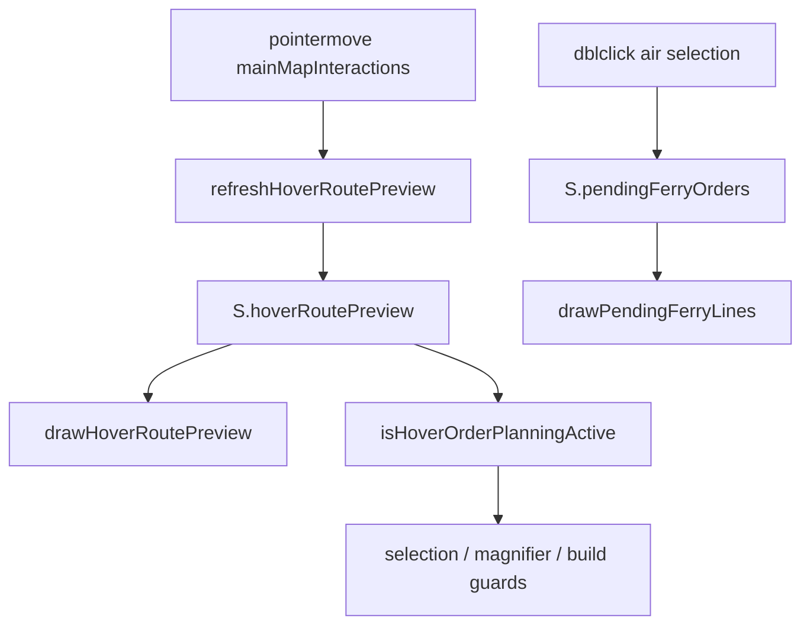

# Ferry Lines, Tooltip Delay, and Hover-Planning Interaction Lock

*Execution plan for a phased, independently verifiable implementation. Structured for reliability, regression safety, and maintainable code. Do not commit without user review.*

---

## 0. Implementer preamble

1. **Read this document end-to-end** before coding.
2. **Do not commit or push** (user rule).
3. **Do not embed phase names/numbers in code**, comments, tests, or config (user rule).
4. Add **orienting comments** on all new/updated non-overriding public methods and fields (user rule).
5. Renderer-only helpers do **not** need backend-style trace/debug logs; no new main-process public APIs are expected.
6. **Tests:** happy paths and essential failure contracts only; no REST/boilerplate tests (user rule).
7. After renderer changes, run **`npm run build:renderer`** (bundles `static/renderer.js` via esbuild — see `package.json`).

---

## 1. Goal, scope, and success criteria

### 1.1 Goal

1. **Ferry line parity** — Planning (hover) and planned (pending ferry) air routes use the same visual language as **ground march lines**: `ORDER_LINE_COLOR`, `ORDER_LINE_WIDTH`, solid stroke for turn-1 (`turn <= 1`), dashed `[6, 4]` for future-turn continuation, polyline stroke via `strokePolylineSkippingWrap`, and terminal `drawArrowheadOnly(..., { tipAtTargetCenter: true })`. **Not** the legacy `drawLineArrow` filled-arrow style.
2. **Tooltip delay** — res1/res4 **hex details** popup waits **1500ms** (2× current 750ms). Order-preview “Blocked:/Slower:” tooltips stay **1500ms** via a **separate** constant (not derived from hex delay).
3. **Interaction lock during hover planning** — While hover order planning is active (see §3.3), block:
   - exclusive selection of **other** units
   - add/remove (Ctrl) selection that **adds** units
   - res1 magnifying glass (tactical entry)
   - res1 build button / build queue open
   - **Allow:** full clear, partial deselect (subset removal), and toggling **off** an already-selected unit (user confirmed).

### 1.2 Binary success checks

| # | Check |
|---|--------|
| 1 | Strategic: select air, hover valid airport → solid blue hover line + arrowhead (not fully dashed). |
| 2 | Strategic: double-click ferry destination → pending line matches standing-order march style. |
| 3 | Tactical: select air sub-units, hover footprint hex → ferry hover line (not “Air units do not use tactical march” only). |
| 4 | Hover res1/res4 hex ~1.5s before terrain details; order-preview hints still dismiss ~1.5s. |
| 5 | Hover planning active: Ctrl-click another unit → no add; click other unit → no swap; empty-map click → deselect; magnifier/build → no action. |
| 6 | Invalid target with **only** red X (no segments) while pointer on hex → lock still applies (user confirmed). |
| 7 | Ctrl held (preview lines suppressed) → selection add/remove works; lock not active. |
| 8 | Hover cleared / deselect → magnifier, build, selection work again. |
| 9 | `npm test` and lint pass; `npm run build:renderer` succeeds. |

### 1.3 Out of scope

- Ferry range perimeter overlay; `ferryModeActive` click mode.
- Blocking when only **committed** pending lines exist without hover preview.
- Strategic airport/range validation in tactical ferry hover (keep existing tactical `validateGroupFerryTarget` footprint checks).
- DB, resolution playback, AI prompt changes.

---

## 2. Architecture reference



**Ground style reference:** `src/renderer/rendering/pathDrawing.ts` — `drawStandingOrderLines`, `drawTacticalPendingMarchPlanLines`.

**Current gaps:**
- `drawPendingFerryLines` uses `drawLineArrow` (`orderDrawing.ts`).
- Strategic air hover: `MOVEMENT_RANGE_BY_UNIT_TYPE.air === 0` forces fully dashed march-branch lines (`hoverPreview.ts`).
- Tactical air hover rejected in `tacticalMarchHoverPreview.ts`.

---

## 3. Shared policy helpers (Phase 4, but spec here for consistency)

Add to `src/renderer/rendering/canvasPreviewPolicy.ts`:

### 3.1 `isHoverOrderPlanningActive()`

```typescript
export function isHoverOrderPlanningActive(): boolean {
  return (
    shouldDrawHoveredPathPreview() &&
    S.hoverRoutePreview !== null &&
    S.hoveredHexH3 !== null
  );
}
```

**Why these three conditions:**
- Aligns lock with **active pointer target** + preview payload (includes invalid X-only targets — user confirmed).
- `shouldDrawHoveredPathPreview()` is false while Ctrl is held → user can multi-select without lock when lines are suppressed (existing canvas policy).
- When pointer leaves hex, `hoveredHexH3` becomes null and preview is cleared → lock releases.

### 3.2 Selection mutation guards

Add companion helpers (same module or `src/renderer/map/hoverPlanningSelectionPolicy.ts` if file size warrants):

```typescript
/** Block adding units not already selected; allow clear and subset removal. */
export function shouldBlockSelectionReplaceDuringHoverPlanning(proposedUnitIds: string[]): boolean {
  if (!isHoverOrderPlanningActive()) return false;
  if (proposedUnitIds.length === 0) return false;
  const current = new Set(S.selectedUnitIds);
  return proposedUnitIds.some((id) => !current.has(id));
}

/** Block toggle only when it would add a unit; allow toggle-off deselect. */
export function shouldBlockToggleSelectionDuringHoverPlanning(unitId: string): boolean {
  if (!isHoverOrderPlanningActive()) return false;
  return !S.selectedUnitIds.includes(unitId);
}
```

**Apply guards at UI boundaries** — do **not** wrap `clearSelection` / `replaceSelection([])` globally inside `selection.ts` (breaks ranged/air-strike commit flows that clear after mode reset).

**Stack callout nuance** (`renderer.ts`):
- `onStackSingleUnitToggleClick` without Ctrl + `inSelection` → `removeUnitsFromSelection` → **allow**.
- Without Ctrl + not in selection → `replaceSelection([unitId])` → **block** when guard true.
- `onStackAllActionClick` `selectAll` / `addAll` → **block** when guard true; `removeAll` → **allow**.

**Deferred single-select** (`mapClickSelectionPolicy.ts`): do not schedule new `pendingSelectTimeout` when `shouldBlockSelectionReplaceDuringHoverPlanning([unitId])` would be true.

---

## 4. Work breakdown

### Block A — Shared march-style line helper + planned ferry lines

**Scope:** Pending ferry committed lines only. Lowest-risk path: introduce helper, use for ferry first; refactor standing/tactical committed drawers only when helper is verified identical.

**Tasks:**

1. Add `drawHumanMarchStyleRouteSegments(ctx, segments, options?)` in `pathDrawing.ts`:
   - Input: `{ turn, hexes: [lat, lng][] }[]` (same segment shape as standing orders).
   - Requires `map` latLng→pixel conversion inside helper (mirror `drawStandingOrderLines`).
   - Style: `ORDER_LINE_COLOR`, `ORDER_LINE_WIDTH`; `setLineDash([])` when `turn <= 1`, else `[6, 4]`; `strokePolylineSkippingWrap`; terminal `drawArrowheadOnly` with `tipAtTargetCenter: true`.
   - Options: `globalAlpha` (default `1` for committed).
2. **Regression-safe refactor:** Refactor `drawStandingOrderLines` and `drawTacticalPendingMarchPlanLines` to call helper **only if** diff is behavior-neutral (same dash rules, arrow placement, opacity). If risky, land ferry on helper first and defer standing-order refactor to Block E.
3. Rewrite `drawPendingFerryLines` in `orderDrawing.ts`:
   - Per ferry order: `cellToLatLng(origin)` / `cellToLatLng(destination)` → single turn-1 two-point segment (mirror `humanMarchPreviewImpl.ts` air branch).
   - Call shared helper; remove `drawLineArrow` parameter.
   - Update `orderOverlayStages.ts` call site.
4. Update `rendererConsolidation.test.ts` — expectations should reference march-style helper / `drawArrowheadOnly`, not `drawLineArrow` for ferry.

**Verify independently:**
- Manual: strategic double-click ferry → solid blue line + center arrowhead like ground march.
- `npm test -- rendererConsolidation`
- Grep: `drawPendingFerryLines` does not call `drawLineArrow`.

---

### Block B — Ferry hover preview (strategic + tactical)

**Depends on:** Block A for visual comparison.

**Tasks:**

1. **Strategic air hover solid line** — `hoverPreview.ts` march branch (when `renderAsSupportTargeting` absent):
   - For preview units with `unitType === 'air'`, treat solid edge budget as **≥ 1** for the preview segment (ferry is always single-hop turn-1). Do not dash-split using `MOVEMENT_RANGE_BY_UNIT_TYPE.air === 0`.
   - Keep opacity: valid `0.55`, invalid `0.75`.
2. **Tactical ferry preview builder** — new `buildTacticalFerryHoverPreview` in `src/shared/tacticalFerryHoverPreview.ts` (or sibling; keep `tacticalMarchHoverPreview.ts` focused):
   - Sync builder: straight turn-1 segment envelope like strategic air preview.
   - Mixed air + non-air selection → invalid envelope with existing mixed-selection copy (do not call march planner).
3. **Wire `hoverRoutePreviewRefresh.ts`** — tactical branch before `buildTacticalMarchHoverPreview`:
   - If all selected human units are air and not in ranged/strike mode:
     - `await window.gameApi.validateGroupFerryTarget({ unitIds, destinationH3Index: hoveredH3 })` (mirror ranged/air stale-async pattern with `hoverRoutePreviewAsyncContextStillValid`).
     - Build preview from validation + `buildTacticalFerryHoverPreview`.
     - `publishHoverRoutePreview` without `renderAsSupportTargeting`.
   - Else if mixed air/non-air → invalid grouped envelope.
4. Strategic all-air path continues via IPC `previewHumanMarchOrders`; Block B.1 fixes drawing.

**Optional focused test:** `tacticalFerryHoverPreview.test.ts` — builder returns one segment for origin ≠ destination; mixed selection invalid.

**Verify:**
- Strategic air hover in-range → solid line; out-of-range → invalid X + blocked copy.
- Tactical air hover inside footprint → solid line.
- Ground march hover unchanged.

---

### Block C — Hex details tooltip delay

**Independent** of A/B; may land in parallel.

**Tasks:**

1. `constants.ts`:
   - Add `HEX_DETAILS_TOOLTIP_DELAY_MS = 1500` (orienting comment: res1 + res4 hex details popup).
   - Set `ORDER_BLOCK_HEX_TOOLTIP_TTL_MS = 1500` as explicit literal **or** `ORDER_PREVIEW_TOOLTIP_TTL_MS = 1500` — **do not** compute from hex delay.
   - Grep `TERRAIN_TOOLTIP_DELAY_MS`; remove or re-export only if nothing else uses it.
2. `mainMapInteractions.ts`: timer uses `HEX_DETAILS_TOOLTIP_DELAY_MS`.
3. Update imports in `orderBlockHexTooltip.ts` / `orderSlowerHexTooltip.ts` if constant renamed.

**Verify:**
- Hex details ~1.5s dwell; order-preview TTL still ~1.5s (not 3s).

---

### Block D — Hover-planning interaction lock

**Depends on:** Block B (ferry hover) and Block C (optional).

**Tasks:**

1. Implement §3 helpers in `canvasPreviewPolicy.ts` (or split module if needed).
2. **Selection guards** using §3.2 helpers:
   - `mapClickSelectionPolicy.ts` — block ctrl toggle add; block deferred/replace swap; allow paths that only clear timer.
   - `mainMapInteractions.ts` — preserve `clearSelection` on empty/non-unit clicks; skip unit icon selection when replace would be blocked.
   - `sidebarSupport.ts` — `applySelectionFromSidebarUnitButton`.
   - `renderer.ts` — `onStackSingleUnitToggleClick`, `onStackAllActionClick` (allow remove/deselect paths).
3. **Magnifier / build guards** when `isHoverOrderPlanningActive()`:
   - `tacticalEntryLayer.ts` — `tryHandleTacticalEntryAtClientXY`.
   - `drawInteraction.ts` — `tryHandleBuildEntryAtClientXY`.
   - `buildQueuePopup.ts` — `showBuildPopup` early return.
   - `initCore.ts` — `#build-entry-layer` click (defense in depth).
   - `renderer.ts` — tactical-entry layer click listener.
4. **Do not block:** double-click march/ferry commit, ranged/strike mode buttons, Ready, opening stack callout (only mutations inside), pan/zoom.

**Verify:** §1.2 checks 5–8; consolidation tests reference `isHoverOrderPlanningActive` at guard sites.

---

### Block E — Integration and regression

1. `npm test` (full).
2. `npm run build:renderer`.
3. Manual matrix:
   - Strategic ground march hover + lock
   - Strategic air ferry hover + commit + lock
   - Tactical ground march + lock
   - Tactical air ferry hover + commit + lock
   - Ranged mode hover lines + lock
   - Air strike mode hover lines + lock
   - Ctrl-held bypass while preview suppressed
   - Invalid X-only target still locks
4. File size: if `pathDrawing.ts` or `hoverPreview.ts` approach 600 lines, extract sub-module.

---

## 5. Key files

| Area | Path |
|------|------|
| Line drawing | `src/renderer/rendering/pathDrawing.ts`, `orderDrawing.ts`, `hoverPreview.ts` |
| Hover data | `hoverRoutePreviewRefresh.ts`, `tacticalFerryHoverPreview.ts` (new), `tacticalMarchHoverPreview.ts`, `humanMarchPreviewImpl.ts` |
| Policy / lock | `canvasPreviewPolicy.ts`, `mapClickSelectionPolicy.ts`, `mainMapInteractions.ts` |
| res1 UI | `tacticalEntryLayer.ts`, `buildQueuePopup.ts`, `drawInteraction.ts`, `initCore.ts` |
| Constants | `constants.ts` |
| Tests | `rendererConsolidation.test.ts`, optional `tacticalFerryHoverPreview.test.ts` |

---

## 6. Regression risks and mitigations

| Risk | Mitigation |
|------|------------|
| Refactoring standing-order drawers breaks committed path visuals | Ferry-first helper adoption; defer standing-order refactor if not byte-identical; manual before/after on multi-segment march |
| `replaceSelection([])` blocked by overly broad guard | Explicit allow empty + subset-only proposals (§3.2) |
| Ranged/air-strike commit breaks | Guards at UI only; commit handlers clear modes before `clearSelection` |
| Ctrl multi-select while “planning” in data but lines hidden | Lock tied to `shouldDrawHoveredPathPreview()` |
| Tactical ferry async race | Reuse `hoverRoutePreviewAsyncContextStillValid` pattern from ranged branch |
| `static/renderer.js` stale | Mandatory `npm run build:renderer` in Block E |
| Mixed air/ground selection hover | Invalid envelope; no march planner call for mixed tactical |

---

## 7. User rules checklist

- [ ] Orienting comments on new public helpers
- [ ] No phase/stage identifiers in version-controlled artifacts
- [ ] Spec lives in `.spec/` (this file)
- [ ] No git commit/push
- [ ] Focused tests only
- [ ] Source files stay under size limits (decompose if needed)
