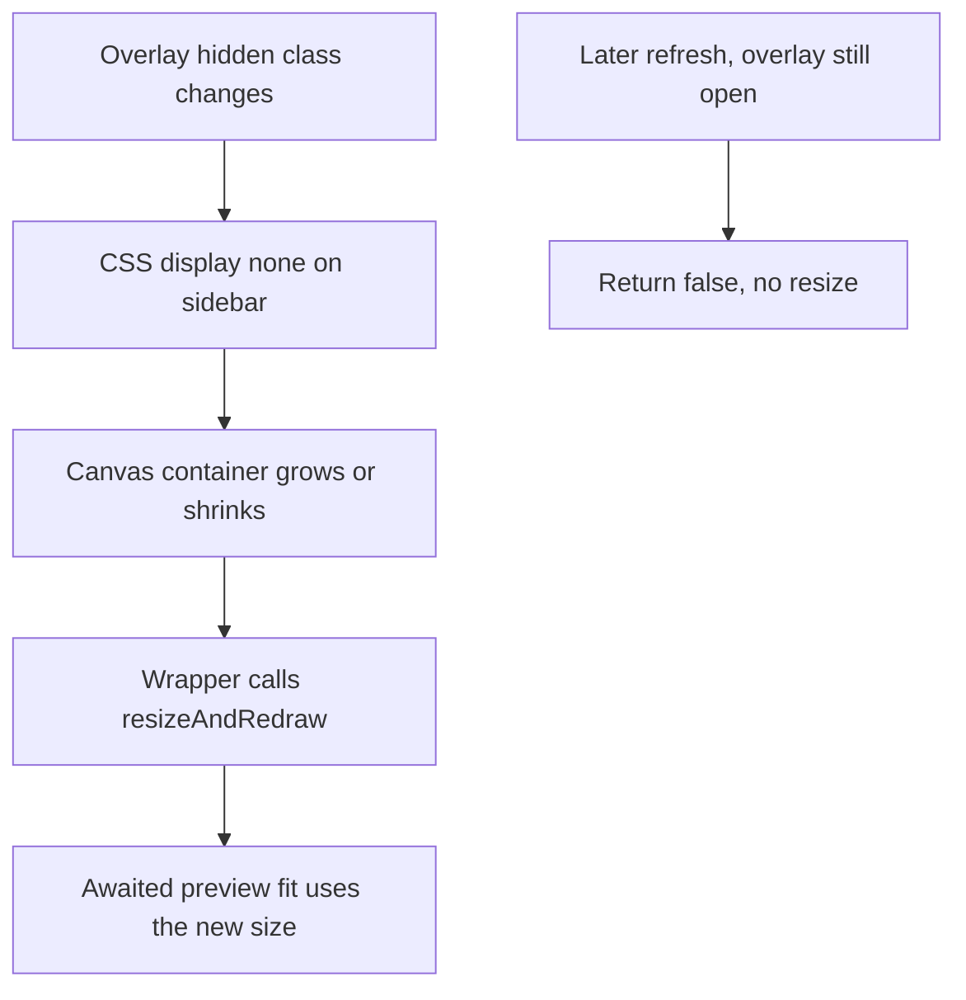

# Hide the right panel during the start overlay

> **For the implementing agent:** Do the phases in order. Do not start a phase until the previous phase's checks pass. On execution of this planning document, save it to `.spec/hide-right-panel-during-start-overlay.md` before changing product code. Do not copy phase names, this filename, or plan wording into code, comments, tests, configuration, or `doc/`.

**Goal:** While the start / strategic win-loss overlay is open, the right panel is out of the layout and the map fills the window. When that overlay closes, the panel returns at its current width and the map fills the space beside it.

**Architecture:** CSS removes `#sidebar` from the flex row whenever `#game-over-overlay` lacks the class `hidden`. The two functions that add or remove that class return whether the overlay actually opened or closed. Their wrappers in `entryCallbacks.ts` then call the existing `resizeAndRedraw`, which is the only place that tells Leaflet and the overlay canvas the new size. A later refresh that leaves the overlay open does not resize, so a preview the player has panned stays put.

**Tech stack:** Electron renderer, existing Leaflet map, CSS in `static/shellChrome.css`. No new dependency.

## Locked decisions

- The trigger is `#game-over-overlay` without the class `hidden`. That is startup with no match, New from the Model tab, strategic "You win!" / "You lose.", and the collapsed form. The class `game-over-dialog-collapsed` does not close the overlay, so the panel stays away while the player pans the preview.
- `#tactical-annihilation-overlay` reuses the class `game-over-overlay` and a different id. The tactical battles list and an active battle are also separate. None of them hide the panel. The selector must use the id `#game-over-overlay`.
- Hide with `display: none`, not `visibility: hidden`. The panel is `width: 320px; min-width: 320px; flex-shrink: 0`. Visibility hidden would keep that column and leave a gap. `display: none` lets `#canvas-container` (`flex: 1`) take the width.
- Do not put a hide class on `#sidebar` in `static/index.html`. The page does not know if a match is loaded until `getGameState` returns. Hiding the panel in HTML would flash a full-width map, then shrink it, on a restored match.
- Resize only when that overlay gains or loses `hidden`. `updateGameOverUI` also runs on later snapshots while the dialog stays open. `resizeAndRedraw` calls `invalidateLeafletMapSizes`. On a regional extent, Leaflet's `resize` listener in [`src/renderer/map/mapExtent.ts`](src/renderer/map/mapExtent.ts) refits and locks `minZoom`. Doing that on a refresh would move a preview the player has panned. Do not edit `mapExtent.ts`. The preview's later `applyLoadedMapExtent` resets `minZoom` and fits the preview after the one resize that opened the overlay.
- Call `resizeAndRedraw` synchronously in the wrapper, after the module returns, and before the preview `await` resumes. Both open paths start `refreshNewGameMapPreview` in a `void` async function. `await` yields before `fitBounds`. The wrapper's resize runs on the current stack, so that fit sees the wide map. Do not move the resize into the async function, and do not put it after `refreshNewGameMapPreview`.
- Do not import `resizeAndRedraw` from [`src/renderer/rendering/gameScene.ts`](src/renderer/rendering/gameScene.ts) into [`src/renderer/core/uiState.ts`](src/renderer/core/uiState.ts). `gameScene.ts` already imports `uiState.ts`. Do not add a resize callback parameter. The wrappers already live in [`src/renderer/entryCallbacks.ts`](src/renderer/entryCallbacks.ts), which already imports `gameScene.ts`.
- On the Start success path in [`src/renderer/gameplay/newGame.ts`](src/renderer/gameplay/newGame.ts), call `updateGameOverUI` before `syncMapExtentToSnapshot`. The overlay is then closed and the map is already beside the right panel when the extent is fit and the opening zoom is saved. Leave the `resizeAndRedraw()` call at the end of that path. Do not delete it. After the width has settled, that second call does not fire a map resize and does not move the frame.
- Leave `setMainUIControlsEnabled` unchanged. Tactical annihilation and the tactical battles list still dim the panel and turn pointer input off while the panel stays on screen.
- Do not change [`src/renderer/gameplay/newGameDialogCollapse.ts`](src/renderer/gameplay/newGameDialogCollapse.ts), the minimap, the legend, or the zoom control. Those stay `visibility: hidden` for the whole time the overlay is open.
- No animation. The panel and the map change in the same turn.
- These are renderer functions. The edited files have no logger. Do not add `console.debug`, `console.log`, or a main-process logger.
- There is no renderer DOM test runner. `src/renderer/**/*.test.ts` does not exist, and `npm test` runs main-process node tests. Do not add a harness, jsdom, or a helper whose only job is `wasHidden !== nowHidden`. Layout and Leaflet size are checked by the commands and the manual list below.

## Global constraints

- Do not commit or push.
- Do not put phase names, this filename, or plan wording into code, comments, tests, configuration, or `doc/`.
- New and updated functions keep an orienting comment with Purpose, When to use, Expected outcome, and Exceptions. Use the comment text in this plan.
- Exported functions stay camelCase. Do not add a file whose name ends in `Utils` or `Impl`.
- Do not grow [`src/renderer/entryCallbacks.ts`](src/renderer/entryCallbacks.ts) past 1000 lines. It is 944 lines. Extend the two wrappers in place. Do not add a helper in that file.
- Named parameters stay within the existing functions. Do not add parameters to `updateGameOverUI` or `openNewGameOverlayFromModelTab`.
- Living UX docs are edited in place under `doc/ux/`. Do not copy them into `.spec`. Do not edit `.spec/completed/`.



## Phase 1 — Hide the panel and resize the map

### CSS

In [`static/shellChrome.css`](static/shellChrome.css), after the `#sidebar { ... }` rule (the one that sets `display: flex` and `width: 320px`), add:

```css
/* Out of the row for the whole time #game-over-overlay is open, including while its form is collapsed. The map pane takes that width. The battle-result dialog is a different element. */
body:has(#game-over-overlay:not(.hidden)) #sidebar {
  display: none;
}
```

`#sidebar` alone is one id. The new rule is two ids plus a class, so it wins over `display: flex` even if a later edit moves it. `body:has(...)` is required because `#sidebar` is a sibling of `#canvas-container`, not a child. Do not key the rule off the class `game-over-overlay`.

### Return whether the overlay opened or closed

In [`src/renderer/core/uiState.ts`](src/renderer/core/uiState.ts), change `updateGameOverUI` so it returns `boolean`. Keep every existing side effect. Replace its orienting comment with:

```ts
/**
 * Shows or hides the new-game overlay to match the current state.
 *
 * Purpose: Keeps the overlay up while there is no game or the game is over, and the main controls disabled with it.
 * When to use: After every state refresh.
 * Expected outcome: Returns true only when `#game-over-overlay` gains or loses `hidden`. Returns false when it stays open, stays closed, or the element is missing. With a live game the overlay hides and controls are enabled. Otherwise the overlay shows a win, loss, or start message. Fog of war and the bonus dropdowns return to their defaults on every call while it shows. The home regions, the starting month, and the map preview are drawn only when the overlay opens. The form starts showing only on that open. A later refresh leaves a hidden form hidden.
 * Exceptions: None.
 */
```

Compute `wasHidden` the way the function already does (`overlay?.classList.contains('hidden') !== false`). On the branch that adds `hidden`, return `overlay != null && wasHidden === false`. On the branch that removes `hidden`, return `overlay != null && wasHidden === true`. A missing overlay returns false on both branches. Do not skip the message, button, or `setMainUIControlsEnabled` work.

`wasHidden === true` when the element is missing, because `undefined !== false`. The `overlay != null` check is what keeps that from counting as a change.

### Blur the panel and drop its tip when the overlay opens

`blurMapChromeIfFocused` is already called only when the overlay goes from hidden to shown: inside `updateGameOverUI` on that open, and at the end of `openNewGameOverlayFromModelTab` after `classList.remove('hidden')`. Do not call it on the close path or on a refresh that leaves the overlay open.

Import `dismissStaleControlTooltip` from [`src/renderer/chrome/controlTooltip.ts`](src/renderer/chrome/controlTooltip.ts). That module does not import `uiState.ts`. Replace `blurMapChromeIfFocused` with:

```ts
/**
 * Drops focus and a control tip from chrome the new-game overlay is about to cover.
 *
 * Purpose: The minimap, the legend, and the right panel are not on screen while that overlay is open. A focused control would still take keys, and a tip for the New button would stay up over the map.
 * When to use: When that overlay goes from hidden to shown, after its `hidden` class is removed.
 * Expected outcome: Focus leaves the minimap, the legend, or the right panel. A dialog control that already has focus is left alone. A tip whose control has no box is dismissed.
 * Exceptions: None.
 */
export function blurMapChromeIfFocused(): void {
  const active = document.activeElement;
  if (active instanceof HTMLElement) {
    const insideHiddenChrome = active.closest('#minimap') != null
      || active.closest('#terrain-legend') != null
      || active.closest('#sidebar') != null;
    if (insideHiddenChrome) active.blur();
  }
  dismissStaleControlTooltip();
}
```

The tip dismiss must run even when focus is not an `HTMLElement`. Do not return before it.

### Model-tab New

In [`src/renderer/gameplay/newGame.ts`](src/renderer/gameplay/newGame.ts), change `openNewGameOverlayFromModelTab` to return `boolean`. Keep the early return for a battle or playback, and make it `return false`. Immediately before `overlay?.classList.remove('hidden')`, record `const opened = overlay?.classList.contains('hidden') === true`. Return `opened` at the end. An overlay that is already open, or missing, returns false and still performs the existing cancel, message, preview, expand, and blur work. Replace its orienting comment with:

```ts
/**
 * Opens the new-game dialog mid-match from the Model tab.
 *
 * Purpose: Lets the player abandon the current match; stops pending AI work first so it cannot land on the new one.
 * When to use: The Model tab's New game button.
 * Expected outcome: Returns false when a battle or playback is active, or when the overlay was already open or missing, and in the battle and playback case does nothing else. Otherwise AI requests are cancelled, Fog of war and the bonus dropdowns return to their defaults, the home regions, starting month, and map preview are drawn again, the form starts showing, and the overlay opens. Returns true only when this call removes `hidden` from `#game-over-overlay`.
 * Exceptions: None.
 */
```

### Resize from the wrappers

In [`src/renderer/entryCallbacks.ts`](src/renderer/entryCallbacks.ts), add `resizeAndRedraw` to the existing import from `./rendering/gameScene`. Replace the two wrappers with:

```ts
/**
 * Shows or hides the new-game overlay, and resizes the map when that visibility changes.
 *
 * Purpose: The overlay and the right panel share the window width. Leaflet keeps the previous container size until a resize.
 * When to use: After a snapshot, and when a match ends.
 * Expected outcome: The overlay matches the snapshot. The map is resized only when the overlay opens or closes.
 * Exceptions: None.
 */
export function updateGameOverUI(state: GameStateSnapshot | null): void {
  const visibilityChanged = updateGameOverUIFromModule(state, updateReadyButtonState);
  if (visibilityChanged) resizeAndRedraw();
}

/**
 * Opens the new-game dialog from the Model tab, and resizes the map when it actually opens.
 *
 * Purpose: The right panel leaves the layout when that dialog opens. The map has to take the freed width before the preview fits.
 * When to use: The Model tab's New button.
 * Expected outcome: A battle or playback ignores the click. Otherwise the dialog opens, and the map resizes only when the overlay was hidden.
 * Exceptions: None.
 */
export function openNewGameOverlayFromModelTab(): void {
  const visibilityChanged = openNewGameOverlayFromModelTabFromModule(setMainUIControlsEnabled, updateReadyButtonState);
  if (visibilityChanged) resizeAndRedraw();
}
```

Deps interfaces that type these as `() => void` can stay. A boolean return is assignable to void. Do not edit those interfaces.

### Phase 1 checks

Run:

```text
npm run check:renderer-types
npx eslint src/renderer/core/uiState.ts src/renderer/gameplay/newGame.ts src/renderer/entryCallbacks.ts src/renderer/chrome/controlTooltip.ts
```

`controlTooltip.ts` is listed so an unused-import or cycle mistake is caught. Do not change it unless eslint reports an error caused by this work. Do not run `npm test`.

Then `npm start` and confirm:

- Startup with no match: no right panel, the map meets the window edge, the dialog sits 12px from the top-left of that map.
- Collapse the form: the panel stays gone, drag and the wheel pan and zoom the preview, and opening the form does not bring the panel back.
- Start game: the panel returns at 320px, the map fills the rest, and there is no empty strip or stale tile band.
- A restored match, if one loads at startup: the panel is present and the opening camera is the match camera, not a second jump from this change.

Do not start Phase 2 until those pass.

## Phase 2 — Update the living UX docs

Edit in place. Use the sentences below. Do not mention selectors, classes, or this plan. Do not edit `.spec/completed/`.

In [`doc/ux/right-panel.md`](doc/ux/right-panel.md), replace the Availability paragraph with:

```text
Shown in Strategic planning, Tactical planning, Resolution playback, the tactical battles list, and Tactical annihilation. It is not on screen in New game or Game over, including while the new-game form is hidden, and the map fills the window. It accepts pointer input in Strategic planning, Tactical planning, and Resolution playback. While the tactical battles list is open, the panel stays visible and does not receive pointer input. In Tactical annihilation, pointer input on the panel is off except the annihilation dialog, which is not part of this panel.
```

Replace the state bullet `Pointer input off: New game, Game over, or Tactical annihilation.` with these two bullets:

```text
- Absent: New game and Game over, including while the new-game form is hidden. The map fills the window.
- Pointer input off: the tactical battles list, and Tactical annihilation.
```

Add this invariant under the existing "never hidden just because a tactical battle is active" bullet:

```text
- The panel is absent for the whole New game and Game over overlay, and present again as soon as that overlay closes.
```

Leave "The panel stays visible in both theaters." as it is.

In [`doc/ux/modes-and-transitions.md`](doc/ux/modes-and-transitions.md), in both the New game paragraph and the Game over paragraph, replace `The right panel does not accept pointer input.` with `The right panel is not on screen, and the map fills the window.` Leave the tactical annihilation paragraph, the tactical battles list paragraph, and "The right panel stays visible in both theaters." unchanged.

In [`doc/ux/new-game-dialog.md`](doc/ux/new-game-dialog.md), replace `The right panel does not accept pointer input while it is open.` with `The right panel is not on screen while it is open, including while the form is hidden, and the map fills the window.`

In [`doc/ux/right-panel-command-bar.md`](doc/ux/right-panel-command-bar.md), replace `They are disabled or hidden in New game, Game over, and Tactical annihilation as stated in [modes-and-transitions.md](modes-and-transitions.md).` with `In New game and Game over the panel is absent, so these controls are absent with it. In Tactical annihilation they are disabled or hidden as stated in [modes-and-transitions.md](modes-and-transitions.md).`

In [`doc/ux/right-panel-selection-and-orders.md`](doc/ux/right-panel-selection-and-orders.md), add to the end of the Availability paragraph: `In New game and Game over the panel is absent, so these lists are absent with it.`

In [`doc/ux/right-panel-tools-tab.md`](doc/ux/right-panel-tools-tab.md), add to the end of the Availability paragraph: `In New game and Game over the panel is absent, so this tab is absent with it.`

In [`doc/ux/right-panel-model-tab.md`](doc/ux/right-panel-model-tab.md), add to the end of the Availability paragraph: `In New game and Game over the panel is absent, so this tab is absent with it.`

In [`doc/ux/ai-activity-log.md`](doc/ux/ai-activity-log.md), add to the end of the Availability paragraph: `The log is absent in New game and Game over because the panel is absent.`

### Phase 2 checks

Read each edited paragraph against the locked decisions. Search `doc/ux` for `right panel does not accept pointer input` and for `Shown in every mode`. Both should be gone. The tactical annihilation and tactical battles list sentences that say the panel stays visible must still be there.

## Phase 3 — Confirm the untouched modes

With the app running, check each item. Stop and fix a miss before calling the work done.

- Startup, New, and a strategic win or loss: panel gone, map flush to the window, dialog still at the minimap's corner, no dark veil.
- Collapsed form: panel stays gone, preview pan and zoom work, and showing the form again does not bring the panel back. A control tip that was open on New is gone.
- After Start game, on both a world map and a regional map: panel returns, map fills the space beside it, and the match framing is the framing Start already applies. This change must not add a second camera jump.
- A snapshot while the start dialog stays open (change a home region, or let a refresh land): the preview does not jump back to the fit.
- Tactical annihilation: panel still visible, still not accepting pointer input, dialog still centered on its veil, minimap and legend still visible.
- Tactical battles list: panel still visible and inert, dialog still centered on the map area rather than on the map plus the panel.
- A battle in progress: panel still visible and usable. Exit Battle still works.
- Resolution playback: panel still visible and still follows its own rules.

## Out of scope

- Hiding the panel for tactical annihilation, the tactical battles list, or a battle.
- Animating the panel.
- Changing minimap, legend, or zoom visibility.
- Editing `mapExtent.ts` or the Start success path's existing `resizeAndRedraw()` call.
- Adding a test harness.
- Committing or pushing.
