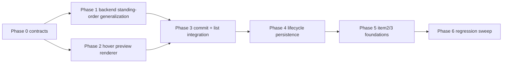

# Human long-distance unit orders — execution plan

This document plans implementation of **item 1**: letting human players issue long-distance autonomous movement orders that execute across turns, using the same route logic and standing-order model the LLM flow relies on.

It also includes **foundational design constraints** so later plans can add:

- item 2: multi-select orders
- item 3: stack-select orders

without reworking core order execution, path preview rendering, or UI event handling.

**Audience:** Coding agent or developer implementing in phases.  
**Primary objective:** Maximum reliability, clarity, and independently verifiable increments.

---

## 1. Scope and success criteria

### 1.1 In scope for this plan

1. Human unit long-distance planning and autonomous per-turn execution to destination.
2. Hover path preview for the currently selected unit:
   - same color and thickness family as movement lines
   - solid segment for next-turn move, dashed for subsequent turns
   - movement arrowhead at hovered destination center
3. Invalid destination preview state (path hidden, X marker shown in movement-line color).
4. Preview/X clearing when pointer leaves map/UI target area.
5. Double-click commit behavior:
   - commit as persistent movement order
   - preview line becomes opaque/frozen order line
6. Turn progression behavior:
   - Ready clears planning overlays
   - ordered units keep moving each turn until destroyed or destination reached
   - completed orders removed from movement-order list
7. Combat interaction:
   - units under movement orders still participate in melee and return fire
   - movement order persists unless unit destroyed or destination reached
8. Performance requirement:
   - recalculate hover path only when hovered hex changes

### 1.2 Explicitly out of scope

1. Multi-select command UX and semantics.
2. Stack-select command UX and semantics beyond preserving compatibility with current stack callout.
3. New combat rules or terrain movement rules.
4. New AI behaviors (LLM side remains functionally unchanged).

### 1.3 Definition of done

1. All item-1 behaviors above work end-to-end in normal gameplay.
2. No regressions in one-turn movement, ranged targeting, or Ready resolution.
3. Core path/standing-order execution path is reusable for future multi-unit order issuance.
4. Tests cover happy paths and essential failures only (no implementation-detail tests).
5. New/updated public backend methods follow repository logging/comment standards.

---

## 2. Locked product and technical decisions

These decisions are locked for this plan to reduce implementation thrash.

| ID | Decision | Value |
|----|----------|-------|
| A | Human long-distance command model | Use standing-order persistence/execution path, not ad-hoc per-turn pending orders only. |
| B | Route source of truth | Use the same route-finding logic/tooling as LLM standing orders (`plan_route`/pathfinding stack), not renderer-local shortest-line logic. |
| C | Preview trigger cadence | Recompute only when hovered hex changes (hex-boundary crossing), plus selection change/map-state refresh. |
| D | Visual split for movement budget | Solid for the first-turn segment (`nextMoveHex` path segment), dashed for later segments. |
| E | Invalid destination feedback | Hide preview path and show X marker (kill-symbol style), using movement-line color/weight. |
| E1 | Destination eligibility | A destination is eligible only when on-map and reachable under the same passability/routing constraints used by standing-order route planning. |
| E2 | Cross-domain hover behavior | Naval→land and land→water hover targets are invalid. Show X marker at hovered hex; if a partial valid route exists, render the path only to the last usable hex. |
| F | Commit gesture | Double-click on valid target while a human unit is selected; committed order shown as opaque/frozen line. |
| G | Ready behavior | Planning-only overlays clear on Ready; committed movement orders execute during resolution and remain persisted for subsequent turns if incomplete. |
| H | Future-proofing for item 2/3 | Introduce order-intent and selection-state abstractions now so unit-group ordering can be added without reshaping execution code. |
| I | Human order types in this plan | March-only for human-issued long-distance orders; pursue UX is deferred to a later plan. |
| J | Occupied-hex double-click behavior | Double-clicking enemy-occupied hexes for human units still resolves as march-only behavior in this plan. |
| K | Movement list scope | Upper-right movement order list shows human orders only during human planning context. |
| L | Cancel semantics | Cancel remains per-unit only; no bulk-cancel in this plan. |

---

## 3. Requirements traceability (user goals → implementation contract)

1. **Left-click selection unchanged** → Preserve current single-unit left-click selection behavior as baseline interaction.
2. **Hover path from selected unit** → Add `hoverPathPreview` render model keyed by selected unit + hovered hex.
3. **Solid first move, dashed future moves, arrow tip at hovered hex** → derive segments from per-turn partitioned route and render style per segment index; for invalid cross-domain hovers show X on hovered hex and (when available) end path at last usable hex.
4. **Use LLM route logic and aesthetically centered bends** → use existing H3 route output path and centerline rendering between hex centers.
5. **Inaccessible target shows X** → invalid/blocked/off-map hover target produces X marker; for cross-domain invalid hover, keep any partial valid segment ending at the last usable hex.
6. **Path/X disappear off-map or out of UI** → clear hover preview state on pointerleave and invalid hover context.
7. **Double-click freezes line and commits order** → convert preview intent to persisted human standing order; render committed line opaque.
8. **Ready clears planned path lines and resolves moves** → clear temporary planning overlays while keeping persisted orders for future turns.
9. **Orders continue each turn until destroyed/arrived** → standing-order generation in turn resolution creates next move each turn until terminal status.
10. **Movement order list keeps behavior; cancel still works** → existing upper-right movement list interaction model remains the same; while a unit is selected the current hover/preview path is shown, and Cancel still cancels that unit's movement orders.
11. **Arrival removes from list** → standing order terminal-state cleanup removes completed movement entries.
12. **Combat does not cancel movement mission** → no auto-cancel from melee/return fire participation.
13. **No recalculation until hex boundary crossed** → route preview cache keyed by hovered hex H3; no per-pixel recompute.

---

## 4. Architecture approach (item 1 + foundations for item 2/3)

### 4.1 Unify order execution contracts

Create or extract a shared backend service module for standing-order operations that can serve both players, with policy checks:

- opponent: existing LLM path
- human: new UI-issued path

This avoids duplicating route computation and status handling logic.

### 4.2 Separate three concepts in renderer state

1. **Selection state** (which controllable units are currently selected; v1 remains single unit).
2. **Preview intent state** (ephemeral hover-derived route or invalid marker).
3. **Committed intent state** (persisted orders returned from game snapshot/order query).

This separation is required groundwork for future multi-select and stack-select.

### 4.3 Introduce batch-capable interfaces now (single-item behavior today)

Even though UI remains single-select in this plan, backend and renderer internal APIs should accept lists where practical:

- `selectedUnitIds: string[]` (current max length = 1)
- `issueOrders(intents: HumanOrderIntent[])` (current usage = one intent)

This creates compatibility for item 2/3 without behavioral change now.

### 4.4 Keep existing one-turn pending movement pathway only as execution output

Standing orders generate per-turn concrete movement/ranged outputs at resolution time; human direct planning should not fork a separate long-distance execution path.

---

## 5. Implementation standards (mandatory on touched code)

1. **Logging**
   - new/updated public backend method invocations log at debug
   - caught exceptions log at error
   - non-mutating getters log at trace
2. **Orienting comments**
   - add orienting comments on new/updated public, non-overriding methods
3. **Tests**
   - include happy path + essential failure contracts only
   - avoid implementation-detail assertions
4. **Readability**
   - prefer clear, composable functions over inline monolith logic
   - keep renderer drawing code factored by overlay type (existing pattern already does this)

---

## 6. Phased execution plan

Each phase below must be independently verifiable with automated tests and/or focused manual smoke checks, using only outputs from completed earlier phases.

## Phase 0 — Contract freeze and schema/API alignment

**Objective:** Freeze data contracts and interaction contracts before UI work.

**Tasks:**

1. Define/confirm order contract(s) for human long-distance intents in shared types (`ipcTypes` + main service interfaces).
2. Decide whether to:
   - extend existing `standing_orders` to include human rows directly, or
   - keep a player-agnostic standing-order service over existing schema.
3. Define renderer overlay state models:
   - `HoverRoutePreview` (valid route)
   - `HoverInvalidMarker` (X)
   - `CommittedRouteOverlay`
4. Define future-safe selection model shape (`selectedUnitIds` list), while preserving single-selection behavior for this phase.
5. Write/update mini-spec comments in touched modules documenting "single-select now, multi-select later" contract.

**Verification:**

- Typecheck/build passes.
- Existing gameplay unaffected (manual smoke).

**Exit criteria:**

- No unresolved contract ambiguities remain for phases 1+.

---

## Phase 1 — Backend standing-order service generalization for human use

**Objective:** Make long-distance movement execution player-agnostic and reusable.

**Tasks:**

1. Extract standing-order core logic into player-agnostic methods where needed (currently AI-opponent-centric in Tool 5 codepath).
2. Add human-safe command entry points for:
   - assign march standing order
   - cancel order
   - query order status/list
3. Ensure route generation uses existing pathfinding/tool1 behavior and preserves terrain/domain rules.
4. Ensure terminal states are explicit (`arrived`, `blocked`, `target_destroyed`, etc.) and can drive UI list cleanup.
5. Add logging/orienting comments to all new/updated public backend methods.
6. Keep existing AI behavior parity (no regressions).

**Verification:**

- Unit tests: assign/query/cancel for human + opponent happy paths.
- Essential failure tests: invalid unit owner, off-map destination, impassable destination.
- Existing AI standing-order tests remain green.

**Exit criteria:**

- Human standing orders can be created/cancelled/queried through backend contract.

---

## Phase 2 — Renderer hover preview engine and invalid-marker behavior

**Objective:** Add high-fidelity hover path preview tied to selected unit + hovered hex.

**Tasks:**

1. Implement preview state machine in renderer:
   - selected unit present + hovered hex changed => recompute route preview
   - invalid destination => hide route, show X marker
   - pointerleave/off-map => clear both
   - cross-domain invalid hover => X marker at hovered hex and partial route to last usable hex when one exists
2. Add preview route resolver call path to main process service using shared route logic.
3. Render preview overlay:
   - line color/width aligned with movement order lines
   - first-turn segment solid; later segments dashed
   - arrowhead at hovered destination center
   - for cross-domain invalid hover with partial route, arrowhead terminates at the last usable hex (X remains at hovered invalid hex)
   - semi-transparent while not yet committed
4. Add performance guard:
   - recompute only when hovered hex H3 changes
   - skip recompute on pixel-level pointer movement within same hex
5. Keep existing terrain tooltip and hover fill behavior intact.

**Verification:**

- Manual UI test on infantry/armor/naval (including long naval route).
- Essential failure smoke: inaccessible hex shows X; leaving map clears overlays.
- No pointer-move performance degradation relative to baseline.

**Exit criteria:**

- Visual preview behaves exactly per requirements 2–6 and 13.

---

## Phase 3 — Double-click commit flow and movement-order list integration

**Objective:** Commit hovered route to persistent human standing order and reflect it in existing order UI.

**Tasks:**

1. On valid double-click:
   - convert current hover preview target into human standing-order assignment
   - freeze/opaque committed line rendering
2. Integrate movement order list with human standing-order query output:
   - keep existing list and cancel interaction model
   - list scope remains human orders only
   - ensure cancel invokes standing-order cancel for human unit
3. Preserve current left-click selection behavior; avoid introducing multi-select behavior now.
4. Keep current stack callout behavior unchanged (foundation only, no new stack-selection mechanics).

**Verification:**

- Manual: double-click commit creates frozen line and order-list row.
- Cancel button removes order and line.
- Existing one-turn submit/ready flows still pass.

**Exit criteria:**

- User can reliably issue and cancel long-distance orders from map interactions.

---

## Phase 4 — Turn lifecycle persistence, completion cleanup, and combat continuity

**Objective:** Ensure long-distance orders persist and execute correctly across turns.

**Tasks:**

1. During Ready/resolution:
   - clear planning overlays
   - generate one-turn move from active standing order
   - execute move as part of normal resolution
2. After resolution:
   - recompute/update standing-order status and next route step
   - retain order for next turn unless terminal
3. Remove order/list entry automatically on arrival or unit destruction.
4. Ensure combat participation (melee/return fire) does not auto-cancel movement mission.
5. Ensure order generation and cancellation remain deterministic and idempotent per turn.
6. Treat dynamic route invalidation as non-goal for this plan unless a concrete invalidation trigger is discovered during implementation/testing; if discovered, add a focused follow-up note/test.

**Verification:**

- Integration test: multi-turn march reaches destination across multiple Ready presses.
- Integration test: ordered unit enters combat and continues mission if alive.
- Integration test: destroyed unit order is removed automatically.
- Integration test: arrival removes order from list and no further movement generated.

**Exit criteria:**

- Requirements 8–12 satisfied end-to-end.

---

## Phase 5 — Future foundations for item 2/3 (no behavior change yet)

**Objective:** Land low-risk abstractions now to reduce future plan complexity.

**Tasks:**

1. Ensure selection and command interfaces can accept multiple unit IDs without changing current UX behavior.
2. Add stable ordering semantics for future batch intent processing (e.g., selection order or explicit primary unit anchor).
3. Create stack-selection-ready utility boundaries:
   - unit collection from hex/stack
   - selection reconciliation
   - order fan-out path
4. Add lightweight design notes in code comments/docblocks indicating extension points for plans 2 and 3.

**Verification:**

- Type-level/API-level checks prove interfaces support >1 unit.
- Current single-unit interaction behavior unchanged.

**Exit criteria:**

- Future multi-select and stack-select can be implemented mostly in renderer/controller layers, not core order engine.

---

## Phase 6 — Regression sweep and release checklist

**Tasks:**

1. Run focused automated tests for:
   - pathfinding/tool1/tool5
   - game action submit/ready flows
   - renderer interaction tests (if available)
2. Manual smoke matrix:
   - infantry/armor/naval long paths
   - inaccessible target marker
   - pointer leave clear
   - double-click on valid/invalid hex
   - cancel order from list
   - multi-turn continuation and arrival cleanup
3. Confirm logging and orienting-comment standards on touched backend public methods.
4. Confirm no accidental UX drift in current left-click selection and stack callout behavior.

**Exit criteria:**

- Green test run + manual matrix pass + no known blocking regressions.

---

## 7. Dependency graph (summary)

---

## 8. Risk register

| Risk | Impact | Mitigation |
|------|--------|------------|
| Duplicate path logic (renderer vs backend) | Divergent routes and broken trust in preview | Route preview must use backend route service only. |
| Tight coupling to single `selectedUnitId` | Rework cost for item 2/3 | Introduce list-capable selection contracts now, keep behavior single-select. |
| Standing-order ownership assumptions (`opponent` hard-coding) | Human order bugs | Player-agnostic service and explicit owner checks in tests. |
| Hover recalculation frequency too high | UI perf issues | Recompute only on hex change; cache last `(unitId, hoveredHex)` key. |
| Combat side effects accidentally cancel movement | Behavioral regression | Explicitly test continuity after melee/return fire participation. |
| List/UI desync with backend order status | Confusing UX | Snapshot-driven list rendering; remove order rows on terminal statuses only. |

---

## 9. Resolved owner decisions

Resolved by owner for this execution plan:

1. Human-issued long-distance commands are **march-only** for now.
2. Double-click on enemy-occupied hex remains **march-only**, not pursue.
3. Movement-order list scope is **human orders only** during human planning.
4. Dynamic route invalidation handling is deferred unless concrete triggers appear during implementation/testing.
5. Naval→land and land→water hover targets are invalid; show **X on hovered hex**, with preview path ending at the last usable hex when applicable.
6. Cancel remains **per-unit** only.

---

*End of plan.*
