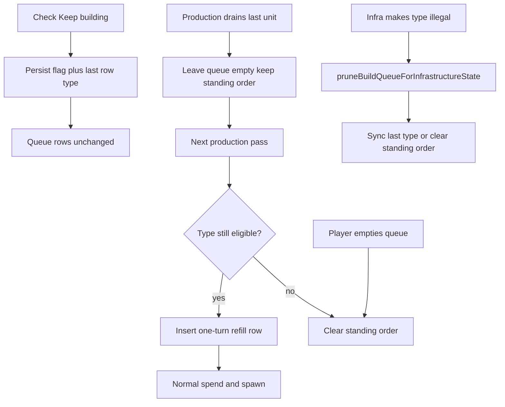

# Keep building checkbox — execution plan

This document defines a phased, reliability-first implementation plan for a per-hex **Keep building** checkbox on the res1 build popup. When enabled, a hex retains a standing unit-type order and, on the production turn after its queue empties, refills with enough of that type to use one turn of urban `$` capacity.

**Audience:** Coding agent or developer implementing the feature end-to-end.  
**Primary objective:** Maximum reliability, clarity, and independently verifiable increments with minimal regression risk.  
**Related work:** Multi-hex shared template selection is already landed (see `.spec/completed/multi-hex-build-queue-selection-execution-plan.md`). This plan extends that popup; it does not reopen template semantics except to broadcast the Keep-building flag across the selection.

**Do not** put this document’s internal section or phase labels into product code, comments, configuration, or other version-controlled artifacts. Game milestones, IPC names, and user-facing strings are fine.

---

## 1. Goal, scope, and done criteria

### 1.1 Goal

1. The build popup (single-hex and multi-hex) shows a **Keep building** checkbox at the bottom.
2. When checked, the hex (or each selected hex) keeps a standing order for the last valid queued unit type.
3. After the queue is exhausted, the **next** Ready production pass refills the queue with enough instances of that type for one turn of `$` capacity (`urbanHexCount`), then runs normal spend/spawn logic.
4. Checking the box only arms the standing order; it does **not** rewrite the current queue immediately.
5. Infrastructure/control changes that make queued types illegal continue to use `pruneBuildQueueForInfrastructureState`, extended so the Keep-building standing order stays consistent with the pruned queue.

### 1.2 Explicitly out of scope

1. AI / `set_build_queue` / LLM production-tool changes (human IPC only).
2. Same-turn refill or continue-spend on the turn that drains the last queued unit.
3. Using banked `stored_points` when computing refill count.
4. Changes to unit costs, prerequisites, deployment caps, or combat rules (except syncing Keep building after existing prune/clear paths).
5. Drag-reorder of queue rows; map chrome beyond existing build-entry selected style.
6. Changing multi-hex **template** row semantics beyond broadcasting the Keep-building flag to all selected hexes.

### 1.3 Definition of done

1. All locked behaviors in Section 2 are implemented and pass phase-level verification.
2. Single-hex build popup flows with Keep building off behave as today.
3. Existing prune callers (strategic air strike, tactical rubble) still prune illegal types; standing-order sync matches Section 2.4.
4. Tests cover happy paths and essential failure contracts only.
5. New/updated public backend methods include required logging and orienting comments.
6. Touched source files stay within project size guidance (desirable ~600 lines, hard 1000); extract helpers rather than grow mega-handlers.
7. No critical regressions on build-entry visibility gates, planning-only edits, production spend/caps, or multi-hex template apply.

---

## 2. Locked behavior contract (from owner)

### 2.1 Checkbox and arming

| Rule | Behavior |
|------|----------|
| Placement | Bottom of the build popup (single and multi). Label: **Keep building**. |
| Enable (interactive) | Allowed when the hex has at least one queue entry **or** an active standing order (`keepBuilding && keepBuildingUnitType`). Otherwise unchecked and **disabled**. |
| Check | Arms standing order only. Persist `keepBuilding=true` and `keepBuildingUnitType` = last queue row’s unit type. Current queue rows and counts are unchanged. |
| Uncheck | Clears standing order (`keepBuilding=false`, `keepBuildingUnitType=null`). |
| Last-type sync | While checked and the queue is non-empty, any change that alters the last row’s unit type (type edit, add row, template apply, prune) updates `keepBuildingUnitType` to the new last remaining row’s type. |
| Player empties queue | Removing the last entry (or replacing with an empty queue) clears the standing order; checkbox unchecked and disabled until the queue has entries again. |
| Multi-hex check/uncheck | Applies the same flag to **every** selected hex. Enabling sets each hex’s type from **that hex’s** last queue row. |

**Multi-hex display (locked):**

1. Checkbox is **checked** only when every selected hex has `keepBuilding === true`; otherwise **unchecked**.
2. Checkbox is **disabled** unless every selected hex can arm (each has `entries.length >= 1` or an existing standing order).
3. Checking sets Keep building true on all selected hexes (each with its own last-row type).
4. Unchecking clears the standing order on all selected hexes.

### 2.2 Refill sizing and timing

1. Refill count:

   ```text
   if urbanHexCount <= 0:
     count = 0   // no refill
   else:
     count = clamp(
       max(1, floor(urbanHexCount / UNIT_COST_BY_TYPE[keepBuildingUnitType])),
       BUILD_ENTRY_MIN_COUNT,
       BUILD_ENTRY_MAX_COUNT
     )
   ```

   (`BUILD_ENTRY_MIN_COUNT` = 1, `BUILD_ENTRY_MAX_COUNT` = 99.)

2. Uses **only** `urbanHexCount` (`$ / turn`). Do **not** include `stored_points` in the refill size.
3. Refill runs at the **start** of that hex’s processing inside `processProductionAfterControlResolution` on the **next** production pass after the queue became empty—not on the draining turn.
4. After refill inserts the row, normal spend / spawn / deployment-cap logic runs unchanged.
5. Examples:
   - Hex with `$1` / turn, last type infantry (cost 20) → refill **1** infantry.
   - Hex with `$100` / turn, last type armor (cost 40) → refill **2** armor.

### 2.3 Standing order across the empty gap

1. When production drains the queue to empty with Keep building on: leave the queue empty; **keep** `keepBuilding` and `keepBuildingUnitType` (confirm type from the last depleted row).
2. On the next production pass: if the standing order is still valid and the type is still eligible → write one refill row with the computed count, then run normal spend.
3. The UI may show the checkbox checked while `entries` are empty **only** when the standing order is still active.

### 2.4 Infrastructure / control vs Keep building

Reuse and **extend** `pruneBuildQueueForInfrastructureState` in `src/main/game-actions/airStrikeResolution.ts` (already called from strategic air-strike destruction and tactical ranged rubble). Prefer keeping a single authoritative prune entry point; relocate the function next to production/build-queue modules only if file size requires it, and update all imports.

| Situation | Behavior |
|-----------|----------|
| Infra makes some queued types illegal | Remove illegal rows (existing behavior). If Keep building is on and the queue is still non-empty → keep checked; set `keepBuildingUnitType` to the **new last remaining** row’s type. |
| Prune leaves an empty queue (`urbanHexCount > 0`) | Clear standing order; checkbox unchecked/disabled. |
| `urbanHexCount <= 0` | Existing `clearBuildQueueAndProgressForHex` (deletes progress row → standing order gone). |
| Control flip | Existing clear of queue + progress → standing order gone. |
| Standing order active, queue already empty, remembered type becomes illegal | Clear standing order immediately. |
| Refill turn, type ineligible | Clear standing order; leave queue empty (defense in depth). |

**Known gap to fix:** today’s prune returns immediately when `rows.length === 0`, so it never invalidates an empty-queue standing order. Extend prune so that when the queue is empty but a standing order exists, eligibility of `keepBuildingUnitType` is checked and the standing order is cleared if illegal (or if urban is gone).

### 2.5 Caps and AI

1. Deployment caps: refill still inserts the row; spend may stall as today. No special Keep-building retry loop.
2. AI tools: out of scope. No requirement to set or clear Keep building from LLM / `set_build_queue` paths. Human IPC, prune, and control clear remain authoritative for human play.

---

## 3. Technical baseline and change strategy

### 3.1 Current system (do not reinvent)

| Area | Location |
|------|----------|
| Build popup (single) | `src/renderer/gameplay/buildQueuePopup.ts` |
| Build popup (multi) | `src/renderer/gameplay/buildQueueMultiPopup.ts` |
| Multi helpers | `src/renderer/gameplay/buildQueueMultiSelect.ts` |
| Queue mutations | `src/main/game-actions/buildQueue.ts` |
| Production spend | `src/main/game-actions/controlAndProduction.ts` — `processProductionAfterControlResolution` |
| Pure production math | `src/shared/productionConfig.ts` — `applyProduction`, costs (no refill today) |
| Infra prune | `src/main/game-actions/airStrikeResolution.ts` — `pruneBuildQueueForInfrastructureState` |
| Tactical prune caller | `src/main/game-actions/tacticalRangedInfrastructureRubble.ts` |
| Progress / queue DB | `src/main/game-db/controlInfrastructure.ts` — `setBuildProgressPointsForHex`, `replaceBuildQueueForHex`, `clearBuildQueueAndProgressForHex` |
| Schema / version | `src/main/game-db/schema.ts` (`getFullDdl`), `src/main/gameDb.ts` (`EXPECTED_USER_VERSION`, currently 12) |
| Snapshot / IPC types | `src/shared/ipc/productionTypes.ts`, `src/shared/ipc/gameApiTypes.ts`, channels / preload / `main.ts` |
| Count bounds | `BUILD_ENTRY_MIN_COUNT` / `BUILD_ENTRY_MAX_COUNT` in `src/main/productionRules.ts` |
| Styles / shell | `static/index.html` — `#build-popup`, `#build-popup-body` |

### 3.2 Change strategy

1. Persist a per-hex standing order on `res1_build_progress` (flag + unit type).
2. Expose it on `HexBuildQueueSnapshot` and mutate via a small Keep-building IPC (single hex or batch of hex indexes).
3. Extend prune to sync or clear the standing order whenever infrastructure makes types illegal—including the empty-queue gap.
4. On the next production pass after drain, refill then spend; do not refill on the draining turn.
5. Add the checkbox to single- and multi-hex popup bottoms; multi broadcasts the flag per Section 2.1.
6. Land in independently verifiable phases below.

### 3.3 Suggested contracts (freeze early)

**DB (`res1_build_progress`)**

```sql
keep_building INTEGER NOT NULL DEFAULT 0
  CHECK (keep_building IN (0, 1)),
keep_building_unit_type TEXT
  CHECK (
    keep_building_unit_type IS NULL
    OR keep_building_unit_type IN ('infantry', 'armor', 'naval', 'air')
  )
```

Bump `EXPECTED_USER_VERSION` from 12 to 13 and update `getFullDdl()`. Wrong-version existing files recover via the project’s current validation/recovery path (acceptable).

**Snapshot fields**

```ts
keepBuilding: boolean;
keepBuildingUnitType: BuildUnitType | null;
```

**Refill helper** (shared, pure)

```ts
computeKeepBuildingRefillCount(unitType: BuildUnitType, urbanHexCount: number): number
// urbanHexCount <= 0 → 0 (no refill)
// else → max(1, floor(urban / cost)) clamped to BUILD_ENTRY_MIN_COUNT..BUILD_ENTRY_MAX_COUNT
```

**Mutation IPC** (name may vary; one API may accept `h3Indexes: string[]`)

```ts
setHexesKeepBuilding(payload: {
  h3Indexes: string[];
  keepBuilding: boolean;
}): Promise<{
  success: boolean;
  reason?: string;
  applied: string[];
  failed: Array<{ h3Index: string; reason: string }>;
  queues?: HexBuildQueueSnapshot[]; // optional; or re-fetch via getHexBuildQueue
}>;
```

Rules:

- Same planning / not-in-tactical-battle / controlled-by-requester validation as other build-queue mutations.
- `keepBuilding: true` requires each hex to have at least one queue entry (or already have a standing order being refreshed); set type from that hex’s last row.
- `keepBuilding: false` always clears flag + type for that hex.
- Best-effort across hexes (like template apply): failures on one hex do not roll back siblings.

**Progress upsert safety**

Any write that updates only `stored_points` must **not** reset `keep_building` / `keep_building_unit_type` to defaults. Prefer partial `UPDATE` / `ON CONFLICT DO UPDATE` that touches only the intended columns, plus dedicated setters for the standing order.

---

## 4. Reliability and coding standards (mandatory)

1. **Logging**
   - New/updated public backend methods log invocations at debug level (include hex count / keepBuilding, not huge payloads).
   - Caught exceptions log at error level.
   - Getter-style non-mutating methods log at trace level.
2. **Orienting comments**
   - Add correctly formatted orienting comments to all new/updated fields and non-overriding methods (all access levels), explaining why they exist and how to use them.
3. **Testing scope**
   - Happy paths and essential failure contracts only.
   - Do not test REST-style boilerplate, DTO getters, or pure IPC delegation wrappers.
4. **Readability**
   - Prefer composable helpers over large event-handler branches.
   - Keep refill math, standing-order sync, and checkbox UI in dedicated helpers/modules when popup or production files approach size limits.
5. **File and argument limits**
   - Desirable file size ~600 lines; hard limit 1000 — split before crossing the hard limit.
   - Desirable ≤6 named parameters; hard ≤10 — use parameter objects when needed.
6. **Reuse**
   - Reuse `validateBuildQueueMutationContext`, `getAvailableBuildUnitTypes`, `replaceBuildQueueForHex`, `pruneBuildQueueForInfrastructureState`, `UNIT_COST_BY_TYPE`, `BUILD_ENTRY_*_COUNT`, and existing build-popup mount patterns.
7. **No plan leakage**
   - Do not copy this document’s phase/section identifiers into code, comments, or config.

---

## 5. Phased execution plan

Each phase has a clear objective, tasks, verification, and exit criteria. Later phases depend only on completed earlier phases.

### Phase 0 — Contracts, types, and refill helper

**Objective:** Freeze shared contracts and pure refill math before persistence or engine behavior changes.

**Tasks:**

1. Confirm Section 2 with this document (no product behavior change required to exit beyond helper/types).
2. Add `computeKeepBuildingRefillCount` in `src/shared/productionConfig.ts` (re-export from `productionRules` if that is the existing pattern for shared production helpers).
3. Add TypeScript fields for `keepBuilding` / `keepBuildingUnitType` on snapshot/view types in `src/shared/ipc/productionTypes.ts` (and mirror view types in `buildQueue.ts` if separate). Wire stub defaults (`false` / `null`) only if needed to keep the tree compiling before Phase 1 persistence.

**Verification:**

- Unit tests for the helper (locked contract: if `urbanHexCount <= 0` return `0` meaning “no refill”; otherwise `max(1, floor(urban/cost))` clamped to 1–99):
  - urban 0 → 0
  - urban 1, infantry → 1
  - urban 100, armor → 2
  - urban 100, naval (100) → 1
  - very large urban → clamped to 99
- Typecheck/build still passes.
- Engine (Phase 3) must skip refill when the helper returns 0 or `urbanHexCount <= 0`.

**Exit criteria:**

- No unresolved contract ambiguity for later phases.
- Helper is the single source of truth for refill counts.

---

### Phase 1 — Schema, persistence, snapshot, and mutation API

**Objective:** Durable standing order + human mutation path, without engine refill yet.

**Tasks:**

1. Update `getFullDdl()` for `res1_build_progress` columns; bump `EXPECTED_USER_VERSION` to 13.
2. Add DB readers/writers for the standing order; ensure `setBuildProgressPointsForHex` does not wipe Keep-building columns.
3. Populate `keepBuilding` / `keepBuildingUnitType` in `getHexBuildQueue` / view builders.
4. Implement `setHexesKeepBuilding` (or equivalent) in `buildQueue.ts`, export through existing facades, wire IPC channel + `gameApi` + preload + `main.ts`.
5. When player mutations leave a hex with an empty queue (`removeHexBuildQueueEntry`, template apply that filters to empty, etc.), clear the standing order.
6. When Keep building is on and a mutation leaves a non-empty queue, sync `keepBuildingUnitType` to the last row’s type.
7. Debug/error logging and orienting comments on new public methods.

**Verification:**

- Backend tests:
  - Arm Keep building on a non-empty queue → snapshot shows flag + last type; queue rows unchanged.
  - Disarm → flag false, type null.
  - Arm on empty queue with no standing order → failure for that hex.
  - Remove last queue entry → standing order cleared.
  - Update last row type while armed → type follows.
  - `setBuildProgressPointsForHex` preserves Keep-building columns.
  - `clearBuildQueueAndProgressForHex` removes standing order (no orphan row).
- Existing build-queue CRUD / template tests remain green.

**Exit criteria:**

- Standing order readable/writable via snapshot and mutation API.
- No production refill behavior yet required.

---

### Phase 2 — Prune standing-order sync

**Objective:** Infrastructure/control-driven illegality keeps Keep building consistent.

**Tasks:**

1. Extend `pruneBuildQueueForInfrastructureState`:
   - Keep existing illegal-row filtering and urban≤0 clear.
   - After prune with remaining rows and Keep building on → set type to new last row.
   - After prune to empty → clear standing order.
   - When queue is already empty but standing order exists → if type illegal or urban≤0, clear standing order (remove empty-queue early-return that skips this).
2. Keep all existing callers (air strike, tactical rubble) on the same function.
3. Add/adjust tests near existing production / air-strike coverage.

**Verification:**

- Queue with infantry + air; destroy airport → air removed, infantry kept; if Keep building was on for air-as-last, type becomes infantry and flag stays on.
- Prune removes all rows → standing order cleared.
- Empty queue + standing order air + airport destroyed → standing order cleared.
- Urban wiped → progress/queue cleared (existing) and no standing order remains.
- Call sites still invoke prune after rubble/infra destruction.

**Exit criteria:**

- Standing order never points at an illegal type after prune.
- Empty-gap standing orders are invalidated when the remembered type becomes illegal.

---

### Phase 3 — Engine next-turn refill

**Objective:** Production refills on the turn after drain, then spends normally.

**Tasks:**

1. In `processProductionAfterControlResolution`, for each controlled hex:
   - Load queue + standing order + infra.
   - If queue empty and Keep building on with eligible type and `urbanHexCount > 0`: insert one refill row via `replaceBuildQueueForHex` using `computeKeepBuildingRefillCount`.
   - If standing order on but type ineligible: clear standing order; skip spend (empty queue).
   - If queue still empty (no standing order / cleared): keep today’s `continue` (no accrual).
   - Otherwise run existing spend/spawn/cap path unchanged.
2. On the draining turn: after spend leaves queue empty with Keep building on, persist empty queue + preserved standing order + leftover `stored_points`; **do not** refill in that same call.
3. Leave pure `applyProduction` unchanged (engine-only refill).
4. Debug log refill decisions (hex, type, count, skipped reason).

**Verification:**

- Armed queue of 1 cheap unit (or arranged counts): after one production pulse that empties the queue → entries empty, `keepBuilding` still true, no refill row yet; `stored_points` preserved as today.
- Second production pulse → refill with expected count, then spend as capacity allows.
- `$1` urban, infantry standing type → refill count 1.
- `$100` urban, armor standing type → refill count 2.
- Cap at head type: refill still inserts; spend stalls as today; standing order remains.
- Ineligible type at refill time → standing order cleared, queue stays empty.

**Exit criteria:**

- Next-turn refill contract holds without same-turn refill.
- Existing production/cap tests remain green; add the essential new cases above.

---

### Phase 4 — Single-hex popup UI

**Objective:** Keep building checkbox at the bottom of the single-hex build popup.

**Tasks:**

1. Render a checkbox row at the bottom of `#build-popup-body` content in the single-hex path (`buildQueuePopup.ts`).
2. Bind checked/disabled from snapshot per Section 2.1.
3. On change → call Keep-building IPC; refresh snapshot into the popup.
4. Ensure popup refresh after Ready / game-state updates so the empty-gap checked state and post-refill queue are visible if the popup stays open.
5. Minimal CSS in `static/index.html` consistent with existing popup controls (no card-heavy redesign).
6. Extract a small shared checkbox helper if multi phase would otherwise duplicate too much.

**Verification:**

- Non-empty queue: checkbox enabled; check arms without changing rows; uncheck clears.
- Empty queue without standing order: unchecked + disabled.
- After drain with Keep building on (engine Phase 3 done): open/refresh popup shows checked with empty queue until refill or invalidation.
- Planning-only: mutation blocked in tactical battle like other build edits.

**Exit criteria:**

- Single-hex UI matches Section 2.1–2.3 for human play.

---

### Phase 5 — Multi-hex popup UI

**Objective:** Same checkbox for multi-select; broadcasts flag to all selected hexes.

**Tasks:**

1. Add the checkbox to `buildQueueMultiPopup.ts` (bottom of multi body).
2. Checked iff all selected snapshots have `keepBuilding`; disabled unless every selected hex can arm.
3. On check/uncheck → `setHexesKeepBuilding` with all `selectedBuildHexH3s`; refresh multi view.
4. Do not alter template row apply semantics beyond standing-order sync already required in Phase 1 when templates rewrite queues.

**Verification:**

- Two hexes both with queues: check → both armed with each hex’s last type; uncheck → both cleared.
- Mixed Keep-building state → checkbox unchecked; checking sets both on.
- One selected hex empty without standing order → checkbox disabled.
- Single-hex mode (`length === 1`) still uses the Phase 4 control (or shared helper with identical rules).

**Exit criteria:**

- Multi-hex Keep building matches Section 2.1 multi rules without breaking template editing.

---

### Phase 6 — Hardening and regression

**Objective:** Production-quality polish and safety net.

**Tasks:**

1. Confirm logging, orienting comments, and file/argument limits on all touched code.
2. Split modules if any file approaches the hard line limit.
3. Run / extend regression coverage:
   - Build-queue CRUD + template apply
   - Production spend + caps
   - Air-strike / tactical prune callers
   - Keep-building arm/disarm, prune sync, next-turn refill
4. Manual smoke (planning):
   - Single hex Keep building through drain → next Ready refill.
   - Multi-hex Keep building on/off.
   - Strike airport while Keep building air → prune + standing-order update/clear as applicable.

**Regression checklist (required)**

- Single-hex build popup add/update/remove/count unchanged when Keep building is off.
- Multi-hex template seed/join/edit unchanged aside from standing-order sync rules.
- Unit Ctrl+multi-select and stack callout behavior unchanged.
- Build-entry visibility gates unchanged.
- Planning-only / tactical-battle-blocked mutations unchanged.
- AI production tools untouched.
- Deployment caps and stored-points accrual behavior unchanged except for intentional empty-queue skip vs refill-then-spend.

**Exit criteria:**

- Definition of done (Section 1.3) satisfied.
- Manual + regression checklists complete.

---

## 6. Interaction flow (reference)



---

## 7. Contingencies

1. **`buildQueuePopup.ts` / `controlAndProduction.ts` / `airStrikeResolution.ts` near the hard line limit:** Extract Keep-building UI helper, standing-order DB helpers, and/or move prune next to production modules before adding more branches.
2. **Progress row missing when arming:** Upsert a progress row (or ensure columns) without clobbering `stored_points`.
3. **Open popup during empty gap:** Snapshot must return `keepBuilding: true` with `entries: []` so the UI stays checked until refill or invalidation.
4. **AI `set_build_queue`:** Out of scope; if AI replaces a queue while a standing order exists, no compatibility guarantee—human play path is authoritative.
5. **Helper urban 0:** `computeKeepBuildingRefillCount` returns 0 when `urbanHexCount <= 0`; engine skips refill on 0. Prune/clear already handles wiped urban.

---

## 8. Success summary

When complete, a player can enable Keep building on one or many selected production hexes; after a queue finishes, the next production turn refills a one-turn batch of the last valid unit type; illegal types are pruned with the standing order kept consistent; and existing single-hex building, multi-hex templates, caps, and AI tools remain behaviorally intact for their current contracts.
