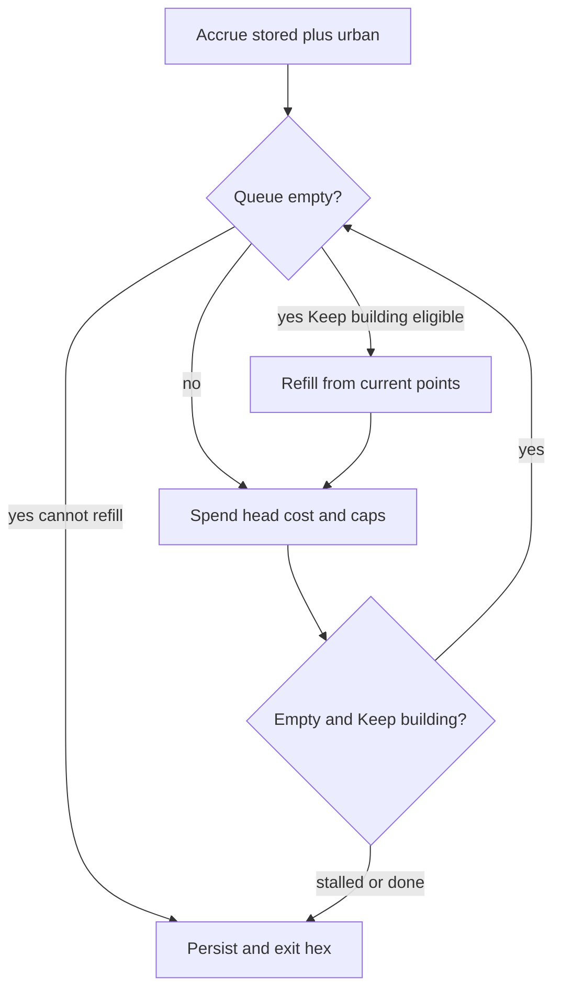

# Keep building same-turn refill — execution plan

This document updates Keep building so refill runs **in the same production pulse** after the last queued unit is deployed, looping refill+spend on leftover `$` until the pulse stalls. It supersedes **timing and refill sizing only** from `.spec/completed/keep-building-checkbox-execution-plan.md`. Checkbox UI, persistence, prune/standing-order sync, IPC, and multi-hex broadcast from that plan remain in force unless contradicted here.

**Audience:** Coding agent or developer implementing the change end-to-end.  
**Primary objective:** Maximum reliability, clarity, and independently verifiable increments.  

**Do not** put this document’s internal section or phase labels into product code, comments, configuration, or other version-controlled artifacts.

---

## 1. Goal, scope, and done criteria

### 1.1 Goal

1. When Keep building is on and the last queued unit is deployed, refill **immediately in that same production pulse** and continue spending leftover `$`.
2. Loop refill → spend until `$` cannot afford another unit of the standing type or a deployment cap blocks the head.
3. After a pulse where Keep building remains on and urban production still exists, the following planning phase should normally show **at least one enqueued unit** (not an empty queue waiting for the next Ready).
4. Owner example: hex with `$40` / turn, queue starts with **1 infantry** (cost 20), Keep building on → that pulse deploys **2 infantry**, then leaves **1 infantry** queued for planning when `$` is exhausted.

### 1.2 Explicitly out of scope

1. Checkbox UI / multi-hex broadcast / schema / IPC changes (except comments/tests tied to refill).
2. AI / `set_build_queue`.
3. Changes to unit costs, prerequisites, deployment caps, or prune eligibility rules.
4. Same-turn continue-spend for finite queues without Keep building (those still drain and stop).

### 1.3 Definition of done

1. Locked behaviors in Section 2 are implemented and phase-verified.
2. Next-turn-only refill path is removed; tests assert same-turn deployment and post-pulse queued residue.
3. Logging, orienting comments, file/argument size guidance, and no plan-ID leakage.
4. Existing Keep-building arm/disarm/prune contracts remain green.

---

## 2. Locked behavior contract

| Rule | Behavior |
|------|----------|
| Timing | Refill immediately when the working queue becomes empty during the pulse (not deferred to the next Ready). |
| Loop | Refill → spend → if empty again and Keep building still valid → refill again, until stall. |
| Stall | Stop when `points < unitCost`, deployment cap blocks the head type, `urbanHexCount <= 0`, Keep building is off, or type is ineligible (clear standing order when ineligible). |
| Refill size | `computeKeepBuildingRefillCount(unitType, availablePoints)` after the engine confirms `urbanHexCount > 0`. Formula: `clamp(max(1, floor(availablePoints / cost)), 1, 99)`. **`availablePoints === 0` → count 1** (enqueue immediately for next planning). |
| Accrual | Once per hex per pulse: `points = stored + urban`, then enter the loop. |
| Empty at pulse start | Same loop: after accrual, empty + Keep building → refill from `points`, then spend. |
| Planning visibility | After Ready, with Keep building still on and urban > 0, snapshot should show a non-empty queue in the common case (typically count 1 when `$` was fully spent). |
| Caps | Refill may still insert; spend stalls as today; do not spin when the queue is non-empty and cap blocks. |
| Safety | Hard iteration cap per hex (e.g. `10_000`) with error log + break if exceeded (bug guard only). |

### 2.1 Worked example (required test)

`urbanHexCount = 40`, `stored = 0`, Keep building infantry, queue = `[infantry×1]`:

1. Accrue → `points = 40`.
2. Spend 1 infantry → `points = 20`, queue empty → **1 deployed**.
3. Refill `max(1, floor(20/20)) = 1`.
4. Spend 1 infantry → `points = 0`, queue empty → **2 deployed** total.
5. Refill `max(1, floor(0/20)) = 1`; cannot spend → persist `[infantry×1]`, `stored = 0`.
6. Next planning phase: **1 infantry** queued, Keep building checked.

---

## 3. Technical baseline and change strategy

### 3.1 Current system (do not reinvent)

| Area | Location |
|------|----------|
| Production pulse | `src/main/game-actions/controlAndProduction.ts` — `processProductionAfterControlResolution` (today: pre-spend empty refill using urban, then one spend loop; no mid-drain refill) |
| Refill helper | `src/shared/productionConfig.ts` — `computeKeepBuildingRefillCount` (today: urban-based; `urban <= 0` → 0) |
| Re-export | `src/main/productionRules.ts` |
| Helper tests | `src/main/productionRules.test.ts` |
| Integration tests | `src/main/gameActionsProduction.test.ts` — `testKeepBuildingNextTurnRefill` must be replaced |
| Standing order / prune / UI | Unchanged from completed Keep-building plan |

### 3.2 Change strategy

1. Change helper to points-based sizing (`availablePoints`; `0` → 1).
2. Replace hex production body with: accrue once → unified loop (refill if empty+Keep building, else spend head) until stall → persist queue + points + confirm standing type from last depleted row when relevant.
3. Engine skips hex when `urbanHexCount <= 0` (do not call helper for refill).
4. Replace next-turn tests with same-turn owner example, empty-start, cap stall, and keep prune tests.

### 3.3 Suggested loop sketch (illustrative)

```text
points = stored + urban
queueWorking = load queue
iterations = 0
loop:
  if iterations++ > 10000: log error; break
  if queueWorking empty:
    if not keepBuilding or type missing: break
    if type ineligible: clear standing; break
    count = computeKeepBuildingRefillCount(type, points)  // urban already > 0
    insert refill row; continue
  // spend head (existing cost/cap math)
  if cap blocks or points < cost or built == 0: break
  if row depleted: record lastDepletedType; splice
  // if now empty, loop continues and refills
persist queueWorking, points; sync standing type if needed; spawn
```

---

## 4. Reliability and coding standards (mandatory)

1. Debug log on public method entry and on each refill (hex, type, count, points); error on catch / iteration guard; trace on pure getters if touched.
2. Orienting comments on new/updated fields and non-overriding methods.
3. Tests: happy paths and essential failures only.
4. File size ~600 desirable / 1000 hard; extract a helper if `controlAndProduction.ts` grows too large.
5. Reuse `UNIT_COST_BY_TYPE`, `MAX_UNITS_PER_TYPE`, `getAvailableBuildUnitTypes`, Keep-building get/set APIs.
6. No plan phase/section IDs in product artifacts.

---

## 5. Phased execution plan

### Phase 0 — Points-based refill helper

**Objective:** Single source of truth for refill counts under the new contract.

**Tasks:**

1. Update `computeKeepBuildingRefillCount(unitType, availablePoints)` in `productionConfig.ts`:
   - `availablePoints` truncated; cost from `UNIT_COST_BY_TYPE`.
   - Return `clamp(max(1, floor(availablePoints / cost)), 1, 99)` (including when points are 0 → 1).
   - Do **not** return 0 for non-positive points (engine owns urban≤0 skip).
2. Update re-export signature/docs in `productionRules.ts`.
3. Update `productionRules.test.ts` expectations.

**Verification:**

- points 0, infantry → 1  
- points 20, infantry → 1  
- points 100, armor → 2  
- points 100, naval → 1  
- very large points → 99  

**Exit criteria:** Helper matches Section 2; typecheck passes.

---

### Phase 1 — Engine same-turn refill + spend loop

**Objective:** Unified loop in `processProductionAfterControlResolution`.

**Tasks:**

1. Remove next-turn-only “refill empty queue before spend, then single while” structure.
2. Accrue points once; run refill+spend loop per Section 2 / sketch in 3.3.
3. Iteration guard with error log.
4. On ineligible standing type when attempting refill: clear Keep building and stop.
5. Persist queue, leftover points, spawn; confirm standing type from last depleted row when Keep building remains on.
6. Debug logs for refill decisions.

**Verification:**

- Owner `$40` / 1 infantry / Keep building → 2 infantry units spawned that pulse; queue ends with 1 infantry; Keep building still on; `storedPoints === 0`.
- Empty queue at start + Keep building + `$40` infantry → deploys 2, residue 1.
- Without Keep building, finite queue still stops when empty (no auto-refill).

**Exit criteria:** Same-turn contract holds; no deferred empty-gap refill required for affordable `$`.

---

### Phase 2 — Cap stall and ineligible under new loop

**Objective:** Caps and eligibility behave safely with looping refill.

**Tasks:**

1. Ensure cap on head type breaks out with non-empty refilled queue (no busy loop).
2. Confirm prune/ineligible clear still works (existing prune tests; add pulse-time ineligible clear if not covered).

**Verification:**

- At armor cap: empty + Keep building armor + high `$` → refill inserts (e.g. 2), spend stalls, queue retains refill count, standing order on.
- Ineligible standing type at refill attempt → standing order cleared, queue empty.

**Exit criteria:** No infinite loops; cap/ineligible contracts match Section 2.

---

### Phase 3 — Replace obsolete tests and harden

**Objective:** Test suite matches new contract; regression safety.

**Tasks:**

1. Replace `testKeepBuildingNextTurnRefill` with same-turn tests (rename appropriately; no next-turn delay assertions).
2. Keep mutation + prune tests.
3. Confirm Ready still refreshes build popup (no code change expected).
4. Orienting comments / logging / file size check.

**Regression checklist:**

- Keep-building arm/disarm / remove-last-clears / stored points preserve.
- Prune retarget / empty-gap illegal type clear.
- Finite queues without Keep building unchanged.
- Deployment caps without Keep building unchanged.
- AI tools untouched.

**Exit criteria:** Definition of done (Section 1.3) satisfied.

---

## 6. Interaction flow (reference)



---

## 7. Contingencies

1. **`controlAndProduction.ts` near hard line limit:** Extract Keep-building production loop helper before adding more branches.
2. **Iteration guard fires:** Indicates a logic bug; fix the loop condition (never treat “cap + non-empty queue” as refill opportunity).
3. **Empty + checked UI:** Uncommon after this change (usually residue count 1); prune/control-clear paths still valid.

---

## 8. Success summary

When complete, Keep building spends leftover `$` in the same Ready pulse after the last unit deploys, loops until `$` or cap stalls, leaves a visible queued unit for the next planning phase, and matches the `$40` / 1-infantry → 2-deployed example—without regressing checkbox, prune, or IPC contracts.
