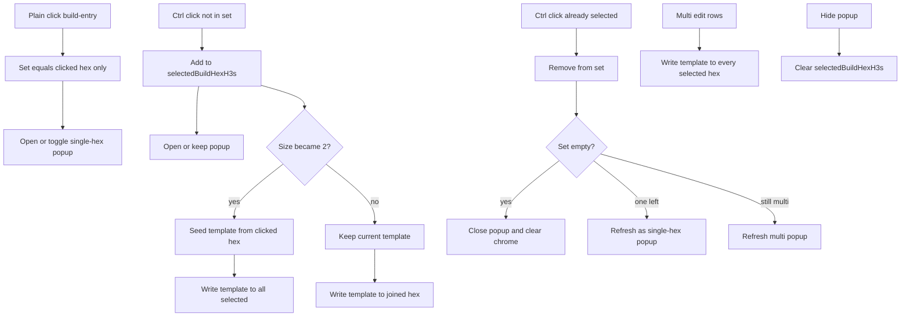

# Multi-hex build queue selection (shared template) — execution plan

This document defines a phased, reliability-first implementation plan for Ctrl+multi-select of res1 build-entry hexes and a shared build-queue **template** that clones (with per-hex eligibility filtering) across the selected set.

**Audience:** Coding agent or developer implementing the feature end-to-end.  
**Primary objective:** Maximum reliability, clarity, and independently verifiable increments with minimal regression risk.  
**Pattern:** Option 1 — shared template queue (what you see is what every eligible selected hex gets).

**Do not** put this document’s internal section or phase labels into product code, comments, configuration, or other version-controlled artifacts. Game milestones, IPC names, and user-facing strings are fine.

---

## 1. Goal, scope, and done criteria

### 1.1 Goal

1. Players can multi-select 1+ human-controlled res1 hexes that show build-entry buttons via **Ctrl+left-click** on those buttons.
2. The build popup opens/stays open for a non-empty set; with 2+ hexes, the description shows a hex-code summary such as `(AA) and (BB)` or `(AA), (BB), and (CC)`.
3. A shared ordered template (`unitType` + `count` rows) is the edit surface for multi-select; joins and edits write that template to selected hexes, silently skipping entries a hex cannot build.
4. Type rows available on only some hexes remain selectable and show an **N of M hexes** annotation (no skip toasts).
5. Selected build-entry buttons use a selected visual style; closing the popup (or emptying the set) clears selection chrome.

### 1.2 Explicitly out of scope

1. AI / `set_build_queue` / LLM production-tool changes.
2. Drag-reorder of queue rows.
3. Merged totals with capacity-weighted or random count distribution across hexes.
4. Hex outline / map highlight beyond build-entry button selected style.
5. Changes to production costs, prerequisites, deployment caps, or combat rules.
6. Changes to unit multi-select, stack callout, or empty-hex unit deselection behavior.

### 1.3 Definition of done

1. All locked behaviors in Section 2 are implemented and pass phase-level verification.
2. Single-hex build popup flows (never multi-selected) behave as today.
3. Unit Ctrl+multi-select and stack callout behavior unchanged.
4. Tests cover happy paths and essential failure contracts only.
5. New/updated public backend methods include required logging and orienting comments.
6. Touched source files stay within project size guidance (desirable ~600 lines, hard 1000); extract helpers rather than grow mega-handlers.
7. No critical regressions on build-entry visibility gates, planning-only edits, or overlay refresh.

---

## 2. Locked behavior contract (from owner)

### 2.1 Selection and clicks (build-entry buttons only)

Membership changes **only** via build-entry buttons (not empty-hex map clicks, not sidebar).

| Input | Behavior |
|-------|----------|
| **Plain click** build-entry | Replace the build-hex selection set with **that hex only**. Open or toggle the popup for that hex as today’s single-hex behavior (re-click same hex with popup open closes it). |
| **Ctrl+click** build-entry not in set | Add hex to the set; mark button selected; **open/keep popup open** whenever the set is non-empty (popup may have been closed). |
| **Ctrl+click** build-entry already in set | Remove hex from the set; update button chrome. |
| **Ctrl+click** removes last hex (set empty) | **Close popup** and clear selection chrome. |
| **Ctrl+click** leaves exactly one hex | Keep popup open; switch presentation to **normal single-hex mode** for the remaining hex. |
| **Close popup** (×, Escape path that hides build popup, zoom/res4/other existing hide paths) | Clear the entire build-hex selection set and selected button styles. |

Cold start: Ctrl+click with popup closed begins a set of one (button selected + popup opens). Growing beyond one uses further Ctrl+clicks.

Any human-controlled res1 hex that already shows a build-entry button may join, even when available unit types differ across the set.

### 2.2 Template seed, join sync, and edits

1. **Template** = ordered list of `{ unitType, count }` shown as the popup’s Build Queue rows while multi-selected (`selectedBuildHexH3s.length >= 2`).
2. **Seed:** When selection size first becomes ≥2, seed the template from the **hex just Ctrl+clicked**, then write that template to **all** selected hexes (eligibility-filtered per hex). Later joins do **not** re-seed; they use the current popup template.
3. **Join sync:** When a hex is **added**, immediately overwrite that hex’s queue with the current template (eligibility-filtered). Removing a hex does not rewrite anyone else’s queue.
4. **Edits while multi-selected:** add / type / count / remove mutate the shared template, then write the template to **every** selected hex (eligibility-filtered). Single-hex mode (`length === 1`) keeps today’s per-`entryId` IPC path (`addHexBuildQueueEntry` / `updateHexBuildQueueEntry` / `removeHexBuildQueueEntry`).
5. **Stored production points** are not cleared by template replace (preserve existing `replaceBuildQueueForHex` semantics).
6. Seed-at-2+ then write-all **intentionally overwrites** the first hex’s prior queue with the newly clicked hex’s queue. That is required by join-sync + last-clicked seed.

### 2.3 Types, skips, and popup copy

1. Type dropdown shows the **union** of types any selected hex can build.
2. A type available on only some hexes remains **selectable**; the row shows an **“N of M hexes”** (or equivalent clear) annotation. That label is the only UI signal for partial eligibility — **no toast** for partial eligibility or silent skips.
3. On every write, **silently skip** template entries a given hex cannot build; keep eligible entries in relative order. No toast for skips.
4. Multi description line replaces the single-hex naming blurb with a hex-code list: `(AA) and (BB)`, `(AA), (BB), and (CC)`, etc., using `getStrategicRes1HexCode` (same codes players already see).
5. Production line = **sum** of selected hexes’ urban production rates.
6. Queue summary = template total cost (sum of costs for template rows as displayed) plus a turn **range** (min–max ETA across selected hexes), using existing helpers such as `sumQueuedProductionCost` and `estimateTurnsToCompleteQueuedProduction` on each hex’s **filtered** applied queue and that hex’s rate/stored points.

### 2.4 Batch API failure mode

`applyBuildQueueTemplateToHexes` is **best-effort**: apply to every hex that passes validation; return per-hex applied / skipped / failed details. Normal play is planning-phase with stable control; still implement best-effort for clear errors (unknown hex, not controlled, not planning, tactical battle active) without rolling back successful siblings. Do not auto-remove failed hexes from the renderer selection.

### 2.5 Map chrome

Selected style on `.build-entry-btn` only (new CSS class aligned with existing selected / unit-select visual language). No hex outline work in this plan.

---

## 3. Technical baseline and change strategy

### 3.1 Current system (do not reinvent)

| Area | Location |
|------|----------|
| Build popup | `src/renderer/gameplay/buildQueuePopup.ts` — `createBuildQueuePopupController`, description / Production / Queue lines, row editors |
| Build-entry hit / click | `src/renderer/map/drawInteraction.ts` (`tryHandleBuildEntryAtClientXY`); `src/renderer/map/initCore.ts` layer handlers; `src/renderer/renderer.ts` (`syncBuildEntryButton`) |
| Renderer state | `src/renderer/core/state.ts` — today: `buildPopupHexH3`, `selectedHexIndex`, `ctrlKeyActive` |
| Single-hex mutations | `src/main/game-actions/buildQueue.ts` — `getHexBuildQueueImpl`, `addHexBuildQueueEntryImpl`, `updateHexBuildQueueEntryImpl`, `removeHexBuildQueueEntryImpl` |
| Persistence | `replaceBuildQueueForHex` / `listBuildQueueRowsForHex` in `src/main/game-db/controlInfrastructure.ts` (via `gameDb`) |
| Eligibility | `getAvailableBuildUnitTypes` / prerequisites in `src/main/productionRules.ts` |
| IPC | `src/shared/ipc/gameApiTypes.ts`, `src/shared/ipc/channels.ts`, `src/main/main.ts`, preload bridge |
| Styles | `static/index.html` — `.build-entry-btn` |
| Ctrl pattern reference | Unit multi-select: `mapClickSelectionPolicy.ts`, `S.ctrlKeyActive` |

### 3.2 Change strategy

1. Add renderer **build-hex selection set** (`selectedBuildHexH3s: string[]`) plus in-popup **template** state for multi mode.
2. Add one authoritative backend batch API that filters + replaces queues; keep single-hex APIs for `length === 1`.
3. Centralize click policy in a small helper (plain replace vs Ctrl toggle vs empty/close) so `drawInteraction` / `initCore` stay thin.
4. Extract pure formatters (hex-code list, N of M, per-hex filter) into a dedicated module if `buildQueuePopup.ts` would otherwise exceed size limits.
5. Land in independently verifiable phases below.

### 3.3 Suggested contracts (freeze in first implementation increment)

**Renderer state**

- `selectedBuildHexH3s: string[]` — order = selection order (first selected … last added). Last Ctrl+added hex is the seed source when size first hits ≥2.
- `buildPopupHexH3: string | null` — anchor hex for popup positioning (typically last interacted build hex); not a substitute for the full set.
- In-controller (or module) template: `Array<{ unitType: BuildUnitType; count: number }>` while multi-selected.

**IPC**

```ts
applyBuildQueueTemplateToHexes(payload: {
  h3Indexes: string[];
  entries: Array<{ unitType: BuildUnitType; count: number }>;
}): Promise<{
  success: boolean; // true if every hex either applied or only had type-skips; false if any hex failed validation/exception
  applied: string[];
  skipped: Array<{ h3Index: string; unitType: BuildUnitType; reason: string }>;
  failed: Array<{ h3Index: string; reason: string }>;
}>;
```

Per hex: validate planning / not in tactical battle / controlled by requester; clamp each count to existing min/max (1–99); drop entries whose type is not in that hex’s `availableUnitTypes` into `skipped`; `replaceBuildQueueForHex` with remaining entries in template order; push hex into `applied` when replace runs (including empty remaining → clear queue).

**Hex-code list formatting**

- 1 code: `(AA)` (multi description unused in single mode).
- 2: `(AA) and (BB)`.
- 3+: `(AA), (BB), and (CC)` (Oxford comma before `and`).

---

## 4. Reliability and coding standards (mandatory)

1. **Logging**
   - New/updated public backend methods log invocations at debug level (include hex count / entry count, not huge payloads).
   - Caught exceptions log at error level.
   - Getter-style non-mutating methods log at trace level.
2. **Orienting comments**
   - Add correctly formatted orienting comments to all new/updated fields and non-overriding methods (all access levels), explaining why they exist and how to use them.
3. **Testing scope**
   - Happy paths and essential failure contracts only.
   - Do not test REST-style boilerplate, DTO getters, or pure IPC delegation wrappers.
4. **Readability**
   - Prefer composable helpers over large event-handler branches.
   - Keep selection policy, template filtering, and batch apply logic in dedicated functions/modules.
5. **File and argument limits**
   - Desirable file size ~600 lines; hard limit 1000 — split before crossing the hard limit.
   - Desirable ≤6 named parameters; hard ≤10 — use parameter objects when needed.
6. **Reuse**
   - Reuse `validateBuildQueueMutationContext` (or extract shared validation), `getAvailableBuildUnitTypes`, `replaceBuildQueueForHex`, production ETA helpers, and existing toast infrastructure only where toasts are still appropriate (mutation hard failures), not for silent type skips.
7. **No plan leakage**
   - Do not copy this document’s phase/section identifiers into code, comments, or config.

---

## 5. Phased execution plan

Each phase has a clear objective, tasks, verification, and exit criteria. Later phases depend only on completed earlier phases.

### Phase 0 — Contracts and interaction freeze

**Objective:** Freeze data and interaction contracts before behavior changes land.

**Tasks:**

1. Confirm Section 2 click table and template/seed/join rules with the implementing agent’s reading of this doc (no product code required).
2. Add shared TypeScript types for the batch payload/response in `src/shared/ipc` (or adjacent production types module) **without** wiring behavior yet, if that helps typecheck; otherwise document types in code comments in the next phase’s PR-sized change.
3. Name the renderer state field `selectedBuildHexH3s` and document that plain click always replaces the set with one hex.

**Verification:**

- Typecheck/build still passes if types were added with no callers.
- No gameplay behavior change required to exit.

**Exit criteria:**

- No unresolved contract ambiguity remains for later phases.

---

### Phase 1 — Backend batch apply API

**Objective:** Authoritative, best-effort template application with eligibility filtering.

**Tasks:**

1. Implement `applyBuildQueueTemplateToHexes` in `src/main/game-actions/buildQueue.ts` (export through `gameActionsCore` / existing facade pattern).
2. Wire IPC channel + `gameApi` method + `main.ts` handler (requesting player = human, same as other build-queue APIs).
3. For each hex index (stable input order):
   - Validate mutation context (planning, not tactical battle, controlled by requester).
   - On validation failure → push `failed`, continue.
   - Filter entries: invalid counts fail that hex (or clamp — **prefer clamp to 1–99** to match single-hex input sanitization); unavailable types → `skipped` with reason; remainder → `replaceBuildQueueForHex`.
   - On success → push `applied`.
4. Set top-level `success` false if `failed.length > 0`; type-only skips do not fail the call.
5. Add debug/error logging and orienting comments on the new public method.

**Verification:**

- Unit tests (happy paths + essential failures):
  - All hexes eligible → identical queues matching template.
  - Template includes naval; inland hex skips naval, keeps infantry/armor; coastal hex gets full template; `skipped` populated; no exception.
  - One unknown / not-controlled hex → that hex in `failed`; others still applied (best-effort).
  - Empty `h3Indexes` or empty handled safely (define: empty indexes → `success: false` with reason, or no-op success with nothing applied — pick **empty indexes → success false, reason required**).
  - Counts outside 1–99 clamped.
- Existing single-hex build-queue tests remain green; AI production tools untouched.

**Exit criteria:**

- Batch API callable from main/tests with contracts above.
- No renderer multi-select yet required.

---

### Phase 2 — Selection, join sync, and button chrome

**Objective:** Ctrl/plain click policy, selection state, join/seed writes, selected button style, popup open rules.

**Tasks:**

1. Add `selectedBuildHexH3s` to `src/renderer/core/state.ts` with an orienting comment.
2. Implement a small selection policy helper (new file under `src/renderer/gameplay/` or `src/renderer/map/`), e.g. functions for:
   - plain-click → set `[h3]`, open/toggle single popup;
   - Ctrl+click → toggle membership; on add run seed/join write; on remove handle empty / single / still-multi;
   - clear selection + chrome on popup hide.
3. Update `tryHandleBuildEntryAtClientXY` and the build-entry layer click path in `initCore` to pass `ctrlKey` / `S.ctrlKeyActive` into that policy (mirror unit-select pattern).
4. On Ctrl+add:
   - If size becomes 2: load template from clicked hex’s current queue (`getHexBuildQueue`), then `applyBuildQueueTemplateToHexes` for **all** selected indexes.
   - If size becomes >2: apply **current** template to the **joined** hex only (still call batch API with one index or full set with same template — either is fine if result matches join-sync; prefer writing only the joined hex for less churn).
5. On Ctrl+remove last: `hideBuildPopup` (which clears selection per Section 2.1).
6. On Ctrl+remove to one: refresh popup in single-hex mode for the remaining hex.
7. CSS: `.build-entry-btn.selected` (name may vary) in `static/index.html`; `syncBuildEntryButton` applies/removes class from `selectedBuildHexH3s`.
8. Ensure every `hideBuildPopup` path clears `selectedBuildHexH3s` and refreshes button chrome.
9. Multi description: at least hex-code list when `length >= 2` (full Production/Queue polish may wait for next phase).

**Verification:**

- Manual or automated renderer-facing checks where practical:
  - Plain click A → set `{A}`, popup for A.
  - Ctrl+click B → set `{A,B}`, template from B, both queues match B’s prior queue (filtered); buttons selected; description lists both codes.
  - Ctrl+click C → C overwritten with current template; A/B unchanged unless template edited.
  - Ctrl+click B again → B removed; if one left, single-hex UI; if none, popup closed and chrome clear.
  - Plain click D while multi → set `{D}` only.
  - Close × → selection empty, no selected buttons.
  - Cold Ctrl+click with popup closed → opens popup and selects that hex.
- Build-entry visibility gates unchanged (zoom, explored, human urban).

**Exit criteria:**

- Selection and join-sync behave per Section 2.1–2.2.
- Single-hex plain click toggle-close still works when set size is one.

---

### Phase 3 — Multi popup presentation

**Objective:** Full multi-hex popup copy and type union with N-of-M annotations.

**Tasks:**

1. When `selectedBuildHexH3s.length >= 2`, render:
   - Description = formatted hex-code list (Section 3.3).
   - Production = sum of urban rates (fetch via existing `getHexBuildQueue` snapshots or a thin aggregate helper — prefer reusing get-per-hex rather than a new backend API unless performance requires it).
   - Queue = template cost + min–max turns across selected hexes (compute filtered queue per hex for ETA).
2. Build type `<select>` options from **union** of `availableUnitTypes`.
3. For each template row, show **N of M hexes** where N = count of selected hexes that can build that `unitType`.
4. Do **not** toast on skips or partial eligibility.
5. Keep single-hex naming line / production / queue behavior when `length === 1`.

**Verification:**

- Two hexes, one without seaport: naval selectable; row shows `1 of 2 hexes` (or equivalent); after write, inland hex has no naval row; coastal has naval; no skip toast.
- Production sum matches sum of individual popups.
- Turn range widens when urban rates differ.

**Exit criteria:**

- Multi presentation matches Section 2.3.
- No toasts for silent skips.

---

### Phase 4 — Multi edits through the template

**Objective:** All multi-select queue edits go through template mutate → batch apply.

**Tasks:**

1. While `selectedBuildHexH3s.length >= 2`:
   - **Add row:** append default type (prefer first type in union, or first type available on all hexes if union default would be confusing — **default to first union type in stable unit-type order**: infantry, armor, naval, air among those present in the union) with count 1; write all.
   - **Change type / count:** update template row; write all.
   - **Remove row:** remove from template; write all.
2. Do not call per-`entryId` update/remove APIs in multi mode (IDs differ per hex after replace).
3. After batch apply, refresh popup from template + fresh snapshots for Production/ETA/N-of-M.
4. Hard failures (`failed.length > 0`): show existing map toast with a short reason; do not toast for `skipped`-only results.
5. Keep `length === 1` on existing add/update/remove IPC.

**Verification:**

- Change count on multi → every eligible hex shows the new count for that type row.
- Remove row → removed from all eligible hexes.
- Add row → appended on all eligible hexes.
- Single-hex editing still uses entry ids and does not call batch API.

**Exit criteria:**

- Section 2.2 edit rules satisfied.
- Silent skips still produce no toast.

---

### Phase 5 — Hardening and regression pass

**Objective:** Close edge paths, enforce standards, confirm no regressions.

**Tasks:**

1. Audit all `hideBuildPopup` call sites (renderer zoom, res4, hover-order, ready flow, etc.) — each clears build-hex selection chrome.
2. Confirm hover-order planning and res4 view still block / hide build popup as today.
3. Refresh game state / production overlays after successful batch writes (reuse `refreshGameStateAfterBuildQueueChange`).
4. File-size check on touched modules; extract helpers if over limits.
5. Orienting comments and logging audit on new/updated public backend surfaces and new renderer exports.
6. Run unit tests + manual checklist below.

**Manual checklist**

- [ ] Single hex: open, add, change type, change count, remove, re-click close — unchanged feel.
- [ ] Ctrl+click second/third hex: description list, selected buttons, queues synced from seed/join rules.
- [ ] Plain click while multi: collapses to that hex only.
- [ ] Ctrl+remove until one: single-hex UI; Ctrl+remove last: popup closes, no selected buttons.
- [ ] Close × / Escape-hide: selection cleared.
- [ ] Cold Ctrl+click with popup closed: opens and selects.
- [ ] Naval on mixed coastal/inland set: N of M label; silent skip; no toast.
- [ ] Unit Ctrl+multi-select and stack callout still work.
- [ ] Zoom out / res4 / tactical battle: build editing still gated as before.

**Regression checklist (required)**

- Single-hex build popup add/update/remove/count unchanged when never multi-selecting.
- Unit Ctrl+multi-select and stack callout behavior unchanged.
- Build-entry visibility gates (zoom, explored, human urban) unchanged.
- Planning-only / tactical-battle-blocked mutations unchanged.
- AI production tools untouched.

**Exit criteria:**

- Definition of done (Section 1.3) satisfied.
- Manual + regression checklists complete.

---

## 6. Interaction flow (reference)



---

## 7. Contingencies

1. **`buildQueuePopup.ts` approaches the hard line limit:** Extract selection policy, hex-list formatting, N-of-M / union helpers, and/or multi render section into `buildQueueMultiSelect.ts` (or similar) before adding more branches.
2. **Fetching N snapshots for Production/ETA is slow:** Add a read-only aggregate IPC later; do not block Phase 3 on it if N is small (typical multi-select is a handful of hexes).
3. **Ambiguity between layer click and canvas hit-test:** Keep both paths calling the same selection policy helper so Ctrl/plain behavior cannot diverge.
4. **If a batch returns `failed` mid-edit:** Toast once; keep selection; refresh from last known template and re-get snapshots so the UI does not show a lie.

---

## 8. Success summary

When complete, a player can Ctrl+select multiple urban hexes, see a shared build queue template with clear N-of-M eligibility, and have joins/edits clone that template onto every eligible selected hex—without breaking single-hex building or unit multi-select—under the same planning-phase rules as today.
