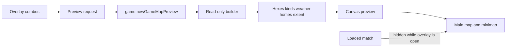

# New-game map preview

> **For agentic workers:** Implement this plan phase by phase. Do not copy phase titles into source, comments, configuration, or `doc/`. Do not commit or push.

**Goal:** While the new-game overlay is open, frame the Global world or the selected region, draw that map’s strategic terrain hexes, show that map’s weather icons for the selected month when the weather bonus is on, and highlight the selected human and AI home areas with the same ownership borders a match uses.

**Architecture:** The overlay never becomes the loaded match. A read-only main-process builder returns terrain kinds, twelve-month weather, and home hexes without changing the active map, footprint, side-group homes, weather-pack cache, or database. The renderer stores that payload and, while `#game-over-overlay` is visible, draws it instead of the match. The month and the weather bonus are read from the dialog at draw time. Home borders and the weather-icon gate are pure functions. Borders and icon assets are the ones a match already uses.

**Tech stack:** TypeScript, Electron IPC, Leaflet, H3, the existing canvas terrain renderer.

## Confirmed behavior

- Global tab: extent is the Mercator world. Hexes are the global strategic grid (resolution 1) with the same terrain fills a started global match uses. No units, orders, fog mask, production labels, infrastructure glyphs, hex codes, or selection chrome. Tech icons appear only while T is held and Tech bonus is not Off.
- Regional tab: extent is the selected region’s hex footprint. Hexes are that manifest’s strategic cells at that pack’s strategic resolution (2 or 3), with the same fills a started match on that pack uses.
- Weather icons use the same assets, band, and plain-label size as the strategic map (`weatherInspectionIconAssetPath`, `strategicOverlayBandOffsetPx`, `inspectionStatusIconDrawPx` with a canvas surface and no units or infrastructure). They are drawn on the main map only, not the minimap. Fog does not hide them. Low and High use the same icon; the level does not change the glyph.
- A weather icon is drawn when the Weather bonus control is `low` or `high`, T is not held, and the view is not at battle-detail zoom. Battle-detail zoom means one of this preview's strategic hexes fills the view, using the match's show and hide fractions. Do not call `shouldRenderTacticalHexes` from the preview. That helper measures the loaded match and writes its zoom flag. The icon is that hex’s weather for turn 1 of the selected starting month: `calendarMonthIndex(1, readNewGameStartMonth())` into that hex’s twelve-month year. `off` or battle-detail zoom draws no weather icon. A held T skips terrain fills and weather icons, matching the live map, and draws a tech icon when Tech bonus is `low` or `high` and that hex’s baseline urban count is above zero. The glyph is Basic or Advanced from the preview map’s `advancedMinUrbanCells`, not from the loaded match and not from Low versus High. Tech bonus `off`, T released, a non-positive count, or battle-detail zoom draws no tech icon. The month and both bonuses are read from the controls on each frame. Do not cache them. `resetNewGameOptionControls` already sets every bonus back to Low on a state refresh and leaves the month alone; do not change that.
- The month and the weather bonus do not need a new payload. All twelve months travel with the hex. Changing the month, its randomize button, or the weather bonus only redraws. Changing the tab, region, home, or a home randomize button still refetches, because the grid or the home lists changed.
- Home areas follow the combo boxes after the dialog opens (including its random reset), after a manual change, and after a randomize click. Global homes are the two region combos. Regional homes are the two side-group combos. The region combo changes the extent; it is not itself a home highlight.
- An exclusive home hex is drawn as already controlled by that side: solid outer ring and dashed inner ring, both in that player’s color. A hex in both homes, including when both combos name the same area, uses the live overlap look: both rings gray (`MULTI_PLAYER_FILL`, `#b0b0b0`).
- Pointer input on the map stays off. A failed Start leaves the overlay and the preview up. A successful Start hides the overlay and the existing match framing takes over. From the Start click until that attempt finishes, a preview reply must not store a payload or fit the camera. Start fits the match while the overlay is still open. A failed attempt frames the dialog's map again. A newer Start click keeps the camera if an older attempt fails.

## Global constraints

- CamelCase files under `src/`. Exported functions camelCase, exported types PascalCase. Role suffixes only: `Handler`, `Helpers`, `Guards`, `Adapter`, `Pipeline`, `Core`, `Types`. No `Utils` or `Impl`.
- Orienting comments on every new field and non-overriding method: why it exists, when to use it, expected outcome, exceptions.
- Public main-process methods log at debug. Caught exceptions log at error. Getters that do not change state log at trace. Use the existing logger. It checks the level before building the message.
- Tests cover the happy path and essential failures only. Do not test an IPC handler that only forwards to the builder.
- Desirable file size 600 lines, hard limit 1000. Desirable argument count 6, hard limit 10.
- Do not put this plan’s section titles into version-controlled product code, comments, or `doc/`.
- Do not commit or push.
- Update living UX docs in `doc/`, not by copying them into `.spec`.

## Files

- Create [src/shared/newGameMapPreviewTypes.ts](src/shared/newGameMapPreviewTypes.ts) — request and payload types.
- Create [src/shared/newGameMapPreviewCore.ts](src/shared/newGameMapPreviewCore.ts) — exclusive-versus-shared border decision and the weather-icon gate.
- Create [src/shared/newGameMapPreviewCore.test.ts](src/shared/newGameMapPreviewCore.test.ts).
- Create [src/main/gameMap/newGameMapPreview.ts](src/main/gameMap/newGameMapPreview.ts) — read-only payload builder and per-map kind cache.
- Create [src/main/gameMap/newGameMapPreview.test.ts](src/main/gameMap/newGameMapPreview.test.ts).
- Create [src/renderer/map/newGameMapPreviewRendering.ts](src/renderer/map/newGameMapPreviewRendering.ts) — canvas draw.
- Create [src/renderer/gameplay/newGameMapPreviewUi.ts](src/renderer/gameplay/newGameMapPreviewUi.ts) — when to fetch and which request is current.
- Modify [src/main/weather/weatherPackLoad.ts](src/main/weather/weatherPackLoad.ts) — read one weather file without touching the loaded match’s cache.
- Modify [src/main/terrainMetadataLoad.ts](src/main/terrainMetadataLoad.ts) — load one metadata file at an explicit resolution. Stay under 1000 lines; do not restructure the file.
- Modify [src/main/terrainMetadataPaths.ts](src/main/terrainMetadataPaths.ts) — bundled global metadata paths that ignore the active pack.
- Modify [src/main/regionScenario.ts](src/main/regionScenario.ts) — global home hexes that ignore installed side groups.
- Modify [src/shared/ipc/channels.ts](src/shared/ipc/channels.ts), [src/shared/ipc/gameApiTypes.ts](src/shared/ipc/gameApiTypes.ts), [src/main/preload.ts](src/main/preload.ts), [src/main/main.ts](src/main/main.ts) — one new channel.
- Modify [src/renderer/rendering/terrainRendering.ts](src/renderer/rendering/terrainRendering.ts) — export the existing home-border drawer.
- Modify [src/renderer/rendering/inspectionStatusIcons.ts](src/renderer/rendering/inspectionStatusIcons.ts) — export one weather-icon draw that uses the existing image cache. Do not call `drawInspectionStatusIcons` for the preview; it reads `S.gameState` and returns immediately when that is missing.
- Modify [src/renderer/rendering/gameScene.ts](src/renderer/rendering/gameScene.ts) — draw the preview instead of the match while the overlay is open.
- Modify [src/renderer/gameplay/newGame.ts](src/renderer/gameplay/newGame.ts), [src/renderer/gameplay/newGameMapUi.ts](src/renderer/gameplay/newGameMapUi.ts), [src/renderer/core/uiState.ts](src/renderer/core/uiState.ts) — refresh after the combos settle.
- Modify [doc/ux/new-game-dialog.md](doc/ux/new-game-dialog.md) and [doc/ux/map-surface.md](doc/ux/map-surface.md).



## Phase: Home border decision

**Files:** create the shared types, core, and core test. No IPC and no canvas.

**Produces:** the request and payload types, `previewHomeBorder`, and `previewWeatherIcon`.

```ts
export type NewGameMapPreviewRequest =
  | { readonly scope: 'global'; readonly humanHomeRegion: string; readonly aiHomeRegion: string }
  | {
      readonly scope: 'regional';
      readonly gameMapId: string;
      readonly humanSideGroupId: string;
      readonly aiSideGroupId: string;
    };

export interface NewGameMapPreviewHex {
  readonly h3Index: string;
  readonly terrainKind: string;
  /** Twelve display states, January at index 0. Same order as the weather pack. */
  readonly weatherByMonth: readonly WeatherState[];
}

export interface NewGameMapPreview {
  readonly gameMapId: string;
  readonly strategicResolution: number;
  readonly extent: 'world' | MapExtentBox;
  readonly hexes: readonly NewGameMapPreviewHex[];
  readonly humanHomeRegionHexes: readonly string[];
  readonly aiHomeRegionHexes: readonly string[];
}

export function previewHomeBorder(
  h3Index: string,
  humanHomeHexes: ReadonlySet<string>,
  aiHomeHexes: ReadonlySet<string>
): { controllerPlayerId: 'human' | 'opponent' | null; homeOwnerIdentity: HomeRegionOwnerIdentity };

export function previewWeatherIcon(input: {
  readonly weatherBonusLevel: BonusLevel;
  readonly startMonth: number;
  readonly weatherByMonth: readonly WeatherState[];
  readonly mapInspectionHeld: boolean;
  readonly tacticalZoom: boolean;
}): WeatherState | null;
```

`MapExtentBox` already lives in [src/shared/mapExtent.ts](src/shared/mapExtent.ts). `HomeRegionOwnerIdentity` already lives in [src/shared/homeRegionRules.ts](src/shared/homeRegionRules.ts). `WeatherState` and `BonusLevel` already exist. The draw loop builds the two sets once per frame. Do not scan the home arrays with `includes` once per hex.

**Rules for `previewHomeBorder`:**

- In both sets: `controllerPlayerId` null and `homeOwnerIdentity` `'both'`.
- Human only: `'human'` and `'human'`.
- AI only: `'opponent'` and `'opponent'`.
- In neither: null and null.

That pairing is what [drawOutlinedHomeRegionOwnershipBorders](src/renderer/rendering/terrainRendering.ts) already paints: a null controller and `'both'` are both gray; a side as controller and as owner paints both rings in that side’s color.

**Rules for `previewWeatherIcon`:**

- `tacticalZoom`, `mapInspectionHeld`, or `weatherBonusLevel === 'off'` returns null. This is the weather icon only. It never returns a tech icon.
- Otherwise return `weatherByMonth[calendarMonthIndex(1, startMonth)]`. Use that helper. Do not subtract the month by hand. Turn 1 is the selected starting month.
- A year shorter or longer than 12, or an index that is missing, returns null. `mild` is a real icon, the same as on a started match.

**Tests:** one hex in each exclusive set, one shared hex, and both sets identical. Assert the four border outcomes. For the icon, assert June (`startMonth` 6) picks index 5, `off` and a held inspection and tactical zoom return null, and `low` and `high` return the same state. No other cases.

**Verify:** `npm run build:main`, then `node --test dist/shared/newGameMapPreviewCore.test.js`. Expected: pass.

## Phase: Read-only preview payload

**Files:** [src/main/gameMap/newGameMapPreview.ts](src/main/gameMap/newGameMapPreview.ts), its test, plus the small metadata and region-scenario additions.

**Produces:** `buildNewGameMapPreview(request: NewGameMapPreviewRequest): NewGameMapPreview`.

This function must not call `setActiveGameMap`, `setLoadedStrategicFootprint`, `installSideGroupHomes`, `ensureGameMapLoaded`, `ensureTerrainClassificationCacheLoaded`, `getOrderedHexList`, `getScenarioHomeRegionHexes`, `strategicH3Resolution`, `strategicParentOf`, `displayWeatherForHex`, `weatherYearForHex`, `ensureWeatherPackLoaded`, or `clearWeatherPackCache`. Those follow the loaded match. A regional match can be loaded while the player previews the world, and the reverse. `displayWeatherForHex` reads one process-wide pack cache filled from the active map; calling it, or replacing that cache, would show the wrong month on the match underneath the overlay.

**Global grid.** Add path resolvers beside `resolveBundledGlobalStrategicNamingPath` that find `terrain_res1_metadata.json`, `terrain_res4_metadata.json`, and `terrain_res1_weather.json` and ignore the active pack. Enumerate resolution-1 cells with `getRes0Cells` and `cellToChildren` at `GLOBAL_STRATEGIC_H3_RESOLUTION` (842 cells). Extent is `'world'`.

**Global homes.** Export a lookup from [src/main/regionScenario.ts](src/main/regionScenario.ts) that reads only the UN naming cache built from `resolveBundledGlobalStrategicNamingPath` at resolution 1. An unknown or blank name returns an empty list. Do not consult `sideGroupHomes`.

**Regional grid.** `regionPackDirectory` plus `readRegionManifest`. Use the manifest hex list, in order, including sea and neutral border. Strategic resolution is the manifest’s. Reject the payload with a logged error if it disagrees with `REGIONAL_RULES_BY_ID`. Extent is `mapExtentBoxForHexes(longitudeIntervalFromCenters(centers), h3Indexes)` using each cell’s `cellToLatLng` longitude. Home hexes are the manifest rows whose `sideGroupId` matches the requested group and whose role is `land` or `member_land`, the same filter as `sideGroupsFromManifest` in [src/main/gameMap/loadGameMap.ts](src/main/gameMap/loadGameMap.ts). An unknown map id or unknown group throws after `logError`.

**Terrain kinds.** Add `loadTerrainMetadataFromPath(absPath, resolution)` in [src/main/terrainMetadataLoad.ts](src/main/terrainMetadataLoad.ts). It parses with that resolution. Do not use `loadTerrainStrategicMetadataFromPath` or `loadTerrainTacticalMetadataFromPath`; both validate against the active map. Classify with `classifyCellWithoutUrbanOverride` and `classifyTacticalTerrainKind`, `DEFAULT_CLASSIFIER_THRESHOLDS`, and `DEFAULT_NODATA_FALLBACK_TERRAIN`. Parent each tactical cell with `cellToParent(h3Index, strategicResolution)`. Roll the dominant kind with the same tie-break as the loop in [src/main/terrainClassificationCache.ts](src/main/terrainClassificationCache.ts) around the `strategicKindByH3` assignment: higher count wins, and an equal count keeps the kind that sorts first with `localeCompare`. If a footprint cell has no kind, log an error and throw.

**Weather years.** Add `loadWeatherPackFromPath(absPath)` in [src/main/weather/weatherPackLoad.ts](src/main/weather/weatherPackLoad.ts). It parses that file and returns the map. It must not assign `yearsByHex`. The existing loader may call it and then store the result, so there is one parser. A regional pack’s file is `terrain_res_s_weather.json` beside the manifest. For each footprint hex, copy the twelve `display` values. A hex missing from the pack gets twelve `mild` values, which is what `weatherYearForHex` already does. Cache the classified hexes and their years by map id for the process lifetime. Compute home lists on each call. Log the public build at debug, the cache read at trace, and failures at error. If this file would pass 600 lines, move the weather-year attachment into its own camelCase file under `src/main/gameMap/` rather than growing past the desirable limit.

**Tests:**

- Global preview returns 842 resolution-1 hexes, extent `'world'`, and the same `terrainKind` per cell as `getTerrainStrategicKindsFromCache()` after a normal global cache load. The process starts on the global profile; this test must not switch it. Record `activeGameMap().id` before the preview call and assert it is unchanged after. For one hex, `weatherByMonth[calendarMonthIndex(1, 6)]` equals `displayWeatherForHex` of that hex at turn 1 and start month 6. Call `displayWeatherForHex` after the preview in this test, so a match means the preview read the global pack and left that cache in place.
- The same global region name for both homes returns equal hex lists.
- One extracted regional pack returns one row per manifest hex, that pack’s resolution, a non-world extent, twelve weather states on every hex, and the two groups’ land hexes. Record `activeGameMap().id` and `displayWeatherForHex` for one global hex first. After the regional preview, both are unchanged. Do not call `setActiveGameMap` in this test.
- An unknown regional id throws.

**Verify:** `npm run build:main`, then `node --test dist/main/gameMap/newGameMapPreview.test.js dist/shared/newGameMapPreviewCore.test.js`. Expected: pass.

## Phase: IPC bridge

Add `newGameMapPreview: 'game:newGameMapPreview'` to `IPC_GAME`. Handle it in [src/main/main.ts](src/main/main.ts) by returning `buildNewGameMapPreview`. Add `newGameMapPreview` to `GameApi` and the preload bridge, typed with `NewGameMapPreviewRequest` and `Promise<NewGameMapPreview>`. No handler test.

**Verify:** `npm run build:main` and `npm run check:renderer-types`. Expected: pass.

## Phase: Draw the preview

Export the existing `drawOutlinedHomeRegionOwnershipBorders` from [src/renderer/rendering/terrainRendering.ts](src/renderer/rendering/terrainRendering.ts). Do not duplicate the inset or dash math.

In [src/renderer/map/newGameMapPreviewRendering.ts](src/renderer/map/newGameMapPreviewRendering.ts), `drawNewGameMapPreview(ctx)`:

- Return immediately when no payload is stored, the payload’s `gameMapId` is not the map the dialog is showing, or the Leaflet map is missing. A failed fetch for a new tab must leave the basemap, not the previous map’s grid.
- Build the human and AI home sets once.
- Read `readNewGameOptionChoices().weatherBonusLevel`, `readNewGameStartMonth()`, and `isMapInspectionModeHeld()` once per frame. Measure battle-detail zoom from one strategic hex of this preview. Do not call `shouldRenderTacticalHexes`.
- For each payload hex, project `getHexBoundaryLatLngForLeafletOverlay` the same way `drawTerrainHexes` does.
- Fill with `fillHexTerrain` unless inspection is held. Do not consult explored hexes, fog, or hover.
- Stroke with `getActiveHexStrokeStyle` and `getMapZoomStrokeScale`.
- Call `previewHomeBorder`. When `homeOwnerIdentity` is null, leave the normal stroke. Otherwise stroke that hex transparent and call `drawOutlinedHomeRegionOwnershipBorders` with that controller and identity, and `getHomeRegionOwnershipLineWidth(zoom)`.
- Call `previewWeatherIcon`. When it returns a state, draw that icon with the exported weather-icon helper, placed at the hex centroid minus `strategicOverlayBandOffsetPx(span)`, at `inspectionStatusIconDrawPx({ productionSurface: 'canvas', hasInfraSymbols: false, hasVisibleUnits: false })`. That is the plain 16.5px size, because the preview has no units, ports, or build button. The asset comes from `weatherInspectionIconAssetPath`.

In both `resizeAndRedraw` and `redraw` in [src/renderer/rendering/gameScene.ts](src/renderer/rendering/gameScene.ts), if `#game-over-overlay` is not hidden, clear and draw only the preview, then return before `drawLoadingScene` and `drawGameScene`. The match’s units and tactical layer must not paint. Keep the existing button sync calls after the return path so the overlay’s buttons do not go stale.

Apply extent with `applyLoadedMapExtent` from [src/renderer/map/mapExtent.ts](src/renderer/map/mapExtent.ts), not `syncMapExtentToSnapshot`. Pass `'world'` or the payload box, with fit true, when the dialog opens or the extent changes. A home change on the same extent does not fit. Do not fit while Start holds the camera, and do not fit a reply that arrives after the overlay has closed. That updates the main map and the minimap. Do not write `appliedKey`. Start already refits the real match.

Store the payload in the renderer module. Map move and zoom already call `redraw`; the overlay branch covers those frames.

**Verify:** `npm run check:renderer-types`. Then, with the app open on the new-game overlay, confirm the checks in the manual list below for a hard-coded payload if the combos are not wired yet. A typecheck-only pass is acceptable for this phase if the next phase is done in the same session before the manual pass.

## Phase: Follow the combos

[src/renderer/gameplay/newGameMapPreviewUi.ts](src/renderer/gameplay/newGameMapPreviewUi.ts) exports `refreshNewGameMapPreview(): Promise<void>`.

- Read the active tab the same way `readNewGameMapChoice` does. Global sends the two region values from `getSelectedScenarioRegions`. Regional sends the region select and the two side selects.
- Increment a request id, call `window.gameApi.newGameMapPreview`, and drop the response if a newer request started. On failure, log the error. Keep a stored payload only when its `gameMapId` is still the map on screen. Otherwise the next draw paints nothing.
- On success, store the payload, `applyLoadedMapExtent`, and call the existing redraw.
- The month and the weather bonus are not part of the request. Their listeners call redraw only.

Wire refresh after the selects have their new values. Setting `selectedIndex` or `value` does not fire `change`, so randomize and the open-reset must call refresh themselves.

- In [src/renderer/core/uiState.ts](src/renderer/core/uiState.ts) and `openNewGameOverlayFromModelTab`, `await Promise.all` of `initializeScenarioRegionSelectorsOnOverlayOpen()` and `prepareNewGameMapPanel()`, then refresh once. Today those two run unawaited, so a refresh inside only one of them would highlight empty combos. The month randomize inside the open helper has already run by the time that promise resolves, and the draw reads the month from the control.
- Tab click, region `change` (after `applySelectedRegionSides`), side `change`, side randomize, global region `change`, and global region randomize each refresh once after they update the selects.
- Weather bonus `change`, starting-month `change`, and the starting-month randomize button each redraw once. They do not refetch.

**Verify:** `npm run check:renderer-types`. Manual pass:

- Open the overlay with no match, on Global. The world is framed. Resolution-1 terrain hexes cover it. Weather icons match the starting-month control, including Mild. Both homes show player-colored double rings. Choosing the same region for both turns those hexes gray.
- Change the month and use its randomize button. The icons change and the hex grid is not rebuilt. Set Weather bonus to Off. The icons disappear and the fills stay. Set it back to Low or High. The icons return, and Low and High look the same. Hold T. The fills and the weather icons hide. With Tech bonus Low or High, hexes that can produce units show that map's tech icon. Off hides those icons. Release T. The fills and the weather icons return, and the tech icons hide.
- Change one home combo and use its randomize button. Only that side’s highlight moves, and the extent stays the world.
- Open Regional. The selected region is framed, including on the minimap, at that pack’s strategic resolution. The two side groups highlight. They are different groups, so they should not overlap. Changing the region refits and redraws both sides and that region’s weather. Each side’s randomize button moves only that side.
- Open New over a match in progress, ideally a regional match while the Global tab is showing, or the reverse. The match’s units disappear. The preview’s weather is the selected map’s weather, not the loaded match’s. After closing by a successful Start, the new match’s weather icons still follow that match’s month. A failed start, when a regional map has fewer than two sides, leaves the overlay and the preview up.

## Phase: UX docs

In [doc/ux/new-game-dialog.md](doc/ux/new-game-dialog.md), under Information Displayed and Inputs, state that the open overlay frames the map to the world on Global and to the selected region on Regional, draws that map’s strategic terrain hexes, and highlights the current human and AI home areas. Exclusive homes use that side’s color on both rings. Shared homes, including the same choice on both combos, use the gray overlap rings. The highlight updates when the dialog opens and when a combo or its randomize button changes. While Weather bonus is Low or High, each strategic hex shows that map’s weather icon for the selected starting month. Off hides the icons. Changing the month, its randomize button, or the weather bonus updates the icons. Holding T hides the fills and the weather icons, and shows that map’s tech icons while Tech bonus is Low or High.

In [doc/ux/map-surface.md](doc/ux/map-surface.md), under Information Displayed and States, state that New game and Game over show this preview instead of the loaded match, and that pan limits follow that preview extent. Pointer input stays off. The preview’s weather icons follow the dialog’s month and weather bonus, and fog does not hide them. The loaded match’s own weather returns when a start succeeds. Leave Known Deviations as none.

**Verify:** reread both docs against the confirmed behavior section. No source file contains a phase title from this plan.
