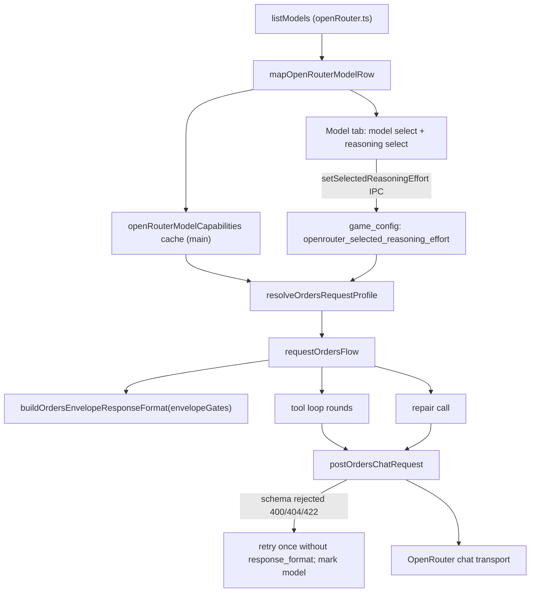

# OpenRouter Structured Output, Healing, Reasoning Effort, and Tool Batching Execution Plan

> **For agentic workers:** Save this document as `.spec/openrouter-structured-output-and-reasoning-effort-execution-plan.md` before starting. Implement phase by phase, in order. Do not start a phase until the previous phase's verification passes. Track steps with the checkboxes.

**Goal:**

1. Record `supported_parameters`, `reasoning.supported_efforts`, and `top_provider.max_completion_tokens` from the OpenRouter models list.
2. Send a closed, fully enumerated JSON schema (`response_format`) plus the `response-healing` plugin on every order-flow request to models that support structured outputs, in both tool-loop rounds and the repair call. The schema lists every field the prompt teaches, so providers that strip unknown keys cannot remove anything the parser needs. If a provider rejects the schema request, retry that request once without it, and stop sending it to that model for the rest of the session.
3. Add tool-batching guidance to the system prompt.
4. Add a Reasoning effort dropdown under the model selector. It shows the model's default, is disabled when there are fewer than two levels, offers only the model's levels, and is persisted in `game_config`. Higher efforts raise the completion `max_tokens` budget, capped by the model's output limit.

**Architecture:**



**Tech stack:** TypeScript, Electron main and renderer, Node `node:test`-style function tests (`assert` plus a `run()` at the bottom, as in [src/main/openRouter/mapOpenRouterModelRow.test.ts](src/main/openRouter/mapOpenRouterModelRow.test.ts)), compiled by `npm run build:main` into `dist/main` and `dist/shared`.

## Global Constraints

- Do not commit or push.
- Do not put phase numbers, step numbers, or this plan's name into code, comments, tests, configuration, log messages, or docs.
- Follow [doc/naming-conventions-contract-v1.md](doc/naming-conventions-contract-v1.md). Files and directories under `src/` are camelCase. Allowed role suffixes are `Handler`, `Helpers`, `Guards`, `Adapter`, `Pipeline`, `Core`, and `Types`. Never use `Utils`, `Impl`, `Manager`, `Service`, `Processor`, or `Controller`, including in type names.
- Fields mirroring OpenRouter JSON keep the vendor's snake_case names (`supported_parameters`, `supported_efforts`, `max_completion_tokens`), the same way `default_effort` already does.
- New frozen strings, which must be typed exactly as shown: IPC channels `openRouter:getSelectedReasoningEffort` and `openRouter:setSelectedReasoningEffort`; config key `openrouter_selected_reasoning_effort`; plugin id `response-healing`; schema name `orders_envelope`.
- Every new or changed field, function, and type member needs an orienting comment that says why it exists, when to use it, and what to expect, in the Purpose / When to use / Expected outcome / Exceptions style used in the surrounding files. Do not restyle comments you did not change.
- Main-process public functions log with `logDebug`, getters with `logTrace`, and caught errors with `logError`, all from `src/main/logger`. Modules under `src/shared` and `src/renderer` do not log.
- Mark immutability: use `const`, `readonly` interface members, and `readonly string[]` for lists.
- Keep every source file under 600 lines. `requestOrdersToolLoop.ts` starts at 577, so the new request logic goes into helper modules, not inline.
- Test only the contracts listed in each phase. Do not add tests for getters, setters, IPC pass-throughs, or DOM wiring.

## Locked Behavior

**Reasoning effort semantics:**

- Persisted value `''` means "use the model default" and sends no `reasoning` field.
- A non-empty persisted value is sent as `reasoning: { effort }` only if it is in the model's selectable list.
- Choosing the option marked "(default)" persists `''`.
- Changing the model clears the persisted effort, both in main and in the renderer.

**Selectable efforts:**

- `supported_efforts` omitted: none, and the selector is disabled.
- `supported_efforts: null`: the full gateway list `max, xhigh, high, medium, low, minimal, none`.
- Otherwise, the API list in API order.
- When `reasoning.mandatory === true`, always drop `none`.

**Budget scaling:**

- The base is `OPENROUTER_ORDER_FLOW_COMPLETION_MAX_TOKENS` (8192).
- The effective effort is the valid override if there is one, otherwise the model default.
- Multiplier: `max` and `xhigh` are 4, `high` is 2, and everything else is 1.
- If the model's `top_provider.max_completion_tokens` is unknown, do not scale.
- Otherwise the budget is `max(base, min(base * multiplier, modelMax))`.
- The existing credit clamp (`resolveEffectiveOpenRouterCompletionMaxTokens`) still applies afterward.

**Structured outputs:**

- A model qualifies when its `supported_parameters` includes both `response_format` and `structured_outputs`.
- Unknown models (not in the cache) never get `response_format` or `reasoning`.
- Do not set `provider.require_parameters`.
- The schema is closed: every object, at every depth, has `additionalProperties: false` and lists every key the prompt teaches for it.
- `json_schema.strict` is `false`. Strict mode on OpenAI-style providers requires every property to be listed in `required`, which would force the model to emit every optional key.
- The schema uses only these keywords: `type` (a single string, never an array), `properties`, `required`, `additionalProperties`, `items`, and `enum`. Never use `minimum`, `maximum`, `minLength`, `maxLength`, `pattern`, `format`, `minItems`, `maxItems`, `uniqueItems`, `oneOf`, `allOf`, or `$ref`. Several providers (Anthropic in particular) reject them.
- Later amendment: `orders[]` rows now also use an inline `anyOf` of per-action closed rows, so moves require `destination`. Anthropic accepts `anyOf`; DeepSeek accepts it only with a sibling `type`, which the row keeps. See `orderRowSchema` in `envelopeJsonSchema.ts`.
- Later amendment: Anthropic models receive the schema like any other model that advertises structured outputs. Anthropic caps a schema at 24 optional parameters and 16 union parameters; the envelope has 26 optional parameters for a tactical beat and 59 for a full strategic turn, so the first request returns HTTP 400 and the existing retry without the schema takes over for the rest of the session. An Anthropic-sized schema was considered and deferred. A developer flag, `AGENT_WARS_DISABLE_STRUCTURED_OUTPUTS`, withholds the schema from every model so tool use can be compared with and without it. See `supportsStructuredOutputs` in `openRouterModelCapabilities.ts`.
- Callbacks are object-only (`{ event, params }`), which is the only form the prompt teaches. The parser's string forms stay accepted for models without the schema.

**Fallback:**

- The fallback runs only when the schema request fails with HTTP 400, 404, or 422.
- Retry the same body once without `response_format` and `plugins`. Keep `reasoning`.
- Mark the model as rejected for the session only if that retry succeeds.
- A cancel, timeout, or other status returns the original failure untouched.

## Background the Implementer Needs

1. The request flow receives only `modelId`. Capabilities reach main through a cache filled by `listModels` in [src/main/openRouter/openRouter.ts](src/main/openRouter/openRouter.ts). The renderer calls `listModels` at startup and on refresh.
2. Model choice is persisted in `game_config` through `saveGameConfigValue` / `loadGameConfigValue` / `deleteGameConfigValue` in `openRouter.ts` (key `openrouter_selected_model`).
3. Tool-loop request bodies are built at [src/main/openRouter/requestOrdersToolLoop.ts](src/main/openRouter/requestOrdersToolLoop.ts) lines 382-397. The repair body is built at [src/main/openRouter/requestOrdersRepairExchange.ts](src/main/openRouter/requestOrdersRepairExchange.ts) lines 159-166.
4. `repairGates` is built after the loop in [src/main/openRouter/requestOrdersFlow.ts](src/main/openRouter/requestOrdersFlow.ts) lines 406-412. It must move above the loop so the tool loop can use the same gates.
5. The fields the closed schema must list come from what the prompt teaches and the parser reads:
   - Envelope text: `buildFinalJsonContractInstruction` in [src/main/openRouter/promptContracts.ts](src/main/openRouter/promptContracts.ts) (around lines 100-142), the production clause in [src/main/openRouter/promptText.ts](src/main/openRouter/promptText.ts) line 435, and the examples in [src/main/openRouter/promptSpec/envelopeContract.ts](src/main/openRouter/promptSpec/envelopeContract.ts) (`buildRepairSchemaText`) and `getFinalJsonOrdersExampleBlock` in `promptContracts.ts`.
   - Parsers: `processV3OrdersArray`, `normalizeAirStrikeOrders`, `normalizeFerryOrders`, `normalizeCallbacks`, and `normalizeMemoryUpdates` in [src/main/openRouter/orderResponseParsing.ts](src/main/openRouter/orderResponseParsing.ts); `normalizeProductionOrders` in [src/main/productionOrders.ts](src/main/productionOrders.ts); `AssignOrderParams` in [src/main/tools/standingOrdersShared.ts](src/main/tools/standingOrdersShared.ts).
   - Order rows, air strikes, and ferry orders may use `unitId` or grouped `unitIds`.
6. The transport's failure result has no `status` today. The fallback needs one.
7. `openRouterMatrix.test.ts` drives the flow through `openRouter.requestOrders` with model id `test-model`, a transport override, and an empty capability cache. Its request bodies must stay unchanged, which the "unknown model gets the baseline" rule guarantees. Each test file runs in its own Node process, so module-level caches never leak between test files.

---

## Phase 1: Tool-Batching Prompt Guidance

**Files:** modify [src/main/openRouter/promptText.ts](src/main/openRouter/promptText.ts), [src/main/openRouter/promptContracts.test.ts](src/main/openRouter/promptContracts.test.ts), and [doc/ai-commander-prompts/source-inventory.md](doc/ai-commander-prompts/source-inventory.md) section 2.4.

- [ ] In `buildToolUsageGuidance`, push this bullet right after the `if (hasPrecomputedBriefing) { ... } else { ... }` block, unconditionally. The function only runs when tools exist.

```ts
lines.push(
  '- Batch independent tool calls: when you need the same tool for several units or hexes, request all of those calls together in one reply as parallel tool calls instead of one call per reply. Wait for a result only when the next call\'s arguments depend on it.'
);
```

- [ ] In `promptContracts.test.ts`, add one test asserting that both `buildToolUsageGuidance(flags, true, 'strategic')` and `buildToolUsageGuidance(flags, false, 'tactical')` include `'Batch independent tool calls'`. Register it the same way neighboring tests are registered.
- [ ] In `source-inventory.md` section 2.4, add "tool-call batching" to the list of mechanic bullets.
- [ ] Verify: `npm run build:main`, then `node dist/main/openRouter/promptContracts.test.js`. Then run `node scripts/run-main-node-tests.cjs` and fix any exact-text prompt assertions that now fail by adding the new bullet to their expectations. Do not remove the bullet.

## Phase 2: Model Metadata Mapping

**Files:** modify [src/shared/ipc/openRouterTypes.ts](src/shared/ipc/openRouterTypes.ts), [src/main/openRouter/mapOpenRouterModelRow.ts](src/main/openRouter/mapOpenRouterModelRow.ts), and [src/main/openRouter/mapOpenRouterModelRow.test.ts](src/main/openRouter/mapOpenRouterModelRow.test.ts).

- [ ] Add these members to `OpenRouterModel`, each with an orienting comment:
  - `supported_parameters?: readonly string[]`: the API parameters at least one provider accepts.
  - `top_provider?: { max_completion_tokens?: number }`: the output-token ceiling.
  - Inside `reasoning`, `supported_efforts?: readonly string[] | null`. `null` means all gateway efforts; omitted means effort is not selectable.
- [ ] In `mapOpenRouterModelRow`:
  - `supported_parameters`: when it is an array, keep trimmed non-empty strings. Omit the key if none remain.
  - `top_provider.max_completion_tokens`: keep it when it is a finite positive number, floored.
  - `reasoning.supported_efforts`: an array keeps trimmed non-empty strings in their original order. Exactly `null` stays `null`. Anything else omits the key.
  - Extend the condition at lines 71-77 so a `reasoning` object holding only `supported_efforts` is still kept.
- [ ] Tests:
  - Extend `testFullMetadata` so the input and the expected output include `supported_parameters: ['tools', 'response_format']`, `top_provider: { max_completion_tokens: 32768 }`, and `reasoning.supported_efforts: ['high', 'low']`.
  - Add `testNullSupportedEffortsPreserved`, asserting that input `reasoning: { mandatory: true, supported_efforts: null }` maps to `reasoning: { mandatory: true, supported_efforts: null }`. Add it to `run()`.
- [ ] Verify: `npm run build:main`, `node dist/main/openRouter/mapOpenRouterModelRow.test.js`, and `node dist/main/openRouter/buildOpenRouterModelList.test.js`.

## Phase 3: Shared Reasoning-Effort Rules

**Files:** create `src/shared/openRouterReasoningEffort.ts` and `src/shared/openRouterReasoningEffort.test.ts`. These are pure functions with no logging. The renderer uses them to build the dropdown, and main uses them to validate requests.

- [ ] Implement exactly this, adding orienting comments:

```ts
import type { OpenRouterModel } from './ipc/openRouterTypes';

export const OPENROUTER_GATEWAY_REASONING_EFFORTS: readonly string[] = [
  'max', 'xhigh', 'high', 'medium', 'low', 'minimal', 'none',
];

export function listSelectableReasoningEfforts(model: OpenRouterModel | undefined): readonly string[] {
  const reasoning = model?.reasoning;
  if (!reasoning || reasoning.supported_efforts === undefined) return [];
  const source = reasoning.supported_efforts ?? OPENROUTER_GATEWAY_REASONING_EFFORTS;
  return reasoning.mandatory === true ? source.filter((effort) => effort !== 'none') : [...source];
}

export function resolveDefaultReasoningEffort(model: OpenRouterModel | undefined): string | null {
  const defaultEffort = model?.reasoning?.default_effort;
  return defaultEffort !== undefined && listSelectableReasoningEfforts(model).includes(defaultEffort)
    ? defaultEffort
    : null;
}

export function resolveRequestedReasoningEffort(model: OpenRouterModel | undefined, persistedEffort: string): string | null {
  const trimmed = persistedEffort.trim();
  return trimmed && listSelectableReasoningEfforts(model).includes(trimmed) ? trimmed : null;
}

export function resolveEffectiveReasoningEffort(model: OpenRouterModel | undefined, persistedEffort: string): string | null {
  return resolveRequestedReasoningEffort(model, persistedEffort) ?? resolveDefaultReasoningEffort(model);
}

export function isReasoningEffortSelectable(model: OpenRouterModel | undefined): boolean {
  return listSelectableReasoningEfforts(model).length >= 2;
}
```

- [ ] Write these four tests, using a `model(overrides)` fixture builder like the one in `openRouterModelDisplay.test.ts`:
  1. Selectable list: omitted gives `[]`, `null` gives the gateway list, and `mandatory: true` drops `none`.
  2. A persisted effort missing from the list gives `resolveRequestedReasoningEffort === null`, and the effective effort falls back to the default.
  3. A default that isn't in the selectable list resolves to `null`.
  4. One effort gives `isReasoningEffortSelectable === false`. Two give `true`.
- [ ] Verify: `npm run build:main`, then `node dist/shared/openRouterReasoningEffort.test.js`.

## Phase 4: Main-Process Capability Cache, Persisted Effort, and IPC

**Files:** create `src/main/openRouter/openRouterModelCapabilities.ts`. Modify `openRouter.ts`, [src/shared/ipc/channels.ts](src/shared/ipc/channels.ts), [src/main/preload.ts](src/main/preload.ts) (both the `IPC_OPENROUTER` constant and the `openRouter` bridge object), [src/shared/ipc/gameApiTypes.ts](src/shared/ipc/gameApiTypes.ts), and [src/main/main.ts](src/main/main.ts).

- [ ] Create `openRouterModelCapabilities.ts` with the following, with orienting comments and logging:
  - A module `Map<string, OpenRouterModel>`.
  - `rememberOpenRouterModels(models: readonly OpenRouterModel[]): void`: clear the map and refill it. Debug log with the count.
  - `getOpenRouterModelCapabilities(modelId: string): OpenRouterModel | undefined`: trace log.
  - `supportsStructuredOutputs(model: OpenRouterModel | undefined): boolean`: true only when `supported_parameters` includes both `'response_format'` and `'structured_outputs'`.
  - A module `Set<string>` of models whose providers rejected the schema request, with:
    - `markStructuredOutputsRejectedForModel(modelId)`: debug log.
    - `isStructuredOutputsRejectedForModel(modelId)`: trace log.
    - `resetOpenRouterModelCapabilitiesForTests()`: clears both collections.
- [ ] In `openRouter.ts`:
  - In `listModels`, call `rememberOpenRouterModels(models)` right after `buildOpenRouterModelList(data)`.
  - Add `const OPENROUTER_SELECTED_REASONING_EFFORT_DB_CONFIG_KEY = 'openrouter_selected_reasoning_effort';`.
  - Add `getSelectedReasoningEffort(): string` (trace log). Read from the database on every call and return `''` when the key is missing.
  - Add `setSelectedReasoningEffort(effort: string): void` (debug log). Trim the value; empty deletes the key, otherwise save it.
  - In `setSelectedModel`, compute `const modelChanged = (modelId ?? '') !== getSelectedModel();` before assigning. After saving, call `setSelectedReasoningEffort('')` when `modelChanged` is true.
- [ ] Add `getSelectedReasoningEffort: 'openRouter:getSelectedReasoningEffort'` and `setSelectedReasoningEffort: 'openRouter:setSelectedReasoningEffort'` to `IPC_OPENROUTER` in both `channels.ts` and the `preload.ts` copy.
- [ ] In the preload bridge, add `getSelectedReasoningEffort(): Promise<string>` and `setSelectedReasoningEffort(effort: string): Promise<void>`, following the `getSelectedModel` / `setSelectedModel` pattern.
- [ ] Add the same two members to the `openRouter` block in `gameApiTypes.ts`.
- [ ] In `main.ts`, register the handlers next to the `setSelectedModel` handler:
  - `ipcMain.handle(IPC_OPENROUTER.getSelectedReasoningEffort, () => getSelectedReasoningEffort());`
  - `ipcMain.handle(IPC_OPENROUTER.setSelectedReasoningEffort, (_event, effort: string) => { setSelectedReasoningEffort(typeof effort === 'string' ? effort : ''); });`
  - Add the matching imports.
- [ ] Verify: `npm run build:main`, `node dist/main/preloadIpcChannelParity.test.js`, and `npm run check:renderer-types`.

## Phase 5: Reasoning Effort Dropdown and Layout

**Files:** modify [static/index.html](static/index.html) (markup around lines 1068-1089 and CSS around lines 281-302). Create `src/renderer/openRouter/reasoningEffortSelect.ts`. Modify [src/renderer/openRouter/openRouterControls.ts](src/renderer/openRouter/openRouterControls.ts) and [doc/ux/right-panel-model-tab.md](doc/ux/right-panel-model-tab.md).

- [ ] Markup. Replace the model row's inner `div.openrouter-model-row` and delete the separate Tactical battles `.openrouter-row`. Keep every existing id, attribute, and title.

```html
<div class="openrouter-model-grid">
  <select id="openrouter-model"><option value="">— Select model —</option></select>
  <button type="button" id="openrouter-refresh-models" ...existing attributes...></button>
  <button type="button" id="openrouter-run-btn" ...existing attributes...>Run</button>
  <button type="button" id="openrouter-new-btn" ...existing attributes...>New</button>
  <select id="openrouter-reasoning-effort" aria-label="Reasoning effort" title="Reasoning effort for the selected model" disabled>
    <option value="">Reasoning: model default</option>
  </select>
  <div class="openrouter-inline-checkbox openrouter-model-grid-checkbox">
    ...existing #openrouter-tactical-battles input and its label, unchanged...
  </div>
</div>
```

- [ ] CSS. Replace the `.openrouter-model-row` and `.openrouter-model-row select` rules with:

```css
.openrouter-model-grid {
  display: grid;
  grid-template-columns: minmax(0, 1fr) auto auto auto;
  gap: 0.4rem;
  align-items: center;
}
.openrouter-model-grid-checkbox { grid-column: 2 / -1; }
.openrouter-model-grid-checkbox label { white-space: nowrap; }
```

  With this grid, the reasoning select takes column 1, the same width as the model select. The checkbox starts directly under the refresh button.
- [ ] `reasoningEffortSelect.ts` exports:
  - `interface ReasoningEffortSelectBinding { showForModel(model: OpenRouterModel | undefined, persistedEffort: string): void }`
  - `attachReasoningEffortSelect(args: { readonly select: HTMLSelectElement; readonly onEffortChange: (persistedEffort: string) => void }): ReasoningEffortSelectBinding`

  Behavior of `showForModel`:
  - Clear the options.
  - Compute `efforts = listSelectableReasoningEfforts(model)` and `defaultEffort = resolveDefaultReasoningEffort(model)`.
  - If `efforts` is empty or `defaultEffort` is `null`, first add an option with value `''` and text `Reasoning: model default`.
  - Add one option per effort, with text `` `Reasoning: ${effort}` `` plus ` (default)` when it equals `defaultEffort`.
  - Set `select.value = resolveRequestedReasoningEffort(model, persistedEffort) ?? defaultEffort ?? ''`.
  - Set `select.disabled = !isReasoningEffortSelectable(model)`.
  - Store `defaultEffort` in a closure variable.

  The single `change` listener calls `onEffortChange(select.value === currentDefault ? '' : select.value)`.
- [ ] Wire it up in `openRouterControls.ts`:
  - Add `let persistedReasoningEffort = '';`.
  - Attach the binding when `#openrouter-reasoning-effort` exists. Its `onEffortChange` does `persistedReasoningEffort = value; void api.setSelectedReasoningEffort(value);`.
  - At the end of the `refreshModels` success path, after the target model is selected, call `showForModel(modelsById.get(modelSelect.value), persistedReasoningEffort)`.
  - In both the error branch and the `catch`, call `showForModel(undefined, '')`.
  - Next to `api.getSelectedModel()`, call `api.getSelectedReasoningEffort().then((effort) => { persistedReasoningEffort = effort; binding?.showForModel(modelsById.get(modelSelect?.value ?? ''), effort); })`.
  - In the model `change` listener, after `api.setSelectedModel(...)`, set `persistedReasoningEffort = ''` and call `showForModel(modelsById.get(modelSelect.value), '')`.
- [ ] Update `right-panel-model-tab.md`:
  - Information Displayed: add the reasoning dropdown, its "(default)" marker, and its disabled state.
  - Inputs: changing the effort saves it; changing the model resets it to the default.
  - Note that the Tactical battles checkbox now sits to the right of the reasoning dropdown.
  - Invariants: only the model's own levels are offered.
  - Code Entry Points: add `#openrouter-reasoning-effort` and `reasoningEffortSelect.ts`.
- [ ] Verify:
  - Run `npm run build:main`, `npm run build:renderer`, and `npm run check:renderer-types`.
  - Run `npm start` and check by hand:
    - The reasoning select is exactly as wide as the model select.
    - Tactical battles sits under the refresh button.
    - Choosing `openai/gpt-5` shows `Reasoning: medium (default)`, enabled, with four levels.
    - Choosing `anthropic/claude-sonnet-4.5` shows a disabled `Reasoning: model default`.
    - A non-default effort survives an app restart.
    - Switching models resets the dropdown to the default.

## Phase 6: Request Profile (Reasoning Parameter and Budget Scaling)

**Files:** create `src/main/openRouter/ordersRequestProfile.ts`, `src/main/openRouter/ordersRequestProfile.test.ts`, and `src/main/openRouter/ordersChatRequestHelpers.ts`. Modify [src/main/openRouter/openRouterChatTransport.ts](src/main/openRouter/openRouterChatTransport.ts) (types only), [src/main/openRouter/requestOrdersFlowDepsTypes.ts](src/main/openRouter/requestOrdersFlowDepsTypes.ts), `requestOrdersFlow.ts`, `requestOrdersToolLoop.ts`, `requestOrdersRepairExchange.ts`, and `openRouter.ts`.

- [ ] Transport types. Export `OpenRouterChatTransportPayload`, which is the existing payload shape. Export `OpenRouterChatTransportResult`:

```ts
| { ok: true; status: number; headers: Record<string, string>; bodyText: string }
| { ok: false; error: string; status?: number }
```

  Redefine `OpenRouterChatTransport` with these two types. In `defaultPostOpenRouterChatWithTimeoutAndRetry`, add `status: chatResponse.status` to the two failure returns that follow an HTTP response (the 401 return and the final non-retryable return). In `RequestOrdersFlowDepsTypes`, replace the inline `postOpenRouterChatWithTimeoutAndRetry` signature with `OpenRouterChatTransport`, using a type-only import.
- [ ] `ordersRequestProfile.ts`:

```ts
export interface OrdersRequestProfile {
  readonly reasoningEffort: string | null;
  readonly effectiveReasoningEffort: string | null;
  readonly structuredOutputs: boolean;
  readonly preferredCompletionMaxTokens: number;
}
export const BASELINE_ORDERS_REQUEST_PROFILE: OrdersRequestProfile;
export function scaleCompletionMaxTokensForReasoningEffort(
  baseMaxTokens: number, effort: string | null, modelMaxCompletionTokens: number | undefined
): number;
export function resolveOrdersRequestProfile(input: {
  readonly modelId: string;
  readonly model: OpenRouterModel | undefined;
  readonly persistedReasoningEffort: string;
  readonly baseCompletionMaxTokens: number;
}): OrdersRequestProfile;
```

  - The baseline is `{ reasoningEffort: null, effectiveReasoningEffort: null, structuredOutputs: false, preferredCompletionMaxTokens: OPENROUTER_ORDER_FLOW_COMPLETION_MAX_TOKENS }`.
  - Build multipliers as `new Map([['max', 4], ['xhigh', 4], ['high', 2]])`, using the Locked Behavior formula.
  - `resolveOrdersRequestProfile` returns the baseline (with the given base) when `model` is undefined.
  - Otherwise it uses the shared rules from the reasoning-effort module and `supportsStructuredOutputs`.
  - It logs one debug line with `modelId`, both efforts, `structuredOutputs`, and `preferredCompletionMaxTokens`.
- [ ] Write these three tests:
  1. An unknown model returns the baseline.
  2. A valid `high` override on a model with `max_completion_tokens: 128000` gives `reasoningEffort: 'high'` and budget 16384. `max` on a model with a 20000 cap gives 20000.
  3. No override on a model with `default_effort: 'xhigh'` gives `reasoningEffort: null`, `effectiveReasoningEffort: 'xhigh'`, and budget 32768. The same model with no `top_provider` gives 8192.
- [ ] `ordersChatRequestHelpers.ts` (reasoning only for now):
  - `interface OrdersChatRequestSettings { readonly profile: OrdersRequestProfile; readonly responseFormat: Readonly<Record<string, unknown>> | null }` and `BASELINE_ORDERS_CHAT_REQUEST_SETTINGS`.
  - `postOrdersChatRequest(args: { post; key; modelId; baseBody; settings; signal; onLog; requestLabel }): Promise<OpenRouterChatTransportResult>`. For now it adds `reasoning: { effort }` when `settings.profile.reasoningEffort` is non-null, logs debug, and calls `post` once.
- [ ] In `openRouter.ts`, add and wire this into the `requestOrdersFlow` deps object as `resolveOrdersRequestProfile`:

```ts
function resolveSelectedModelOrdersRequestProfile(modelId: string): OrdersRequestProfile {
  const model = getOpenRouterModelCapabilities(modelId);
  const persistedReasoningEffort =
    model !== undefined && modelId === getSelectedModel() ? getSelectedReasoningEffort() : '';
  return resolveOrdersRequestProfile({
    modelId,
    model,
    persistedReasoningEffort,
    baseCompletionMaxTokens: OPENROUTER_ORDER_FLOW_COMPLETION_MAX_TOKENS,
  });
}
```

  Keep the `model !== undefined` check first. It means unknown models, including `test-model` in `openRouterMatrix.test.ts`, never touch the database.

  In `RequestOrdersFlowDeps`, add the optional member `resolveOrdersRequestProfile?: (modelId: string) => OrdersRequestProfile`. It is optional so existing test doubles keep compiling.
- [ ] In `requestOrdersFlow.ts`:
  - Destructure the new dep.
  - Before `resolveOrderFlowMaxTokens`, compute `const requestProfile = resolveOrdersRequestProfile?.(modelId) ?? BASELINE_ORDERS_REQUEST_PROFILE;`.
  - Change `resolveOrderFlowMaxTokens` to use `requestProfile.preferredCompletionMaxTokens`.
  - In the `'openRouter requestOrders: completion token budgets'` debug log (line 337), change `preferredCompletionMaxTokens` to `requestProfile.preferredCompletionMaxTokens` and add `reasoningEffort: requestProfile.effectiveReasoningEffort`. Remove the `OPENROUTER_ORDER_FLOW_COMPLETION_MAX_TOKENS` import if nothing else in the file uses it, since lint will flag it.
  - Build `const requestSettings: OrdersChatRequestSettings = { profile: requestProfile, responseFormat: null };`.
  - Pass `requestSettings` to the tool loop and to the repair exchange as one new field each, with an orienting comment.
- [ ] In the tool loop and the repair exchange:
  - Replace the direct `postOpenRouterChatWithTimeoutAndRetry({...})` call with `postOrdersChatRequest({ post: postOpenRouterChatWithTimeoutAndRetry, key, modelId, baseBody: <the existing body object>, settings: requestSettings, signal, onLog, requestLabel: <unchanged label> })`.
  - Add `reasoningEffort: requestSettings.profile.effectiveReasoningEffort` to both "truncated at max_tokens" `logError` payloads.
- [ ] Verify: `npm run build:main`, `node dist/main/openRouter/ordersRequestProfile.test.js`, and `node scripts/run-main-node-tests.cjs`. `openRouterMatrix.test.js` in particular must pass unchanged.

## Phase 7: Structured Outputs, Response Healing, and Fallback

**Files:** create `src/main/openRouter/promptSpec/envelopeJsonSchema.ts`, `src/main/openRouter/promptSpec/envelopeJsonSchema.test.ts`, and `src/main/openRouter/ordersChatRequestHelpers.test.ts`. Modify `ordersChatRequestHelpers.ts`, `requestOrdersFlow.ts`, [src/main/tools/standingOrdersShared.ts](src/main/tools/standingOrdersShared.ts), [src/main/tools/standingOrdersCore.ts](src/main/tools/standingOrdersCore.ts), [src/shared/ipc/productionTypes.ts](src/shared/ipc/productionTypes.ts), and [doc/ai-commander-prompts/consultation-flow.md](doc/ai-commander-prompts/consultation-flow.md).

- [ ] Share the two enums that already exist as literals so the schema cannot drift from validation:
  - In `standingOrdersShared.ts`, export `STANDING_ORDER_TYPES: readonly string[] = ['defend', 'march', 'pursue', 'patrol', 'hold_fire']`, with an orienting comment. In `standingOrdersCore.ts` line 279, replace the inline array with `STANDING_ORDER_TYPES`. Behavior must not change.
  - In `productionTypes.ts`, export `BUILD_UNIT_TYPES: readonly BuildUnitType[] = ['infantry', 'armor', 'naval', 'air']`, and make `isBuildUnitType` return `typeof value === 'string' && (BUILD_UNIT_TYPES as readonly string[]).includes(value)`. Behavior must not change.
- [ ] `envelopeJsonSchema.ts` exports `ORDERS_ENVELOPE_SCHEMA_NAME = 'orders_envelope'` and `buildOrdersEnvelopeResponseFormat(gates: EnvelopeGates): Record<string, unknown>` (debug log with the gates and field count). Build it from three small private helpers, each with an orienting comment:

```ts
const STRING_SCHEMA = { type: 'string' } as const;
const STRING_ARRAY_SCHEMA = { type: 'array', items: STRING_SCHEMA } as const;

function enumSchema(values: readonly string[]): Record<string, unknown> {
  return { type: 'string', enum: [...values] };
}

function closedObjectSchema(
  properties: Readonly<Record<string, unknown>>,
  required: readonly string[]
): Record<string, unknown> {
  return { type: 'object', properties: { ...properties }, required: [...required], additionalProperties: false };
}

function arraySchema(items: Record<string, unknown>): Record<string, unknown> {
  return { type: 'array', items };
}
```

  Define these private enum constants in the module, each with a comment naming the parser function it mirrors: `AIR_STRIKE_TARGET_TYPES = ['units', 'urban', 'airport', 'seaport']` (`normalizeAirStrikeOrders`), `INFRASTRUCTURE_TARGET_TYPES = ['urban', 'airport', 'seaport']` (callback params), `MEMORY_UPDATE_ACTIONS = ['write', 'delete']` and `MEMORY_TIERS = ['persistent', 'stored']` (`normalizeMemoryUpdates`), and `PRODUCTION_ORDER_ACTIONS = ['set_build_queue']` (`normalizeProductionOrders`).

  Build the envelope with exactly these shapes (`str` is `STRING_SCHEMA`, `strs` is `STRING_ARRAY_SCHEMA`):
  - `message`, `strategy`: `str`.
  - `orders`: an array of `closedObjectSchema({ action: enumSchema(actions), unitId: str, unitIds: strs, destination: str, targetHexCode: str, targetUnitId: str, navalUnitId: str, ...(standing ? { order: standingOrderSchema } : {}) }, ['action'])`.
    - `actions = legalOrderActionsForMode(gates.coordinateMode, true, standing)`, where `standing = gates.includeStandingOrderActions !== false`. The sealift verbs are always included as a superset, and the parser still drops illegal rows.
    - `standingOrderSchema = closedObjectSchema({ type: enumSchema(STANDING_ORDER_TYPES), destination: str, defendHex: str, waypoints: strs, targetUnitId: str, engageRange: { type: 'number' }, maxDistance: { type: 'number' }, avoidEnemies: { type: 'boolean' }, engageEnRoute: { type: 'boolean' } }, ['type'])`.
  - `airStrikes`: an array of `closedObjectSchema({ unitId: str, unitIds: strs, targetHexCode: str, targetUnitId: str, targetType: enumSchema(AIR_STRIKE_TARGET_TYPES) }, ['targetType'])`.
  - `ferryOrders`: an array of `closedObjectSchema({ unitId: str, unitIds: strs, destination: str }, ['destination'])`.
  - `callbacks`: an array of `closedObjectSchema({ event: enumSchema(taughtEvents), params: callbackParamsSchema }, ['event'])`.
    - `taughtEvents` is `TAUGHT_CALLBACK_EVENTS` filtered with the same rule as `buildCallbackVocabularyClause` (`!row.modes || row.modes.includes(mode)`), mapped to `event`.
    - `callbackParamsSchema = closedObjectSchema({ n: { type: 'integer' }, unitId: str, side: str, severity: str, targetType: enumSchema(INFRASTRUCTURE_TARGET_TYPES), hex: str }, [])`.
  - `memoryUpdates`: an array of `closedObjectSchema({ action: enumSchema(MEMORY_UPDATE_ACTIONS), key: str, content: str, tier: enumSchema(MEMORY_TIERS) }, ['action', 'key'])`.
  - `productionOrders`: an array of `closedObjectSchema({ action: enumSchema(PRODUCTION_ORDER_ACTIONS), hex: str, unitType: enumSchema(BUILD_UNIT_TYPES), count: { type: 'integer' } }, ['action', 'hex', 'unitType', 'count'])`.
  - Include only the fields in `envelopeFieldsForGates(gates)`, inserted in that order. The order matters because `strategy` before `orders` gives the model room to reason first.
  - Return `{ type: 'json_schema', json_schema: { name: ORDERS_ENVELOPE_SCHEMA_NAME, strict: false, schema: closedObjectSchema(properties, ['message', 'strategy', 'orders']) } }`.
  - Keep a short constraint comment above `buildOrdersEnvelopeResponseFormat` stating that the schema is closed at every depth because some providers strip unlisted keys, and that it may use only `type`, `properties`, `required`, `additionalProperties`, `items`, and `enum` because providers reject other keywords. Write the keyword list itself in the comment; do not refer to this plan or its section names.
- [ ] `envelopeJsonSchema.test.ts` has three tests:
  1. With strategic all-on gates (`coordinateMode: 'strategic'`, all `include*` flags true), `Object.keys(properties)` deep-equals `envelopeFieldsForGates(gates)`, `strict === false`, and a recursive walk finds `additionalProperties === false` on every schema whose `type` is `'object'`.
  2. With tactical gates (`coordinateMode: 'tactical'`, `includeAirActions`, `includeMemoryUpdates`, and `includeProductionOrders` all true, `includeStandingOrderActions: false`), the `orders` action enum contains neither `assign_order` nor `cancel_order`, the orders item has no `order` property, the callback event enum has no `unit_arrived`, and properties have no `memoryUpdates` or `productionOrders`.
  3. Taught examples fit the schema. For strategic all-on gates and for tactical gates, extract the JSON from `buildRepairSchemaText(gates)` and from `getFinalJsonOrdersExampleBlock(...)` with matching flags. Use `text.slice(text.indexOf('{'), text.lastIndexOf('}') + 1)`, then `JSON.parse`. Then assert with a small recursive helper in the test file that every key of every object in the example is in the matching schema's `properties` (descending through `items` for arrays). Every enum-typed string value must also be in its `enum`. This test is the drift guard: if someone teaches a new key in a prompt example without adding it to the schema, it fails.
- [ ] Extend `postOrdersChatRequest`:
  - Add `const RESPONSE_HEALING_PLUGIN = { id: 'response-healing' } as const;` and `const STRUCTURED_OUTPUT_REJECTION_STATUSES: ReadonlySet<number> = new Set([400, 404, 422]);`.
  - Start from `bodyWithReasoning`. Use the schema when `settings.responseFormat !== null && !isStructuredOutputsRejectedForModel(modelId)`.
  - Otherwise post `bodyWithReasoning` and return.
  - If using the schema, post `{ ...bodyWithReasoning, response_format: settings.responseFormat, plugins: [RESPONSE_HEALING_PLUGIN] }`.
  - Return the result if it succeeded, or if `status` is undefined or not in the rejection set.
  - Otherwise, call `logError` with `requestLabel`, `modelId`, `status`, and `error`. Call `onLog?.('Model rejected the structured JSON request; retrying once without it.', true)`. Post `bodyWithReasoning` once.
  - If that retry succeeded, call `markStructuredOutputsRejectedForModel(modelId)`. Return the retry result.
- [ ] `ordersChatRequestHelpers.test.ts` uses a fake `post` that records bodies and returns queued results. Call `resetOpenRouterModelCapabilitiesForTests()` before each test. Three tests:
  1. With a schema and a non-null `reasoningEffort`, the single recorded body has `response_format`, `plugins: [{ id: 'response-healing' }]`, and `reasoning.effort`.
  2. A 400 followed by success gives two posts, and the second has no `response_format` or `plugins`. A following call for the same model posts once with no `response_format`.
  3. A 400 followed by another 400 does not mark the model, so a following call sends `response_format` again.
- [ ] In `requestOrdersFlow.ts`:
  - Move the `repairGates` object literal above the tool loop and rename it `envelopeGates`. Pass it as `repairGates: envelopeGates` to `runParseRepairExchange`.
  - Set `responseFormat: requestProfile.structuredOutputs ? buildOrdersEnvelopeResponseFormat(envelopeGates) : null` in `requestSettings`.
- [ ] In `consultation-flow.md` section 5, add one paragraph covering three points:
  - When the model supports structured outputs, every consultation request carries a closed envelope schema (only the taught fields, gated the same way as the envelope text) and the response-healing plugin.
  - A schema rejection resends the identical messages once without the schema. This is a transport retry, not a new prompt, so the one-repair budget is unchanged.
  - Tools stay disabled on the repair call.
- [ ] Verify:
  - `npm run build:main`
  - `node dist/main/openRouter/promptSpec/envelopeJsonSchema.test.js`
  - `node dist/main/openRouter/ordersChatRequestHelpers.test.js`
  - `node scripts/run-main-node-tests.cjs`

## Phase 8: Full Verification

- [ ] Run `npm test`, which covers the native rebuild, `build:main`, lint, the naming check, renderer types, and all main tests. Fix every failure without weakening the behavior above.
- [ ] Run `npm run build` (renderer bundle).
- [ ] Manual check with `npm start`, a real key, a structured-output model such as `openai/gpt-5-mini`, and Run on:
  - The debug log shows `postOrdersChatRequest` with `structuredOutputs: true`.
  - Orders parse.
  - Changing the effort to `high` shows the budget doubled in the "completion token budgets" log line.
- [ ] Manual check with a model that lacks structured outputs, or one whose provider rejects the schema: Run still produces orders, and the activity log shows the single "retrying once without it" line on the first consultation only.
- [ ] Confirm that no file you touched exceeds 600 lines: `requestOrdersToolLoop.ts`, `requestOrdersFlow.ts`, `openRouterControls.ts`, `openRouter.ts`, `main.ts`, and `preload.ts`. Note that `main.ts` already started above 600, so just don't grow it meaningfully.
- [ ] Run `git status` and review the diff. Do not commit.

## Known Limitations to Leave Documented, Not Fixed

- Models with `default_enabled: false` show their `default_effort` marked "(default)". Choosing that option sends nothing, so reasoning stays off.
- Some providers may honor `response_format` alongside tools by skipping tool calls. Gemini 3 is reported to call tools erratically when a JSON schema is present. Gemini 2.5 rejects the combination outright, and the fallback handles that. Watch the per-round tool counts in the activity log. If a model family degrades, the follow-up is a per-model opt-out, which is out of scope here.
- Higher efforts raise `max_tokens`. On a nearly empty credit balance this reaches the existing 402 clamp sooner, and the clamp then lowers the budget as it does today.
- The closed schema steers models toward the taught key names. Parser aliases that the prompt does not teach (`value` for memory content, string-form callbacks, `h3Index` in callback params) remain accepted only from models that run without the schema.
- A persisted effort that is invalid for the model is ignored silently, apart from the debug profile log line.
