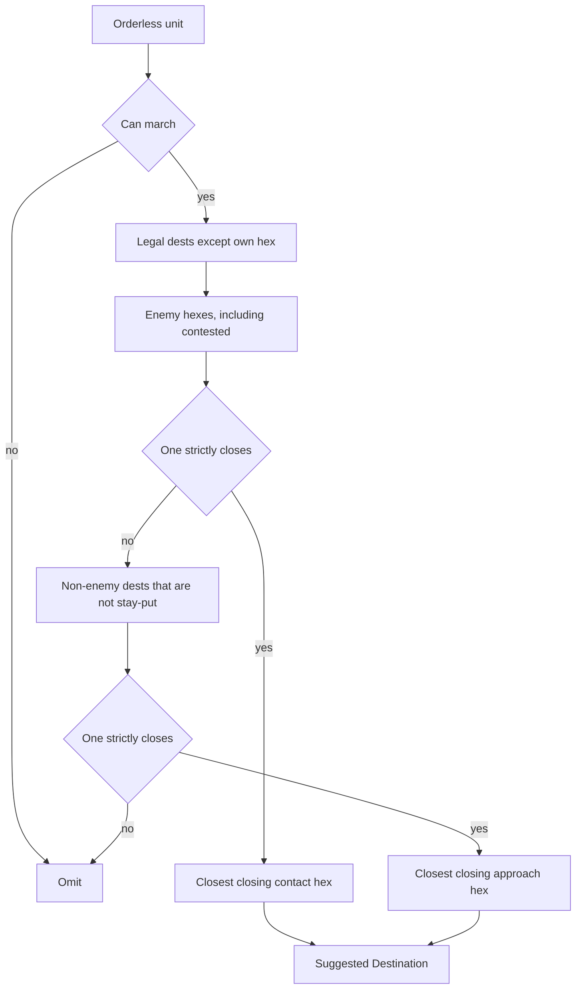

# Orderless Contact Suggestion And Movement Copy

> **For agentic workers:** Implement this plan phase by phase. Steps use checkbox (`- [x]`) syntax. Do not copy phase titles into source, comments, configuration, or `doc/`. Do not commit or push.

**Goal:** Make the orderless Suggested Destination name a legal enemy hex when moving there strictly closes on the nearest enemy, and reword the strategic briefing so a blank cell means defend and a Best Options hex is the only explicit move.

**Architecture:** Suggestion selection changes only the candidate choice inside `suggestApproachDestinationsForOrderlessUnits`. Ranking stays in `bestClosingDestination` and `pickApproachHexesTowardNearestEnemy`. Prompt copy changes in three existing string builders. Order validation, pathfinding, weather numbers, and the tactical clamp sentence stay as they are.

**Tech stack:** TypeScript main process. Compile with `npm run build:main`, then run each test file with `node dist/...test.js`. That is the same command the test-file headers already document. `coachingText.test.ts` and `gameRuleText.test.ts` use `node:test`; the others call their own `run()`. A failing `node:test` file exits non-zero. The custom runner prints `OK` or `FAIL` and exits on the first failure.

## Global constraints

- CamelCase files under `src/`. Exported functions camelCase, exported types PascalCase. Role suffixes only: `Handler`, `Helpers`, `Guards`, `Adapter`, `Pipeline`, `Core`, `Types`. No `Utils` or `Impl`.
- Orienting comments on every new or updated field and non-overriding method: why it exists, when to use it, expected outcome, exceptions.
- Public main-process methods log at debug. Caught exceptions log at error. Getters that do not change state log at trace. Use `logDebug`, `logTrace`, and `logError` from `src/main/logger.ts`. The logger checks the level before building the message.
- Tests cover the happy path and essential failures only.
- Desirable file size 600 lines, hard limit 1000. Desirable argument count 6, hard limit 10.
- Do not put this plan’s section titles into version-controlled product code, comments, or `doc/`.
- Do not commit or push.
- Update the living prompt docs in `doc/ai-commander-prompts/` in place. Do not copy them into `.spec`.

## Confirmed behavior

Try a closing enemy hex first. Only if none strictly closes, keep today’s approach suggestion.

1. Skip air and any other unit for which `canAssignStandingOrderType(unitType, 'march')` is false. Those units stay absent from the map.
2. Take `getValidDestinations` and drop the unit’s own hex. Do not call `getValidDestinationsUnoccupied`.
3. Contact pool: every remaining hex that holds an enemy, including a hex that also holds a stay-put friendly.
4. If `bestClosingDestination` returns a hex for that contact pool, that hex is the suggestion. Among closing contact hexes it still picks the one closest to the unit, then the smaller hex id.
5. Otherwise use the approach pool: remaining hexes that do not hold an enemy and are not stay-put friendly hexes. A hex a friendly is leaving this period stays eligible. The same `bestClosingDestination` call chooses among those.
6. If that also returns null, omit the unit. The table already renders an em dash (`—`, U+2014). This includes no observed enemy, and a unit already standing on the nearest enemy, because nothing is strictly closer than distance 0.
7. Never suggest the unit’s current hex.

An enemy two steps away, inside an armor budget of 2, must beat the empty hex one step away. Picking the closest hex to the unit out of a mixed pool would choose the empty step and miss the Best Options move/melee row. Contact-first avoids that. Falling back when no contact hex strictly closes avoids the other miss: a legal enemy hex that does not get closer must not hide an empty step that does.

Do not change `assignOrder` or pathfinding. `resolveRoutePathForUnit` in [src/main/tools/pathfindingRouteResolution.ts](src/main/tools/pathfindingRouteResolution.ts) already removes the destination from the blocked set, so a march whose destination is the enemy hex is accepted with the opponent default `avoidEnemies: true`.

Coaching, when standing orders are enabled:

- A named Suggested Destination is a march destination. It may be the enemy hex. Pursue still needs an enemy unit id; do not tell the model to pursue that hex.
- An em dash means assign defend on the current hex. Do not say the column already holds a hex.
- `explicit_move` copies a Best Options approach or move/melee Target Hex for that unit. That hex is already inside this turn’s budget, weather included. A longer nearest-enemy path is only the remaining distance. Do not put a farther hex from that path into `explicit_move`.

Strategic movement sentence: the printed armor and naval count is the clear-weather budget. When the weather sentence is present and states a lower budget for a unit that lacks that weather, the lower number wins. When the weather bonus is off, that sentence is absent and the clear-weather count stands. An `explicit_move` past the budget is dropped, not shortened. Leave the tactical branch of `buildMovementBudgetRule` unchanged, including its clamp sentence.

Do not change `validateAiOrder`, `validateOrder`, `strategicRangeOnState`, `getValidDestinations`, `buildWeatherRule`, `applyInterestOrApproach`, `pickApproachHexesTowardNearestEnemy`, or `bestClosingDestination`.

## Out of scope

- The “Global Earth map, H3 resolution 1” preamble.
- Tactical naval combat stats, and strategic weather or ferry sentences in a battle with no naval or air.
- Production queues, ferry sweeps, tempo infrastructure strikes, and the tool-round loop.
- Clamping strategic over-budget moves. They stay dropped.
- The variants note that says an occupied option target cannot occur. Best Options occupancy is not part of this change.

## Files

- [src/main/tools/orderlessUnitSuggestions.ts](src/main/tools/orderlessUnitSuggestions.ts) — candidate choice only, inside the existing function.
- [src/main/tools/orderlessUnitSuggestions.test.ts](src/main/tools/orderlessUnitSuggestions.test.ts) — new contracts, appended after the existing three.
- [src/main/openRouter/promptSpec/coachingTextStrategic.ts](src/main/openRouter/promptSpec/coachingTextStrategic.ts) — `ORDERLESS_BULLET`.
- [src/main/openRouter/promptSpec/coachingText.test.ts](src/main/openRouter/promptSpec/coachingText.test.ts).
- [src/main/tools/assessUnitProximity.ts](src/main/tools/assessUnitProximity.ts) — `FOG_PATH_DISTANCE_BRIEFING_LINE` only.
- [src/main/tools/assessUnitProximity.test.ts](src/main/tools/assessUnitProximity.test.ts).
- [src/main/openRouter/promptSpec/gameRuleText.ts](src/main/openRouter/promptSpec/gameRuleText.ts) — strategic return of `buildMovementBudgetRule` only.
- [src/main/openRouter/promptSpec/gameRuleText.test.ts](src/main/openRouter/promptSpec/gameRuleText.test.ts).
- [doc/ai-commander-prompts/strategic-prompt.md](doc/ai-commander-prompts/strategic-prompt.md), [doc/ai-commander-prompts/variants.md](doc/ai-commander-prompts/variants.md), and [doc/ai-commander-prompts/information-decision-model.md](doc/ai-commander-prompts/information-decision-model.md) — the sentences named in each phase.

Leave [src/main/openRouter/possibleUnitActionsStrategicBestOptions.test.ts](src/main/openRouter/possibleUnitActionsStrategicBestOptions.test.ts) assertions as they are. Those fixtures put the enemy four hops away, outside one step, so the suggestion stays an approach hex.



## Phase 1 — Suggestion hex

Verifiable alone. Do not edit prompt sentences in this phase.

- [x] Append four tests to the `tests` array in [src/main/tools/orderlessUnitSuggestions.test.ts](src/main/tools/orderlessUnitSuggestions.test.ts), after the existing three. The runner exits on the first failure, so the existing tests must stay first. Use `findGeodesicLandMassChain` and `buildLandChainState` as the existing tests do. Import `getValidDestinations` from `../oneStepMoveDestinations` for the armor fixture check only.
  - Adjacent enemy: opponent infantry on `chain[0]`, human infantry on `chain[1]`. Suggestion is exactly `chain[1]`.
  - Enemy inside a longer budget: opponent armor on `chain[0]`, human infantry on `chain[2]`. Before asserting the suggestion, assert `getValidDestinations` for that armor includes both `chain[1]` and `chain[2]`. Suggestion is exactly `chain[2]`, not `chain[1]`.
  - Contested contact: opponent infantry on `chain[0]`, a second opponent infantry and a human infantry both on `chain[1]`. Suggestion is exactly `chain[1]`.
  - Already there: opponent infantry and human infantry both on `chain[0]`. The opponent unit is absent from the map.
- [x] Run `npm run build:main`, then `node dist/main/tools/orderlessUnitSuggestions.test.js`. The existing three print `OK`. The new tests then fail.
- [x] In `suggestApproachDestinationsForOrderlessUnits`, replace the candidate filter and the single `bestClosingDestination` call with this block. Do not extract a new function.

```typescript
const legal = getValidDestinations(unit, state).filter((h3) => h3 !== unit.h3Index);
const contact = legal.filter((h3) => enemyOccupiedH3.has(h3));
const approach = legal.filter((h3) => !enemyOccupiedH3.has(h3) && !stayPut.has(h3));
const destination =
  bestClosingDestination(unit.h3Index, contact, enemyOccupiedH3) ??
  bestClosingDestination(unit.h3Index, approach, enemyOccupiedH3);
```

Keep the existing trace log. Pass `legal.length` as `candidateCount` is no longer accurate; log `contactCount: contact.length` and `approachCount: approach.length` instead of `candidateCount`.

Update the orienting comments on `suggestApproachDestinationsForOrderlessUnits` and `bestClosingDestination`. Say a suggestion is a closing enemy hex when one exists, otherwise a closing approach hex, never the unit’s own hex, and omitted when nothing strictly closes.

- [x] Re-run `node dist/main/tools/orderlessUnitSuggestions.test.js` and `node dist/main/openRouter/possibleUnitActionsStrategicBestOptions.test.js`. All of those tests pass.
- [x] Update only these living-doc sentences:
  - [doc/ai-commander-prompts/strategic-prompt.md](doc/ai-commander-prompts/strategic-prompt.md) cell contract 11, replace the current sentence with: `Suggested Destination` is a legal dest from `getValidDestinations` that strictly closes on the nearest enemy, or an em dash when none does, including when the unit is already on the enemy. It is never the unit’s current hex. An enemy-occupied dest is preferred when one strictly closes, including a contested hex, and that hex is the Best Options move/melee contact. Otherwise the cell is one of that unit’s approach hexes.
  - Same file, section 5 item 2, replace the current sentence with: Suggestions and approach rows both call `pickApproachHexesTowardNearestEnemy`. Suggestions read `getValidDestinations`, not `getValidDestinationsUnoccupied`. They take a closing enemy-occupied dest first, including a contested hex, and only then the unoccupied closing dests that approach rows use. A contact suggestion matches the move/melee row, not the approach row.
  - [doc/ai-commander-prompts/variants.md](doc/ai-commander-prompts/variants.md) section 3.5 system cell, replace the suggested-destination sentence with: A suggested destination is required when a closing cell exists. An em dash means none does, including when the unit is already on the enemy.
  - [doc/ai-commander-prompts/information-decision-model.md](doc/ai-commander-prompts/information-decision-model.md) `SUGGESTED_DESTINATION` meaning: a closing enemy-occupied legal dest when one exists, otherwise a closing unoccupied dest, per orderless march-capable unit. Engine source stays `suggestApproachDestinationsForOrderlessUnits` calling `pickApproachHexesTowardNearestEnemy`.
  - Same file, `LEGAL_DEST_OCCUPANCY` meaning: keep the Best Options half. Change the orderless half to: orderless suggestions prefer a closing enemy-occupied dest from `getValidDestinations`, including contested hexes, and otherwise skip stay-put friendlies.

## Phase 2 — Orderless coaching

Depends on phase 1 for the claim that a named hex may be contact. The string test is verifiable on its own.

- [x] In the strategic coaching test in [src/main/openRouter/promptSpec/coachingText.test.ts](src/main/openRouter/promptSpec/coachingText.test.ts) that already matches `Units Without Standing Orders`, add these assertions and no others:

```typescript
assert.doesNotMatch(text, /already holds a legal hex/i);
assert.match(text, /When the cell is —/);
assert.match(text, /assign defend on its current hex/);
assert.match(text, /enemy-occupied hex/);
assert.match(text, /Use pursue only when you supply an enemy unit id/);
assert.match(text, /inside this turn's movement budget, including weather/);
assert.match(text, /Do not copy a farther hex from the printed nearest-enemy path/);
assert.match(text, /Never march to the unit's current Hex/);
```

The `—` in the first new match is U+2014, the same character the orderless table writes.

- [x] Run `npm run build:main`, then `node dist/main/openRouter/promptSpec/coachingText.test.js`. That test fails on the new assertions.
- [x] Replace `ORDERLESS_BULLET` in [src/main/openRouter/promptSpec/coachingTextStrategic.ts](src/main/openRouter/promptSpec/coachingTextStrategic.ts) with this exact string. The dash before “the unit is already” is U+2014:

```text
- For every unit listed under ## Units Without Standing Orders, add an orders[] entry with action assign_order. When Suggested Destination names a hex, march there; that hex is a legal destination that closes on the nearest enemy, and it may be the enemy-occupied hex. Use pursue only when you supply an enemy unit id, not in place of that hex. When the cell is —, the unit is already on the enemy or has no closing step: assign defend on its current hex. Never march to the unit's current Hex; that order is dropped as already arrived and the unit stays idle. When you need a one-step explicit_move this turn, copy a Best Options approach or move/melee Target Hex for that unit. That hex is already inside this turn's movement budget, including weather. Do not copy a farther hex from the printed nearest-enemy path.
```

- [x] Update the orienting comment on `ORDERLESS_BULLET`: a named cell is the march dest and may be contact; a blank cell means defend; pursue needs a unit id.
- [x] Re-run `node dist/main/openRouter/promptSpec/coachingText.test.js`. It passes, including the gate test that drops the orderless bullet when standing orders are off.
- [x] In [doc/ai-commander-prompts/strategic-prompt.md](doc/ai-commander-prompts/strategic-prompt.md) coaching item 8, replace the two sentences that begin “For each row” and “The suggested destination” with: For each row, march to the named hex, which may be enemy-occupied, or assign defend when the cell is an em dash. Pursue only with an enemy unit id, not in place of that hex. Never march a unit to its own cell. An `explicit_move` copies a Best Options Target Hex that is already inside this turn’s budget, including weather, and does not copy a farther hex from the printed nearest-enemy path.

## Phase 3 — Path length and budget sentences

Independently verifiable. Do not edit the tactical return of `buildMovementBudgetRule`. Do not edit `buildWeatherRule`.

- [x] In `testFogPathHonestyLineUsesBestOptionsDestCopy` in [src/main/tools/assessUnitProximity.test.ts](src/main/tools/assessUnitProximity.test.ts), keep the checks for `path lengths`, `Best Options This Turn`, and the omniscient line. Add:

```typescript
assert.ok(FOG_PATH_DISTANCE_BRIEFING_LINE.includes("inside this turn's budget, including weather"));
assert.ok(FOG_PATH_DISTANCE_BRIEFING_LINE.includes('Do not copy a farther hex from the printed path'));
assert.ok(FOG_PATH_DISTANCE_BRIEFING_LINE.includes('explicit_move past the budget is dropped'));
assert.ok(!FOG_PATH_DISTANCE_BRIEFING_LINE.includes('copy them even when'));
```

- [x] In the strategic half of the `buildMovementBudgetRule` test in [src/main/openRouter/promptSpec/gameRuleText.test.ts](src/main/openRouter/promptSpec/gameRuleText.test.ts), keep the existing assertions. Add:

```typescript
assert.match(strategic, /Movement budgets in clear weather/);
assert.match(strategic, /When the weather sentence states a lower budget for a unit that lacks that weather, that lower number is this turn's budget/);
assert.match(strategic, /dropped, not shortened to the first step/);
assert.match(tactical, /clamped to the first reachable leg/);
assert.doesNotMatch(tactical, /\bdropped\b/);
```

- [x] Run `npm run build:main`, then `node dist/main/tools/assessUnitProximity.test.js` and `node dist/main/openRouter/promptSpec/gameRuleText.test.js`. The new assertions fail.
- [x] Replace `FOG_PATH_DISTANCE_BRIEFING_LINE` with:

```text
Nearest-enemy distances are march or sail path lengths when a path exists (otherwise a hop count). That length can be longer than one movement budget. Best Options This Turn Target Hexes are the one-step destinations already inside this turn's budget, including weather. Copy a Target Hex into explicit_move. Do not copy a farther hex from the printed path; an explicit_move past the budget is dropped.
```

Update that constant’s orienting comment: the printed path is remaining distance, and the Target Hex is the hex to order.

- [x] Replace only the strategic `return` of `buildMovementBudgetRule` with this template literal, so the two `${...}` calls stay interpolated:

```typescript
return (
  `Movement budgets in clear weather: ${getMovementBudget('infantry')} cell for infantry, ` +
  `${getMovementBudget('armor')} for armor and naval, and air never marches. ` +
  "When the weather sentence states a lower budget for a unit that lacks that weather, that lower number is this turn's budget. " +
  'Armor that enters a rugged, arctic, or city hex ends its move there. Armor already on that hex may leave. ' +
  'A longer route continues on the next turn, and the turn count includes that halt. ' +
  "An explicit_move farther than this turn's budget is dropped, not shortened to the first step."
);
```

Update that function’s orienting comment: the strategic sentence names clear-weather counts, defers to a lower number only when the weather sentence states one, and says an over-budget explicit move is dropped.

- [x] Re-run the two test files from this phase, plus `node dist/main/briefingFormatter.test.js` and `node dist/main/openRouter/promptSpec/variantConformance.test.js`. All pass.
- [x] In [doc/ai-commander-prompts/strategic-prompt.md](doc/ai-commander-prompts/strategic-prompt.md), replace clause 12 with: Movement budgets in clear weather: one cell for infantry, two for armor and naval, and air never marches (`buildMovementBudgetRule`). When clause 6 states a lower budget for a unit that lacks that weather, the lower number is this turn’s budget; that shorter budget does not stack with the armor stop. Armor that enters a rugged, arctic, or city hex ends its move there. Armor already on that hex may leave. A longer route continues on the next turn, and the turn count includes that halt. An explicit_move farther than this turn’s budget is dropped, not shortened to the first step.
- [x] In the same file’s fog-on distance-basis caveat, replace the sentence that begins “Copy them even when” so the caveat says: Best Options Target Hexes are the one-step destinations already inside this turn’s budget, including weather. Copy a Target Hex into explicit_move. Do not copy a farther hex from the printed path; an explicit_move past the budget is dropped.
- [x] In [doc/ai-commander-prompts/information-decision-model.md](doc/ai-commander-prompts/information-decision-model.md), update job 24, the fog-on distance sentence, the `HOP_VS_PATH_CAVEAT` meaning, and the `MOVE_BUDGET` meaning so they match those two sentences. Do not change the tactical or fog-off hop sentences beyond keeping them true.

## Phase 4 — Combined check

- [x] Run `npm run build:main`, then these files, in order. Stop at the first non-zero exit. Do not commit.
  - `node dist/main/tools/orderlessUnitSuggestions.test.js`
  - `node dist/main/openRouter/possibleUnitActionsStrategicBestOptions.test.js`
  - `node dist/main/openRouter/promptSpec/coachingText.test.js`
  - `node dist/main/tools/assessUnitProximity.test.js`
  - `node dist/main/openRouter/promptSpec/gameRuleText.test.js`
  - `node dist/main/briefingFormatter.test.js`
  - `node dist/main/openRouter/promptSpec/variantConformance.test.js`
