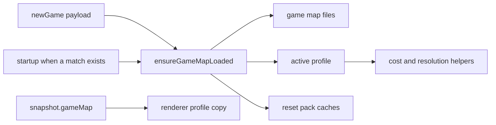

# Regional Game Execution Plan

The executing agent follows this plan phase by phase, in order. Each phase ends with a verification block. Don't start a phase until the previous phase's verification passes.

## Goal

Make a regional game playable beside the global game. A regional game is the global game on one regional map, with that map's resolutions and the rule numbers in [Rules catalog](#rules-catalog).

The player picks the mode in the start-game dialog. Map data loads when a game starts, and again at the next launch if that game is still the current match. A clean database loads nothing and draws no hexes. The main map and the mini map cannot pan or zoom out past the loaded map. Inside that limit, panning and zooming work as they do today.

## Out of scope

Leave these alone. They are open issues in `doc/region-summary-1.md`, not this work.

- The win condition. A side still wins by controlling every enemy home hex, or by eliminating that home's urban cells. A side group is the home region. Don't add a production-weighted win.
- The shoreline-wetlands classifier, and the forest-before-mountain classifier order.
- Urban data quality, EarthEnv, and per-unit price scales.
- Battle rules, ranges, vision, strike and ferry radii, weather categories, and sub-unit counts.
- Global JSON filenames, global JSON keys, and the global Python pipeline's output.
- IPC channel string values.

## Background the agent needs

### Two games, one rule path

The global map is H3 resolution 1 (842 strategic hexes) with battles at resolution 4. Regional maps are resolution 2 with battles at 5, or resolution 3 with battles at 6. Every battle is still the children of one strategic hex, three levels down.

Regional packs are already generated under `data/generated/regions/<region_id>/`. The app does not read them. `scripts/regional_pipeline/README.md` lists the files. Each `region_manifest.json` has `res_s`, `res_t`, `scalerank_policy`, and `hexes[]` of `{ h3_index, role }` where role is `land`, `sea`, or `neutral_border`. The JSON envelopes match the global files. The envelope `resolution` field is the real H3 resolution.

Folder ids are the map ids. They differ from the ids in `doc/region-summary-1.md`:

| Summary id | Folder id |
| --- | --- |
| eastern-asia | `eastern_asia` |
| western-europe | `western_europe` |
| southern-europe | `southern_europe` |
| western-asia-north | `western_asia_north` |
| southern-asia-west | `southern_asia_west` |
| northern-america | `northern_america` |
| southern-asia-east | `southern_asia_east` |
| central-asia | `central_asia` |
| central-america | `central_america` |
| northern-europe | `northern_europe` |
| southern-africa | `southern_africa` |
| libya-egypt-sudan | `libya_egypt_sudan` |
| maghreb | `maghreb` |
| west-africa-coast | `west_africa_coast` |
| eastern-europe | `eastern_europe` |
| south-america | `south_america` |
| south-eastern-asia | `south_eastern_asia` |
| caribbean | `caribbean` |
| australia-nz | `australia_new_zealand` |
| middle-africa-north | `middle_africa_north` |
| middle-africa-south | `middle_africa_south` |
| southern-east-africa | `southern_east_africa` |
| horn-great-lakes | `horn_and_great_lakes` |

### What happens today

Startup (`src/main/main.ts`) calls `initDatabase()`, which always calls `ensureTerrainClassificationCacheLoaded()` (`src/main/terrainClassificationCache.ts`). That reads the eight global JSON files once into module-level caches. A missing required file throws, so the app does not boot without global data.

`getOrderedHexList()` (`src/main/mapData.ts`) is every resolution-1 child of every resolution-0 cell. `getGameStateSnapshot()` (`src/main/gameDb/fogState.ts`) uses that list whenever `hexes` has any row, and fills a missing row as `land` / `plains`. A regional hex table would still draw the whole globe.

The database is `game-baseline-v12.sqlite`. `EXPECTED_USER_VERSION` is 16 (`src/main/gameDb.ts`). There is no migration list. A version mismatch renames the file aside and creates a fresh database. Bump the version when the DDL changes. Don't rename the sqlite filename.

These tables and the column `units.birth_res4_h3_index` are the resolution-named schema (`src/main/gameDb/schema.ts`): `res1_control`, `res1_build_queue`, `res1_build_progress`, `res1_infrastructure`, `res4_feature_overrides`. Triggers in `src/main/gameDb/controlInfrastructure.ts` roll tactical feature rows up into `res1_infrastructure`.

Match settings are rows in `game_config`. `scenario_id` is always `region_vs_region`. Home regions are UN subregion names from the global naming JSON (`src/main/regionScenario.ts`), stored as `scenario_region_human` and `scenario_region_ai`. `resetGame.ts` writes `map_size` as `world`. That value is unused by play.

The start screen is `#game-over-overlay` in `static/index.html`. It is also the game-over screen. Two selects pick the human and AI home regions. Game size, bonuses, fog, and starting month sit below them. Region options come from IPC `game:listScenarioHomeRegions`. Starting calls IPC `game:newGame`.

The map is Leaflet. `initWorldLeafletMaps` (`src/renderer/map/worldLeafletMap.ts`) sets the main map's `maxBounds` to the Web Mercator world, `minZoom` 1.5, `maxZoom` 12, `worldCopyJump: true`, and `maxBoundsViscosity: 1`. The mini map is not draggable or zoomable. It fits the same world bounds and draws a rectangle of the main view. `exitTacticalMapView` (`src/renderer/map/tacticalMapView.ts`) puts the world bounds back.

Unit origin is a country (`src/main/unitOrigin/`). Flags are `static/flags/<iso2>.svg`, from the vendored country-flags set. `countryFlagAssetPath` (`src/shared/countryFlags.ts`) falls back to `static/flag-unknown.svg`. The country bonus compares country names (`src/shared/originBonusRules.ts`).

### Rules that are constants today

| Rule | Today | Where |
| --- | --- | --- |
| Unit costs | 20 / 40 / 100 / 60 | `UNIT_COST_BY_TYPE` in `src/shared/productionConfig.ts` |
| Build minimum urban cells | infantry 1, armor 2, air 5, naval 10; naval also needs a seaport; air also needs an airport | `BUILD_PREREQUISITES_BY_TYPE` and `getAvailableBuildUnitTypes` in `src/main/productionRules.ts` |
| Advanced tech | 21 baseline urban cells | `TECH_ADVANCED_MIN_URBAN_HEX_COUNT` in `src/shared/techBonusRules.ts` |
| Strategic urban air strike | up to 9 tactical urban cells | `MAX_URBAN_RES4_CELLS_DESTROYED_PER_STRATEGIC_URBAN_AIR_STRIKE` in `src/main/gameActions/airStrikeResolution.ts` |
| Tactical urban air strike | 1 cell | the same function, when a tactical cell is passed |
| Strategic movement | hop budget; weather can reduce armor and naval to 1; terrain does not slow | `src/shared/weatherBonusRules.ts`, `src/main/pathfinding.ts` |
| Strategic cover | forest 2/1, mountain 2/0, wetlands 1/0; urban is ignored on the strategic map | `src/shared/terrainCoverRules.ts`, `src/main/terrainCover/terrainCoverLookup.ts` |
| Scalerank cutoffs | urban 5, major airports and seaports 5 | `src/main/terrainMetadataLoad.ts` |

`doc/combat-rules-v3.md` says a strategic strike destroys 3 urban cells. The live constant is 9. Keep 9 for the global game.

Prompt sentences that mention costs, minimums, and the Advanced threshold already interpolate these constants (`src/main/openRouter/promptSpec/gameRuleText.ts`, `gameRuleTechText.ts`). No sentence states the strike cell count.

### Main and renderer are two processes

A module under `src/shared/` is bundled twice: once in the main process and once in the renderer. Writing the active map in main does not change the renderer's copy. The renderer learns the active map from `GameStateSnapshot`.

## Settled decisions

These were decided before this plan was written. Don't revisit them.

### Map identity

- The global map id is `global`. A regional map id is its folder id.
- Persist it in `game_config` under `game_map_id`.
- Remove the `map_size='world'` write. Don't add a replacement `map_size` value.
- Keep `scenario_id` as `region_vs_region` for both modes. Victory, seeding, and prompts branch on that id today. The map id is a separate key.
- An in-progress match from before the schema bump is discarded by the existing version check. Don't write a migration.

### Starting areas

The Regional tab's two selectors list side groups, the named groups in Table 1 of `doc/region-summary-1.md`. They don't list individual provinces.

Global selectors stay the UN subregion names from the global naming JSON.

### Rules catalog

Copy the numbers below into `src/shared/regionalRulesCatalog.ts`. Don't recompute them at runtime. Don't read `doc/region-summary-1.md` from the app.

Costs are infantry / armor / naval / air. Minimums are armor / air / naval urban cells. Infantry stays at 1 urban cell, and air still needs an airport and naval a seaport, on every map. Strike cells are `max(1, round(9 × scale))` with half-up rounding, which is what `Math.round` does for positive numbers. The global strike value stays 9, not `round(9 × 1)`.

| Folder id | Res | Costs | Minimums | Advanced | Strike cells |
| --- | --- | --- | --- | --- | --- |
| `eastern_asia` | 2 / 5 | 30 / 60 / 150 / 90 | 3 / 7 / 14 | 27 | 13 |
| `western_europe` | 3 / 6 | 65 / 130 / 325 / 195 | 9 / 20 / 38 | 60 | 29 |
| `southern_europe` | 3 / 6 | 45 / 90 / 225 / 135 | 5 / 12 / 21 | 47 | 20 |
| `western_asia_north` | 3 / 6 | 25 / 50 / 125 / 75 | 3 / 10 / 13 | 20 | 11 |
| `southern_asia_west` | 3 / 6 | 35 / 70 / 175 / 105 | 5 / 11 / 17 | 32 | 15 |
| `northern_america` | 2 / 5 | 20 / 40 / 100 / 60 | 3 / 7 / 13 | 22 | 10 |
| `southern_asia_east` | 3 / 6 | 20 / 40 / 100 / 60 | 4 / 9 / 12 | 18 | 10 |
| `central_asia` | 3 / 6 | 20 / 40 / 100 / 60 | 3 / 8 / 11 | 19 | 9 |
| `central_america` | 3 / 6 | 13 / 26 / 65 / 39 | 2 / 6 / 8 | 12 | 6 |
| `northern_europe` | 3 / 6 | 40 / 80 / 200 / 120 | 2 / 13 / 24 | 34 | 17 |
| `southern_africa` | 3 / 6 | 18 / 36 / 90 / 54 | 4 / 6 / 9 | 16 | 8 |
| `libya_egypt_sudan` | 3 / 6 | 19 / 38 / 95 / 57 | 3 / 6 / 10 | 23 | 9 |
| `maghreb` | 3 / 6 | 20 / 40 / 100 / 60 | 5 / 9 / 14 | 18 | 10 |
| `west_africa_coast` | 3 / 6 | 20 / 40 / 100 / 60 | 3 / 7 / 12 | 20 | 10 |
| `eastern_europe` | 2 / 5 | 19 / 38 / 95 / 57 | 3 / 6 / 11 | 17 | 8 |
| `south_america` | 2 / 5 | 9 / 18 / 45 / 27 | 2 / 4 / 5 | 8 | 4 |
| `south_eastern_asia` | 2 / 5 | 9 / 18 / 45 / 27 | 2 / 3 / 5 | 8 | 4 |
| `caribbean` | 3 / 6 | 11 / 22 / 55 / 33 | 3 / 5 / 6 | 8 | 5 |
| `australia_new_zealand` | 2 / 5 | 8 / 16 / 40 / 24 | 2 / 3 / 4 | 9 | 4 |
| `middle_africa_north` | 3 / 6 | 10 / 20 / 50 / 30 | 2 / 4 / 6 | 10 | 5 |
| `middle_africa_south` | 3 / 6 | 11 / 22 / 55 / 33 | 2 / 6 / 7 | 9 | 5 |
| `southern_east_africa` | 3 / 6 | 11 / 22 / 55 / 33 | 3 / 6 / 8 | 9 | 5 |
| `horn_and_great_lakes` | 3 / 6 | 11 / 22 / 55 / 33 | 3 / 6 / 8 | 9 | 5 |

Global rules, not in that file: costs 20 / 40 / 100 / 60, minimums 2 / 5 / 10, Advanced 21, strike cells 9, resolutions 1 / 4, scalerank maxima urban 5, airport 5, seaport 5, city label 4.

A regional map uses its manifest `scalerank_policy` for those four maxima. Roads and rail are already filtered in the JSON.

### Rules that apply to both modes

- Armor that enters a rugged, arctic, or city hex ends its move there. Infantry and naval movement don't change. Weather slowing and this stop don't stack: weather still reduces the hop budget, and the stop only prevents leaving the blocking hex. Don't add an extra movement cost on top of either.
- Rugged: at least half of the hex's land tactical cells pass the mountain test (TRI ≥ 24, or slope ≥ 5 with elevation_max ≥ 700), whatever the land cover. Arctic: at least half of its land tactical cells are arctic. City: at least 86 tactical cells are urban in the generated data. Keep 86 as an absolute count. The twelve pentagon hexes have fewer children and sit in open ocean, so they don't need a ratio. Use the same mountain and arctic tests as `src/main/terrainClassifierFromMetadata.ts`. Share the threshold constants. Don't copy the numbers into a second table.
- Strategic cover adds city hexes at 2/1 and rugged hexes at 2/0. Where more than one cover applies, each column keeps its larger value. Tactical cover is unchanged. A strategic strike on infrastructure still ignores cover.
- A neutral-border hex can be entered and held by infantry and armor. It adds no production points, it accepts no build queue, and an air unit cannot base there. Naval movement is unchanged, so naval units still only enter water and coastal hexes.
- The country bonus matches the unit's origin area to the hex's origin area. In the global game the origin area is the country, and the comparison stays the country name, so current global bonuses don't change.
- The hex tooltip Effects line and the planning effects tooltip show these new impacts with the existing status icons in `src/shared/statusIconHtml.ts`. A stop uses the blocked icon. Cover of 1 uses the up icon and cover of 2 uses the double-up icon. A slowdown stays the down icon. Don't add a new icon.

### Dialog

The opponent section becomes two tabs, Global and Regional. Game size, the four bonuses, fog, and the starting month stay outside the tabs.

The Regional tab has one region selector, centered, above the human and AI side-group selectors. Each side-group selector has a randomize button. Opening the overlay randomizes the global regions, the regional map, and both side groups. Global randomize stays independent, so the two global home regions may match, as they can today. The two regional side groups are always different. Changing the region reloads the side lists and randomizes both sides again.

When a match is loaded, the overlay opens on the tab for that match (`global`, or Regional for any other id). With no match, it opens on Global. The lists load when the overlay opens. They do not load while the overlay is still hidden at startup, so a clean launch reads no terrain files.

Under each game-size unit symbol, under the unit name, show that unit's cost for the tab and region currently selected, as `$10`. On the Regional tab, under the side selectors, show `Advanced tech: $N+ hexes` with that region's Advanced threshold. Both lines update as the selection changes. Unit-cap badges stay driven by game size only.

### Map maximum extent

Locked means the maximum area, not a fixed camera.

- The main map's `maxBounds`, with `maxBoundsViscosity: 1`, is the loaded map's bounds. Dragging stops at that edge. Scroll-wheel zoom, zoom snap, and keyboard pan stay as they are.
- `minZoom` is the zoom at which those bounds just fit the window, including the same padding `fitBounds` uses, so the player cannot zoom out to the rest of the world. Compute it by fitting once with the current low minimum, then set `minZoom` to that fitted zoom. Setting the minimum first traps the view inside a zoom that cannot show the whole map. `maxZoom` stays 12. A tactical battle still raises the maximum and tightens the bounds to the battle, and leaving the battle restores the loaded map's maximum extent and the saved strategic view. Keyboard pan uses the same bounds as dragging.
- When a game's state arrives, fit the view to that extent, then keep the existing one-level zoom onto human units (`applyInitialCameraForState` in `src/renderer/map/mapHelpers.ts`).
- A clean database uses the current world bounds (`WEB_MERCATOR_MAX_ABS_LAT`, ±180°) and the current `minZoom` of 1.5.
- The mini map stays non-interactive (`dragging: false`, no scroll zoom). Its fitted bounds are the same maximum extent. The viewport rectangle still tracks the main view.
- `worldCopyJump` stays true for the global map and is false for a regional map.

Bounds come from strategic cell centers, not raw boundary vertices. Longitude uses the largest empty gap, not the average:

1. Sort the center longitudes. Include the gap that wraps past ±180.
2. The map occupies the complement of the largest gap. Unwrapped, that interval can run past ±180 (Eastern Europe runs from Europe eastward through the Pacific edge). A map that does not cross the antimeridian keeps a normal interval (Australia and New Zealand).
3. Shift each cell's boundary vertices by multiples of 360 so each vertex sits within 180° of its own center, then expand the interval to include those vertices. Clamp latitude to `WEB_MERCATOR_MAX_ABS_LAT`.

Leaflet accepts a longitude past ±180, so that interval is the `maxBounds`.

### Flags

Sub-national flags are SVG files from Wikimedia Commons, found through Wikidata. Accept public domain, CC0, CC BY, and CC BY-SA, and record attribution. Skip a file over 300 KB, a file that isn't SVG, and a file with any other license. Anything skipped uses the parent national flag, then `flag-unknown.svg`.

### Packaging

The installer ships the regional zips, not the extracted JSON. Dev and the packaged app use the same load order: the repo JSON if it is already extracted, then a previous extract under Electron `userData`, then that one region's zip. The first play of a region extracts only that region. `npm start` and `npm run build` do not extract every region. `npm run regional:extract` stays available when someone wants all of the JSON on disk.

## Behavior contract

### Stays the same for a global game

Resolutions 1 and 4, the 842-hex world, costs, build minimums, the Advanced threshold, strike damage of 9 and tactical damage of 1, country-name bonuses, national flags, UN subregion home areas, seeding, victory, fog, game size, and the bonus levels.

### Changes for a global game too

Armor stops on a rugged, arctic, or city hex. City and rugged hexes add strategic cover as described above. Startup no longer reads terrain files when the database has no match. The dialog gains tabs and cost labels. Database table names change, so an old match database is discarded once.

### A regional game adds

Its footprint, resolutions, scalerank policy, rules-catalog numbers, side-group home areas, origin-area names and flags, neutral-border limits, and the maximum map extent.

## Ground rules

1. Never commit or push. Leave every change in the working tree.
2. One phase at a time. If verification fails and the cause isn't clear after two focused attempts, stop and report the command and its output.
3. No plan identifiers in versioned files. Don't write phase names, phase numbers, or headings from this plan into code, comments, tests, config, README files, `doc/`, or `package.json`.
4. Orienting comments. Every new or changed exported function, class, type, and module-level const, and every new field, has a comment that says why it exists, when to use it, and what it returns or throws. A comment that only restates the name is not enough.
5. Logging. New and changed public main-process functions log `logDebug` on entry with their identifying arguments. Getters that don't change state log `logTrace`. Every `catch` logs `logError` with the error before rethrowing or returning a failure. Use `src/main/logger.ts`. Renderer code has no logger; failures there use the existing toast or `console.error` path already next to the call.
6. Tests cover the happy path and the essential failure only. Don't test constructors, pass-through IPC handlers, or private steps. When a global behavior on purpose changes, update the existing test and add a comment that names the rule. Don't weaken an assertion to make it pass.
7. File size. New code goes in a new module when the destination is already over 600 lines. Those files may take a call-site edit only. The hard limit is 1000 lines. Known large files: `src/renderer/core/state.ts`, `src/renderer/entryCallbacks.ts`, `src/main/gameDb/controlInfrastructure.ts`, `src/main/terrainMetadataLoad.ts`, `src/main/terrainNamingLoad.ts`, `src/renderer/renderer.ts`, `src/renderer/rendering/gameScene.ts`, `src/main/terrainClassificationCache.ts`, `src/renderer/map/initCore.ts`, `src/main/gameActions/airStrikeResolution.ts`, `src/main/tacticalBattle/tacticalStrategicOrderPhases.ts`. `src/main/openRouter/promptSpec/gameRuleText.ts` is at the 600-line mark; put new prompt sentences in a sibling module.
8. Functions take at most six named arguments, and never more than ten. Past that, pass one parameter object.
9. Naming. Directories and TypeScript files under `src/` are camelCase. Exported functions are camelCase. Exported types are PascalCase. Role suffixes stay on the allowlist in `doc/naming-conventions-contract-v1.md`. Don't add `Utils` or `Impl`. String values listed as frozen in that contract stay frozen, including IPC channel strings.
10. After any change under `src/renderer/`, run `npm run build:renderer` so `static/renderer.js` matches.
11. Python, from the repo root, after `.\.venv\Scripts\Activate.ps1`. The venv already has the packages the regional pipeline uses.
12. Tests that need the active map leave it on the global default. Add `withGameMap(profile, fn)` and use it for every test that switches maps. It restores the default in a `finally` block, including when the test throws. A leaked profile makes later tests run at the wrong resolution.

## Shared design

Use this shape from the phase that introduces it. Later phases call it. They don't invent a second one.

`src/shared/gameMapTypes.ts` holds:

- `GameMapId`: `global` or a regional folder id.
- `GameMapProfile`: id, display name, strategic resolution, tactical resolution, rules, and scalerank maxima.
- `GameRules`: the four costs, three build minimums, Advanced threshold, and strategic strike cell count.

`src/shared/activeGameMap.ts` holds the process-local profile. It defaults to the global profile so existing tests keep resolution 1 and 4 and the global costs without setup. `setActiveGameMap` replaces it. `resetActiveGameMap` restores the default.

Helpers, all reading the active profile:

- `strategicH3Resolution()`, `tacticalH3Resolution()`
- `strategicParentOf(h3Index)`, `tacticalChildrenOf(h3Index)`
- `isStrategicCell(h3Index)`, `isTacticalCell(h3Index)`
- `strategicCellAt(lat, lng)`, `tacticalCellAt(lat, lng)`
- `unitCostFor(unitType)`, `buildMinimumUrbanCells(unitType)`, `advancedTechMinUrbanCells()`, `strategicUrbanCellsDestroyedPerHit()`
- `isNeutralBorderHex(h3Index)` once roles are loaded; until then it is false

`GLOBAL_STRATEGIC_H3_RESOLUTION` and `GLOBAL_TACTICAL_H3_RESOLUTION` remain the numbers 1 and 4 for fixtures. Production code uses the functions.

`src/main/gameMap/` holds the loader, path resolution, manifest parsing, the dialog catalog, and a cache-reset registry. Pack-scoped caches register a reset function. The loader calls the registry before filling caches.

The snapshot gains `gameMap: { id, displayName, strategicResolution, tacticalResolution }` and optional `gameMapLoadError: string`. The renderer copies `gameMap` into its own `activeGameMap` inside `applyGameStateSnapshot`, before drawing.

## Phase 1: Side groups and origin areas

### Purpose

Write, for all 23 maps, the side groups and the origin area of each tactical land cell. The app reads these in later phases.

### Definitions

Add `scripts/regional_pipeline/side_group_catalog.py`. Data only, plus the lookup helpers the step needs.

For each country in a map, set `origin_level` to `admin1`, `region`, or `country`, following the origin-unit column of Table 1 and the Method section of `doc/region-summary-1.md`. `admin1` is one Natural Earth admin-1 unit. `region` groups admin-1 units by the shapefile's `region` field. `country` is the whole country. Spain's origin level is `region`: the shapefile `region` field is the autonomous community. Don't invent a fourth level.

Follow the docstring and logging style already in `scripts/regional_pipeline/`: `Why this exists`, `When to use`, and `What to expect` on every new function, a `#` comment on every new module-level constant, `LOGGER.debug` on entry to a public function, and `LOGGER.error(..., exc_info=True)` before re-raising.

For each map, define the side groups by display name. Membership is one of: a list of admin-1 `iso_3166_2` codes, a list of `region` or `region_sub` values, or a coordinate split named in the Method section (Turkey at 35°E, Uzbekistan at 67.5°E, Iran at 33°N and 54.5°E, and the other splits listed there). Copy those splits. Don't add new ones. US groups use Census divisions (`region_sub`). Where Table 1 names a state list and the Method section doesn't enumerate it, read the shapefile, assign each admin-1 unit to the group its name belongs to, and write the codes into the catalog. An admin-1 unit that fits no group fails the step.

### Assignment

Add a step that reads the existing manifest and the admin-1 shapefile (`ne_10m_admin_1_states_provinces.shp`, the same way `member_geometry.py` reads it). Don't regenerate metadata, naming, landmass, weather, or roads. Don't parse `terrain_res_t_metadata.json` or `terrain_res_t_naming.json`. A tactical cell is non-water when it intersects the land geometry used by the footprint step. The step is resumable per region.

1. Build origin units. The id is `iso_3166_2` for `admin1`, `<ISO2>:<region name>` for `region`, and the ISO2 code for `country`. Store the display name, the parent ISO2 (`country_code`), and `iso_3166_2` when the unit is a single admin-1 area. Leave `iso_3166_2` null for a region or a whole country.
2. Give every non-water tactical cell the origin unit with the largest land overlap. Ties break by id, ascending.
3. Give every `land` strategic hex the side group that owns the most of its tactical land cells. Ties break by group id, ascending. `sea` and `neutral_border` hexes have no group.
4. A group with zero land hexes fails the step. Print the group and stop that map.

### Outputs

- Manifest `schema_version` becomes `1.1.0`. Add `side_groups[]` (`id`, `display_name`, `land_hex_count`) and `origin_units[]` (`id`, `name`, `country_code`, `iso_3166_2` or null). Add `side_group_id` to each land hex. Keep every existing field.
- `terrain_res_t_origin_units.json`: envelope plus records `{ h3_index, origin_id }` for non-water tactical cells only.
- `qa/side_groups_qa.json`: per group, land hexes and share of the map's tactical urban cells, next to the Table 1 estimate.

`read_manifest` accepts 1.0.0 and 1.1.0. After this step, `regional:check` requires 1.1.0, non-empty groups, and an origin record for every non-water tactical cell.

Add `terrain_res_t_origin_units.json` to `REGIONAL_JSON_FILES` in `scripts/generated-regional-manifest.cjs`.

### Checkpoint

Run the step for `eastern_asia` first and read its QA file. Group names match Table 1. No group is empty. Then run all maps.

Table 1's hex counts are estimates from older data. Don't edit membership to force those counts. Do stop if a group's land hexes are zero, or if the map's groups don't sum to its land hexes.

### Verification

From the activated venv:

1. `python -m unittest discover -s scripts/regional_pipeline/tests -p "test_*.py" -v`
2. The new step for all maps, then `npm run regional:check`.
3. Read `data/generated/regions/eastern_asia/qa/side_groups_qa.json` and `data/generated/regions/western_europe/qa/side_groups_qa.json`. Confirm the group names and that land hexes sum to the manifest land count.
4. `npm run regional:zip` so the new file is packed.

## Phase 2: Sub-national flags

### Purpose

Add SVG flags for origin areas that have a Wikimedia flag of the same kind as `static/flags/`.

### Steps

1. Add `scripts/fetch-subdivision-flags.py`. Query Wikidata for ISO 3166-2 codes (property P300) and flag images (property P41). Download an SVG from Commons only when the Commons license metadata is public domain, CC0, CC BY, or CC BY-SA, and the file is at most 300 KB.
2. Write files to `static/flags/subdivisions/<code>.svg` with the code lowercased (`us-ca.svg`).
3. Write `static/flags/subdivisions/ATTRIBUTION.md` with one line per file: code, Commons title, license, author. This file is data, not a design note, so it stays under `static/`.
4. Write `src/shared/subdivisionFlagCodes.ts` exporting the allow-list `Set`. Generate it from the folder. Don't hand-edit it.
5. The script is resumable: skip a code whose SVG is already present. A failed download is a skipped code, logged, and not a failed run.

Don't block later phases on how many flags appear. Missing flags are the national-flag fallback in Phase 12.

### Verification

1. Run the script once. It exits 0.
2. A test reads `static/flags/subdivisions/*.svg` and asserts the allow-list matches the folder exactly.
3. Open three saved SVGs and confirm they are flags, not placeholders.

## Phase 3: Database names

### Purpose

Rename resolution-specific schema objects to `res_s` and `res_t`. Behavior is unchanged. Add 1 to `EXPECTED_USER_VERSION` (16 today, so 17). Later phases add 1 again when they change the DDL: the hex role, then the origin columns.

### Rename

| Current | New |
| --- | --- |
| `res1_control` | `res_s_control` |
| `res1_build_queue` | `res_s_build_queue` |
| `res1_build_progress` | `res_s_build_progress` |
| `res1_infrastructure` | `res_s_infrastructure` |
| `res4_feature_overrides` | `res_t_feature_overrides` |
| `units.birth_res4_h3_index` | `units.birth_res_t_h3_index` |
| `res4_sync_res1_after_insert` | `res_t_sync_res_s_after_insert` |
| `res4_sync_res1_after_delete` | `res_t_sync_res_s_after_delete` |
| `res4_sync_res1_after_update` | `res_t_sync_res_s_after_update` |

Update every SQL string, the required-table list in `src/main/gameDb/databaseValidation.ts`, and TypeScript fields that copy these column names. A camelCase property that only contains `res1` or `res4` waits for Phase 4. Leave IPC strings, JSON keys, and global filenames alone.

Don't rename TypeScript identifiers such as `res1Control` in this phase. That is Phase 4.

### Verification

1. `npm test`.
2. Search `src/` for `res1_` and `res4_`. The only hits are comments, identifier names, IPC strings, and global filenames such as `terrain_res1_metadata.json`. No SQL string still contains `res1_` or `res4_`.

## Phase 4: Code names

### Purpose

Rename `res1` and `res4` identifiers, file names, and comments to the words `strategic` and `tactical`. Behavior is unchanged. Don't bump `EXPECTED_USER_VERSION`. The DDL didn't change.

### What the tool may change

Add `scripts/naming/resolutionWordRename.ts` and a dry-run mode. It uses the TypeScript compiler API so it renames identifiers and not string contents.

Apply these rules to identifiers and file names:

- A `res1` or `Res1` token becomes `strategic` or `Strategic`. A `res4` or `Res4` token becomes `tactical` or `Tactical`.
- Keep the surrounding camelCase. `getTerrainRes1NamingRecordsFromSnapshot` becomes `getTerrainStrategicNamingRecordsFromSnapshot`. `terrainTooltipRes1State.ts` becomes `terrainTooltipStrategicState.ts`.
- If the name already contains `strategic` or `tactical`, drop the `res1` or `res4` token instead of adding a second copy. `tacticalRes4MovementPlanner` becomes `tacticalMovementPlanner`.
- Two different names that collapse to one name are a collision. The dry-run lists them and applies nothing until each collision has a hand-written distinct name in the script. Don't resolve a collision by adding a suffix like `2`.

Then a comment-only text pass replaces `res1` with `strategic` and `res4` with `tactical` inside comments. It doesn't open string literals.

### What the tool must not change

- String literals, including IPC channel values in `src/shared/ipc/channels.ts` (`game:getRes4TerrainOverrides` and the rest), SQL, `game_config` keys, and JSON keys.
- Files under `data/`, `doc/`, `scripts/terrain_pipeline/`, `scripts/naming_pipeline/`, and `scripts/regional_pipeline/`.
- `GLOBAL_STRATEGIC_H3_RESOLUTION` doesn't exist yet. Don't rename the global data filenames.

Update prompt sentences that say `res1` or `res4` by hand, in this phase, and update the tests that assert those sentences. Known sentences are in `src/main/openRouter/promptSpec/coachingTextTactical.ts`, `gameRuleText.ts`, `envelopeContract.ts`, `promptContracts.ts`, `tacticalPromptProjection.ts`, and `scenarioGoals.ts`. Say "strategic" or "tactical". Don't change a prompt heading that doesn't contain those tokens.

Add a naming-check rule that fails `src/**/*.ts` identifiers containing `res1` or `res4`. Allow the tokens inside string literals.

Update `doc/naming-conventions-contract-v1.md` in Phase 14, not here. If `naming:check` fails because the contract text still lists the old abbreviations, limit this phase's new rule to identifiers in `src/`.

### Verification

1. Dry-run. Read the collision list. It is empty before apply.
2. Apply, then `npm run build:renderer`, `npm test`, and `npm run naming:check`. The renderer bundle is generated, so a source rename without the rebuild leaves the app on the old names.
3. Search `src/` for identifier hits of `res1` and `res4`. Remaining hits are string literals and global filenames only.

`npm test` must pass without assertion changes except the prompt sentences edited above and tests whose names were renamed. A behavior failure means the rename touched a string it should have left. Restore that string. Don't change the expected game behavior.

## Phase 5: Variable resolutions

### Purpose

Production code asks the active profile for resolutions. The default profile is global, so results stay 1 and 4.

### Steps

1. Add `gameMapTypes.ts` and `activeGameMap.ts` as in [Shared design](#shared-design).
2. Replace `src/shared/h3Resolutions.ts` with the helper functions. Update production imports. Renderer aliases `WORLD_H3_RESOLUTION` and `DETAIL_H3_RESOLUTION` (`src/renderer/core/constants.ts`) become calls to the helpers.
3. Replace production calls that pass a literal resolution:
   - `cellToParent(x, 1)` becomes `strategicParentOf(x)`.
   - `getResolution(x) === 1` or `=== 4` becomes `isStrategicCell` or `isTacticalCell`.
   - `latLngToCell(lat, lng, 1)` or `4` becomes `strategicCellAt` or `tacticalCellAt`.
   - `cellToChildren(x, TACTICAL_H3_RESOLUTION)` and the other constant forms become `tacticalChildrenOf` or `strategic` helpers.
   - Envelope checks that require resolution 1 or 4 take the file's expected resolution from the caller. The global loaders pass 1 and 4. Don't hard-code those inside the parser.
4. Leave test fixtures and `src/main/**/testSupport/**` on literal 1 and 4 when they build global cells. Add one test that sets a profile of strategic 3 and tactical 6, checks `strategicParentOf` and `tacticalChildrenOf`, and resets the profile.

`gridDisk` radii are hop counts. Don't change them.

Search production `src/` (exclude `*.test.ts` and `testSupport`) for `cellToParent(`, `cellToChildren(`, `latLngToCell(`, and `getResolution(`. Every hit uses a helper or a value read from the profile.

### Verification

1. `npm test`.
2. The new helper test passes for resolutions 3 and 6.
3. The production search above has no literal `1` or `4` used as an H3 resolution.

## Phase 6: Variable rules

### Purpose

Costs, build minimums, the Advanced threshold, strike damage, and scalerank maxima come from the active profile. The default is the global column of the [Rules catalog](#rules-catalog).

### Steps

1. Add `src/shared/gameRules.ts` with the global rules and the accessors from [Shared design](#shared-design).
2. Add `src/shared/regionalRulesCatalog.ts` with the 23 rows. A contract test checks every row: armor is 2× infantry, naval is 5×, air is 3×, all four costs are positive integers, and the id matches a key the loader will accept. A second test lists tracked `data/generated/regions/*/region_manifest.json.zip` files, ignores `qa`, and asserts the catalog has exactly those ids. Don't require the extracted JSON. `npm test` does not extract regional packs.
3. Replace reads of `UNIT_COST_BY_TYPE`, `BUILD_PREREQUISITES_BY_TYPE`, `TECH_ADVANCED_MIN_URBAN_HEX_COUNT`, and the strike constant. Keep the old exports as the global defaults if tests import them, and point them at the global rules object so they can't drift.
4. `getAvailableBuildUnitTypes` uses `buildMinimumUrbanCells`. The airport and seaport checks stay.
5. The strategic branch of `applyInfrastructureDestructionEffects` uses `strategicUrbanCellsDestroyedPerHit()`. The tactical branch still destroys one named cell.
6. Scalerank maxima used while reading metadata (`URBAN_OVERLAY_MAX_SCALERANK`, `MAJOR_POINT_FEATURE_MAX_SCALERANK`, and the city-label maximum of 4 in `src/main/terrainClassificationCache.ts`) become arguments, defaulting to the global profile. Callers pass the active profile. Don't change the global numbers. The global overlay test that rejects scalerank 5 stays a global-profile test.
7. Prompt builders already interpolate the cost and Advanced constants. Point them at the accessors so a later profile swap changes the sentence. Don't add a strike-damage sentence in this phase.

### Verification

1. `npm test`.
2. A test sets the `western_europe` profile, expects infantry cost 65, Advanced threshold 60, and strike cells 29, then resets the profile.
3. Search `src/` for `urbanHexCount >= 21`, `minUrbanHexes: 2`, and `DESTROYED_PER_STRATEGIC`. Production code reads the accessors.

## Phase 7: On-demand global loading

### Purpose

Load the global pack only when a match exists or a match is starting. A clean database boots with no terrain read and no hexes.

### Steps

1. Split `initDatabase` so the terrain load runs only when `hexes` has a row or `game_map_id` is set. A missing `game_map_id` with existing hexes means `global`. Zero hexes and no key loads nothing.
2. `ensureGameMapLoaded('global')` is the only global load entry. It resets the cache registry, then fills the caches the startup path fills today. A second call re-reads only when the id differs from the loaded id. The same id returns the caches already in memory.
3. Register the existing module caches: the classification snapshot, the weather pack, the birth-country maps, and the ordered hex list. `getOrderedHexList` becomes the loaded footprint. For `global` that is still every resolution-1 cell, in the current sort.
4. `getGameStateSnapshot` lists hexes from the database rows that belong to the loaded footprint, in footprint order. It doesn't synthesize `land` / `plains` for a footprint hex missing from the table, and it doesn't add a database hex that isn't in the footprint. Log an error in either case. Zero rows still returns the empty snapshot.
5. Add `gameMap` to the snapshot. The renderer stores it on its profile copy in `applyGameStateSnapshot`.
6. If a saved map fails to load, set `gameMapLoadError`, log it, and return the empty snapshot (`hexes: []`). Don't draw those rows at the global resolution. Don't delete the database file. The start overlay opens because there are no hexes, and the toast shows the error. Starting a new game replaces the match as usual.
7. `listScenarioHomeRegions` reads the global strategic naming file only. It must not load tactical metadata. Cache that name list on its own. The renderer calls it when the overlay opens, not from startup wiring while the overlay is hidden.

`resetGameForNewMatch` calls `ensureGameMapLoaded` before it deletes hexes. Remember the previously loaded id. Do the file load outside the database transaction. Wrap the delete, config writes, and seed in one transaction. If the load throws, leave the previous match and reject the IPC with the error message. If the load succeeds and the transaction then fails, call `ensureGameMapLoaded` for the previous id before returning the error, so memory matches the database. No previous match means reset the caches to the unloaded state. The overlay stays open (`newGame.ts` already keeps it open when start fails).

Persist `game_map_id` inside the transaction. Stop writing `map_size`.

### Verification

1. `npm test`.
2. A test opens a fresh database and asserts the terrain loader was not called. Path lookup tries the repo after a test override, so an empty override directory does not prove this. A second test, with the real global files, starts a global game and gets 842 hexes.
3. Manual: launch with the match database removed. The start overlay appears, the basemap has no hexes, and starting a global game draws the world. Relaunch and confirm the same match returns without using the dialog.

## Phase 8: Regional loading and seeding

### Purpose

A `newGame` payload can name a regional map and two side groups. The match loads that pack and seeds inside those groups.

### Steps

1. Resolve pack files with the same candidate-path order as `src/main/terrainMetadataPaths.ts`: an extracted repo or resources directory, then `userData` from a later extract. Read `region_manifest.json` first. Parse `res_s`, `res_t`, `scalerank_policy`, `hexes`, `side_groups`, and `origin_units`. Reject a manifest whose `schema_version` is below `1.1.0`.
2. Build the profile from the manifest resolutions and `regionalRulesCatalog`. The catalog row's resolutions must equal the manifest. A mismatch throws.
3. Load strategic metadata, naming, landmass, and weather, and the tactical files, through the existing parsers. Pass the manifest resolutions and scalerank maxima. The ordered hex list is the manifest `hexes` array, in file order.
4. `isOnMap(h3Index)` is true for footprint hexes. Filter strategic neighbors, reachability, pathfinding, ranges, fog, and spawn candidates through it. `gridDisk` itself stays a geometry helper. The global profile's `isOnMap` is always true. A test with a one-hex footprint asserts that an off-map neighbor is not a legal move, not a visible hex, and not a spawn candidate.
5. Store each hex role on a new nullable `hexes.map_role` column (`member_land`, `sea`, or `neutral_border`). Add 1 to `EXPECTED_USER_VERSION`. Don't reuse `hexes.terrain`, and don't rewrite its check constraint. Global rows leave `map_role` null. `isNeutralBorderHex` is true only when `map_role` is `neutral_border`. Neutral-border rules are Phase 11.
6. Strategic LLM hex codes (`buildStrategicRes1H3ToCodeMap` and the main-process coordinate registry, under their post-rename names) are assigned from the loaded footprint, in the existing sort order, not from every resolution-0 child. Tactical codes stay the sorted children of one strategic hex at the active tactical resolution. Reset those singletons when the loaded map id changes, in both processes. A regional footprint is a few hundred hexes, so the two-character code space still holds it.
7. Extend `NewGameIpcPayload` with optional `gameMapId`, `humanSideGroupId`, and `aiSideGroupId`. When `gameMapId` is absent or `global`, the current region fields apply and the map is global.
8. Regional seeding reuses `assignRegionOpeningHexes` and the flex air slot. Home hexes are the side group's land hexes. Unknown group ids throw before the transaction. Two equal group ids throw. A group with no sea still drops naval the way an inland home region does today. Units of one side may share a hex, which already works for a small group.
9. Victory keeps using the home hex lists on the snapshot. Fill those lists from the side groups. Keep storing `scenario_id` as `region_vs_region`.
10. Clear renderer overlay caches when `gameMap.id` changes. The once-per-session flags in `src/renderer/entryCallbacks.ts` (`sessionStaticRes4OverlaysLoaded` and the baseline-urban flag, under their post-rename names) reset on that change.

### Verification

1. `npm test`.
2. One integration test loads the `western_europe` strategic files and manifest from `data/generated/regions/western_europe/` when that folder is present. It asserts `res_s` is 3, `res_t` is 6, the hex list length equals the manifest, a neutral-border hex is flagged, and both side groups are non-empty and disjoint. It reads the tactical metadata envelope only, not the whole tactical file. When the folder is missing, the test skips and names `npm run regional:extract`. The fixture test in the next item still runs.
3. A unit test seeds a tiny fake pack with two side groups and asserts units spawn inside those hexes and nowhere else.
4. From a dev console or a temporary log, start a `maghreb` match and confirm the snapshot hex count equals the manifest hex count. Remove that log before finishing the phase.

## Phase 9: New-game dialog

### Purpose

The opponent section becomes the Global and Regional tabs described in [Dialog](#dialog).

### Steps

1. Add a small tab helper used by this overlay and by the existing Tools / Model tabs in `src/renderer/openRouter/openRouterControls.ts`. One implementation. Keyboard behavior stays as the current tablist (click to switch). Don't add a tab library.
2. Markup stays in `static/index.html`. The Global tab contains the two current region selects and their randomize buttons. The Regional tab contains the region select, centered, then the two side selects and their randomize buttons, then the Advanced-tech line. Shared controls stay below the tab panels.
3. Add IPC `game:listGameMaps`. Its result is `{ id, displayName, sideGroups: { id, displayName }[], costs, advancedMinUrbanCells }[]` for the 23 maps, plus the global costs. Build it from the catalog and the manifests' `side_groups` and `display_name`. Don't load tactical JSON. Sort maps and side groups by display name.
4. Cost labels are `$` plus the integer, under the unit name, inside each `.game-over-size-cap`. They follow the active tab and, on the Regional tab, the selected region. Cap badges don't change.
5. The Advanced line is `Advanced tech: $N+ hexes`. It is on the Regional tab only.
6. On overlay open, randomize the two global selects independently, including a result where they match. Randomize the regional map, then randomize the two side groups to two different values. Changing the regional map does that side randomization again. A randomize click on one side picks any group except the other side's current group. Select the tab for the loaded match, or Global when no match is loaded. If a map ever has fewer than two groups, the start button stays disabled and the toast says the map has no two sides. The catalog step already rejects an empty group list. Don't fill either list from startup wiring while the overlay is hidden.
7. Start sends `gameMapId` and the two side group ids when the Regional tab is selected, and the current payload when the Global tab is selected.
8. Tooltips use `data-control-tooltip`, matching the existing selects.

### Verification

1. `npm run build:renderer`, then `npm test`.
2. Pure tests: cost text for `global` infantry is `$20`; for `western_europe` infantry it is `$65`; the Advanced line for that map is `Advanced tech: $60+ hexes`; randomizing sides never returns two equal ids when two or more exist.
3. Manual, with the app running:
   - Open the overlay. Both tabs show a selection. Costs match the tab. Switching tabs updates the four costs.
   - On Regional, change the map. The side lists change, the two sides differ, and the costs and Advanced line match the new map.
   - Start a global game and confirm the world still appears.
   - Start a regional game and confirm the hex count is the region's, not 842.
   - End a turn isn't required. Closing and reopening the overlay randomizes again.

## Phase 10: Map maximum extents

### Purpose

The player can pan and zoom inside the loaded map and cannot move the view past it. A clean database keeps the world limit used today.

### Steps

1. Add `src/renderer/map/mapExtent.ts`. It computes bounds with the largest-gap longitude rule in [Map maximum extent](#map-maximum-extent). The result is a Leaflet bounds plus the unwrapped center longitude used as the draw reference.
2. Add `applyLoadedMapExtent(bounds | 'world')` in that module. For a loaded map it sets main-map `maxBounds`, `maxBoundsViscosity: 1`, and `worldCopyJump: false`. Fit the bounds first, then set `minZoom` to that fitted zoom, as in [Map maximum extent](#map-maximum-extent). `maxZoom` stays 12 unless a tactical battle has raised it. Keyboard pan uses those same bounds. It fits the mini map to the same bounds and doesn't enable mini-map dragging or scroll zoom. For `'world'` it restores today's world bounds, `minZoom` 1.5, and `worldCopyJump: true`.
3. Call it from `applyGameStateSnapshot` when the hex list or `gameMap.id` changes, and on first paint of an empty snapshot (`'world'`). Recompute `minZoom` on window resize.
4. Keep `applyInitialCameraForState`: after the fit, zoom one level toward human units when they exist. That zoom stays inside `maxZoom` and inside the bounds.
5. `exitTacticalMapView` restores the loaded extent from `mapExtent.ts`, not a hard-coded world rectangle. The saved strategic view restore stays.
6. Hex drawing that already calls `alignLngToReference` uses the extent's reference longitude, so a Far East hex of Eastern Europe draws east of European Russia instead of jumping across the date line.
7. Keyboard pan still uses one strategic hex as its step, at the active strategic resolution.

Don't disable drag, wheel zoom, or keyboard pan.

### Verification

1. `npm run build:renderer` and `npm test`.
2. Pure tests for the longitude interval: centers at 170 and −170 span about 20° across the antimeridian, not 340°. Centers at 10 and 30 span 20° and do not cross it. Centers at −175, 30, and 170 run from 30 eastward past 180 to −175, not westward across the Atlantic.
3. Manual:
   - Clean database: pan and zoom the world. The view stops at the same world edges as before this phase. The mini map fits the world and doesn't drag.
   - Western Europe: fit shows the region. Zoom in, pan, and zoom out. Zoom out stops when the region fills the view. Dragging stops at the region edge. The mini map shows that region and the viewport rectangle.
   - Eastern Europe: the Far East hexes sit on the Pacific side of the region, the view doesn't jump to a second world copy, and panning stops at the region's edges.
   - Enter and leave a tactical battle. After leaving, the maximum extent is the match's extent again, and the camera is back on the strategic view.

## Phase 11: Strategic terrain rules

### Purpose

Apply the armor stop, the extra strategic cover, and the neutral-border limits. They use the loaded pack, including the global pack.

### Classification

While building the classification snapshot, mark strategic hexes:

- Land tactical cells are cells that are not water.
- Rugged when the mountain test is true for at least half of those land cells. Use `classifyInteriorBiome`'s mountain condition, ignoring the forest-before-mountain order: a forested cell that passes the mountain test still counts.
- Arctic when at least half of the land cells classify as arctic.
- City when the generated urban count is at least 86.

Store the three sets on the snapshot. Expose them on the snapshot only if the renderer needs them for a tooltip; otherwise keep them in main and send the derived cover and the stop fact. Prefer computing cover in shared code from a small per-hex descriptor `{ terrainKind, rugged, arctic, city, role }` so the tooltip and the resolver don't drift.

### Armor stop

Path search treats a rugged, arctic, or city hex as a hex the unit may enter and may not leave, when the unit is armor. The hop budget is still the weather budget. A one-hop weather slowdown doesn't add a second penalty.

Apply it in every place that accepts a strategic armor destination: `src/main/pathfinding.ts`, land reachability, `oneStepMoveDestinations.ts`, `strategicOrderValidation.ts`, the AI destination and route tools, human march preview, and the renderer's route preview. One shared predicate, `armorMoveEndsOnHex(h3Index)`, imported by those callers. Don't reimplement the half-cell test in each file.

`estimatedTurns` counts hexes until the stop. An armor unit already on a blocking hex can leave it. The stop applies to entering one during the move. Validation and the AI destination list follow that path. A destination whose grid distance is inside the budget is still illegal when every path reaches it by leaving a blocking hex. The blocking hex itself is a legal destination.

### Cover

`terrainCoverLookup` for the strategic map passes rugged and city into the cover function. Extend `terrainCoverPairFor` so each column is the max of the terrain-kind cover, city cover (2/1) when `city` is set, and rugged cover (2/0) when `rugged` is set. Tactical calls pass neither flag unless they already pass urban, and they don't pass the strategic rugged flag.

### Neutral border

`isNeutralBorderHex` gates three checks, all shared:

- The production pulse adds 0 points for that hex, and `getAvailableBuildUnitTypes` returns none. Urban cells stay on the map for display. Strikes against them stay allowed.
- Build-queue edits for that hex are rejected.
- An air unit cannot have it as a base, using the same failure as a hex with no airport.

Infantry and armor orders into the hex still succeed. Don't give the hex a special terrain kind.

### Text

Update the strategic movement and cover prompt sentences so they describe the stop and the extra cover, using the shared predicates rather than new numbers. Update the tests that assert the old sentences.

### Hex tooltip Effects line

`formatTerrainTooltipHtml` in `src/renderer/map/terrainTooltipHtml.ts` already ends a world hex with `Effects:`. Today that line is cover only. `movementRangeHtml` returns null unless the cell is tactical, and `coverPair` for a world hex passes the terrain kind alone. `doc/ux/hex-tooltips.md` says a world hex has no movement clause because strategic terrain does not change movement. That sentence becomes false. Zoomed cells and battle cells keep their tactical movement, range, and cover. Don't add the strategic stop to those cells.

On a strategic hex, append to the same Effects line, before the cover clauses:

- When the hex is rugged, arctic, or city, one clause: the blocked icon from `formatStatusIconHtml('blocked')`, then `Armored Movement`. One clause covers all three reasons. Infantry and naval get no clause from this rule. Don't use the down icon. The down icon means a slower enter cost, and this rule does not add one.
- Cover clauses stay `Ground & Naval Cover` and `Air Cover`. Pass `rugged` and `city` into `terrainCoverPairFor` for the strategic hex, using the same column maximum as the resolver. Cover of 2 uses the double-up icon and cover of 1 uses the up icon, which `formatTerrainCoverTooltipHtml` already does. A rugged hex therefore shows the double-up ground clause when that column wins. A city hex shows the double-up ground clause and the single-up air clause. A forest city hex stays 2/1. A rugged wetlands hex shows double-up ground and omits air when the air column is 0.

The Effects line is still omitted when every clause is empty. Weather stays on the Weather line. Neutral-border production stays on the Production line as `(none)`. Don't add an Effects clause for it.

### Planning effects tooltip

`resolveOrderPreviewEffectsTooltipHtml` in `src/shared/orderPreviewEffectsTooltip.ts` is the popup shown while the player aims an order. Strategic marches currently emit only `Slower:` for weather, and the comment says strategic terrain does not change movement. Replace that comment.

- A legal strategic armor march whose destination is rugged, arctic, or city adds `Effects:` plus the blocked icon and `Armored Movement`. Keep the weather `Slower:` line when weather also applies. The two lines use `TOOLTIP_SECTION_GAP_HTML`. Don't use the down icon.
- A march that cannot be ordered because every path leaves an earlier stop hex is illegal. `validForAll` is false, so this function still returns null and the existing blocked-order tooltip explains it. Don't show Effects for that hover.
- A ranged attack or air strike aimed at a visible enemy on a rugged or city hex keeps its `Cover:` line. When rugged or city is why a column is above 0, lead that source with the same up or double-up icon the hex Effects line uses, then the word `Rugged` or `City`. `terrainCoverSourceLabel` does not know those words today. Extend it, or add a strategic source next to it, without changing the Forest, Mountain, Wetlands, Urban, and Rubble swatch labels. Ground and naval fire uses the ground column. An air strike uses the air column, so a rugged hex with no city and no forest still shows no air Cover line.
- An air unit ordered to base on a neutral-border hex is illegal. The blocked-order tooltip already covers illegal orders. Don't add an Effects clause for that.

`src/renderer/gameplay/orderPreviewEffectsContext.ts` has to pass the destination's rugged, arctic, and city flags, and the target's cover place has to include them. Take those flags from the snapshot descriptor. Don't recompute the half-cell test in the renderer.

Global tests whose expected routes change because a fixture hex is rugged, arctic, or city get the new expected value and a comment that names the armor-stop rule. Don't skip them.

### Verification

1. `npm test`.
2. New tests:
   - Armor path of budget 2 stops on entering a rugged hex and does not continue. Armor that starts on a rugged hex can move onto an adjacent open hex.
   - A destination two hops away through a rugged hex is illegal even when the grid distance is 2. The rugged hex itself is legal.
   - The same path with the weather budget already at 1 is still one hop, not zero.
   - Infantry path through that hex is unchanged.
   - A forest city hex covers 2/1. A rugged wetlands hex covers 2/0.
   - A neutral-border hex yields no production and rejects an air base; infantry may enter.
   - A rugged strategic hex's Effects line contains the blocked icon and `Armored Movement`, plus the double-up icon and `Ground & Naval Cover`. It has no down icon. A plains hex has neither new clause.
   - A city hex's Effects line has the blocked movement clause, the double-up ground clause, and the single-up `Air Cover` clause.
   - A tactical cell's Effects line does not gain `Armored Movement` from the strategic stop.
   - A legal strategic armor march onto a rugged hex returns Effects HTML with the blocked icon. The same march in slowing weather also keeps `Slower:`. An illegal march past that hex returns null from `resolveOrderPreviewEffectsTooltipHtml`.
3. Manual: in a global game, rest on a rugged hex and confirm the Effects line shows the blocked icon before `Armored Movement` and the double-up cover icon. Path armor onto that hex and confirm the planning popup shows the same blocked clause, and that the preview stops there. A mountain-kind hex that is not rugged does not stop armor and does not show that clause. In Western Europe, select a neutral-border hex and confirm the build popup offers no units.

## Phase 12: Origin areas

### Purpose

A unit's origin is its birth cell's origin area. The country bonus and the flag use that area. Global matches keep country origins.

### Steps

1. Add 1 to `EXPECTED_USER_VERSION`. Add `units.birth_area_id` and `units.birth_area_name`. Keep `birth_country_name` and `birth_country_code`.
2. Global birth: `birth_area_id` and `birth_area_name` equal `birth_country_name`. The strategic place id stays the majority country name. The tactical place id stays that cell's country name. Existing bonus tests stay valid.
3. Regional birth: the tactical origin file selects the area. `birth_area_id` is the origin unit id. `birth_area_name` is its display name. `birth_country_code` is the origin unit's `country_code`, not a parse of the id. A region id such as `FR:Île-de-France` contains hyphens and is not an ISO 3166-2 code.
4. The bonus compares `birth_area_id` to the place id. The strategic place id is the majority origin id among the hex's tactical land cells, ties broken by id ascending. The tactical place id is that cell's origin id.
5. Flag lookup uses fields, not id parsing. Use the subdivision SVG when `iso_3166_2` is non-null and in the allow-list (`static/flags/subdivisions/`). Otherwise use the national SVG for `birth_country_code`. Otherwise use `flag-unknown.svg`.
6. Tooltips and unit labels show `birth_area_name` and that flag. The global tooltip still shows the country, because the area name is the country.
7. Update the country-bonus control tooltip so it says the bonus applies in the area where the unit was built: a country in a global game, and the origin area in a regional game.

Don't change terrain-bonus or weather-bonus matching.

### Verification

1. `npm test`.
2. Tests: a global unit's area id equals its country name; a regional unit born on a cell with origin `US-CA` matches a hex whose majority origin is `US-CA` and doesn't match a hex of `US-NY`; flag lookup for an allow-listed code returns the subdivision path, for an unknown subdivision returns `flags/us.svg`, and for a missing country returns `flag-unknown.svg`.
3. Manual: start Northern America, inspect a unit, and confirm the label is a state or province name with either its flag or the US or Canadian flag.

## Phase 13: Packaging

### Purpose

A packaged app can play a region without shipping 2 GB of JSON.

### Steps

1. Extend the electron-builder file list and `extraResources` filter so each region's `*.json.zip` and `region_manifest.json.zip` ship, and the extracted regional `*.json` files don't. Reuse `scripts/electronBuilderGeneratedFiles.cjs` and `scripts/generated-regional-manifest.cjs`. Global JSON handling stays as it is.
2. Add the `fflate` dependency. At runtime, if a pack's JSON is missing and its zip is present, extract that one region into `userData/generated-regions/<region_id>/`. Write into a temp directory, then rename it into place. A marker file records success. A failed extract deletes the temp directory and surfaces `gameMapLoadError`. Don't extract every region up front. Don't call Python from the app. Don't add `regional:extract` to `npm start` or `npm run build`.
3. Resolution order is the repo JSON, then the `userData` copy, then that one zip. This is the same order in dev and in a packaged app.
4. Extend `generated:assert-pack-ready` and the packaged assert so a build fails when a catalog id has no zip.

### Verification

1. `npm test`.
2. Run the pack assert.
3. Build a packaged app, install or unpack it, start a regional game, and confirm `userData/generated-regions/<id>/` appears and the map draws. Start a second region and confirm the first region's folder is still there. Remove one extracted JSON file, relaunch, and confirm the game still loads that region from the zip.

## Phase 14: Living docs

### Purpose

Bring the living documents in line with the game. Edit them in place.

### Files

- `doc/README.md` index rows that describe costs, cover, movement, and the map.
- `doc/combat-rules-v3.md`: the strike figure becomes the global 9, with regional values coming from the catalog; armor stop; strategic cover; neutral borders; origin areas. Don't paste this plan's phase list.
- `doc/ux-specification.md` and the `doc/ux/` page that describes the start screen: tabs, costs, Advanced line, maximum extent.
- `doc/ux/hex-tooltips.md`: a strategic hex Effects line includes the armor stop and the rugged and city cover. The planning effects tooltip includes the same stop. The sentence that says a world hex has no movement clause is removed.
- `doc/ai-commander-prompts/` mirrors of the sentences Phase 11 changed.
- `doc/naming-conventions-contract-v1.md`: approved abbreviations lose `res1` and `res4`. Note that database objects use `res_s` and `res_t`, that IPC channel strings already in the file are unchanged, and that `game_map_id` and `game:listGameMaps` are new frozen values.
- `scripts/regional_pipeline/README.md`: the game loads these packs, and the manifest carries side groups and origin units.
- `static/flags/README.md`: one paragraph pointing at `subdivisions/` and the attribution file.

Don't copy these into `.spec/`.

### Verification

Read each edited file once. The global strike number is 9. The start-screen description matches the dialog. The naming contract's abbreviation list matches the identifiers in `src/`.

## Done

All fourteen verification blocks have passed, `npm test` is green, and a manual session has started one global game and one regional game from a clean database, quit, and resumed the regional game.
