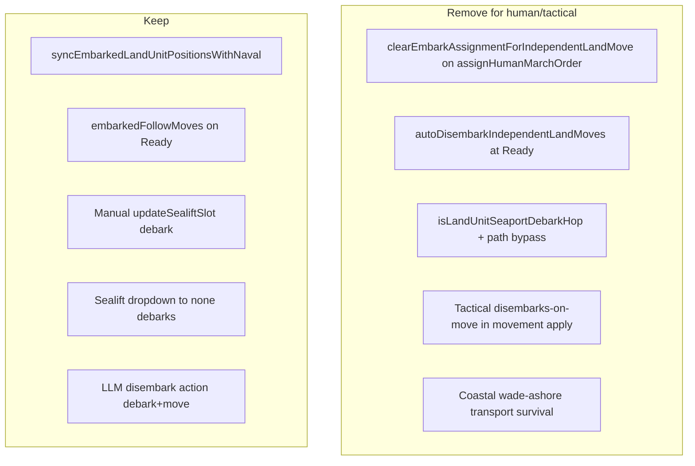

# Remove Auto-Debark — Execution Plan

*Execution plan for a coding agent. Removes implicit debark-on-move for human and tactical play. **Implemented** with a post-plan policy amendment: the LLM opponent auto-debarks on all independent movement actions (`explicit_move`, `disembark`, standing-order march expansion); humans still require manual debark. Authoritative rules: `.spec/combat-rules-v3.md` §9.*

---

## 1. Goal, scope, and success criteria

### 1.1 Goal

Embarked land units may leave a carrier only via **explicit manual debark** (stack popup debark button / sealift slot `(none)`) or via the LLM **`disembark` order action** (the one allowed automation). Human `assignHumanMarchOrder`, tactical marches, and opponent `explicit_move` must **never** clear `unit_transport_assignments` implicitly.

Destroying a naval unit **always** destroys its embarked cargo (terrain-neutral). Manually debarked co-located land is unaffected (no assignment row).

### 1.2 Confirmed product decisions

| Topic | Decision |
|-------|----------|
| Movement blocking | **All embarked land everywhere** until manual debark (human/tactical) |
| Water seaport debark UI | **Enable** manual debark at controlled water seaports |
| Transport loss | **Terrain-neutral fatal loss** for all embarked cargo when carrier dies |
| + All in stack popup | All **selectable** humans (embarked excluded via non-selectable set); debarked land remains selectable |
| Tactical parity | **Yes** — res4 matches strategic debark/move rules |
| LLM `disembark` | **Keep** debark+move automation for this action only (acceptable narrow bandwidth) |
| Selection | Block embarked land **everywhere** (map Ctrl+click, sidebar, stack popup) |

### 1.3 Requirements traceability

| # | Stated need | Plan coverage |
|---|-------------|---------------|
| 1 | Land units can't move from ports until manually debarked | Phases 3–4 block **all** embarked independent movement (human); Phase 3 enables water-port manual debark |
| 2 | Embarked land unselectable in multi-select popup | Phase 5 |
| 3 | + All excludes embarked land | Phase 5 (`getSelectableHumanIdsForStackCallout` filtering) |
| 4 | Naval destroyed with embarked cargo → cargo destroyed | Phase 2 |
| 5 | Manually debarked co-located land survives naval loss | Phase 2 (assignment-based cargo query unchanged for non-embarked) |
| Extra | Map/sidebar selection blocked | Phase 5 |
| Extra | LLM disembark still works | Phase 7 |

### 1.4 Non-goals

- Rebalancing combat stats or transport capacity
- Changing cargo follow-move when **naval** moves (embarked land still rides along)
- Changing melee/ranged rules for embarked units except where movement/selection intersects
- Rewriting historical milestone docs (header cross-reference only)

---

## 2. Current auto-debark surface area



| Mechanism | Location | Target |
|-----------|----------|--------|
| Order assignment auto-debark | [`gameActionsCore.ts`](f:/Projects/Personal/agent-wars/src/main/game-actions/gameActionsCore.ts) `clearEmbarkAssignmentForIndependentLandMove` | **Remove** from human assign path |
| Ready-phase blanket auto-debark | [`sealift.ts`](f:/Projects/Personal/agent-wars/src/main/game-actions/sealift.ts) `autoDisembarkIndependentLandMoves` | **Delete** (replace with LLM-only debark at ingest — Phase 7) |
| Seaport debark hop | [`landMovementConstraints.ts`](f:/Projects/Personal/agent-wars/src/main/game-actions/landMovementConstraints.ts), pathfinding modules | **Remove** |
| Tactical auto-debark on move | [`tacticalMovementApply.ts`](f:/Projects/Personal/agent-wars/src/main/tacticalBattle/tacticalMovementApply.ts), [`tacticalPlanStateMovement.ts`](f:/Projects/Personal/agent-wars/src/main/tacticalBattle/tacticalPlanStateMovement.ts) | **Remove**; block embarked marches |
| Transport loss (coastal survive) | [`sealift.ts`](f:/Projects/Personal/agent-wars/src/main/game-actions/sealift.ts) `applyTransportLossForRemovedNavalUnits` | **Always destroy cargo** |
| Multi-select filter | [`renderer.ts`](f:/Projects/Personal/agent-wars/src/renderer/renderer.ts) | **All embarked slot occupants**, not water-only |
| Map/sidebar selection | [`mapClickSelectionPolicy.ts`](f:/Projects/Personal/agent-wars/src/renderer/map/mapClickSelectionPolicy.ts), [`sidebarSupport.ts`](f:/Projects/Personal/agent-wars/src/renderer/gameplay/sidebarSupport.ts) | **Block embarked land** |

**Important naming fix for agent:** Human march validation lives in `validateOrder` inside [`gameActionsCore.ts`](f:/Projects/Personal/agent-wars/src/main/game-actions/gameActionsCore.ts) — not a function named `validateHumanMarchOrder`.

---

## 3. Phase ordering rationale

Phases are ordered so each step leaves the game in a **valid playable state**:

1. **Helpers first** — shared predicates before behavior changes
2. **Transport loss** — isolated, testable rule change
3. **Water-port manual debark** — **before** blocking movement, so water-port stacks are never stuck
4. **Strategic movement block** — remove human/tactical implicit debark paths
5. **Selection UI** — depends on snapshot embark field + sealift state
6. **Tactical parity**
7. **LLM disembark** — narrow automation preserved via ingest-time debark
8. **Spec alignment**
9. **Full regression**

---

## Phase 1 — Shared contracts, helpers, and snapshot embark field

**Purpose:** Single source of truth for all layers.

**Changes:**

1. [`landMovementConstraints.ts`](f:/Projects/Personal/agent-wars/src/main/game-actions/landMovementConstraints.ts):
   - Replace `EMBARKED_LAND_UNIT_AT_SEA_MOVE_REASON` with a general constant, e.g. `Embarked land units cannot receive independent movement orders. Debark first.`
   - Add `isEmbarkedLandUnit(unitId: string): boolean` (query `unit_transport_assignments` or delegate to [`getEmbarkedNavalForLandUnit`](f:/Projects/Personal/agent-wars/src/main/game-actions/sealift.ts)).
   - Update `getLandMovementBlockReason` to block when `isEmbarkedLandUnit` is true (remove `isSeaportDebarkHop` bypass).
   - Delete `isLandUnitSeaportDebarkHop` once callers are migrated (Phase 4).

2. [`sealift.ts`](f:/Projects/Personal/agent-wars/src/main/game-actions/sealift.ts):
   - Add `canManualDebarkFromHex(h3Index: string, playerId: string): boolean`:
     - `true` for coastal hexes (including `coastal_no_port` debark-only mode)
     - `true` for water hexes with `seaportCount > 0` and player controls port
     - `false` for open-ocean water
   - Add `clearEmbarkAssignmentForLandUnit(unitId: string): void` — shared debark primitive (used by manual UI, LLM ingest, tests).
   - Add `getEmbarkedLandUnitIdsAtHex(h3Index: string): string[]` for UI.

3. [`unitSnapshotRead.ts`](f:/Projects/Personal/agent-wars/src/main/game-db/unitSnapshotRead.ts):
   - Extend strategic unit snapshot with optional `embarkedOnNavalUnitId` (LEFT JOIN `unit_transport_assignments`) so renderer can block map/sidebar selection without extra IPC per click.
   - Update [`gameStateTypes.ts`](f:/Projects/Personal/agent-wars/src/shared/ipc/gameStateTypes.ts) contract comment (field is strategic + tactical).

4. [`sealiftTypes.ts`](f:/Projects/Personal/agent-wars/src/shared/ipc/sealiftTypes.ts): expose `debarkAllowedAtHex` or equivalent on stack state if it simplifies renderer.

**Verify:**
- [`sealift.test.ts`](f:/Projects/Personal/agent-wars/src/main/game-actions/sealift.test.ts): `canManualDebarkFromHex` cases (coastal, water+port, open water)
- New/extended tests for `isEmbarkedLandUnit` / movement block reason
- Snapshot test: embarked unit row includes `embarkedOnNavalUnitId`

---

## Phase 2 — Terrain-neutral transport loss (strategic)

**Purpose:** Isolated high-value rule change.

**Changes:**

1. [`applyTransportLossForRemovedNavalUnits`](f:/Projects/Personal/agent-wars/src/main/game-actions/sealift.ts): remove terrain branch; for each removed naval with assignments, **DELETE all assigned land units** and clear assignment rows.

2. Update [`sealift.test.ts`](f:/Projects/Personal/agent-wars/src/main/game-actions/sealift.test.ts) `testTransportLossDestroysCargoOnWaterAndDebarksOnCoastal` → coastal cargo **also destroyed**.

3. Review [`lossSummaryFromResolution.test.ts`](f:/Projects/Personal/agent-wars/src/main/lossSummaryFromResolution.test.ts) if coastal transport losses now appear under "Other losses".

**Verify:**
- `node dist/main/game-actions/sealift.test.js` passes
- Destroy naval on coastal with embarked infantry → infantry row deleted; debarked co-located infantry survives

---

## Phase 3 — Enable manual debark at controlled water seaports

**Purpose:** Must complete **before** Phase 4 so water-port stacks retain an exit path.

**Changes:**

1. [`updateSealiftSlotImpl`](f:/Projects/Personal/agent-wars/src/main/game-actions/sealift.ts):
   - Replace blanket `contextMode === 'water'` rejection with:
     - Block **embark** (`landUnitId` non-null) at water unless product rules say otherwise (unchanged: embark still requires valid port context)
     - Allow **debark** (`landUnitId === null`) when `canManualDebarkFromHex(h3Index, 'human')`

2. [`buildNavalRows`](f:/Projects/Personal/agent-wars/src/main/game-actions/sealift.ts):
   - `debarkSlot1Enabled` / `debarkSlot2Enabled`: use `canManualDebarkFromHex`, not `contextMode !== 'water'`
   - Keep `controlsDisabled` for embark dropdowns at water / coastal_no_port

3. Mirror in [`tacticalSealiftStackState.ts`](f:/Projects/Personal/agent-wars/src/main/tacticalBattle/tacticalSealiftStackState.ts) and [`tacticalSealiftSlotUpdate.ts`](f:/Projects/Personal/agent-wars/src/main/tacticalBattle/tacticalSealiftSlotUpdate.ts).

4. [`renderer.ts`](f:/Projects/Personal/agent-wars/src/renderer/renderer.ts) `renderSealiftSection`:
   - Render debark buttons when `debarkSlot*Enabled` even if `contextMode === 'water'`
   - Keep embark dropdowns disabled at water

**Verify:**
- Debark succeeds at water+controlled port; fails at open water
- [`rendererConsolidation.test.ts`](f:/Projects/Personal/agent-wars/src/main/rendererConsolidation.test.ts): water **port** shows debark; open water hides debark
- Run `npm run build:renderer` after renderer changes

---

## Phase 4 — Remove strategic auto-debark on movement (human + Ready execution)

**Purpose:** Core gameplay change; depends on Phases 1 and 3.

**Changes:**

1. **Remove human auto-debark hooks:**
   - Delete `clearEmbarkAssignmentForIndependentLandMove` and its call from `assignHumanMarchOrder` in [`gameActionsCore.ts`](f:/Projects/Personal/agent-wars/src/main/game-actions/gameActionsCore.ts).
   - Remove `autoDisembarkIndependentLandMoves(allOrders)` call from [`readyStrategicResolutionPipeline.ts`](f:/Projects/Personal/agent-wars/src/main/game-actions/readyStrategicResolutionPipeline.ts); delete the function from [`sealift.ts`](f:/Projects/Personal/agent-wars/src/main/game-actions/sealift.ts).

2. **Block embarked independent movement in `validateOrder`** ([`gameActionsCore.ts`](f:/Projects/Personal/agent-wars/src/main/game-actions/gameActionsCore.ts)):
   - If `isEmbarkedLandUnit(unitId)` and `toH3Index !== current naval carrier hex` → invalid (blocks march preview, assign, and human pending orders via [`submitOrders.ts`](f:/Projects/Personal/agent-wars/src/main/game-actions/submitOrders.ts))
   - Remove all seaport debark hop logic from `validateOrder`
   - Allow no-op orders where `toH3Index === unit.h3_index` (or `=== carrier hex` for stay-aboard)

3. **Mirror in preview and AI destination enumeration:**
   - [`humanMarchPreviewImpl.ts`](f:/Projects/Personal/agent-wars/src/main/game-actions/humanMarchPreview/humanMarchPreviewImpl.ts)
   - [`oneStepMoveDestinations.ts`](f:/Projects/Personal/agent-wars/src/main/oneStepMoveDestinations.ts) — no destinations for embarked land except current hex

4. **Ready pipeline safety filter** ([`readyStrategicResolutionPipeline.ts`](f:/Projects/Personal/agent-wars/src/main/game-actions/readyStrategicResolutionPipeline.ts)):
   - Before executing `UPDATE units SET h3_index`, **skip** orders where land unit is embarked and destination differs from carrier hex (covers opponent `explicit_move`, standing-order expansion, and any non-validated paths)
   - Log skipped orders at debug with reason
   - **Do not skip** naval orders or `embarkedFollowMoves` synthesis (cargo still follows carrier)

5. **Remove seaport debark hop infrastructure:**
   - [`tool1Pathfinding.ts`](f:/Projects/Personal/agent-wars/src/main/tools/tool1Pathfinding.ts), [`tool1PathfindingStateful.ts`](f:/Projects/Personal/agent-wars/src/main/tools/tool1PathfindingStateful.ts), [`tool1PathfindingRouteResolution.ts`](f:/Projects/Personal/agent-wars/src/main/tools/tool1PathfindingRouteResolution.ts), [`pathfinding.ts`](f:/Projects/Personal/agent-wars/src/main/pathfinding.ts): remove `seaportDisembarkOriginH3` embarked branching
   - [`landTraversalRes1.ts`](f:/Projects/Personal/agent-wars/src/shared/landTraversalRes1.ts): remove or narrow `allowsLandUnitStepWithOptionalSeaportDebark` if unused; update [`landTraversalRes1.test.ts`](f:/Projects/Personal/agent-wars/src/shared/landTraversalRes1.test.ts)

6. **Keep unchanged:** `syncEmbarkedLandUnitPositionsWithNaval`, `embarkedFollowMoves`, armor slot rules, combat exclusion for embarked-on-water.

**Verify — update [`gameActionsMultiSelect.test.ts`](f:/Projects/Personal/agent-wars/src/main/game-actions/gameActionsMultiSelect.test.ts):**
- `testEmbarkedLandUnitCanPreviewAndAssignFromSeaportWaterToAdjacentLand` → **blocked** (until manual debark in Phase 3 test setup)
- `testAssignMarchForEmbarkedLandUnitImmediatelyDebarksAndClearsSealiftSlot` → **blocked**, assignment retained
- Add: embarked land on **coastal** hex → movement blocked, assignment retained
- Add: after manual debark, movement succeeds

---

## Phase 5 — Selection blocking (stack popup, map, sidebar)

**Purpose:** Align UI with movement rules.

**Changes:**

1. **Stack popup** — [`renderer.ts`](f:/Projects/Personal/agent-wars/src/renderer/renderer.ts) `renderSealiftSection`:
   - Set `nonSelectableEmbarkedIds` to **all embarked slot occupants** from sealift state (any contextMode), not only `contextMode === 'water'`
   - Fallback: `getEmbarkedLandUnitIdsAtHex` when sealift section absent

2. **Map selection** — [`mapClickSelectionPolicy.ts`](f:/Projects/Personal/agent-wars/src/renderer/map/mapClickSelectionPolicy.ts):
   - In `applyHumanUnitIconClickSelectionPolicy` / toggle paths: if unit has `embarkedOnNavalUnitId`, block select/toggle (trace log); allow deselect if already selected

3. **Sidebar selection** — [`sidebarSupport.ts`](f:/Projects/Personal/agent-wars/src/renderer/gameplay/sidebarSupport.ts):
   - Same guard using `embarkedOnNavalUnitId` from game state snapshot

4. **+ All behavior:** no change to button logic — `getSelectableHumanIdsForStackCallout` already filters `stackCalloutNonSelectableUnitIds`; debarked land and naval remain selectable

5. Run `npm run build:renderer`

**Verify:**
- [`rendererConsolidation.test.ts`](f:/Projects/Personal/agent-wars/src/main/rendererConsolidation.test.ts): non-selectable logic not water-only
- Manual: embarked land cannot be Ctrl+selected on map or sidebar; debarked land can; + All omits embarked only

---

## Phase 6 — Tactical movement parity

**Purpose:** res4 matches strategic rules.

**Changes:**

1. [`tacticalMovementApply.ts`](f:/Projects/Personal/agent-wars/src/main/tacticalBattle/tacticalMovementApply.ts) and [`tacticalPlanStateMovement.ts`](f:/Projects/Personal/agent-wars/src/main/tacticalBattle/tacticalPlanStateMovement.ts):
   - Remove `disembarks` branch that clears `embarkedOnSubUnitId` on move
   - Reject/skip orders for sub-units with `embarkedOnSubUnitId` when destination ≠ current hex

2. [`tacticalSnapshotGuards.ts`](f:/Projects/Personal/agent-wars/src/main/tacticalBattle/tacticalSnapshotGuards.ts) / [`validateHumanTacticalMarchOrders`](f:/Projects/Personal/agent-wars/src/main/tacticalBattle/tacticalBattleSession.ts): block embarked land marches before projection

3. [`tacticalTerrainMovement.ts`](f:/Projects/Personal/agent-wars/src/shared/tacticalTerrainMovement.ts) `tacticalMovementUnitTypeForPathfinding`: do not treat embarked land moving off carrier as land disembark path (return block at validation instead)

4. Tactical transport loss already removes cargo when naval sub dies via [`expandedRemovalIdsForVictim`](f:/Projects/Personal/agent-wars/src/main/tacticalBattle/tacticalStrategicOrderPhases.ts) — no change needed

**Verify — update [`tacticalMovementApply.test.ts`](f:/Projects/Personal/agent-wars/src/main/tacticalBattle/tacticalMovementApply.test.ts):**
- Opponent/human embarked land march to different hex → rejected, `embarkedOnSubUnitId` retained
- Embarked land still follows naval carrier position sync

---

## Phase 7 — LLM `disembark` action (narrow automation preserved)

**Purpose:** Human/tactical never auto-debark; LLM keeps one explicit action.

**Changes:**

1. [`orderResponseParsing.ts`](f:/Projects/Personal/agent-wars/src/main/openrouter/orderResponseParsing.ts) — on `disembark` action:
   - Resolve destination hex
   - **Do not** rely on Ready-phase auto-debark
   - At order **application** time (planning phase ingest, same timing as other opponent orders): call `clearEmbarkAssignmentForLandUnit(unitId)`, then enqueue movement order
   - Reject `disembark` if unit is not embarked or destination invalid after debark

2. On `explicit_move` for opponent: **reject/drop** if unit is still embarked (force AI to use `disembark` action instead)

3. Update [`promptText.ts`](f:/Projects/Personal/agent-wars/src/main/openrouter/promptText.ts) / [`promptContracts.ts`](f:/Projects/Personal/agent-wars/src/main/openrouter/promptContracts.ts):
   - Clarify: `disembark` clears cargo and moves in one action; `explicit_move` fails while embarked

4. Tactical AI path in [`requestOrdersFlow.ts`](f:/Projects/Personal/agent-wars/src/main/openrouter/requestOrdersFlow.ts): apply same disembark-vs-move distinction for tactical opponent drafts if `disembark` appears there

**Verify:**
- New test: `disembark` clears assignment and movement succeeds
- `explicit_move` while embarked is dropped
- `embark` / `transport_move` regression tests pass

---

## Phase 8 — Documentation alignment

**Changes:**

1. Update [`.spec/combat-rules-v3.md`](f:/Projects/Personal/agent-wars/.spec/combat-rules-v3.md) §9.2, §9.4, §11:
   - Remove human auto-disembark on independent movement
   - Transport loss always fatal for embarked cargo
   - Manual debark required before human/tactical land movement
   - Debark enabled at coastal and controlled water seaports
   - LLM `disembark` action remains the programmatic exception

2. Add superseded-rules note to header of [`.spec/completed/milestone-1.6-execution-plan.md`](f:/Projects/Personal/agent-wars/.spec/completed/milestone-1.6-execution-plan.md) (rules 12–14) — do not rewrite body

**Verify:** No contradictory auto-debark language in active spec files

---

## Phase 9 — Final regression gate

**Commands:**
```bash
npm test
# Key subsets if needed:
# node dist/main/game-actions/sealift.test.js
# node dist/main/gameActionsMultiSelect.test.js
# node dist/shared/landTraversalRes1.test.js
# node dist/main/tacticalBattle/tacticalMovementApply.test.js
# node dist/main/rendererConsolidation.test.js
npm run build:renderer
```

**Manual smoke checklist:**

1. Embark at port → embarked land cannot march or be selected until debark clicked
2. Debark at water seaport → land can march; assignment cleared
3. Open ocean: debark disabled; embarked land unselectable; cannot march
4. Destroy naval with embarked cargo (any terrain) → cargo destroyed
5. Destroy naval with manually debarked co-located land → land survives
6. + All at port stack selects naval + debarked land, not embarked slot occupants
7. Map/sidebar cannot select embarked land
8. Tactical: embarked land cannot march until tactical debark; cargo dies with naval sub
9. LLM `disembark` still clears cargo and moves; `explicit_move` while embarked fails

---

## Implementation notes for the coding agent

- **Logging:** All new/changed public backend methods need orienting comments plus debug (mutations), error (caught exceptions), trace (getters) per project rules.
- **Minimal diffs:** Delete dead seaport-debark-hop code; do not leave unused parameters.
- **Do not commit or push.**
- **File size:** If [`sealift.ts`](f:/Projects/Personal/agent-wars/src/main/game-actions/sealift.ts) exceeds ~600 lines, extract debark eligibility + transport helpers to e.g. `sealiftDebarkRules.ts`.
- **No phase/stage identifiers in code** (plan section names are documentation only).
- **Tests:** Happy paths + essential failure cases only; no boilerplate REST/delegation tests.
- **Preserve:** Sealift dropdown `(none)` debark, armor slot rules, cargo follow on naval move, embarked-on-water combat exclusion, LLM `disembark` automation.

---

## Risk register

| Risk | Mitigation |
|------|------------|
| Water-port units stuck after movement block | Phase 3 before Phase 4 |
| Opponent `explicit_move` moves embarked land via Ready loop | Phase 4 Ready pipeline skip filter |
| Standing orders generate embarked land marches | Same Ready filter + `validateOrder` for human |
| LLM uses `explicit_move` instead of `disembark` | Phase 7 reject + prompt update |
| Map selection without snapshot field | Phase 1 `embarkedOnNavalUnitId` on strategic snapshot |
| Stale tests for seaport hop / auto-debark | Update tests in same phase as behavior |
| Tactical/strategic drift | Phase 6 after Phase 4; shared `isEmbarkedLandUnit` / snapshot field |
| Renderer bundle stale | `npm run build:renderer` in Phases 3, 5, 9 |
