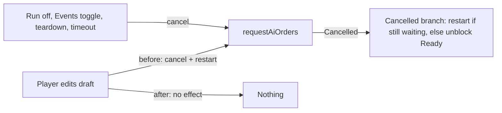

# Execution Plan: Stop Restarting AI Planning on Draft-Order Edits

*Audience: implementing agents. Do every phase in order. Do not commit or push. Do not copy this document's phase names or numbers into code, comments, docs, or test names.*

*Line numbers are from before any edit. Find each edit by the quoted code or symbol. Within a file, numbers drift once earlier lines are deleted.*

## Why

During tactical planning, every edit to the player's draft (march, ranged, air strike, ferry, embark) does three things:
- it cancels the in-flight background `requestAiOrders`;
- the result handler then restarts that request;
- if a successful result arrives after an edit, the handler discards it and starts another request.

None of this gives the model new information:
- The renderer sends only `{ enabledToolGroups }`. The prompt is built from the tactical battle snapshot.
- The player's draft stays in the renderer until Ready (`game:commitHumanTacticalDraftOrders`).
- `sanitizeOpponentTacticalDraftForReadyCommit` in [src/main/gameActions/gameActionsCore.ts](src/main/gameActions/gameActionsCore.ts) checks the AI plan against the pre-turn snapshot, not against the player's draft.

So each restart costs tokens and pushes back the moment Ready unlocks. Ready stays disabled while `isWaitingForPrecomputedAiOrders()` is true.

**Strategic play:** draft edits never cancel planning (verified by searching for every `cancelRequestAiOrders` caller). The strategic prompt lists human units by position only, and standing-order text and `query_orders` are scoped to the AI player. Strategic needs no code change, only the doc rule in the documentation phase and the smoke checks in the final phase.

The shared helpers changed in Phase A (`cancelRangedForUnit`, `cancelAirStrikeForUnit`, `cancelFerryForUnit`, `replacePendingOrdersForSelected`) also run in strategic play. There the wrapper was already a no-op because it requires an active tactical snapshot, so unwrapping them does not change strategic behavior.

## What Stays (Do Not Remove)

These cancel sources are legitimate and must keep working:
- Run turned off ([src/renderer/openRouter/openRouterControls.ts](src/renderer/openRouter/openRouterControls.ts)).
- Key or model removed (`syncOpenRouterRunToggleInteractable` in [src/renderer/renderer.ts](src/renderer/renderer.ts)).
- Events toggled (`handleEventDrivenModeTransition`).
- New game ([src/renderer/gameplay/newGame.ts](src/renderer/gameplay/newGame.ts)).
- Battle exit or reconciliation (`cancelInFlightBackgroundAiRequestForRendererTeardown`).
- Annihilation ([src/renderer/tactical/tacticalAnnihilationDialog.ts](src/renderer/tactical/tacticalAnnihilationDialog.ts)).
- The wait timeout or a rejected request (the `.catch` in `startBackgroundRequestIfAllowed`).

**Critical:** keep the `result.error === 'Cancelled'` restart branch in `startBackgroundRequestIfAllowed`. `handleEventDrivenModeTransition` calls `startBackgroundRequestIfAllowed` while the old request is still in flight, so that call declines. Planning resumes only through the restart in the Cancelled branch. Change only that branch's comment.

[src/main/tacticalPrefetchRestartContract.test.ts](src/main/tacticalPrefetchRestartContract.test.ts) guards this branch by reading the source text. Inside the block after `if (result.error === 'Cancelled')`, it requires:
- `startBackgroundRequestIfAllowed(deps)` to appear before `unblockPrecomputedAiPlanningAfterBackgroundFailure()`;
- `if (!S.backgroundRequestInFlight)` to be present.

The test uses `indexOf`, so the new comment inside that block must not contain either call text, including the parentheses.

---

## Phase A: Unwrap Every Draft-Edit Call Site

**Goal:** Replace every `withTacticalHumanDraftPrefetchInvalidation(() => { BODY });` with `BODY`, dedented one level, so the edit runs directly. Keep each surrounding `if`. The wrapper stays defined, unused, until the next phase, so the build stays green.

Call sites:
- [src/renderer/map/mainMapInteractions.ts](src/renderer/map/mainMapInteractions.ts) line 450. Keep the `if (S.tacticalBattleSnapshot)` guard. Remove the import on line 6.
- [src/renderer/gameplay/sidebarSupport.ts](src/renderer/gameplay/sidebarSupport.ts) line 512, in `onCancel`. Remove the import on line 9.
- [src/renderer/renderer.ts](src/renderer/renderer.ts) lines 719, 724, 741, and 797. Remove `withTacticalHumanDraftPrefetchInvalidation,` from the import list (about line 137).
- [src/renderer/gameplay/tacticalOrders.ts](src/renderer/gameplay/tacticalOrders.ts) lines 57, 136, 194, 218, and 242. Remove the import on line 7.

Orienting comments on functions whose own body changes. The ESLint rule `orienting-comments/require-orienting-block` requires:
- a summary line first, which must not contain `Purpose:`, `Contract:`, or `When to use:`;
- then the labeled lines `Purpose:`, `When to use:`, `Expected outcome:`, and `Exceptions:`.

Replace the boilerplate blocks with these. Keep the `/** ... */` style and the ` * ` margins used in each file.
- `tacticalOrders.ts` `replacePendingOrdersForSelected`: keep the summary line. Purpose becomes "Shared filter/push for ranged, air, and ferry pending arrays." Expected outcome becomes "Prior rows for `selectedIds` removed; one new row per selected id."
- `tacticalOrders.ts` `clearPendingTacticalOrders`:
  - Summary: "Empties every draft order list (ranged, air strike, ferry, embark, tactical march) and turns Ranged and Strike targeting off."
  - Purpose: "One reset for callers that discard all drafts, so no list is forgotten."
  - When to use: "New game, tactical battle exit or session release, and preparing the strategic UI before a tactical battle auto-starts."
  - Expected outcome: "All five lists are empty and both targeting modes are off. Standing orders and any in-flight AI planning are untouched."
  - Exceptions: "None."
- `tacticalOrders.ts` `cancelRangedForUnit`:
  - Summary: "Removes one unit's pending ranged attack (and, during a battle, its embark row), turns Ranged targeting off, and refreshes the panels and map."
  - Purpose: "Backs the cancel control on a pending ranged row in both theaters."
  - When to use: "From the ranged list's row cancel callback."
  - Expected outcome: "Only that unit's rows are removed; other drafts and any in-flight AI planning are unaffected."
  - Exceptions: "None."
- `tacticalOrders.ts` `cancelAirStrikeForUnit`: the same block as `cancelRangedForUnit`, with "air strike" for "ranged attack", "Strike targeting" for "Ranged targeting", and "air strike list" for "ranged list".
- `tacticalOrders.ts` `cancelFerryForUnit`:
  - Summary: "Removes one unit's pending ferry order (and, during a battle, its embark row) and refreshes the panels and map."
  - Purpose: "Backs the cancel control on a pending ferry row in both theaters."
  - When to use: "From the movement list's ferry row cancel callback."
  - Expected outcome: "Only that unit's rows are removed; other drafts and any in-flight AI planning are unaffected."
  - Exceptions: "None."
- `mainMapInteractions.ts` `wireMainMapInteractions`:
  - Summary: "Attaches the main map's pointer, click, double-click, and context-menu handlers."
  - Purpose: "Single place where map gestures become hover previews, selection changes, and order drafts in both theaters."
  - When to use: "Once during renderer startup, after `#main-map` exists."
  - Expected outcome: "Handlers are registered on `#main-map`; returns without wiring when the element is missing."
  - Exceptions: "None."

`updatePendingOrdersSidebar` and `renderSealiftSection` already have real comments that do not mention prefetch, so leave them alone.

Comment cleanup in the same files (these comments only explain why the wrapper is absent):
- `renderer.ts` about lines 808-809: delete the two-line `// Strategic sealift debark ... tacticalSealiftMode).` comment.
- [src/renderer/gameplay/readyHandler.ts](src/renderer/gameplay/readyHandler.ts) lines 877-881. Replace the five-line comment with:
  `// Replaces pending rows from the successful commit (continuations plus cleared ranged/air/ferry/embark). A late requestAiOrders result is dropped in openRouterRuntime when tacticalBattleSnapshot is gone.`
- [src/renderer/tactical/tacticalUiOrchestration.ts](src/renderer/tactical/tacticalUiOrchestration.ts): delete line 72 and line 125. Keep line 71.
- [src/renderer/tactical/tacticalStrategicOrderUiStash.ts](src/renderer/tactical/tacticalStrategicOrderUiStash.ts): delete the two-line comments at lines 49-50 and 102-103.

**Verify:**
- `npm run build:renderer`, `npm run lint`, and `npm run check:renderer-types` all pass.
- Search for `withTacticalHumanDraftPrefetchInvalidation` under `src`. The only matches should be the definition and comments in `openRouterRuntime.ts`.

---

## Phase B: Remove the Invalidation Machinery

All edits are in [src/renderer/openRouter/openRouterRuntime.ts](src/renderer/openRouter/openRouterRuntime.ts) unless noted.

1. Delete:
   - the import of `buildTacticalHumanDraftPrefetchFingerprint` (line 3);
   - `tacticalHumanDraftFingerprintNow` (lines 33-49);
   - `invalidateTacticalPrefetchIfHumanDraftChangedSinceRequestStart` (lines 51-68);
   - `withTacticalHumanDraftPrefetchInvalidation` (lines 70-81).
2. `cancelInFlightBackgroundAiRequestForRendererTeardown`:
   - Change the early exit to `if (!S.backgroundRequestInFlight) return;`.
   - Delete the `S.tacticalPrefetchFingerprintWhenRequestStarted = null;` line after the cancel.
   - Rewrite Purpose as: "Battle exit, session reconciliation, and similar teardown must abort main-process AI work and release the Ready latch so a late result is never applied to a torn-down session."
3. `cancelTacticalScopedBackgroundPrefetchForSessionTeardown`: rewrite Purpose as: "Exiting tactical play or reconciling the battle away must cancel main-process work so a late success cannot call `applySuccessfulPrecomputedAiResult` against a null snapshot."
4. `startBackgroundRequestIfAllowed`:
   - Delete every `S.tacticalPrefetchFingerprintWhenRequestStarted = ...` assignment (about lines 254, 261, 364, and 380).
   - Delete the `if (S.tacticalBattleSnapshot && S.tacticalPhasePlanning) { ... } else { ... }` block that captures the fingerprint (about lines 266-270).
   - Delete the whole stale check in `.then`: from `const startedFp` through the `return;` that closes `if (staleTacticalPrefetch) { ... }`, plus the `S.tacticalPrefetchFingerprintWhenRequestStarted = null;` after it (about lines 281-302). The next statement becomes `if (S.runButtonOn && result.success) {`.
   - In the `result.error === 'Cancelled'` branch, keep the code unchanged. Replace only its comment with:
     `// A deliberate cancel (Run off, Events toggled, key or model removed, session teardown) ends here. Restart before releasing the Ready latch: unblocking first installs an empty tactical draft, which makes isWaitingForPrecomputedAiOrders false and makes the restart decline. When nothing restarts, unblock so Ready is not stuck.`
   - Replace the boilerplate orienting comment with:
     - Summary line (first line, no label): "Starts the background opponent-planning request when Ready is waiting on it."
     - Purpose: "Starts at most one background `requestAiOrders` when Run is on and Ready is waiting on an opponent plan (strategic precompute or tactical opponent draft)."
     - When to use: "After any state change that may leave Ready waiting on AI planning: Run on, a new game, a successful Ready or beat commit, the Events toggle."
     - Expected outcome: "Applies a successful result to the precomputed buffers; on failure or cancel, restarts once if still waiting, otherwise releases Ready with an empty plan. No request while the annihilation dialog is open or a deferred consult is pending. Editing the player's draft never affects an in-flight request."
     - Exceptions: "None; failures are logged to the activity log and the sidebar."
5. [src/renderer/core/state.ts](src/renderer/core/state.ts): delete the `tacticalPrefetchFingerprintWhenRequestStarted` property and its comment (lines 1086-1096).
6. Delete [src/shared/tacticalHumanDraftPrefetchFingerprint.ts](src/shared/tacticalHumanDraftPrefetchFingerprint.ts) and [src/main/tacticalHumanDraftPrefetchFingerprint.test.ts](src/main/tacticalHumanDraftPrefetchFingerprint.test.ts).
7. [src/main/tacticalPrefetchRestartContract.test.ts](src/main/tacticalPrefetchRestartContract.test.ts): change only the header's first line to "Guards the ordering contract that lets a deliberately cancelled AI planning request (Events toggle and similar) restart before the Ready latch is released." Leave the assertions unchanged.
8. Remove stale compiled output. `scripts/run-main-node-tests.cjs` runs every `*.test.js` under `dist/`, so the deleted test would otherwise keep running from its old build output. Delete every file matching `dist/main/tacticalHumanDraftPrefetchFingerprint.test.*` and `dist/shared/tacticalHumanDraftPrefetchFingerprint.*` (`.js`, plus any `.map` or `.d.ts`). If deleting is blocked, close the app and run `npm run clean:dist` instead.

**Verify:**
- `npm test` passes. It rebuilds native modules for Node, builds main, lints, typechecks, and runs the tests.
- `npm run build:renderer` regenerates `static/renderer.js`.
- `npm test` lists `tacticalPrefetchRestartContract.test.js` and it passes. It does not list `tacticalHumanDraftPrefetchFingerprint.test.js`. To check the file list without running the tests: `node scripts/run-main-node-tests.cjs --list`.
- Searching `src` and `static` for these terms returns zero matches: `tacticalPrefetchFingerprint`, `HumanDraftPrefetch`, `invalidateTacticalPrefetch`, `tacticalHumanDraftFingerprintNow`, `human draft changed`, `Discarded stale tactical`.
- `renderer.ts` must not grow; it only loses lines.

---

## Phase C: Document the Rule

- [doc/ux/modes-and-transitions.md](doc/ux/modes-and-transitions.md):
  - At the end of the strategic "While the Run control is pressed..." paragraph (line 19), append: "Drafting, changing, or cancelling orders during that wait does not cancel or restart opponent planning."
  - At the end of the tactical paragraph at line 47, append: "As in strategic planning, editing the tactical draft during that wait does not cancel or restart opponent planning."
- [doc/hybrid-ai.md](doc/hybrid-ai.md): add a bullet after the tactical event-driven bullet (line 30):
  "- **Draft edits:** the player's draft orders are not consult input, so editing them never cancels, restarts, or discards a background `requestAiOrders`. Only Run off, a removed key or model, an Events toggle, a new game, battle exit or reconciliation, annihilation, the wait timeout, or a rejected request cancel it."
- Leave files under `.spec/completed/` unchanged; they are a historical record.

**Verify:** Read both edited paragraphs in context. Wording must stay consistent with the surrounding text, which says "Run", "Ready", and "opponent plan".

---

## Phase D: End-to-End Verification

Run `npm start` (it rebuilds native modules for Electron). Turn on Run with a model and key set, leave Events off (every-turn mode) unless a step says otherwise, and keep the AI activity log open.

1. **Tactical edits:** enter a battle. While Ready shows "AI:", add, change, and cancel several marches and a ranged attack. Expect:
   - no line "Tactical AI prefetch cancelled (human draft changed).";
   - the first consultation completes and Ready unlocks without a restart;
   - after Ready, the opponent's moves come from that plan;
   - `debug.log` shows no `success:false` / `Cancelled` request results during the edits.
2. **Strategic edits:** edit several orders during the "AI:" wait. Expect the same: one consultation, then Ready unlocks.
3. **Events toggle mid-request (strategic):** while "AI:" shows, turn Events on. Planning must restart (a new request starts, Ready stays "AI:", then unlocks). This guards the Cancelled branch.
4. **Run off mid-request:** Ready becomes usable immediately; no new request starts.
5. **Exit Battle mid-request:** the line "Background AI request cancelled (exiting tactical battle)." appears; no tactical plan is applied afterward.

---

## Rules Checklist for the Implementer

- No new tests. The fingerprint test is deleted along with its module. The restart contract test stays, because it guards the Cancelled branch that remains.
- Every updated function keeps a complete orienting comment: a summary line, then Purpose, When to use, Expected outcome, and Exceptions. `npm run lint` enforces the format.
- Renderer-only change: no backend methods change, so no logging changes are required. Do not add new activity-log lines.
- No file grows past its current size; every touched file gets shorter or stays about the same.
- No phase names or numbers from this document in code or docs. Do not add new "Phase" wording; removing the existing "Phase 4" mentions in the touched comments is expected.
- No commit or push.
