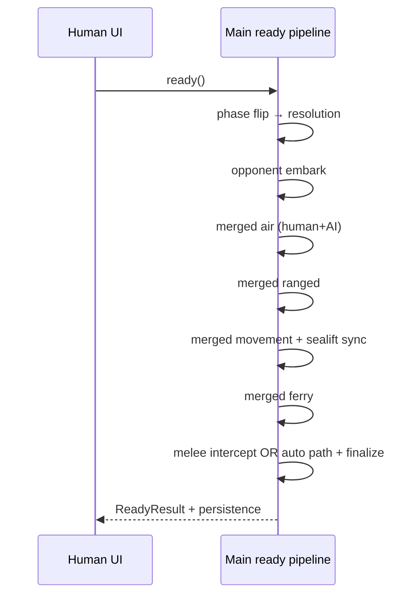
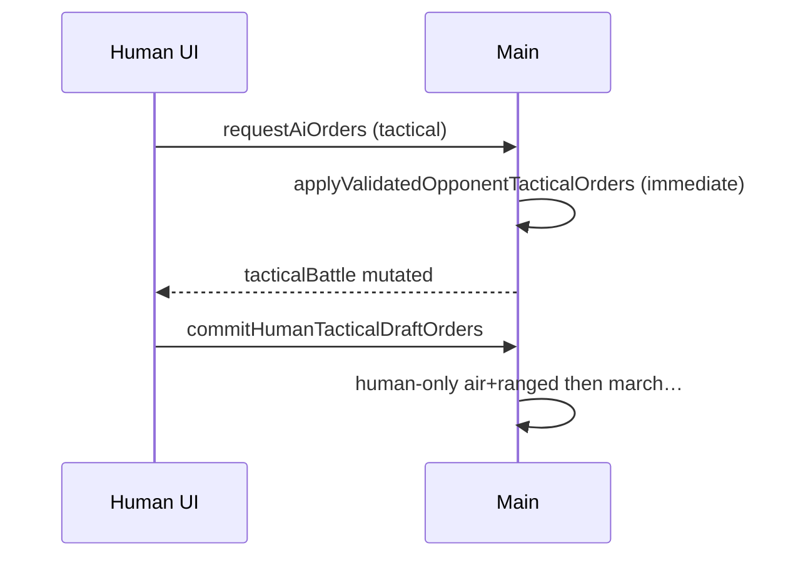
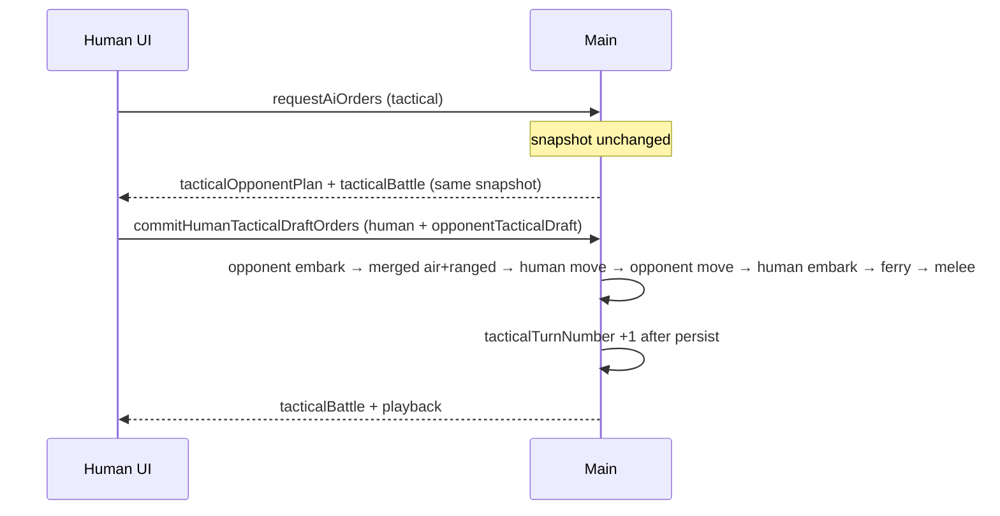

# Execution Plan: Align Tactical Turn Resolution with Strategic

*Audience: implementers (including lower-capability coding agents). Product scope: tactical battles at res4; **unit production remains out of scope** for tactical mode.*

---

## 1. Purpose and success criteria

### 1.1 Goal

Make **tactical turn resolution** match **strategic `ready` / resolution** semantics where the game rules intend them to match: same **ordering of phases**, **combined human + opponent combat phases** where strategic merges them, and **deterministic, reviewable** combat sequencing—while keeping tactical-specific **scale** differences (sub-units, res4 footprint, movement budgets, ranges, urban targeting granularity) as parameterized differences, not accidental forks in logic.

**Melee (product-locked):** Tactical has **no melee intercept dialog**. All melee is resolved **automatically**, equivalent to the human **always choosing “Ignore”** on the strategic intercept. **Combat and kill animations** must still run—the same playback family as strategic resolution (adapted for sub-unit ids / tactical playback payloads where needed).

### 1.2 Explicit non-goals (for this plan)

- **Unit production** in tactical (excluded by design).
- **Melee intercept modal** in tactical (explicitly out of scope; see §1.1).
- Rewriting combat math from scratch (reuse `combatResolution` / existing phase helpers).
- Changing map topology or res4/res1 contracts unless a phase explicitly requires it.

### 1.3 “Done” checklist (program-level)

When this plan is complete:

1. **Melee:** Tactical resolves melee **only** via the automatic path (strategic **Ignore-equivalent**); **no** intercept UI. **Animations:** Melee (and related kill) overlays match strategic **quality and code path reuse** where feasible (`TacticalCommitResolutionPlayback` / renderer parity with strategic resolution playback patterns).

2. **Phase ordering (must match `executeReadyStrategicTurn` for mirrored slices):** In one tactical Ready pass, order is **opponent embark** (opponent-only, same role as strategic step before air) → **merged air** (human + opponent) → **merged ranged** (human + opponent) → **movement** (human + opponent march orders for that beat) → **human embark** (Ready drafts / sealift rows, same boundary as today’s tactical beat after movement) → **ferry** → **embark cargo sync** → **auto-melee** → finalize persistence. Document any unavoidable deviation in the ordering contract (§0 / appendix).

3. **Scheduling:** Opponent tactical orders apply on the **same cadence as strategic**—**buffered until human Ready** with a **single** resolution pass per tactical planning cycle (see Phase 4).

4. **Res1 infrastructure / aggregates:** Updates that affect **urban/rubble/airport/seaport** (and related res1 counts) are **written to the strategic DB during tactical turn resolution** as soon as reasonably possible after the events that change them—not deferred to tactical exit unless technically unavoidable.

5. **No silent divergence:** New or touched code paths include **debug logs at mutation boundaries** and **tests for ordering / melee playback / infra / regression** so future developers can tell when tactical and strategic drift.

---

## 2. Current technical facts (baseline for implementers)

These are intentional references—read before coding.

| Area | Strategic (`executeReadyStrategicTurn`) | Tactical (today) |
|------|----------------------------------------|-------------------|
| Opponent embark | **Before** merged air (`applyEmbarkOrdersForPlayer` for opponent) | Part of opponent projection **before** opponent-scoped air+ranged |
| Air + ranged | Human + AI orders **merged**, then `resolveAirStrikePhase` → `runRangedPhase` | Opponent projection uses player-scoped phases; human beat uses separate human-scoped pass; **not merged like strategic** |
| Melee | May **pause** for melee intercept (`awaitingMeleeDecision`, pending snapshot) or resolve after choice | **Automatic** `applyTacticalMeleeAfterSupportOrders` at end of human commit (**no dialog**—by design) |
| Opponent orders | Part of same Ready pipeline | Applied on **AI request** into tactical snapshot (`applyValidatedOpponentTacticalOrders`); **not the same scheduling model** as strategic Ready |
| Res1 infra during tactical | Updated during strategic ready / reconciliation | Partially updated on some tactical commits; **align to “as soon as reasonable”** across all mutating paths |

**Key files (non-exhaustive):**

- Strategic pipeline: `src/main/game-actions/readyStrategicResolutionPipeline.ts` (`executeReadyStrategicTurn`).
- Tactical human full beat: `src/main/tacticalBattle/tacticalBattleSession.ts` (`applyHumanTacticalDraftBeatInStrategicOrder`), `commitHumanTacticalDraftOrders` in `src/main/gameActions.ts`.
- Tactical opponent projection: `src/main/tacticalBattle/tacticalCompositeOrdersApply.ts` (`projectTacticalSnapshotAfterValidatedOpponentOrders`), `applyValidatedOpponentTacticalOrders` in `tacticalBattleSession.ts`.
- Tactical melee: `src/main/tacticalBattle/tacticalMeleeApply.ts`.
- AI tactical apply entry: `src/main/gameIpcHandlers.ts` (`handleRequestAiOrders` tactical branch—**must change** when buffering: see Phase 4).
- Strategic melee pending (reference only—tactical does **not** add intercept): `src/main/game-actions/meleeInterceptPendingState.ts`, `meleeInterceptReadyFinalize.ts`.
- Infra reconciliation example: `reconcileRes1InfrastructureCountsFromRes4Overrides` (see `gameActions.ts` tactical commit paths).

---

## 3. Engineering principles (for lower-quality agents)

Follow these strictly to maximize reliability:

1. **Small phases, small PRs:** One phase (or one sub-phase) per merge; avoid mixing infra reconciliation with RNG ordering refactors.
2. **Behavior before refactor:** Prefer adding **tests that lock current behavior** (or a clearly named “legacy” path) before changing ordering.
3. **Feature flags:** Use a **single tactical resolution flag** (e.g. `TACTICAL_WEGO_RESOLUTION_V1`) only if needed for incremental rollout; remove or default-on once stable.
4. **No new mega-files:** If a file approaches ~600 lines, **split** into `tacticalResolution/` (or similar) with focused modules.
5. **Logging (repo policy):** New/updated **public** backend entry points: **debug** on invocation; **error** in `catch`; **trace** for non-mutating getters; include enough structured context (ids, counts) to triage without dumping full snapshots unless necessary.
6. **Comments (repo policy):** New non-trivial fields and non-overriding methods need **orienting comments** (why, when to use, expected outcome, exceptions).
7. **Tests (repo policy):** Prefer **happy paths + essential failure contracts**; avoid brittle tests of implementation details or thin REST wrappers.
8. **Verification commands:** Each phase lists **exact** `npm run …` / `node dist/…` commands. If `npm test` is not wired, use the repo’s documented test entrypoints from `package.json`.

---

## 4. Stakeholder decisions (locked)

| ID | Topic | Decision |
|----|--------|----------|
| **D1** | Melee dialog | **None in tactical.** All melee is **automatic** (equivalent to strategic user **always** clicking **Ignore**). |
| **D1b** | Melee / kill **animations** | Must match strategic **experience**: same combat/kill **animation behavior** as strategic resolution (reuse or share renderer playback building blocks; tactical payloads already include `tacticalResolutionPlayback`—extend/populate melee segments as needed). |
| **D2** | Opponent order timing | Match **strategic**: **buffer** opponent tactical orders until **human Ready**, then run **one** combined resolution pass (Phase 4). |
| **D3** | RNG vs strategic | **Prefer** identical ordering rules and RNG consumption where practical; **not a hard requirement** if documented and tested alternatives are equivalent for gameplay. |
| **D4** | Strategic DB during tactical | **Res1 infrastructure / aggregate counts** (urban hex, rubble, airport, seaport, etc.): **persist during tactical turn resolution** as soon as reasonably possible after the events that change them—not only on tactical exit. |
| **D5** | Opponent buffer when AI runs again | **Replace** the entire buffered opponent plan with the **latest** successful AI response (no merge with prior AI plans). Emit a **debug** log when a replace occurs. |
| **D6** | Ready fails validation | **Transactional failure:** do **not** partially apply the beat; **keep** human drafts, opponent buffer, and tactical snapshot as they were; do **not** increment `tacticalTurnNumber`. |
| **D7** | `tacticalTurnNumber` | Increment **exactly once** per **successful** combined Ready commit, **after** persistence succeeds (one coherent resolution pass = one tactical turn advance). |

### 4.1 Clarifications (buffering semantics — locked with D5–D7)

- **Replace (D5):** If the human has not pressed Ready and a **new** AI request succeeds, discard the previous opponent draft entirely. The buffer always holds at most **one** opponent plan—the newest. Avoids ambiguous merges (e.g. same sub-unit, two destinations).
- **Failed Ready (D6):** A rejected `commitHumanTacticalDraftOrders` must leave the game state **observationally unchanged** from before the click: no half-applied movement, no cleared buffers, no turn bump.
- **Turn counter (D7):** Do not tie `tacticalTurnNumber` to the AI callback or to separate human vs opponent sub-steps; only the **successful** end of the combined pipeline advances it.

---

## 5. Phased execution plan

Each phase lists: **Objective**, **Deliverables**, **Verification** (independent where possible), **Depends on**, **Risks/notes**.

---

### Phase 0 — Decisions, contracts, and traceability

**Objective:** Freeze semantics before code movement; give reviewers a single source of truth.

**Deliverables:**

1. **Decisions log** — use §4 (D1–D7 locked) and §4.1 clarifications.
2. **Sequence diagram** (Mermaid or ASCII) for:
   - Strategic Ready: phase flip → opponent embark → merged air → merged ranged → movement → … → ferry → melee intercept **or** post-choice melee + finalize.
   - Tactical **legacy (historical)**: pre–Phase 4, `handleRequestAiOrders` applied opponent orders immediately; see diagram below for contrast with the **target** buffer model.
   - Tactical **target (shipped)**: buffer → single Ready pass with §1.3 ordering; auto-melee; infra writes inline.
3. **Ordering contract doc:** opponent embark **before** merged air; air / ranged merge and sort keys—**reference** `executeReadyStrategicTurn`, `resolveAirStrikePhase`, `runRangedPhase`, and tactical mirror `applyHumanTacticalDraftBeatInStrategicOrder` / `projectTacticalSnapshotAfterValidatedOpponentOrders`.

**Verification:**

- [x] Documentation-only PR acceptable.
- [x] Peer review: diagrams match code paths (reviewer validates against `executeReadyStrategicTurn` / tactical session).

**Depends on:** Nothing.

#### Phase 0 — Sequence diagrams (implementation reference)

**Strategic Ready (high level)**



**Tactical legacy (pre–Phase 4 scheduling — for diff review only)**



**Tactical target (buffer + single Ready pass)**



**Ordering contract (ASCII)**

```text
opponent embark (opponent only)
  → merged air (human orders first, then opponent; single sort pass)
  → merged ranged (human then opponent in one runRangedPhase)
  → human march (range-limited legs)
  → opponent march (AI destinations)
  → human embark (sealift drafts)
  → ferry human, then ferry opponent
  → embark cargo sync → auto-melee → persist + tacticalTurnNumber +1
```

---

### Phase 1 — Baseline tests (characterization / “golden” ordering)

**Objective:** Lock **current** tactical and strategic behavior with tests so refactors are detectable.

**Deliverables:**

1. **Strategic ordering tests** (minimal): documented sort order for merged air / ranged inputs (fixture DB or pure tests).
2. **Tactical ordering tests** (minimal): fixed seed + small snapshot for current human vs opponent projection.
3. **Melee characterization:** tactical always runs **auto** melee after human beat when co-located enemies exist; document equivalence to strategic **post-Ignore** melee resolution (not intercept pause).

**Verification:**

```text
npm run build:main
node dist/main/tacticalBattle/tacticalStrategicOrderingAlignment.test.js
node dist/main/gameIpcHandlers.test.js
```

**Depends on:** Phase 0 diagrams.

**Risks:** Over-brittle snapshot JSON tests; prefer **documented** ordering invariants.

---

### Phase 2 — Melee: auto-resolve + **animation parity** (no UI)

**Objective:** Keep **automatic** melee resolution; ensure **strategic-grade combat/kill animations** run for tactical commits (melee segment populated and consumed like strategic playback).

**Deliverables:**

1. **Playback audit:** Map strategic resolution playback path (melee hexes, casualties, removed units) to `TacticalCommitResolutionPlayback` / renderer consumers in `readyHandler.ts` and related modules.
2. **Gap fill:** Any tactical melee outcome that strategic would animate but tactical omits—add fields to `tacticalResolutionPlayback` and renderer handling **without** adding an intercept dialog.
3. **Tests:** Fixture or unit-level assertions that melee **playback payload** is non-empty when melee occurs; optional visual QA checklist in PR.

**Verification:**

```text
npm run build:main
npm run build:renderer
node dist/main/tacticalBattle/<relevant-tests>.js
```

**Depends on:** Phase 1.

**Risks:** Double-playing animations if both generic and tactical paths fire—**one** authoritative path per commit.

#### Phase 2 — Strategic vs tactical playback mapping (audit)

| Strategic `ReadyResult` / animation slice | Tactical `TacticalCommitResolutionPlayback` | Renderer (`readyHandler` tactical branch) |
|-------------------------------------------|---------------------------------------------|-------------------------------------------|
| `humanMoves` | `humanMoves` | `S.resolutionMoveAnimation.moves` (human legs) |
| AI strategic moves (merged in one list) | `opponentMoves` | Appended after human moves in the same `moves` array |
| `rangedCombatHexes` / casualties / removed | Same field names | Same `S.resolutionMoveAnimation` ranged keys |
| Melee hexes / casualties / kills | `meleeCombatHexes`, `meleeCasualtyHexes`, `meleeRemovedUnits`, `killsByMelee` | Same; populated from `applyTacticalMeleeAfterSupportOrders` |

Authoritative path per tactical Ready: **only** the tactical branch sets `resolutionMoveAnimation` from `tacticalResolutionPlayback` (no duplicate strategic Ready animation for the same click).

---

### Phase 2.5 — Res1 infrastructure / strategic aggregates during tactical resolution

**Objective:** Whenever tactical combat (air, ranged, melee, etc.) changes res4-derived infrastructure that rolls up to res1 **urban / rubble / airport / seaport** (and related counters), **persist strategic DB updates during that resolution**, as soon as reasonable—same family of reconciliation as strategic (`reconcileRes1InfrastructureCountsFromRes4Overrides` or successor).

**Deliverables:**

1. **Audit:** List all tactical code paths that mutate infrastructure or res4 overrides; mark which already reconcile vs missing. *(See [tactical-infra-reconciliation-audit.md](./tactical-infra-reconciliation-audit.md).)*
2. **Unify:** Call reconciliation **once per logical batch** after mutations (avoid redundant `saveDatabase` storms where possible).
3. **Tests:** DB or integration test: tactical action that destroys infra → res1 row counts updated before tactical session ends.

**Verification:**

```text
npm run build:main
node dist/main/tacticalBattle/<infra-related-tests>.js
```

**Depends on:** Phase 1; can parallelize with Phase 2 if touch different files.

**Risks:** Reconcile ordering vs `game_config` tactical snapshot—ensure no inconsistent reads for restore.

---

### Phase 3 — Opponent embark + merged air + ranged (single pass)

**Objective:** Within a **single** tactical resolution beat, apply **opponent embark first**, then resolve **air** and **ranged** using the **same merge + sort rules** as strategic (human + opponent together), feeding RNG per **D3** (prefer match; document if not). This phase **must not** drop the strategic “embark before air” step for the opponent slice.

**Deliverables:**

1. **Pure function module** (e.g. `tacticalCombatPhaseOrdering.ts`): inputs include opponent embark orders + merged air + merged ranged → snapshot + kill/removal metadata aligned with existing tactical result shapes.
2. **Refactor** callers so **one** pipeline applies these phases (coordinates with Phase 4 buffering).
3. **Tests:** opponent embark ordering relative to air; two-sided air/ranged ordering vs strategic comparator (soft requirement: document any intentional deviation).

**Verification:**

```text
npm run build:main
node dist/main/tacticalBattle/<ordering-tests>.js
```

**Depends on:** Phase 1; coordinate with Phase 2.5 if same commit touches post-strike snapshot.

**Risks:** Ferry validity changes if removal timing shifts—run ferry tests.

---

### Phase 4 — Single tactical “Ready” resolution session (strategic-style scheduling)

**Objective:** Match **strategic**: opponent tactical effects are **not** applied on the immediate AI callback into the “committed” world; they are **held until human Ready**, then applied in **one** pass with human orders (Phase 3 ordering, then movement / human embark drafts / ferry / sync / auto-melee per §1.3).

**Deliverables:**

1. **Renderer / shared state:** Store **opponent draft orders** from AI until Ready; implement **invalidation** rules (at minimum: tactical exit, successful commit clears buffer, new AI response **replaces** buffer per **D5**).
2. **Main / IPC:** Stop applying `applyValidatedOpponentTacticalOrders` directly from `handleRequestAiOrders` when buffering is enabled (return AI plan to renderer only, or equivalent). `commitHumanTacticalDraftOrders` (or companion) carries **both** human and buffered opponent payloads—**no double-apply**.
3. **Main:** One entry point runs §1.3 ordering; ends with `applyTacticalMeleeAfterSupportOrders`; invokes Phase 2.5 reconciliation hooks where infra changes; increments **`tacticalTurnNumber`** once on success (**D7**).
4. **Failure semantics:** Failed Ready must satisfy **D6** (no partial mutation; drafts and snapshot preserved).

**Verification:**

- [x] E2E or integration: AI returns orders → tactical snapshot **unchanged** until Ready → Ready applies **once** (`gameIpcHandlers.test.ts` buffers plan; full Ready E2E optional).
- [x] `npm run build:main` / `npm run build:renderer`.

**Depends on:** Phase 3 strongly recommended first; Phase 2 playback should not regress.

**Risks:** UX/latency expectations—label UI (“Opponent plan applies when you press Ready”) and document buffer replace behavior.

---

### Phase 5 — Movement / standing-order parity (optional)

> **Superseded:** Tactical battles no longer merge strategic standing orders into AI or human Ready marches/fire. Explicit drafts only; see `.spec/completed/tactical-prompt-section-parity-execution-plan.md`.

**Objective (historical):** Align human tactical march sourcing with strategic standing-order merge (parent → sub-units).

**Deliverables:**

1. **Preview-only standing orders** — `generateOrdersForStandingOrders(..., { mutateProgress: false })` computes the same movement/ranged rows **without** mutating `standing_orders` / `saveDatabase`, so tactical Ready can merge marches before strategic Ready consumes standing progression.
2. **Main merge** — `mergeHumanStandingOrdersIntoTacticalMarchOrders` maps each parent-level standing march to res4 destinations inside the active footprint (`pickTacticalRes4TowardStrategicH3`), fills human sub-units that lack explicit renderer marches, and lets **explicit** marches win for the whole parent stack when **any** sub-unit of that parent appears in the renderer payload (mirrors strategic pending-over-standing precedence).
3. **Commit wiring** — `commitHumanTacticalDraftOrders` validates and applies `effectiveHumanMarches` (merged list) for march legs, continuations, and playback.
4. **Tests** — `tacticalStandingOrderMarchMerge.test.ts` (projection + merge smoke + preview immutability).

**Verification:**

```text
npm run build:main
node dist/main/tacticalBattle/tacticalStandingOrderMarchMerge.test.js
node dist/main/tools/tool5StandingOrders.test.js
```

**Depends on:** Phase 4 stable.

**Risks / notes:** The renderer still edits only explicit `tacticalPendingMarches`; standing-derived legs appear at **Ready** when main merges them. Debug logs (`tacticalStandingOrderMarchMerge`, `commitHumanTacticalDraftOrders standing-order march merge`) list explicit vs effective counts for triage.

---

### Phase 6 — Hardening, flags removal, documentation

**Objective:** Ship-quality consolidation.

**Deliverables:**

1. Remove or default-on feature flags.
2. Final diagrams in this file; link from `devleopment-plan-v3.3.md` if useful.
3. Regression commands in PR description.

**Verification:**

```text
npm run build:main
npm run build:renderer
npm test
```

(If `npm test` is not defined, run the scripts listed in `package.json` for CI parity.)

**Depends on:** Phases **2, 2.5, 3, 4** complete; Phase 5 optional.

#### Phase 6 — Completion checklist (in-repo)

- [x] No tactical resolution feature flag left to remove (none was introduced for this alignment).
- [x] Diagrams and ordering contract live in §5 Phase 0; legacy vs target tactical diagrams labeled.
- [x] Infra audit note: [tactical-infra-reconciliation-audit.md](./tactical-infra-reconciliation-audit.md).
- [x] Phase 5 march merge tests wired in `package.json` (`tacticalStandingOrderMarchMerge.test.js`).
- [x] Regression: `npm run build:main`, `npm run build:renderer`, `npm test` (see `package.json`).

---

## 6. Suggested order for a weaker coding agent

Execute **0 → 1 → 2 → 2.5 → 3 → 4 → 5 → 6**. Phase **5** is implemented (movement / standing-order parity); keep regression tests when touching tactical march or Tool 5 generation.

Phase **2** and **2.5** may run in parallel **only** if file ownership is clearly split to avoid merge conflicts.

**Do not start Phase 4** until Phase **3** design for merged combat + opponent embark is written down (Phase 0 diagram updated)—otherwise buffering will ship without correct ordering.

---

## 7. Decisions log (summary)

| ID | Question | Decision | Status |
|----|-----------|----------|--------|
| D1 | Melee UI | **No dialog;** auto melee = always **Ignore** | Locked |
| D1b | Animations | **Same** combat/kill animations as strategic (adapt playback) | Locked |
| D2 | Opponent timing | **Strategic-style:** buffer until **Ready**, single pass | Locked |
| D3 | RNG | **Prefer** match strategic; **not** hard requirement | Locked |
| D4 | DB / infra | **Write** res1 infra / aggregates **during** tactical resolution, ASAP after changes | Locked |
| D5 | New AI vs buffer | **Replace** opponent buffer with latest AI plan; **debug** on replace | Locked |
| D6 | Failed Ready | **No** partial apply; **keep** drafts + snapshot; **no** turn bump | Locked |
| D7 | `tacticalTurnNumber` | **+1** only after **successful** combined commit + persist | Locked |

---

## 8. Appendix — Strategic reference sequence

High-level `executeReadyStrategicTurn` (see `readyStrategicResolutionPipeline.ts`):

1. Phase → `resolution`
2. Opponent embark (`applyEmbarkOrdersForPlayer` for opponent)
3. `resolveAirStrikePhase` (merged human + AI air)
4. `runRangedPhase` (merged human + AI ranged; transport cleanup hooks)
5. Movement (human merged with standing orders + AI), sealift follow-ups, `syncEmbarkedLandUnitPositionsWithNaval`
6. Ferry resolution
7. Melee intercept **or** (after user choice) melee + finalize

*Tactical does not implement the intercept branch; melee is always the post–“Ignore” auto path with animation parity (§1.1, D1).*

**Tactical target (this plan):**

- Same **merged combat ordering** (including **opponent embark before merged air**), **single Ready scheduling**, **auto-melee + animations**, **infra writes during resolution**, adapted to **sub-units** and **res4** lists.
- **No production** in tactical.
