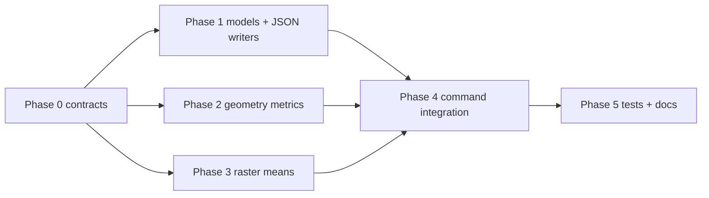

# Terrain feature metadata pipeline — execution plan

This document plans implementation of a **second Python script/pipeline path** that computes and writes per-hex terrain-support metadata for **all** `res1` and **all** `res4` cells, without performing final terrain classification and without suppressing `res4` rows that match their parent terrain.

**Audience:** Coding agent or developer implementing in phases.  
**Primary objective:** Maximum reliability, clarity, and independently verifiable increments.

---

## 1. Scope and success criteria

### 1.1 In scope

1. Add a new pipeline/script entrypoint (parallel to existing terrain classification flow) that computes metadata for:
   - all `res1` cells
   - all `res4` cells
2. Write JSON outputs for `res1` and `res4` with one record per hex containing:
   - `total_edges` (integer, 5-6)
   - `all_water` (boolean)
   - `intersects_water` (boolean)
   - `water_edges` (integer, 0-6)
   - `arctic_mean` (float or null)
   - `forest_mean` (float or null)
   - `desert_mean` (float or null)
   - `tri_mean` (float or null)
   - `slope_mean` (float or null)
   - `elevation_max` (float or null)
   - plus for `res4` only: `all_urban`, `intersects_urban`, `urban_edges`
3. Write a separate JSON file containing:
   - threshold values
   - comparison semantics (`>=`)
   - precedence/order semantics used for deconfliction
4. Preserve determinism and reproducibility standards of the existing terrain pipeline.
5. Add tests for happy paths and essential failures only.

### 1.2 Out of scope

1. Changing current terrain classification outputs or rules.
2. Replacing existing CSV outputs (`terrain_res1_base.csv`, `terrain_res4_exceptions.csv`).
3. TS implementation of deconfliction rules (this plan provides contract data for that work).
4. Any migration of historical outputs.

### 1.3 Definition of done

1. New command/script runs end-to-end and emits all three JSON artifacts.
2. `res1` and `res4` JSON files include all cells at their resolution (not exceptions-only).
3. Output schema is documented and validated.
4. Automated tests cover core contract and essential failure behavior.
5. Logs and comments follow repository standards on touched public backend methods.

---

## 2. Locked technical decisions for this plan

| ID | Decision | Value |
|----|----------|-------|
| A | Existing classifier behavior | Remains unchanged; metadata pipeline is additive. |
| B | Cell universes | Use same H3 generation contract as current pipeline (`res_parent=1`, `res_child=4` by default). |
| C | Water semantics | Derived from polygon predicates and edge coverage, not raster thresholds. |
| D | Urban semantics | Computed and emitted for `res4` only; omitted from `res1` output. |
| E | Mean semantics | Means are deterministic sample means from existing raster sampling pipeline; `elevation_max` field keeps existing naming contract. |
| F | Output determinism | Stable sort by H3 index in emitted JSON arrays. |
| G | Script shape | Add a separate metadata entrypoint module, not a replacement of current `run`. |

---

## 3. Output contracts

## 3.1 `res1` metadata JSON

Proposed path: `data/generated/terrain_res1_metadata.json`

Top-level shape (owner-selected object envelope, not top-level array):

- `schema_version`: string
- `resolution`: integer (`1`)
- `generated_at_utc`: ISO timestamp
- `record_count`: integer
- `records`: array of objects sorted by `h3_index`

Record shape:

- `h3_index`: string
- `total_edges`: integer
- `all_water`: boolean
- `intersects_water`: boolean
- `water_edges`: integer
- `arctic_mean`: number or null
- `forest_mean`: number or null
- `desert_mean`: number or null
- `tri_mean`: number or null
- `slope_mean`: number or null
- `elevation_max`: number or null

## 3.2 `res4` metadata JSON

Proposed path: `data/generated/terrain_res4_metadata.json`

Same base schema as `res1`, with `resolution = 4`, containing **all** `res4` cells, plus:

- `all_urban`: boolean
- `intersects_urban`: boolean
- `urban_edges`: integer

## 3.3 rule-semantics JSON

Proposed path: `data/generated/terrain_rule_semantics.json`

Top-level shape (owner-selected object envelope):

- `schema_version`: string
- `thresholds`: object
  - `arctic_dominant_min`
  - `forest_dominant_min`
  - `desert_barren_min`
  - `mountain_tri_mean_min`
  - `mountain_slope_mean_min`
  - `mountain_elevation_max_min`
- `comparison_semantics`: object
  - `operator`: `">="`
  - `mountain_rule`: `"tri_mean >= tri_threshold OR (slope_mean >= slope_threshold AND elevation_max >= elevation_threshold)"`
- `precedence_order`: array
  - For deconfliction replay, use an explicit simple order matching current behavior:
    `["in_ocean", "coastal_band", "interior_arctic", "interior_forest", "interior_mountain", "interior_desert", "interior_land", "urban_override_res4_non_ocean_intersection"]`
- `nodata_fallback_terrain`: string

Note: This file is intentionally explicit so TS can reconstruct decision flow without reverse-engineering Python source.

---

## 4. Architecture approach

1. Reuse existing modules (`sampling.py`, `ocean_mask.py`, config thresholds, H3 cell generation) to avoid drift.
2. Isolate metadata computation into a dedicated implementation module (for example `metadata_pipeline.py`) rather than overloading existing `TerrainPipeline` classification methods.
3. Keep geometry and raster extraction composable:
   - water/urban geometry metrics
   - raster-derived means
4. Ensure each metric can be unit-tested independently, then integration-tested as a combined record.
5. Prefer explicit dataclass(es) for output records and semantics payloads to keep JSON serialization controlled and understandable.

---

## 5. Implementation standards (mandatory on touched code)

1. **Logging**
   - new/updated public backend method invocations log at debug
   - caught exceptions log at error
   - non-mutating getters log at trace
2. **Orienting comments**
   - add orienting comments on new/updated public, non-overriding methods
3. **Tests**
   - happy paths + essential failure contracts only
   - avoid implementation-detail assertions
4. **Readability**
   - clear function boundaries for geometry metrics vs raster metrics
   - avoid hidden schema construction; centralize schema constants

---

## 6. Phased execution plan

Each phase must be independently verifiable using tests plus artifact inspections from completed phases.

## Phase 0 — Contract freeze and path decisions

**Objective:** Finalize schema and command shape before implementation.

**Tasks:**

1. Confirm output filenames and object-envelope JSON payload shape (single file per resolution, with `records` array).
2. Confirm strict field names and nullability policy.
3. Confirm `forest_mean` only (no class_1..4 output fields).
4. Confirm `res1` omits urban fields and `res4` includes them.
5. Confirm semantics payload `precedence_order` labels.

**Verification:**

- Written schema section in this doc is finalized.
- No unresolved naming/shape ambiguities.

**Exit criteria:**

- Implementation can proceed without schema churn.

---

## Phase 1 — Core data model and serialization scaffolding

**Objective:** Add typed record models and deterministic JSON writers.

**Tasks:**

1. Add dataclass models for:
   - per-hex metadata record
   - per-resolution metadata document
   - rule-semantics document
2. Add JSON write helpers:
   - UTF-8, newline-stable
   - deterministic ordering (`h3_index` sort)
   - pretty-printed JSON (`indent=2`) for readability
3. Add schema-version constant(s) and embed in all outputs.

**Verification:**

- Unit tests for serialization shape and deterministic ordering.
- Golden snapshot test for a tiny synthetic record set.

**Exit criteria:**

- Static payloads serialize exactly as contract.

---

## Phase 2 — Geometry metric extraction (water and urban)

**Objective:** Compute edge and intersection booleans/integers per cell, with urban metrics emitted only for `res4`.

**Tasks:**

1. Build reusable helpers for edge metrics from polygon masks:
   - `total_edges`
   - `all_*`
   - `intersects_*`
   - `*_edges`
2. Reuse existing mask preparation contexts:
   - `res1` water: ocean only
   - `res4` water: ocean+lakes
   - urban: urban shapefile union
3. Ensure edge count logic handles pentagons and hexagons (`5` or `6`) correctly.
4. Add guardrails validating `*_edges <= total_edges`.

**Verification:**

- Unit tests with controlled synthetic polygons for:
  - full cover
  - no intersection
  - partial edge coverage
- Integration smoke on a small cell subset from real data.

**Exit criteria:**

- Water metrics stable and contract-valid for both resolutions; urban metrics stable and contract-valid for `res4`.

---

## Phase 3 — Raster mean extraction for biome-support metrics

**Objective:** Compute `arctic_mean`, `forest_mean`, `desert_mean`, `tri_mean`, `slope_mean`, `elevation_max`.

**Tasks:**

1. Reuse deterministic point sampling counts:
   - `res1`: existing `area_weighted_samples_per_cell_res1`
   - `res4`: existing `area_weighted_samples_per_cell_res4`
2. Compute:
   - `arctic_mean = class_10 mean`
   - `forest_mean = class_1 + class_2 + class_3 + class_4 means`
   - `desert_mean = class_11 mean`
3. Reuse existing topo key selection per resolution.
4. Preserve null semantics when samples are unavailable.

**Verification:**

- Unit tests for mean composition (forest sum, null handling).
- Integration comparison on selected cells versus direct sampled raster reads.

**Exit criteria:**

- Raster-derived fields are reproducible and contract-valid.

---

## Phase 4 — End-to-end metadata pipeline command

**Objective:** Deliver runnable second script/CLI command producing all artifacts.

**Tasks:**

1. Add separate metadata entrypoint (example: `python -m scripts.terrain_pipeline.metadata_cli --verbose`).
2. Run phase sequence:
   - environment validation reuse
   - cell generation for both resolutions
   - metadata extraction for `res1` and `res4`
   - semantics JSON emission
3. Emit:
   - `terrain_res1_metadata.json`
   - `terrain_res4_metadata.json`
   - `terrain_rule_semantics.json`
4. Add summary logs with counts and output paths.

**Verification:**

- Manual run with small cap (`--max-child-cells`) if supported for command.
- Full run smoke in a prepared environment.
- Validate record counts match generated cell counts.

**Exit criteria:**

- New command reliably emits all expected files.

---

## Phase 5 — Quality gates, tests, and documentation

**Objective:** Lock reliability and maintainability.

**Tasks:**

1. Add integration tests for:
   - output files exist and parse
   - required keys present
   - essential invariant checks (edge counts, bool consistency, and `res1` urban-field omission contract)
2. Add essential failure tests:
   - missing shapefile
   - missing raster
   - invalid thresholds config in semantics output path
3. Update `scripts/terrain_pipeline/README.md` with:
   - new command usage
   - output file descriptions
   - semantics file intent for TS parity
4. Confirm touched public methods include orienting comments and required logs.

**Verification:**

- Test suite green for new tests and impacted existing tests.
- Manual artifact inspection on sample run.

**Exit criteria:**

- Implementation is understandable, test-backed, and production-usable.

---

## 7. Dependency graph (summary)

---

## 8. Risk register

| Risk | Impact | Mitigation |
|------|--------|------------|
| Contract drift between Python and TS rule replay | Classification mismatch in consumers | Emit explicit semantics JSON with rule order and operators. |
| Ambiguous edge-count semantics | Inconsistent all/intersects flags | Centralize edge metric helper and test with synthetic geometries. |
| Large JSON output size for full `res4` | Slow writes/loads | Keep JSON arrays as selected; add optional gzip follow-up only if needed. |
| Nodata handling ambiguity | Null/number mismatches across environments | Contract-test null behavior and document it explicitly. |
| Duplicate logic between existing and metadata pipelines | Future maintenance cost | Reuse existing helpers and keep one source of truth per metric computation. |

---

## 9. Resolved owner decisions

1. **Output encoding:** JSON array files.
2. **Forest fields:** `forest_mean` only.
3. **Urban fields on `res1`:** Omitted.
4. **Semantics precedence payload:** Use explicit labels:
   - `in_ocean`
   - `coastal_band`
   - `interior_arctic`
   - `interior_forest`
   - `interior_mountain`
   - `interior_desert`
   - `interior_land`
   - `urban_override_res4_non_ocean_intersection`
5. **`elevation_max` semantics:** Keep field name as `elevation_max`.
6. **CLI shape:** Separate module entrypoint.
7. **JSON root shape for `res1`/`res4` files:** Top-level object envelope with metadata fields and `records` array (not top-level array).
8. **JSON formatting:** Pretty-printed output (indentation enabled) for readability.

---

*End of plan.*
