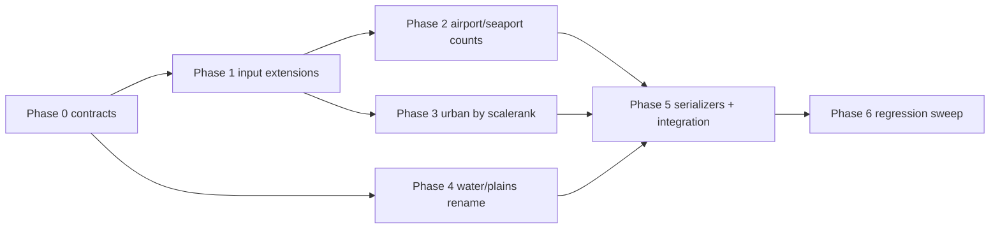

# Terrain metadata enhancements — execution plan

This document plans implementation of enhancements to the terrain metadata pipeline and related terrain-label terminology updates.

**Audience:** Coding agent or developer implementing in phases.  
**Primary objective:** Maximum reliability, clarity, and independently verifiable increments.

---

## 1. Scope and success criteria

### 1.1 In scope

1. Expand res-4 urban metadata from a single aggregate triple to:
   - keep existing aggregate fields:
     - `all_urban`
     - `intersects_urban`
     - `urban_edges`
   - add per-`scalerank` breakdown array with the same triple for each scalerank.
2. Add airport point-count metadata for both `res1` and `res4`:
   - total airport count per hex
   - per-`scalerank` airport counts array
   - source: `ne_10m_airports.shp`, features with `featurecla == "Airport"`.
3. Add seaport point-count metadata for both `res1` and `res4`:
   - total seaport count per hex
   - per-`scalerank` seaport counts array
   - source: `ne_10m_ports.shp`, features with `featurecla == "Seaport"`.
4. Rename terrain label terminology in pipeline/output contracts:
   - `ocean` → `water`
   - `land` → `plains`
5. Preserve deterministic outputs and pretty-printed JSON object envelopes.

### 1.2 Out of scope

1. Changing geometry predicate logic (coverage/intersection rules) beyond required renaming.
2. Modifying unrelated gameplay semantics outside terrain-label propagation needs.
3. Replacing metadata pipeline architecture; this is an enhancement pass.

### 1.3 Definition of done

1. Metadata outputs include new airport/seaport counts and res-4 urban-per-scalerank breakdown.
2. Terrain label rename is consistently applied to pipeline outputs and contracts.
3. Tests cover happy paths and essential failures for new behavior.
4. Existing deterministic and validation behavior remains intact.
5. Touched public backend methods include required logs and orienting comments.

---

## 2. Locked technical direction

| ID | Decision | Value |
|----|----------|-------|
| A | Metadata file shape | Keep object-envelope root with `records` array. |
| B | JSON style | Pretty-printed (`indent=2`) with trailing newline. |
| C | Per-scalerank arrays | Use deterministic sort by numeric `scalerank` ascending. |
| D | Point counting rule | Prevent double-counting by assigning each point to exactly one hex: points on shared boundaries are assigned to the lexicographically smallest candidate H3 index among touching cells. |
| E | Label migration approach | Hard cutover for `ocean`→`water` and `land`→`plains` (no compatibility aliases in this effort). |
| F | Scalerank anomaly handling | Bucket missing/non-integer scalerank values under sentinel scalerank `-1` while still contributing to totals. |
| G | Semantics labels | Emit new labels only (`water`, `plains`). |

---

## 3. Proposed output contract changes

## 3.1 Res-4 urban metadata extension

Keep existing fields:

- `all_urban`: boolean
- `intersects_urban`: boolean
- `urban_edges`: integer

Add:

- `urban_by_scalerank`: array of:
  - `scalerank`: integer
  - `all_urban`: boolean
  - `intersects_urban`: boolean
  - `urban_edges`: integer

## 3.2 Airport and seaport counts (both `res1` and `res4`)

Add:

- `airport_count_total`: integer
- `airport_count_by_scalerank`: array of:
  - `scalerank`: integer
  - `count`: integer
- `seaport_count_total`: integer
- `seaport_count_by_scalerank`: array of:
  - `scalerank`: integer
  - `count`: integer

Per-scalerank arrays are sparse (omit zero-count scaleranks).

## 3.3 Rule-semantics file updates

Update terminology and precedence labels to new names:

- `in_ocean` → `in_water`
- `interior_land` → `interior_plains`

Keep comparison semantics unchanged (`>=`) unless explicitly changed by owner.

---

## 4. Architecture approach

1. Reuse current mask/raster pipeline structure and extend with point-index processing for airports/seaports.
2. Add dedicated loaders for point shapefiles with:
   - robust field validation (`featurecla`, `scalerank`)
3. Keep per-hex metric extraction decomposed:
   - polygon-mask metrics
   - raster means
   - point counts (total + by scalerank)
4. Add deterministic tie-break logic for boundary-touch points so each airport/seaport feature contributes to exactly one hex.
5. Implement label renaming via centralized constants first, then propagate to serializers/semantics/outputs.
6. Add targeted regression checks during hard-cutover rename.

---

## 5. Implementation standards (mandatory on touched code)

1. **Logging**
   - new/updated public backend method invocations log at debug
   - caught exceptions log at error
   - non-mutating getters log at trace
2. **Orienting comments**
   - add orienting comments on new/updated public, non-overriding methods
3. **Tests**
   - happy paths + essential failures only
   - avoid implementation-detail assertions
4. **Readability**
   - small composable helpers for scalerank aggregation and point counting
   - centralized schema constants and serializer paths

---

## 6. Phased execution plan

Each phase is independently verifiable with tests and artifact inspection.

## Phase 0 — Contract freeze and migration decisions

**Objective:** Lock output schema and rename migration boundaries before coding.

**Tasks:**

1. Finalize new JSON fields and exact key names.
2. Finalize anti-double-count point-in-hex strategy:
   - strictly interior points count in their containing hex
   - boundary-touch points are assigned once via deterministic smallest-H3-index tie-break
3. Confirm scalerank typing/normalization strategy:
   - integer scaleranks preserved
   - missing/non-integer scaleranks bucketed under sentinel scalerank `-1`
4. Confirm rename scope (`water`/`plains`) across:
   - terrain CSV outputs
   - DB staging table checks
   - metadata semantics labels
   - downstream TS readers/consumers
5. Lock hard-cutover behavior for renamed terrain labels and remove compatibility aliases from semantics output.

**Verification:**

- Schema and migration decisions documented in this plan section.
- No unresolved contract ambiguity.

**Exit criteria:**

- Implementation can proceed without schema churn or rename uncertainty.

---

## Phase 1 — Config and input-sources extension

**Objective:** Add airport/seaport shapefile config contracts and validation hooks.

**Tasks:**

1. Extend input config with:
   - `airport_shapefile_name` default `ne_10m_airports.shp`
   - `seaport_shapefile_name` default `ne_10m_ports.shp`
2. Extend validation to require these files and verify readable features.
3. Add reusable point-shapefile loading utilities with scalerank + featureclass extraction.

**Verification:**

- Unit tests for config defaults and missing-file failures.
- Validation command fails clearly when airport/seaport shapefiles are absent/malformed.

**Exit criteria:**

- Input layer supports airports/seaports with deterministic parsing.

---

## Phase 2 — Point-count metric extraction (airports and seaports)

**Objective:** Produce per-hex total and per-scalerank point counts for airports/seaports.

**Tasks:**

1. Build point-index workflow:
   - load and filter points by `featurecla`
   - normalize scalerank values
   - project/prepare as needed for fast repeated point-in-polygon checks
   - resolve boundary-touch ties deterministically so each point has exactly one owning hex
2. Implement per-hex counters:
   - `airport_count_total`, `airport_count_by_scalerank`
   - `seaport_count_total`, `seaport_count_by_scalerank`
3. Ensure deterministic scalerank-array ordering.
4. Add invariants:
   - sum(by_scalerank.count) == total.

**Verification:**

- Unit tests with synthetic point datasets.
- Essential failure tests for missing required point properties.

**Exit criteria:**

- Point counts are stable, deterministic, and contract-valid.

---

## Phase 3 — Res-4 urban-by-scalerank mask breakdown

**Objective:** Add per-scalerank urban mask metrics while preserving existing aggregate fields.

**Tasks:**

1. Split urban polygons by scalerank during load.
2. Compute per-hex urban metrics for each scalerank:
   - `all_urban`, `intersects_urban`, `urban_edges`
3. Aggregate existing res-4 total urban metrics unchanged.
4. Serialize `urban_by_scalerank` as deterministic sorted array.

**Verification:**

- Unit tests: scalerank breakdown sums/consistency with aggregate behavior.
- Integration smoke test on sample cells.

**Exit criteria:**

- Res-4 outputs include both aggregate urban metrics and per-scalerank breakdown.

---

## Phase 4 — Terrain label rename (`ocean`→`water`, `land`→`plains`)

**Objective:** Safely apply terminology change across pipeline outputs/contracts.

**Tasks:**

1. Replace canonical enum/labels in classification pipeline and output writers.
2. Update semantics payload labels and precedence entries.
3. Update CSV/DB constraints/checks using terrain labels.
4. Update downstream readers/tests/docs to match new labels.
5. Remove compatibility aliases and ensure all touched contracts use hard-cutover labels only.

**Verification:**

- Unit/integration tests for classifier outputs with new labels.
- Contract checks for DB schema and CSV readers.
- Focused regression checks in TS terrain consumers.

**Exit criteria:**

- No surviving `ocean`/`land` output labels where canonical terrain labels are expected.

---

## Phase 5 — Serializer updates and end-to-end metadata export integration

**Objective:** Emit enhanced metadata files and semantics files with final schema.

**Tasks:**

1. Extend record models and JSON serializers for new fields.
2. Keep res1/res4 envelope contracts stable (object root + `records`).
3. Ensure pretty-printed output and deterministic row ordering.
4. Update CLI help/readme examples for new data sources and fields.

**Verification:**

- Golden-file snapshot tests for res1/res4/semantics JSON examples.
- Run metadata CLI validate/run with dry-run cap and inspect outputs.

**Exit criteria:**

- Enhanced JSON outputs are generated correctly and documented.

---

## Phase 6 — Regression sweep and release readiness

**Objective:** Ensure reliability and maintainability after enhancements.

**Tasks:**

1. Run full terrain pipeline test suite (including metadata tests).
2. Add/confirm essential failure tests:
   - missing airport/seaport shapefiles
   - malformed scalerank values (bucket to sentinel while preserving coherent totals)
   - invalid rename-dependent consumer assumptions
3. Confirm public-method logging/orienting comments on all touched methods.
4. Validate no accidental behavior drift in existing non-enhanced paths.

**Verification:**

- Green test run + manual sanity checks on generated artifacts.

**Exit criteria:**

- Implementation is stable, understandable, and compliant with owner rules.

---

## 7. Dependency graph

---

## 8. Risk register

| Risk | Impact | Mitigation |
|------|--------|------------|
| Rename scope underestimation (`ocean`/`land`) | Consumer breakage (TS readers, DB checks, CSV imports) | Phase 0 scope lock + Phase 4 explicit migration and consumer tests. |
| Scalerank quality variance in Natural Earth fields | Bad grouping or dropped records | Normalize and bucket invalid scaleranks under sentinel; test total consistency. |
| Point-in-hex boundary ambiguity | Off-by-one or duplicate counts | Deterministic single-owner tie-break for boundary points + dedicated tests. |
| Output size growth from per-scalerank arrays | Slower exports/parsing | Keep deterministic arrays; profile with `--max-child-cells` first. |
| Dual semantics drift (aggregate vs scalerank urban) | Inconsistent metadata interpretation | Add invariant tests and consistency checks in Phase 3. |

---

## 9. Resolved owner decisions

1. **Per-scalerank arrays:** sparse arrays (omit zero-count scaleranks).
2. **Boundary points:** use an anti-double-count strategy with deterministic single-hex assignment.
3. **Invalid scalerank values:** bucket under sentinel scalerank `-1` so totals remain coherent.
4. **Rename migration:** hard cutover for `ocean`→`water` and `land`→`plains`.
5. **Semantics labels:** new labels only; no legacy aliases.

---

*End of plan.*
