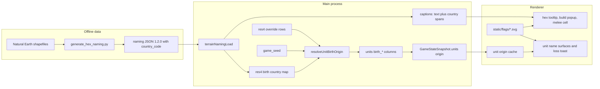

# Unit Origin and Country Flags: Execution Plan

Every new unit records where it was born: its birth res1 hex, a birth res4 cell, that cell's terrain, and a country of origin. The UI puts a small SVG country flag before full unit names and before country names in hex tooltips and popups. Hovering a unit's flag shows its origin and birth terrain. This change does not add terrain bonuses or any other gameplay effect.

## Ground Rules for the Executing Agent

- **Do not** put this document's phase numbers, phase titles, or step labels into product code, comments, configuration, tests, or `doc/`. Never commit or push.
- Follow every rule in `.cursor/rules/`. The ones most likely to bite here:
  - Every new or changed field, function, type, and constant gets an orienting comment (why it exists, when to use it, what to expect, exceptions).
  - Main-process logging uses `logDebug` / `logTrace` / `logError` from `src/main/logger.ts`. Public mutating functions log at debug, getter-style reads at trace, and every caught exception at error. Renderer catch paths use `console.error`, matching existing renderer code.
  - Use `const`, `readonly`, and `ReadonlyMap` / `ReadonlyArray` wherever the value is not mutated.
  - At most 6 named arguments per function; use a parameter object beyond that.
  - File size: 600 lines desirable, 1000 hard. `src/renderer/renderer.ts` (3266), `src/main/gameDb.ts` (1557), `src/main/terrainNamingLoad.ts` (1058), `src/renderer/gameplay/readyHandler.ts` (1259), and `src/renderer/core/state.ts` (1162) are already over. Put new logic in **new** modules and change those files by only a few lines each. `terrainNamingLoad.ts` gets smaller in the caption phase.
  - Naming contract: `doc/naming-conventions-contract-v1.md`. camelCase files and directories, PascalCase types, only the allowed role suffixes. String values such as IPC channel strings, SQL column names, and generated-JSON keys are frozen once they exist.
  - Tests: happy paths and essential failures only. No tests for pure delegation, types, or accessors.
- If a test or check does not match what this plan says to expect, stop and investigate. Never edit an assertion just to make it pass.
- Run commands from the repository root `F:\Projects\Personal\agent-wars` in PowerShell.

## Locked Decisions

1. **Birth data per unit:** birth res1 hex, birth res4 cell, birth terrain kind, birth country name, and birth country ISO alpha-2 code. It is written once when the unit row is inserted, never recomputed, and has no gameplay effect. The AI prompts do not get it.
2. **Birth cell selection:** a deterministic seeded pick among the **intact urban** res4 children of the birth res1 hex (urban and not rubble). If there are none, pick among the **land** children (effective terrain kind is not `water`). If there are none of those either, there is no birth cell: the terrain is the res1 hex's `terrain_kind` and the country is unknown. The pick varies from unit to unit within one hex and is stable for a given game seed and unit id.
3. **Birth country:** taken from the chosen res4 cell's naming record (rules in the birth-selection phase), using one canonical country name per ISO code.
4. **Country codes:** the Python naming pipeline emits `country_code` on every country, state, and city row (naming schema `1.2.0`), resolved through `ADM0_A3` → `ISO_A2_EH`, falling back to `ISO_A2`. `-99` means no code.
5. **Flag assets:** a pinned copy of `https://github.com/hampusborgos/country-flags` at commit `c09927e63705529bbf59ca6684cd9b23225dddad`, vendored as `static/flags/<lowercase-iso2>.svg`. Only two-letter files are copied (the four `gb-*.svg` subdivision flags are excluded). A repo-authored placeholder `static/flag-unknown.svg` fills any country slot with no flag file or no code.
6. **Who gets unit flags:** every unit the human can see, own and enemy.
7. **Surfaces with unit flags:**
   - In scope: stack callout unit labels, the sealift fleet label, the selected-unit sidebar line, pending order rows (march, standing order, ferry), ranged and air-strike rows, and the loss-summary toast bullets.
   - Excused: `<select>` / `<option>` lists (sealift embark), AI activity log text, prose toasts (validation, tactical placement skip), the combat-activity fallback lines in the turn toast's Updates section, map canvas tokens, the build popup (type nouns only), and the melee-intercept modal (counts only).
8. **Unit flag tooltip** (unit flags only), two lines:
   - `Origin: <country> (<XX>)`, where `XX` is `getStrategicRes1HexCode(birthH3Index)`. Drop the parenthetical if no code resolves.
   - `Terrain: <Terrain>`, title-cased, the same label style the hex tooltip uses.
   - When the country is unknown: placeholder flag and `Origin: Unknown (XX)`.
   - Units with no recorded birth data (rows inserted by tests or legacy code) show no flag at all.
9. **Hex tooltips and popups** (res1 and res4 hover tooltip, build popup, melee-intercept hex cell): every **country name** gets the same flag, with no tooltip. That means the country heading in city and state captions and each country item in country captions. A real country name with no ISO code gets the placeholder flag. The literal fallback heading `Unknown Country` (used when a city row has no country) is not a country name and gets no flag. Continent headings, state and city names, and water captions get no flag.
10. **No terrain bonuses.**

## Verified Facts

- **Unit inserts.** Exactly two production insert sites:
  - `insertPlannedUnitsForPlayer` in `src/main/gameDb/seeding/plannedUnits.ts` (opening seed; called by `seedUnits` and `trySeedScenarioRegionVsRegion`).
  - `spawnProducedUnitsForHex` in `src/main/gameActions/controlAndProduction.ts` (production).

  Tactical battles never insert strategic units. Test files insert units with inline SQL that does not name birth columns.
- **Seeding dependencies.** `gameDb.ts` builds the seeding deps object once, in its private `seedUnits()` (around line 756: `run`, `getOne`, `getAll`, `allocateNextUnitDisplayOrder`, `allocateNextUnitIdOrdinal`, `hasDb`). `seedUnits.ts` and `regionScenarioSeeding.ts` each declare a deps interface that threads those members into `insertPlannedUnitsForPlayer`.
- **Production database helpers.** `controlAndProduction.ts` already imports `dbRun`, `dbGetOne`, and `dbGetAll` from `../gameDb`. `BasicDbOps` (`src/main/gameDb/dbOps.ts`) is `{ run, getOne, getAll }`, and `ControlDbOps` in `controlInfrastructure.ts` is an alias of it.
- **Test databases.** `withTempGameDb` (`src/main/testSupport/withTempGameDb.ts`) calls `resetGameForNewMatch()`, which seeds from the real terrain cache. Tests built on it see real res4 terrain, the game seed, and seeded units.
- **Fog.** `getGameStateForPlayer` in `src/main/gameDb/fogState.ts` filters `state.units` by visibility and passes the same objects through, so an `origin` field survives. No main-process code serializes whole unit objects with `JSON.stringify`.
- **Schema.** `units` DDL is in `src/main/gameDb/schema.ts` (`getFullDdl`). `EXPECTED_USER_VERSION = 14` in `src/main/gameDb.ts`. There are no `ALTER TABLE` migrations: a version mismatch recreates the database, which is the established, intended behavior.
- **Game seed.** `game_seed` is written before opening units: `resetGame.ts` calls `seedGameSeedIfMissing()` and then `seedUnits()`, and the fresh-create path seeds it too. Read it with `getGameSeedWithOps` in `src/main/gameDb/gameConfigKv.ts`.
- **Res4 terrain.**
  - `getRes4TerrainOverridesForRendererFromGame(ops)` in `src/main/gameDb/controlInfrastructure.ts` returns merged rows `{ h3Index, terrainKind, isUrban, isRubble?, ... }`. They are memoized by `res4RendererOverrideCache.ts`, and the array identity is stable on a cache hit.
  - A res4 child with no row inherits the parent res1 `terrain_kind`.
  - Urban is a flag, not a terrain kind.
  - Terrain kinds are `water | coastal | wetlands | plains | forest | mountain | desert | arctic` (`src/shared/pipelineTerrain.ts`).
- **Naming data.**
  - `data/generated/terrain_res{1,4}_naming.json` (schema `1.1.0`) has names only, no codes.
  - It is loaded by `src/main/terrainNamingLoad.ts` and reduced to tooltip **strings** in `terrainClassificationCache.ts` (`namingLinesRes1ByH3`, `namingLinesRes4ByH3`), then sent over IPC `game:getHexNamingTooltipLine` as `string | null`.
  - The renderer bolds headings with `formatGroupedSemicolonNamingLineHtml` (`src/shared/htmlTextFormatting.ts`). Its three callers are the hover tooltip `formatTerrainTooltipHtml` (`src/renderer/map/terrainTooltipRes1State.ts`), the build popup (`buildQueuePopup.ts` via `formatGroupedBuildNamingLineHtml`), and the melee-intercept hex cell (`src/renderer/gameplay/meleeInterceptHexTooltip.ts`, which reuses the tooltip HTML).
- **Generated-data packaging.** The JSON is tracked in git as `data/generated/*.json.zip`. `npm run generated:zip` re-zips every listed JSON, and `npm run generated:extract` (run by `build:main`) unzips whenever a zip is newer than its JSON.
- **Shapefile fields** (inspected in `F:\Data`):
  - Countries have `ADM0_A3`, `ISO_A2`, and `ISO_A2_EH`. `ISO_A2_EH` fixes France, Norway, Kosovo, and others where `ISO_A2` is `-99`. 13 disputed or special areas are `-99` in both fields; they get no code.
  - States have `adm0_a3` and every value matches a country. A state's country **name** comes from its `admin` field.
  - Cities have `ADM0_A3` and `ISO_A2`. `SJM`, `SSD`, and `TKL` are not country `ADM0_A3` values and must fall back to the city's own `ISO_A2`. A city's country **name** comes from `adm0name`.
- **Pipeline module layout.** `_resolve_field_names` lives in `generate_hex_naming.py`, and `tests/test_generate_hex_naming.py` imports it from there. A new module that `generate_hex_naming.py` imports must therefore **not** import `generate_hex_naming.py` back, because that would be a circular import. The pipeline runs as `python -m scripts.naming_pipeline.generate_hex_naming`, so package-relative imports (`from .country_codes import ...`) work. `python -m unittest scripts.naming_pipeline.tests.test_generate_hex_naming` currently runs 4 tests and passes.
- **Unit names.**
  - Built by `buildUnitDisplayNameLookup` in `src/shared/unitDisplayNames.ts`. The renderer resolves them with `formatUnitDisplayName` in `renderer.ts`, and `rebuildUnitDisplayNameLookup` (around line 1346) rebuilds the lookup from each snapshot.
  - Tactical sub-unit ids are `<parentUnitId>-s<slot>`; `parseTacticalSubUnitId` in `src/shared/unitIds.ts` returns `{ parentUnitId, slot }`.
- **Unit name surfaces** (all set `textContent` today):
  - `showStackCallout`: `label.textContent = formatUnitDisplayName(u.id)` in `renderer.ts`, around line 923.
  - `renderSealiftSection`: the fleet label in `renderer.ts`, around line 684.
  - `updateSidebar` in `src/renderer/core/uiState.ts`.
  - `createSidebarOrderRow` / `updatePendingOrdersSidebar` in `src/renderer/gameplay/sidebarSupport.ts`.
  - `updateRangedSidebar` (ranged and air rows) in `src/renderer/gameplay/tacticalOrders.ts`.
  - Loss toast: `buildPopupTurnLossSummary` → `buildConsolidatedTurnUpdateToastMessage` (`src/shared/consolidatedTurnUpdateToast.ts`) → `showMapToast` (`src/renderer/openRouter/openRouterUiHelpers.ts`). Each loss line is `${causeLabel}: ${text}`, where `text` is the victims' display names joined by `', '` (or grouped type totals such as `3 Infantry` when there are more than five). `showMapToast` splits the message into lines and sets `textContent` per bullet; its signature is already `showMapToast(message: string, options?: { isError?: boolean })`. `LostUnit.unitId` is populated (`lossSummaryFromResolution.ts`).
  - Human display names use ordinals (`1st Infantry`) and opponent names use roman numerals (`I Infantry`), so names do not collide across sides.
  - The order-row target labels (distances, `(ferry)`, strike target type) never contain another unit's name.
  - `createSidebarOrderRow` has six callers: four in `sidebarSupport.ts` (tactical march, tactical ferry, strategic standing order, strategic ferry) and two in `tacticalOrders.ts` (ranged, air strike). Each knows its unit id.
- **Renderer startup.** `init()` in `renderer.ts` (around line 3143) runs on `DOMContentLoaded`. `rebuildUnitDisplayNameLookup` (around line 1346) has no early return; it is called from `applyGameStateSnapshot` in `src/renderer/core/stateSnapshot.ts` and from the new-game handler in `src/renderer/gameplay/newGame.ts` (around line 241).
- **Renderer assets and styles.** The page is `static/index.html` (inline `<style>`, no CSP meta). `.hex-tooltip` is `position: fixed; pointer-events: none; max-width: 180px; white-space: normal; z-index: 6400`. Other layers: stack callout 6500, tactical HUD 6600, map toast 7000 (hoverable), game-over overlay 7002, tactical annihilation overlay 7010. `static/` is packaged by electron-builder, and `static/flags/` is not git-ignored. Relative URLs resolve from `static/`, so `flags/fr.svg` is correct.
- **Tracked build output.** `static/renderer.js` is tracked in git, so `npm run build:renderer` modifies it; that is expected. The extracted `data/generated/*.json` files are git-ignored; only their `.json.zip` files are tracked.
- **`npm test`** runs `rebuild:native:node`, `build:main`, `lint`, `naming:check`, `check:renderer-types`, and then every compiled main and shared test.
- **Strategic hex code.** `getStrategicRes1HexCode(h3Index)` in `src/shared/hexLlmCodeAssignment.ts` returns a globally stable two-character code, usable from both the renderer and main.
- **Hashing.** `computeTacticalBattleSnapshot.ts` has a private FNV-1a `hashBattleIdToSeed` (lines 152–159) that can be reused.
- **Flag repo.** 255 SVG files, about 3.5 MB, lowercase two-letter names plus `gb-eng`, `gb-nir`, `gb-sct`, `gb-wls`. No LICENSE file. The README states the flags are public domain.

## Data Flow



## New Modules at a Glance

- `scripts/naming_pipeline/country_codes.py`: pure ISO code normalization, `ADM0_A3` → code map building, and code resolution (no shapefile I/O).
- `src/shared/countryFlags.ts`: the available flag code set, asset path, and flag `` HTML.
- `src/shared/hexNamingCaption.ts`: caption type, caption builder, intern key, and caption HTML (with flags).
- `src/shared/terrainKindLabel.ts`: shared title-case terrain label (extracted from the hover tooltip).
- `src/shared/stableHash.ts`: FNV-1a string hash (extracted from tactical placement).
- `src/shared/unitOriginTypes.ts`: `UnitOrigin` type.
- `src/shared/unitOriginTooltipText.ts`: the two-line tooltip text.
- `src/shared/lossToastUnitSegments.ts`: splits a loss-cause bullet into name and text segments.
- `src/main/terrainNamingCaption.ts`: caption selection, moved out of `terrainNamingLoad.ts`.
- `src/main/unitOrigin/res4BirthCountry.ts`: birth country for one res4 naming record, plus the per-cell map builder.
- `src/main/unitOrigin/unitBirthCellSelection.ts`: pure seeded birth-cell and origin selection.
- `src/main/unitOrigin/unitBirthOrigin.ts`: wiring from the database and terrain cache to the selection.
- `src/main/gameDb/unitInsert.ts`: one `INSERT INTO units` used by both insert sites.
- `src/renderer/core/unitOriginFlags.ts`: renderer origin cache, flag DOM helpers, and the loss-toast origin map builder.
- `src/renderer/core/unitOriginTooltip.ts`: delegated hover tooltip for unit flags.

---

## Phase 0: Preflight

**Goal:** a known-good baseline.

1. `npm run rebuild:native:node`
2. `npm test`. Record any failing test files; they are pre-existing and must not be blamed on this work.
3. `python -m unittest scripts.naming_pipeline.tests.test_generate_hex_naming -v`. Record the result.
4. `npm run check:circular`. Record the result.
5. Confirm `F:\Data\ne_10m_admin_0_countries.shp`, `ne_10m_admin_1_states_provinces.shp`, and `ne_10m_populated_places.shp` exist.

**Done when:** the baseline results are written down in your working notes (not in the repo).

---

## Phase 1: The Naming Pipeline Emits Country Codes (Python Only)

**Goal:** `generate_hex_naming.py` can emit `country_code`. This phase does not regenerate data.

**Files:** `scripts/naming_pipeline/country_codes.py` (new), `scripts/naming_pipeline/generate_hex_naming.py`, `scripts/naming_pipeline/tests/test_generate_hex_naming.py`, `scripts/naming_pipeline/tests/test_country_codes.py` (new).

**Steps:**

1. Create `country_codes.py`: **pure Python with no `fiona` import and no import from `generate_hex_naming.py`** (see the circular-import fact above). Use "Why this exists / When to use / What to expect" docstrings like the existing module:
   - `normalize_iso_a2(value: object) -> str | None`: strip and uppercase. Return `None` for `None`, empty, `-99`, or anything that is not exactly two ASCII letters.
   - `build_country_code_by_adm0_a3(rows: Iterable[tuple[object, object, object]]) -> dict[str, str | None]`: each row is `(adm0_a3, iso_a2_eh, iso_a2)`. Skip rows whose `adm0_a3` is empty after `str(...).strip()`. The code is `normalize_iso_a2(iso_a2_eh) or normalize_iso_a2(iso_a2)`. If an `adm0_a3` repeats, keep the first non-`None` code. Log the row count and the count of `None` codes at DEBUG.
   - `resolve_country_code(adm0_a3: object, fallback_iso_a2: object, code_by_adm0_a3: Mapping[str, str | None]) -> str | None`: if the stripped `adm0_a3` string is a key of the map, return the mapped value (which may be `None`). Otherwise return `normalize_iso_a2(fallback_iso_a2)`.
2. In `generate_hex_naming.py`:
   - `from .country_codes import build_country_code_by_adm0_a3, resolve_country_code`.
   - `SCHEMA_VERSION = "1.2.0"`.
   - `REQUIRED_FIELDS_BY_LAYER`: countries add `"adm0_a3", "iso_a2", "iso_a2_eh"`; states add `"adm0_a3"`; cities add `"adm0_a3", "iso_a2"`.
   - Add a private `_load_country_code_by_adm0_a3(countries_path: Path) -> dict[str, str | None]` next to `_insert_countries`. It opens the shapefile with `fiona`, resolves the three fields with the existing `_resolve_field_names`, and passes a generator of `(adm0_a3, iso_a2_eh, iso_a2)` tuples to `build_country_code_by_adm0_a3`. Keep it under about 20 lines.
   - `_init_tables`: add `country_code TEXT` to `countries_res1`, `countries_res4`, `states_res1`, `states_res4`, and `cities_res4`. Leave every `UNIQUE(...)` clause unchanged; the code depends on the country, so dedupe is unaffected.
   - `run_pipeline`: build `code_by_adm0_a3 = _load_country_code_by_adm0_a3(countries_path)` once, then pass it as a keyword argument to `_insert_countries`, `_insert_states`, and `_insert_cities`.
   - Countries: `country_code = resolve_country_code(props[adm0_a3], props[iso_a2], code_by_adm0_a3)`. States: `resolve_country_code(props[adm0_a3], None, ...)`. Cities: `resolve_country_code(props[adm0_a3], props[iso_a2], ...)`. Add the column to each `INSERT`.
   - `_write_res1_json` / `_write_res4_json`: add `'country_code', country_code` to every `json_object(...)` for countries, states, and cities. Water rows are unchanged.
   - Update the module docstring so the field list mentions the codes.
   - `generate_hex_naming.py` is already 806 lines. Keep its growth to roughly 50 lines; anything bigger belongs in `country_codes.py`.
3. Tests (essential only):
   - `test_country_codes.py`: `normalize_iso_a2` (`"fr"` → `"FR"`, `"-99"` → `None`, `"ABC"` → `None`); `build_country_code_by_adm0_a3` (`ISO_A2_EH` wins over `ISO_A2`, and a `-99`/`-99` row maps to `None`); `resolve_country_code` (a mapped key wins, including when it maps to `None`; an unmapped key falls back to the city ISO).
   - `test_generate_hex_naming.py`: in the existing shape test, give one country, one state, and one city row a `country_code` (and leave one `NULL`), then assert the emitted JSON has `country_code` with those values and `null`. The existing `INSERT` statements name their columns, so the new nullable column needs no other edits.

**Verify:**

- `python -m unittest scripts.naming_pipeline.tests.test_generate_hex_naming scripts.naming_pipeline.tests.test_country_codes -v` passes.
- `python -m scripts.naming_pipeline.generate_hex_naming validate --verbose` passes; the new required fields exist.

**Done when:** both commands pass. Do **not** regenerate data yet.

---

## Phase 2: Regenerate Naming Data and Read Codes in the Main Process

**Goal:** the shipped naming JSON is schema `1.2.0` with codes, and the TypeScript loader reads them. These two changes land together because the app will not start with one but not the other.

**Files:** `data/generated/terrain_res{1,4}_naming.json(.zip)`, `src/main/terrainNamingLoad.ts`, `src/main/terrainNamingLoad.test.ts`.

**Steps:**

1. Back up the current outputs first: run `npm run generated:extract`, then copy `data/generated/terrain_res1_naming.json` and `terrain_res4_naming.json` to `%TEMP%\naming-before\`.
2. Regenerate (long-running, possibly tens of minutes; run it in the background and poll):
   `python -m scripts.naming_pipeline.generate_hex_naming run --verbose`
3. **Drift check (must pass before anything else).** Using a one-off Python snippet (not saved in the repo), load each old and new file, then remove `schema_version`, `generated_at_utc`, and every `country_code` key from every country, state, and city object. The remaining old and new documents must be **exactly equal**. If they differ, the shapefiles or Python libraries changed since the last generation and names would silently change in the UI. Stop, restore the backups and the zips (`git checkout -- data/generated`), and report the first few differing records to the user.
4. Spot-check with a one-off Python snippet (do not save it in the repo). Load `data/generated/terrain_res1_naming.json` and assert:
   - `schema_version == "1.2.0"`.
   - Every country, state, and city object has the `country_code` key.
   - A res1 cell that contains France has a country row `{"name": "France", "country_code": "FR"}`.

   Print the sorted set of distinct non-null codes across both files to `%TEMP%\naming-country-codes.txt`; Phase 3 uses it.
5. `npm run generated:zip`. Then run `git status data/generated`. Only `terrain_res1_naming.json.zip` and `terrain_res4_naming.json.zip` should be modified. If any other zip shows as modified, restore it with `git checkout -- <that zip>`, because its JSON did not change.
6. `terrainNamingLoad.ts`:
   - `EXPECTED_HEX_NAMING_SCHEMA_VERSION = '1.2.0'`.
   - Add `countryCode: string | null` to `TerrainNamingCountryRow`, `TerrainNamingStateRow`, and `TerrainNamingCityRow`, each with an orienting comment ("ISO 3166-1 alpha-2 from Natural Earth, uppercase; null when Natural Earth has no code").
   - Add a private reader `readCountryCodeOrNull(el, i, key)`: the key must be present, otherwise throw `terrain naming: <key>[<i>].country_code is missing`. `null` maps to `null`. A string must match `/^[A-Z]{2}$/`, otherwise throw. Use it in `readCountryArray`, `readStateArray`, and `readCityArray`.
7. Update fixtures in `terrainNamingLoad.test.ts` that build rows or JSON so they include `countryCode` / `country_code` and schema `1.2.0`. Add one essential failure test: a lowercase or `-99` code is rejected.

**Verify:**

- `npm run build:main`
- `node dist/main/terrainNamingLoad.test.js`
- `npm test`: no new failures compared with the baseline. Many existing tests reset a game through `withTempGameDb`, which loads the real regenerated naming data, so this is the end-to-end check of the new files.

**Done when:** the drift check passed, all of the above pass, and only the two naming zips changed under `data/generated`.

---

## Phase 3: Vendor Flags and Add Shared Flag Helpers

**Goal:** flag SVGs exist in the repo, and one shared module decides which flag file a code uses and how the `` looks.

**Files:** `static/flags/*.svg` (new), `static/flags/README.md` (new provenance note), `static/flag-unknown.svg` (new), `src/shared/countryFlags.ts` (new), `src/shared/countryFlags.test.ts` (new), `static/index.html` (CSS only).

**Steps:**

1. Vendor the flags. Do this outside the repo, then copy in:
   - `git clone https://github.com/hampusborgos/country-flags "$env:TEMP\country-flags"` and `git -C "$env:TEMP\country-flags" checkout c09927e63705529bbf59ca6684cd9b23225dddad`.
   - Copy only files matching `^[a-z]{2}\.svg$` from `svg/` into `static/flags/`. Expect 251 files.
2. Write `static/flags/README.md` (short): source URL, the pinned commit, the copy rule ("two-letter ISO files only; `gb-*` subdivision flags excluded"), the license statement from the upstream README (flags are public domain; the upstream repo has no LICENSE file), and how to refresh.
3. Author `static/flag-unknown.svg`: a 3:2 `viewBox="0 0 30 20"` light-gray rectangle (`#d8d8d8`) with a 1px darker border (`#999`) and a centered dark-gray `?`. Keep it under 1 KB and hand-written.
4. `src/shared/countryFlags.ts` (no DOM, so it runs in Node tests):
   - `export const AVAILABLE_COUNTRY_FLAG_CODES: ReadonlySet<string>`: the uppercase codes for exactly the vendored files, written as a sorted literal array wrapped in a `Set`.
   - `export const UNKNOWN_COUNTRY_FLAG_PATH = 'flag-unknown.svg'`.
   - `export function countryFlagAssetPath(countryCode: string | null): string`: returns `flags/<lowercase>.svg` when the uppercase code is in the set, otherwise `UNKNOWN_COUNTRY_FLAG_PATH`.
   - `export const COUNTRY_FLAG_CLASS_NAME = 'country-flag'`.
   - `export function countryFlagImgHtml(countryCode: string | null): string`: returns `" alt="" aria-hidden="true" draggable="false">`, with the path escaped by `escapeHtmlText`.
5. `countryFlags.test.ts`:
   - Read `static/flags/` with `fs` (resolve from `process.cwd()`). The set equals the directory's uppercase basenames, both ways.
   - `countryFlagAssetPath('FR') === 'flags/fr.svg'`; `null` and `'ZZ'` return the placeholder.
6. Coverage check (one-off, not committed): compare `%TEMP%\naming-country-codes.txt` from Phase 2 with the set. Any code with no flag file falls back to the placeholder at runtime; list such codes in your working notes and in the final summary. Do not add flags from other sources.
7. CSS in `static/index.html`, next to `.hex-tooltip`:

   ```css
   .country-flag {
     display: inline-block;
     width: 1.125em;
     height: 0.75em;
     object-fit: contain;
     vertical-align: -0.05em;
     margin-right: 0.3em;
     filter: drop-shadow(0 0 0.5px rgba(0, 0, 0, 0.6));
   }
   ```

**Verify:**

- `npm run build:main`
- `node dist/shared/countryFlags.test.js`
- `npm run lint`

**Done when:** the tests pass and `static/flags/` holds only two-letter SVGs plus `README.md`.

---

## Phase 4: Structured Naming Captions in the Main Process (Text Unchanged)

**Goal:** naming captions carry country codes alongside their text, without changing a single character of the text. The renderer still receives plain strings at the end of this phase.

**Design.** A caption is its text plus spans that mark headings and country names by character offset:

```ts
export interface HexNamingCaptionSpan {
  readonly start: number;          // inclusive offset into text
  readonly end: number;            // exclusive; covers the name only, never the trailing colon
  readonly role: 'heading' | 'item';
  readonly isCountry: boolean;     // true when the span is a country name (gets a flag)
  readonly countryCode: string | null; // uppercase ISO alpha-2 when known
}
export interface HexNamingCaption {
  readonly text: string;
  readonly spans: ReadonlyArray<HexNamingCaptionSpan>;
}
```

Heading spans are always immediately followed by `:` in `text`. Spans never overlap and are in ascending order. Water captions have `spans: []`.

**Files:** `src/shared/hexNamingCaption.ts` (new), `src/shared/hexNamingCaption.test.ts` (new), `src/main/terrainNamingCaption.ts` (new), `src/main/terrainNamingCaption.test.ts` (new), `src/main/terrainNamingLoad.ts`, `src/main/terrainNamingLoad.test.ts`, `src/main/terrainClassificationCache.ts`, `src/main/terrainClassificationCacheSerialization.ts`.

**Steps:**

1. `src/shared/hexNamingCaption.ts`:
   - The two interfaces above, with orienting comments.
   - `export const EMPTY_HEX_NAMING_CAPTION_SPANS: ReadonlyArray<HexNamingCaptionSpan> = Object.freeze([])`, shared by every caption without spans to save memory.
   - `export class HexNamingCaptionBuilder` with a private mutable `text` string, a private `spans` array, and these methods:
     - `appendText(value: string): this`
     - `appendHeading(name: string, countryCode: string | null, isCountry: boolean): this`: records the span, then appends `name` followed by `': '`. Callers append the remainder after it.
     - `appendCountryItem(name: string, countryCode: string | null): this`
     - `build(): HexNamingCaption`: uses the frozen empty array when there are no spans.
   - `export function formatHexNamingCaptionHtml(caption: HexNamingCaption): string`: one linear walk with a cursor.
     - For each span, emit `escapeHtmlText(text.slice(cursor, span.start))`.
     - A heading span emits `<strong>` + (flag if `isCountry`) + escaped name + `:</strong>`, then sets the cursor to `span.end + 1` (skipping the colon). If `text[span.end] !== ':'`, emit `</strong>` without consuming a character.
     - An item span emits (flag if `isCountry`) + escaped name, and sets the cursor to `span.end`.
     - Finally emit the escaped tail.
     - Flags come from `countryFlagImgHtml(span.countryCode)`.
2. `hexNamingCaption.test.ts`:
   - **Parity:** for captions built with `isCountry: false` everywhere, `formatHexNamingCaptionHtml` equals the current `formatGroupedSemicolonNamingLineHtml(caption.text)`. Cover a two-group heading caption and a water caption with no spans. The old function still exists in this phase, so the test can call it.
   - **Flags:** a country heading with code `FR` produces `<strong>France:</strong>`; a country item with a `null` code uses the placeholder.
   - **Escaping:** a name with `&` or `<` is escaped.
3. Create `src/main/terrainNamingCaption.ts`. **Move** these functions, unchanged except for their output type, from `terrainNamingLoad.ts`:
   - `sortRowsByScalerankAscending`, `groupedLabel`, `formatGroupedCitiesForTooltip`, `formatGroupedStatesForTooltip`, `formatGroupedCountriesForTooltip`
   - `citiesCoverAllStates`, `citiesCoverAllCountries`, `statesCoverAllCountries`, `statesCoverAllContinents`
   - `preferredNamingLineForRes1Record`, `preferredNamingLineForRes4Record`, `formatGroupedWaterNamingLine`, `waterNamingLineForRes1Record`, `waterNamingLineForRes4Record`, `namingLineForRes1Record`, `namingLineForRes4Record`

   Keep `TOOLTIP_NAME_LIST_MAX_ITEMS` and `namesForFirstOccurringScalerank(List)` where they are unless the move needs them; import them in that case. Rename the producers so the new return type is obvious: `namingLine…` becomes `namingCaption…` (for example, `namingCaptionForRes1Record(record): HexNamingCaption | null`), and `formatGrouped…ForTooltip` becomes `buildGrouped…Caption`. Each producer builds with `HexNamingCaptionBuilder`, emitting exactly the same text as before:
   - **Cities:** heading = city row `country ?? 'Unknown Country'`. `isCountry` is `true` only when the row's `country` is a non-empty string; the `Unknown Country` fallback gets `isCountry: false`. Code = the first row in that group whose `countryCode` is non-null (or `null`). Items are plain text. Groups are joined by `'; '`.
   - **States:** heading = `country || 'Unknown Country'`, with `isCountry` and the code decided the same way as for cities. Items are plain text.
   - **Countries:** heading = continent (`isCountry: false`, code `null`). Each country name is `appendCountryItem(name, row.countryCode)`, items separated by `', '`.
   - **Water:** plain text, no spans.

   Rewrite `groupedLabel` as a builder-based helper that takes callbacks for heading details and item emission, so the three grouped captions share one loop.
4. Move the string-asserting caption tests from `terrainNamingLoad.test.ts` into `terrainNamingCaption.test.ts`. Assert `caption.text` equals the **old expected strings, unchanged**; this is the text-parity guard. Add one span test: a states caption for France with code `FR` has a heading span covering exactly `France`, with `text[end] === ':'`. Remove the moved tests from the old file. Tests of `namesForFirstOccurringScalerank(List)` stay where they are.
5. `terrainClassificationCache.ts`: rename the snapshot fields to `namingCaptionsRes1ByH3` / `namingCaptionsRes4ByH3` of type `ReadonlyMap<string, HexNamingCaption>`, built with the new functions. Update the `buildSnapshot` debug log keys. In `terrainClassificationCacheSerialization.ts`, keep `hexNamingTooltipLineFromSnapshot` returning `string | null` **for now** by returning `caption?.text ?? null`. This keeps the IPC contract unchanged in this phase.
6. **Caption interning (memory).** There are hundreds of thousands of res4 cells, and neighboring cells usually have identical captions. In `buildSnapshot`, keep one local `Map<string, HexNamingCaption>` and store the interned caption instead of each freshly built one. Add an exported `hexNamingCaptionInternKey(caption): string` to `src/shared/hexNamingCaption.ts`. It joins `text` and, for each span, `start`, `end`, `role`, `isCountry`, and `countryCode`, separated by `\u0000`, so two captions share an object only when they are identical in every field. Debug-log the distinct caption count next to the existing record counts. Interned captions are never mutated (all fields are `readonly`).

**Verify:**

- `npm run build:main`
- `node dist/shared/hexNamingCaption.test.js`
- `node dist/main/terrainNamingCaption.test.js`
- `node dist/main/terrainNamingLoad.test.js`
- `npm test`: no new failures.
- `terrainNamingLoad.ts` is now well under 1000 lines (`(Get-Content src/main/terrainNamingLoad.ts).Count`).

**Done when:** all of the above pass and the caption text tests pass without changing any expected string.

---

## Phase 5: Flags in Hex Tooltips and Popups

**Goal:** the hover tooltip (res1 and res4), the build popup, and the melee-intercept hex cell show a flag before every country name.

**Files:** `src/main/terrainClassificationCacheSerialization.ts`, `src/main/terrainClassificationCache.ts` (return type of `getHexNamingTooltipLineForRenderer`), `src/main/main.ts` (handler typing only), `src/shared/ipc/gameApiTypes.ts`, `src/main/preload.ts`, `src/renderer/core/state.ts`, `src/renderer/map/terrainTooltipRes1State.ts`, `src/renderer/renderer.ts` (only if the compiler requires it: `showTerrainTooltip` around line 1249 and the melee deps around line 2183 pass the value through), `src/renderer/gameplay/meleeInterceptHexTooltip.ts`, `src/renderer/gameplay/buildQueuePopup.ts`, `src/renderer/gameplay/buildQueuePopupFormatting.ts`, `src/shared/htmlTextFormatting.ts`, `src/shared/htmlTextFormatting.test.ts`, `src/shared/hexNamingCaption.test.ts`.

**Steps:**

1. Change the IPC payload, not the channel. `game:getHexNamingTooltipLine` keeps its channel string and its `gameApi` member name, but its result type becomes `HexNamingCaption | null`. Update the orienting comments on the member in `gameApiTypes.ts` and `preload.ts` to say it returns a structured caption (text plus country spans). `hexNamingTooltipLineFromSnapshot` and `getHexNamingTooltipLineForRenderer` return the caption.
2. `state.ts`: `namingLineByLookupKey: new Map<string, HexNamingCaption | null>()`. Update its comment.
3. `terrainTooltipRes1State.ts`:
   - `getCachedNamingLineForTarget` returns `Promise<HexNamingCaption | null>`.
   - `formatTerrainTooltipHtml`, `terrainTooltipContentKey`, and `getCachedTerrainTooltipHtml` take the caption. Use `formatHexNamingCaptionHtml(caption)` for the naming line. The content key uses `caption?.text ?? ''` wherever it used `namingLine ?? ''`.
   - Keep today's emptiness rule exactly: the old code skipped the naming line when `!namingLine`, so the new code skips it when `!caption || caption.text === ''`.
4. `meleeInterceptHexTooltip.ts`: update the dependency types from `string | null` to `HexNamingCaption | null`. Its behavior does not otherwise change.
5. `buildQueuePopup.ts`: hold `namingCaption: HexNamingCaption | null`, decide whether to show the line with `(namingCaption?.text.trim().length ?? 0) > 0` (today's rule), and render with `formatHexNamingCaptionHtml(namingCaption)`. Do not trim the caption before formatting, because span offsets index the untrimmed text; captions never have leading or trailing spaces, so the output is unchanged. Delete `formatGroupedBuildNamingLineHtml` from `buildQueuePopupFormatting.ts` once it has no callers.
6. Delete `formatGroupedSemicolonNamingLineHtml` and its test case from `htmlTextFormatting.ts` / `.test.ts` once nothing calls it. Also remove the parity test from `hexNamingCaption.test.ts`, since it referenced the deleted function; keep the flag and escaping tests. Update the module header comment of `htmlTextFormatting.ts`.
7. Extract the private `formatTerrainKindLabel` from `terrainTooltipRes1State.ts` into `src/shared/terrainKindLabel.ts` as `export function formatTerrainKindLabel(kind: string | null): string` (empty or `null` → `'Unknown'`), and import it back. Phase 8 reuses it.

**Verify:**

- `npm run build:main && npm run build:renderer`
- `npm run check:renderer-types`
- `node dist/shared/hexNamingCaption.test.js`
- `npm run lint`
- `npm test`: no new failures.
- Grep: `formatGroupedSemicolonNamingLineHtml` has no remaining references in `src/`.

**Done when:** everything builds and passes. The user's visual check: hovering a hex in Europe shows flags before country names, and so do the build popup and the melee-intercept modal.

---

## Phase 6: Birth-Origin Selection Logic (Pure, Tested)

**Goal:** a pure, deterministic function picks a birth cell and origin, and the terrain cache can answer "what birth country does this res4 cell have".

**Files:** `src/shared/stableHash.ts` (new), `src/main/tacticalBattle/computeTacticalBattleSnapshot.ts`, `src/shared/unitOriginTypes.ts` (new), `src/main/unitOrigin/res4BirthCountry.ts` (new) with test, `src/main/unitOrigin/unitBirthCellSelection.ts` (new) with test, `src/main/terrainClassificationCache.ts`.

**Steps:**

1. `src/shared/stableHash.ts`: `export function hashStringToUint32(text: string): number`, the FNV-1a loop from `hashBattleIdToSeed`. Make `hashBattleIdToSeed` in `computeTacticalBattleSnapshot.ts` delegate to it, or replace it at its single call site. The output must be bit-identical; the existing tactical placement tests guard this. No separate hash test is needed.
2. `src/shared/unitOriginTypes.ts`:

   ```ts
   export interface UnitOrigin {
     readonly birthH3Index: string;              // res1 hex the unit was created in
     readonly birthRes4H3Index: string | null;   // chosen res4 cell; null when the hex had no land child
     readonly birthTerrainKind: string | null;   // PipelineTerrainKind of the birth cell, else of the res1 hex
     readonly birthCountryName: string | null;
     readonly birthCountryCode: string | null;   // uppercase ISO alpha-2
   }
   export interface BirthCountry {
     readonly name: string;
     readonly code: string | null;
   }
   ```

3. `res4BirthCountry.ts`:
   - `export function pickRes4BirthCountry(record: TerrainNamingRecordRes4, canonicalNameByCode: ReadonlyMap<string, string>): BirthCountry | null`, applying these rules in order:
     1. **Cities:** among cities with a non-empty `country`, take the largest `population` (a `null` population counts as 0; ties go to the lower `scalerank`, with `null` ranked last, then the name ascending). Use that city's `country` and `countryCode`.
     2. **Countries:** one country row returns it. With several rows (a border cell), count the cell's `states` by `countryCode` and pick the country row whose `countryCode` has the highest count. With no states or a tie, take the lowest `scalerank`, then the name ascending.
     3. **States only:** the state with the lowest `scalerank` gives `{ name: state.country, code: state.countryCode }`.
     4. Otherwise `null`.

     The final name is `canonicalNameByCode.get(code) ?? rowName`, so the same country reads the same everywhere.
   - `export function buildRes4BirthCountryByH3(args: { res1Records; res4Records }): ReadonlyMap<string, BirthCountry>`:
     - Build `canonicalNameByCode` from the res1 **country** rows; the first name seen per code wins, after sorting the rows by name for determinism.
     - Intern one `BirthCountry` object per `name|code` pair, so equal countries share one object and memory stays small.
     - Map every res4 record that yields a non-null country.
     - Log the map size at debug.
4. `unitBirthCellSelection.ts` (pure, no DB):

   ```ts
   export interface Res4BirthCandidate {
     readonly h3Index: string;
     readonly terrainKind: string;
     readonly isIntactUrban: boolean;
   }
   export interface UnitBirthOriginSelectionInput {
     readonly birthH3Index: string;
     readonly res1TerrainKind: string | null;
     readonly res4Candidates: ReadonlyArray<Res4BirthCandidate>; // every res4 child of birthH3Index
     readonly seedKey: string;                                   // `${gameSeed}:${unitId}`
     readonly birthCountryForRes4: (h3Index: string) => BirthCountry | null;
   }
   export function selectUnitBirthOrigin(input: UnitBirthOriginSelectionInput): UnitOrigin
   ```

   Algorithm:
   - Sort the candidates by `h3Index` ascending, without mutating the input.
   - `urban = candidates.filter(isIntactUrban)`; `land = candidates.filter(c => c.terrainKind !== 'water')`.
   - `pool = urban.length > 0 ? urban : land`.
   - If the pool is empty, return `{ birthH3Index, birthRes4H3Index: null, birthTerrainKind: res1TerrainKind, birthCountryName: null, birthCountryCode: null }`.
   - Otherwise `cell = pool[hashStringToUint32(seedKey) % pool.length]`, `country = birthCountryForRes4(cell.h3Index)`, and return the origin built from them.
5. `terrainClassificationCache.ts`:
   - Add a `res4BirthCountryByH3: ReadonlyMap<string, BirthCountry>` snapshot field, built in `buildSnapshot` with one call to `buildRes4BirthCountryByH3` before the naming envelopes go out of scope.
   - Add `export function getRes4BirthCountryFromSnapshot(h3Index: string): BirthCountry | null`. It logs at trace, returns `null` for unknown cells, and follows the module's existing empty-cache error pattern.
6. Tests (essential):
   - `res4BirthCountry.test.ts`:
     - The largest city wins over a smaller city in another country.
     - A border cell without cities picks the country with more states.
     - The canonical name replaces a variant city country name for the same code.
     - A cell with no naming rows returns `null`.
   - `unitBirthCellSelection.test.ts`:
     - Only intact urban cells are chosen when any exist; rubble is excluded because callers pass `isIntactUrban: false` for it.
     - With no urban cells, a land cell is chosen and water cells never are.
     - With all water, the birth cell is `null` and the terrain falls back to the res1 kind.
     - The same input gives the same output, and different `seedKey`s over a 10-cell pool give at least two distinct cells (variation).

**Verify:**

- `npm run build:main`
- `node dist/main/unitOrigin/res4BirthCountry.test.js`
- `node dist/main/unitOrigin/unitBirthCellSelection.test.js`
- `node dist/main/tacticalBattle/computeTacticalBattleSnapshot.test.js` and `node dist/main/tacticalBattle/computeTacticalBattleSnapshotDb.test.js` (these guard the bit-identical hash)
- `npm run lint`

**Done when:** all of the above pass.

---

## Phase 7: Persist Birth Origin on Units

**Goal:** every unit inserted by seeding or production stores its origin, and snapshots carry it.

**Files:** `src/main/gameDb/schema.ts`, `src/main/gameDb.ts`, `src/main/gameDb/unitInsert.ts` (new), `src/main/unitOrigin/unitBirthOrigin.ts` (new), `src/main/gameDb/seeding/plannedUnits.ts`, `src/main/gameDb/seeding/seedUnits.ts` and `regionScenarioSeeding.ts` (deps interface member only), `src/main/gameActions/controlAndProduction.ts`, `src/main/gameDb/unitSnapshotRead.ts`, `src/shared/ipc/gameStateTypes.ts`.

**Steps:**

1. Schema (`getFullDdl`, table `units`). Add these nullable columns after `h3_index`:

   ```sql
   birth_h3_index TEXT,
   birth_res4_h3_index TEXT,
   birth_terrain_kind TEXT,
   birth_country_name TEXT,
   birth_country_code TEXT,
   ```

   Nullable is deliberate: test fixtures insert units without these columns, and a missing origin must never block gameplay. Do **not** add a `CHECK` constraint. A failed `CHECK` would abort the `INSERT` and lose the unit; instead, `resolveUnitBirthOrigin` stores only values that pass `isPipelineTerrainKind`. Bump `EXPECTED_USER_VERSION` from 14 to 15 and update its comment to say that existing match databases are recreated on first launch, as with earlier bumps. Do not rename `GAME_DB_FILE_NAME`.
2. `src/main/gameDb/unitInsert.ts`: `export interface NewUnitRow { id; player; unitType; displayOrder; h3Index; origin: UnitOrigin | null }` and `export function insertUnitRow(run: (sql: string, params?: unknown[]) => unknown, row: NewUnitRow): void`. It is the only `INSERT INTO units` in product code: ten columns, with `null` for every birth column when `origin` is `null`. Debug log with the id and birth hex.
3. `src/main/unitOrigin/unitBirthOrigin.ts`:
   - `export function resolveUnitBirthOrigin(ops: BasicDbOps, args: { unitId: string; birthH3Index: string }): UnitOrigin`.
   - It must **not** import `src/main/gameDb.ts`, which would create a cycle. Use the `*WithOps` / `ops`-taking functions from `src/main/gameDb/` modules:
     - `getGameSeedWithOps(ops)` for the seed.
     - `ops.getOne('SELECT terrain_kind FROM hexes WHERE h3_index = ?', [birthH3Index])` for the res1 kind.
     - `getRes4TerrainOverridesForRendererFromGame(ops)` from `gameDb/controlInfrastructure.ts`, indexed into a `Map` by `h3Index`. Memoize the map in a module-level `WeakMap` keyed by the returned array, which is stable on a cache hit.
     - `cellToChildren(birthH3Index, 4)` from `h3-js`.
     - `getRes4BirthCountryFromSnapshot`.
   - Each candidate: `terrainKind = row?.terrainKind ?? res1Kind ?? 'water'`; `isIntactUrban = !!row?.isUrban && !row?.isRubble`.
   - Call `selectUnitBirthOrigin` with `seedKey` `${seed}:${unitId}`. Before returning, replace `birthTerrainKind` with `null` unless `isPipelineTerrainKind(value)` (from `src/shared/pipelineTerrain.ts`) is true.
   - It only reads. It must not consume or advance any gameplay random-number stream, so combat and placement results stay exactly as before.
   - **Reliability rule:** wrap the body in `try/catch`. On any error, `logError` with the unit id and hex, then return the minimal origin `{ birthH3Index, birthRes4H3Index: null, birthTerrainKind: null, birthCountryName: null, birthCountryCode: null }`. Cosmetic metadata must never fail a spawn.
   - Debug-log the chosen cell, terrain, and country code.
4. Seeding: add `resolveBirthOrigin: (unitId: string, h3Index: string) => UnitOrigin` to `PlannedUnitInsertDeps` in `plannedUnits.ts`, and replace the inline `INSERT` with `insertUnitRow(deps.run, { ..., origin: deps.resolveBirthOrigin(id, plan.h3Index) })`. Add the same member, with an orienting comment, to the deps interfaces in `seedUnits.ts` and `regionScenarioSeeding.ts`. Wire it once, in the deps object literal inside the private `seedUnits()` in `gameDb.ts`, as `resolveBirthOrigin: (unitId, h3Index) => resolveUnitBirthOrigin({ run, getOne, getAll }, { unitId, birthH3Index: h3Index })`. That is one import line and one property in `gameDb.ts`. If the compiler reports another place that builds these deps (for example a test), pass the same lambda there.
5. Production: in `spawnProducedUnitsForHex`, replace the inline `INSERT` with `insertUnitRow(dbRun, { ..., origin: resolveUnitBirthOrigin({ run: dbRun, getOne: dbGetOne, getAll: dbGetAll }, { unitId, birthH3Index: h3Index }) })`. All three helpers are already imported from `../gameDb`. Hoist the ops object to a module-level `const` with an orienting comment rather than rebuilding it per unit.
6. Snapshot read (`unitSnapshotRead.ts`): add the five columns to `DbUnitSnapshotRow` and to the `SELECT`. In `mapDbUnitSnapshotRow`, set `unit.origin` only when `birth_h3_index` is a non-empty string, mapping each column to its `UnitOrigin` field (with `null` for nulls).
7. `gameStateTypes.ts`: add `origin?: UnitOrigin` to the `units` element type, with an orienting comment: display-only birth metadata, absent for rows created without it, never used by rules or prompts.
8. Fog: already verified (see Verified Facts); `getGameStateForPlayer` passes unit objects through. Re-read it once to confirm nothing has changed, and make no edit.
9. Prompt safety: grep `src/main` for `origin` and `birth_` outside the files this plan touches. No briefing, prompt, or LLM tool result may emit it. Do not change prompts.
10. Tests (essential):
    - Seeding: in an existing test file that uses `withTempGameDb` (for example `src/main/gameDb/seeding/regionScenarioSeeding.test.ts`, or a new `src/main/unitOrigin/unitBirthOrigin.test.ts` that uses `withTempGameDb`), assert after the reset that every unit has `origin.birthH3Index === unit.h3Index`. Also assert that at least one unit has a non-null `origin.birthRes4H3Index`, and that every non-null one satisfies `cellToParent(birthRes4H3Index, 1) === unit.h3Index` and has a non-null `birthTerrainKind`.
    - Production: extend one happy-path test in `gameActionsProduction.test.ts`. The spawned unit's `origin.birthH3Index` equals the producing hex. If `birthRes4H3Index` is non-null, `cellToParent(birthRes4H3Index, 1)` equals the producing hex. Do **not** assert that the cell is urban: that test may set its urban count synthetically on a hex with no urban res4 cells.
    - Snapshot: a unit row with null birth columns maps to no `origin`. This is the essential legacy case.
    - Existing tests: a test may fail only because snapshot units now carry `origin`, for example a `deepStrictEqual` on whole seeded unit objects. In that case, compare without `origin` or add the expected `origin`; this is an intended contract change. Any other new failure must be investigated, not patched.

**Verify:**

- `npm run build:main`
- The touched test files, run with `node dist/...test.js`.
- `npm run check:circular`: no new cycles.
- `npm test`: no new failures.

**Done when:** all of the above pass.

---

## Phase 8: Unit Flags and Origin Tooltip in the Renderer

**Goal:** a flag precedes every in-scope full unit name, and hovering a unit flag shows the origin tooltip.

**Files:** `src/shared/unitOriginTooltipText.ts` (new) with test, `src/renderer/core/unitOriginFlags.ts` (new), `src/renderer/core/unitOriginTooltip.ts` (new), `src/renderer/core/state.ts`, `src/renderer/renderer.ts` (a few lines: imports, `init()`, `rebuildUnitDisplayNameLookup`, stack callout label, sealift fleet label), `src/renderer/core/uiState.ts`, `src/renderer/gameplay/sidebarSupport.ts`, `src/renderer/gameplay/tacticalOrders.ts`, `src/renderer/gameplay/newGame.ts`, `static/index.html`.

**Steps:**

1. `src/shared/unitOriginTooltipText.ts`: `export function formatUnitOriginTooltipText(origin: UnitOrigin): string` returns two lines joined by `\n`:
   - `Origin: ${origin.birthCountryName ?? 'Unknown'}${code ? ` (${code})` : ''}`, where `code = getStrategicRes1HexCode(origin.birthH3Index)`.
   - `Terrain: ${formatTerrainKindLabel(origin.birthTerrainKind)}`.

   Test: a known country with a code; an unknown country; and that the hex code is the two-character code for the given hex (derive the expected code from `getStrategicRes1HexCode` for a fixed real res1 index, not a literal).
2. `state.ts`: add `unitOriginById: new Map<string, UnitOrigin>()` with an orienting comment. It is an **accumulating** cache: entries survive unit removal, so loss toasts and tactical casualty labels can still find origins. It is cleared on new game.
3. `src/renderer/core/unitOriginFlags.ts`:
   - `rememberUnitOrigins(units: GameStateSnapshot['units']): void`: sets an entry for every unit that has `origin`. Never deletes.
   - `clearRememberedUnitOrigins(): void`.
   - `resolveUnitOrigin(unitId: string): UnitOrigin | null`: tries the id directly, then `parseTacticalSubUnitId(unitId)?.parentUnitId`.
   - `createUnitOriginFlagImage(origin: UnitOrigin): HTMLImageElement`: `class` = `COUNTRY_FLAG_CLASS_NAME`, `src` = `countryFlagAssetPath(origin.birthCountryCode)`, `alt = ''`, `draggable = false`, and `dataset.unitOriginTooltip = formatUnitOriginTooltipText(origin)`.
   - `setUnitNameContent(target: HTMLElement, unitId: string, text: string): void`: clears `target`, appends the flag when `resolveUnitOrigin(unitId)` is non-null, then appends `document.createTextNode(text)`. This is the single helper every surface uses. `text` is the existing label text (the plain name or the `Name → Target` arrow label).
4. `src/renderer/core/unitOriginTooltip.ts`: `installUnitOriginTooltip(): void`, called once from `init()` in `renderer.ts` (one line).
   - Delegated `pointerover` / `pointerout` / `pointermove` listeners on `document` find the anchor with `event.target instanceof Element ? event.target.closest('[data-unit-origin-tooltip]') : null`.
   - Read the text from the anchor's `dataset.unitOriginTooltip` **when the tooltip is shown**, not when the pointer enters, so a re-rendered label shows current text.
   - Show after `HEX_DETAILS_TOOLTIP_DELAY_MS` (from `src/renderer/core/constants.ts`) at the pointer plus `TOOLTIP_OFFSET_PX`, using the same visual path as `modelDescriptionTooltip.ts`: `textContent`, toggle `hidden`, and `aria-hidden`.
   - Hide and cancel any pending timer on `pointerout` from the anchor, `pointerdown`, `scroll` (capture), and `blur` on `window`. Surfaces such as the stack callout and the toast rebuild or hide their content without a `pointerout`, so also hide when the remembered anchor is no longer connected (`!anchor.isConnected`). Check this on every `pointermove` and again right before showing after the delay.
   - Install at most once, guarded by a module flag.
5. `static/index.html`: add `<div id="unit-origin-tooltip" class="hex-tooltip unit-origin-tooltip hidden" aria-hidden="true"></div>` next to `#model-description-tooltip`, plus `#unit-origin-tooltip { white-space: pre-line; z-index: 7100; }`. The z-index must sit above the map toast (7000) and the overlays (7002, 7010), because flags appear in the toast.
6. Wire the cache:
   - At the top of `rebuildUnitDisplayNameLookup` (`renderer.ts`), add `if (state) rememberUnitOrigins(state.units);`. That function has no early return, and it runs for every applied snapshot (`stateSnapshot.ts`) and for the new-game snapshot.
   - In `newGame.ts`, call `clearRememberedUnitOrigins()` on the line immediately before `deps.rebuildUnitDisplayNameLookup(state)` (around line 241), so the new game's origins are remembered right after the clear.
7. Apply `setUnitNameContent` to each in-scope surface, replacing the `textContent` assignment:
   - `showStackCallout`: `setUnitNameContent(label, u.id, formatUnitDisplayName(u.id))`. This covers tactical sub-units too, because their ids resolve to the parent's origin.
   - `renderSealiftSection`, the fleet label: `setUnitNameContent(left, row.navalUnitId, formatUnitDisplayName(row.navalUnitId))`. Leave the `<option>` labels unchanged.
   - `updateSidebar`: for the primary unit, `setUnitNameContent(selectedUnitEl, primary, <existing text including any (+N) suffix>)`. With no primary unit, keep `textContent = '—'`.
   - `createSidebarOrderRow` (`sidebarSupport.ts`): add an optional `unitId?: string` to its argument object and to the matching `createSidebarOrderRow` member type in the deps interface (around line 149). When `unitId` is present, call `setUnitNameContent(label, args.unitId, args.labelText)`; otherwise keep `label.textContent = args.labelText`.
   - Pass `unitId` from all six callers: `row.subUnitId` and `ferry.unitId` (tactical march and ferry), `order.unitId` and `ferry.unitId` (strategic standing order and ferry) in `updatePendingOrdersSidebar`, and `r.unitId` and `strike.unitId` (ranged and air strike) in `updateRangedSidebar` in `tacticalOrders.ts`.
   - Keep each edit minimal. In particular, `renderer.ts` should grow by no more than about 10 lines in total.

**Verify:**

- `npm run build:main`
- `node dist/shared/unitOriginTooltipText.test.js`
- `npm run build:renderer`
- `npm run check:renderer-types`
- `npm run lint`
- `npm run check:circular`

**Done when:** all of the above pass. The user's visual check:
- The stack callout shows flags for own and enemy units, and tactical sub-units show their parent's flag.
- Hovering a flag shows `Origin: France (A7)` and `Terrain: Plains` (example values).
- The sidebar and order rows show flags, and the sealift `<option>`s do not.

---

## Phase 9: Loss-Toast Flags

**Goal:** named victims in the loss-summary toast bullets show flags. Grouped totals such as `3 Infantry` and every other toast line stay plain.

**Files:** `src/shared/lossSummary.ts` (export the labels only), `src/shared/lossToastUnitSegments.ts` (new) with test, `src/renderer/core/unitOriginFlags.ts`, `src/renderer/openRouter/openRouterUiHelpers.ts`, `src/renderer/gameplay/readyHandler.ts` (dependency type and two call sites), and any other place that restates the `showMapToast` type.

**Steps:**

1. `lossSummary.ts`: export `LOSS_CAUSE_LABELS: ReadonlyArray<string>`, derived from the existing `CAUSE_SPECS` labels. Do not duplicate the literals.
2. `lossToastUnitSegments.ts`:
   - `export interface LossLineSegment { readonly text: string; readonly unitDisplayName: string | null }`.
   - `export function splitLossCauseLineForUnitFlags(line: string, knownDisplayNames: ReadonlySet<string>): ReadonlyArray<LossLineSegment>`.
   - Strip an optional leading `• ` into a plain segment. If the remainder starts with `<label>: ` for a label in `LOSS_CAUSE_LABELS`, emit the `<label>: ` prefix as plain text, split the rest on `', '`, emit each token as `{ text: token, unitDisplayName: knownDisplayNames.has(token) ? token : null }`, and put plain `', '` segments between tokens.
   - Any other line returns a single plain segment.
   - Test: a two-name line marks both names; a grouped-totals line marks nothing; a non-loss line is one plain segment.
3. `openRouterUiHelpers.ts`:
   - `showMapToast` already takes `options?: { isError?: boolean }`. Add `unitOriginByDisplayName?: ReadonlyMap<string, UnitOrigin>` to that options type; no existing caller changes. Thread the map into `appendMapToastMessageBody` (exported; give it an optional third parameter) and then into the private `appendMapToastBulletLine`.
   - When the map is present and non-empty, build the bullet from `splitLossCauseLineForUnitFlags(text, new Set(map.keys()))`. Segments with `unitDisplayName` get `createUnitOriginFlagImage(map.get(name)!)` before the text node; everything else is a text node.
   - Without the map, behavior is byte-for-byte unchanged.
4. Map building, in a small exported renderer helper `buildUnitOriginByLossDisplayName(summary: TurnLossSummary): ReadonlyMap<string, UnitOrigin>` in `src/renderer/core/unitOriginFlags.ts` (`TurnLossSummary` and `PlayerLossSummary` are in `src/shared/lossSummary.ts`):
   - For every `LostUnit` in the five cause buckets (`ranged`, `melee`, `returnFire`, `airStrike`, `other`) of `summary.human` and `summary.ai` with a non-empty `unitId`, look up `resolveUnitOrigin(unitId)`.
   - When it is non-null, record `displayName → origin`.
   - If one display name would map to two different origin objects, drop that name entirely, so no flag is better than a wrong flag.
5. `readyHandler.ts`: at the two call sites after `buildPopupTurnLossSummary` (tactical commit, around line 924, and the strategic Ready path, around line 1175), call the helper and pass `{ unitOriginByDisplayName }` in the options already passed to `deps.showMapToast`. Update the `showMapToast` member type in `ReadyHandlerDeps`, and anywhere that type is restated, for example `tacticalOrderDeps.ts`; the compiler will list them. The `appendOpenRouterLog` echo stays plain text. `readyHandler.ts` grows by about 4 lines.

**Verify:**

- `npm run build:main`
- `node dist/shared/lossToastUnitSegments.test.js`
- `npm run build:renderer`
- `npm run check:renderer-types`
- `npm run lint`

**Done when:** all of the above pass. The user's visual check: after a turn with losses, the named victims show flags.

---

## Phase 10: Living Documentation

Update in place; do not copy into `.spec`.

- `doc/ux/hex-tooltips.md`: country names in the naming line carry a small flag (placeholder when unknown); no flag tooltip.
- `doc/ux/build-popup.md`: same for the naming line.
- `doc/ux/stack-callout.md` and `doc/ux/right-panel-selection-and-orders.md`: unit names carry an origin flag. Hovering shows `Origin: <country> (<XX>)` and `Terrain: <terrain>`, and an unknown origin uses the placeholder. Sealift option lists have no flags.
- `doc/ux/notifications-and-feedback.md`: named victims in loss bullets carry flags.
- `doc/combat-rules-v3.md`, production section: one sentence saying that each new unit records a birth hex, birth res4 cell and terrain, and country of origin; these are display-only and have no rules effect.
- `doc/terrain-pipeline.md`: the naming JSON (schema 1.2.0) includes ISO country codes, regenerated with `python -m scripts.naming_pipeline.generate_hex_naming run` followed by `npm run generated:zip`. Flag SVGs live in `static/flags/` (see its README).

**Verify:** a quick read that each statement matches the code. Grep the docs for `1.1.0` naming references that should now say `1.2.0`.

---

## Phase 11: Final Verification

1. `npm test`
2. `npm run check:circular`
3. `npm run build:renderer`
4. `python -m unittest scripts.naming_pipeline.tests.test_generate_hex_naming scripts.naming_pipeline.tests.test_country_codes -v`
5. File sizes. Every new file is under 600 lines. `renderer.ts`, `gameDb.ts`, `readyHandler.ts`, and `state.ts` grew by only a few lines each, and `terrainNamingLoad.ts` shrank. Check with `(Get-Content <file>).Count`.
6. Rule audit of the diff (`git diff --stat` and a read-through): orienting comments on every new or changed declaration; logging levels; `readonly` / `const`; argument counts; no `Utils` / `Impl`; no plan phase numbers or titles anywhere in the diff (`git diff | Select-String -Pattern 'Phase [0-9]|phase [0-9]'` should return nothing new).
7. `git status`: confirm that only intended files changed. Under `data/generated/`, only the two naming zips should appear (the JSON files are git-ignored build outputs). `static/renderer.js` is a tracked bundle and is expected to be modified. No `__pycache__` or `%TEMP%` scratch files may appear. Do not commit.
8. Write a short summary for the user that lists:
   - Any ISO codes with no vendored flag (from the Phase 3 coverage check).
   - The schema version bump, and that existing in-progress matches reset on first launch.
   - The visual checks that remain for the user.

## Known Limits

- Existing match databases are recreated on first launch after the version bump, as with every earlier schema change.
- Units inserted by test fixtures (null birth columns) show no flag. Production never inserts without an origin, though a failed origin lookup stores a minimal origin with the country unknown.
- Thirteen Natural Earth areas (for example, Somaliland, N. Cyprus, and Bir Tawil) have no ISO code and show the placeholder flag.
- AI prompts do not see unit origin.
- Loss-toast flags rely on display names inside the toast's `Cause: name, name` line format. If that format changes, the flags silently disappear rather than break. Grouped totals (more than five victims on one cause line) and the Updates section lines have no flags.
- Because enemy units get flags (decision 6), hovering an enemy flag reveals the res1 hex code where that unit was built. This is a small, deliberate intel exposure.
- The main process holds one birth-country entry per land res4 cell and interned naming captions. This is a modest, one-time memory cost built at terrain-cache load.
