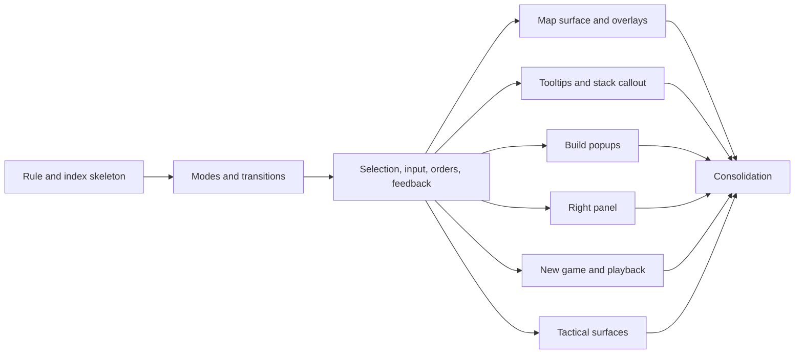

# UX Specification Suite Execution Plan

> **For agentic workers:** Implement this plan phase by phase, in order. Each phase ends with verification commands and a review checkpoint. Do not start the next phase until the verification commands for the current phase report no problems and the user has answered the checkpoint. Steps use checkbox (`- [ ]`) syntax for tracking.

**Goal:** Create a normative UX requirements suite for the Agent Wars desktop UI: one index document at `doc/ux-specification.md` and a `doc/ux/` folder holding cross-cutting documents (modes, selection, input, orders, feedback) and one document per interactive element. Coding agents will read these before feature work and bugfixes so they can tell intended behavior from accidental behavior.

**Approach:** Documentation only. No source, test, style, or configuration changes except the single rule edit and a git-status baseline file in the first phase. Every requirement is derived from reading renderer code, existing tests, and existing `doc/` files. Behavior that looks unintended or ambiguous is recorded as today's behavior and also listed under **Open Questions** for the user to resolve at the checkpoint that ends each phase.

**Tech stack:** Markdown. Verification uses PowerShell from the repo root (`f:\Projects\Personal\agent-wars`).



Run the element phases in the order listed below, even though the diagram shows they don't depend on each other.

## Global Constraints

- Do not commit or push.
- Do not change anything under `src/`, `static/`, `scripts/`, `data/`, or test files. Do not change `doc/README.md` or any existing `doc/` file. Outside `doc/ux-specification.md` and `doc/ux/`, the only files you touch are `.cursor/rules/05-spec-documents.mdc` (first phase), `.spec/ux-suite-git-baseline.txt` (created once in the first phase), and the checkboxes in this plan file.
- Do not put this plan's phase names, phase numbers, step numbers, checkpoint names, or its file name into any file under `doc/`. Headings in this plan stay in this plan. Never write "this plan" in the new documents. Game terms are allowed. For example, the game-state readout shows the current game phase and turn, and describing it that way is fine. Just don't number or name anything after this plan's divisions.
- You may read `.spec/*.md` files as evidence of intended behavior. Do not link to them, name them, or quote their headings from `doc/`.
- Do not use emojis. Write plain, direct American English in the same tone as the existing `doc/` files.
- File names under `doc/ux/` are lowercase kebab-case (`map-surface.md`), matching existing `doc/` files. The camelCase rule in the naming contract applies to `src/` only.
- Keep each new document at or under 300 lines. The hard limit is 600. If a document grows past 300 lines, stop and ask the user whether to split it.
- Documents are written for coding agents. Write for precision, not persuasion.
- No code changes means the source-code rules (logging, orienting comments, testing, argument limits, boilerplate, mutability) have nothing to apply to. Don't add or edit code to "demonstrate" a requirement.
- Never revert, stage, or modify a file you didn't create or edit under this plan. The working tree may already hold the user's uncommitted work. Check F compares against a baseline for exactly this reason.
- If the code contradicts something this plan says about an element (for example, a listed DOM id or file doesn't exist, or a behavior the plan asks you to cover isn't implemented), trust the code, write what the code does, and mention the mismatch at the next checkpoint. Don't create the missing behavior.

## Writing Rules for Every New Document

These rules apply to every file you create under `doc/`. Re-read them at the start of each phase.

1. **Requirements are declarative, present tense, one per bullet.** Start each input requirement with its trigger: "When the player double-clicks an empty hex while units are selected, ..." Use "never" and "always" only in the **Invariants** section.
2. **Name things the way the player sees them.** Use the visible label text: "the Ready button", "the Tools tab", "the Tactical battles checkbox", "the Exit Battle button". Where an element has no visible label, use the plain name from `doc/ux-specification.md` (for example "the stack callout", "the minimap").
3. **Use canonical mode names only.** After the modes document exists, refer to application modes only by the exact names defined in `doc/ux/modes-and-transitions.md`. Don't invent synonyms.
4. **Leave out styling and layout.** No colors, fonts, pixel sizes, icons, animation details, or where items sit inside an element. The one exception is when a visual change is the functional signal, such as "the Run button shows as pressed while the AI loop is running". Describe the signal, not the look.
5. **No code identifiers in the body.** No function, variable, type, CSS class, or IPC channel names outside the **Code Entry Points** section. That section may list repo-relative file paths and DOM ids.
6. **No game-rule numbers.** Don't restate ranges, costs, caps, movement points, or legality rules. Link to the mechanics document instead, for example `[combat rules](../combat-rules-v3.md)`. You may name a rule concept ("strike range") and link to it.
7. **Copy text only when it is the requirement.** Button labels that change with state (Ranged, Cancel, Strike, Run) are requirements; quote them exactly. For tooltip or toast bodies, list the information items shown, not the sentences.
8. **Only write what you can trace.** Every requirement must come from code you read, a test you read, or an existing `doc/` statement. If you can't confirm a behavior, don't guess: write it as an Open Question.
9. **Record today's behavior, and flag what looks wrong.** Write current behavior as the requirement. If it looks accidental, inconsistent with a sibling element, contradicted by `doc/ui-style-guide.md`, or contradicted by a `.spec` plan, also add an Open Question. Don't write Known Deviations on your own; they only come from user answers at checkpoints.
10. **Link, don't duplicate.** If a cross-cutting document already defines a behavior (for example, what right-click does to the selection), link to that section instead of restating it.
11. **Link only to files that already exist.** When you need to refer to a `doc/ux/` document that a later phase will write, write its bare file name as plain text, for example "see new-game-dialog.md". Don't make it a markdown link, and don't wrap it in backticks with a `doc/` prefix. Check B and Check C would fail on a file that doesn't exist. The consolidation phase turns these plain-text references into links.
12. **The phase coverage lists are questions, not facts.** When a phase says "Cover how clicking the minimap moves the main map", it means "find out whether and how it does". If the code doesn't support an item, say what actually happens (or write "None." for inputs) and don't invent behavior.
13. **No glob patterns or partial paths in backticks.** Every backticked path that starts with `src/`, `static/`, or `doc/` must be one exact file.

## Document Template

Every element document under `doc/ux/` uses exactly these second-level headings, in this order. Write "None." under a heading that has no content. Don't add other second-level headings; use third-level headings inside a section if needed.

```markdown
# <Element Name>

<One or two sentences: what the element is for, from the player's point of view.>

## Purpose

## Availability

<Which modes show the element, and what opens or closes it. Use canonical mode names.>

## Information Displayed

<Bullets. Each bullet is one information item: what it shows, what it shows when empty or unknown, and when it refreshes.>

## Inputs and Responses

<Bullets grouped by input: mouse, keyboard, other. Each bullet is "When <trigger> [while <condition>], <response>." Include disabled or ignored cases.>

## States

<Named states such as hidden, visible, disabled, pressed, loading, error. For each: how the element enters and leaves it.>

## Invariants

<"Always" and "never" statements that must stay true across changes.>

## Strategic and Tactical Differences

| Aspect | Strategic | Tactical |
| --- | --- | --- |

<If the element behaves the same in both theaters, write one sentence saying so instead of the table.>

## Related Documents

<Relative links to cross-cutting docs, sibling element docs, and mechanics docs.>

## Known Deviations

None.

## Open Questions

<Format each entry as:
- **<Short title>.** Current behavior: <what the code does>. Why it looks questionable: <reason>. Choices: <two or three plausible intended behaviors>.>

## Code Entry Points

<Bullets of backticked repo-relative paths, optionally followed by backticked DOM ids. No line numbers, no function names.>
- `static/index.html` (`#example-id`)
- `src/renderer/example/exampleFile.ts`
```

Cross-cutting documents use the headings listed in their own phase instead. `notifications-and-feedback.md` is the one hybrid: it's cross-cutting and also the element document for the map toasts, so it uses the headings its phase lists. That list includes every template heading plus one extra `## Feedback Channels` section.

Known Deviations entries (added only after a checkpoint answer) use this format:

```markdown
- **<Short title>.** Required: <the intended behavior, also stated in the requirement sections above>. Current: <what the code does today>. Entry point: `<repo-relative path>`.
```

## Research Procedure for Each Document

Follow these steps for every element document. They are the main way to avoid invented behavior.

1. Open `static/index.html` and find the DOM ids listed for the document in its phase. Note the visible labels and any `title` or `aria-label` text.
2. Search `src/renderer/` for each id (`getElementById('<id>')`, `querySelector('#<id>')`, and the bare id string). Open every file that matches.
3. In those files, find every event listener (`addEventListener`, Leaflet `.on(`, `onclick`) and list each event type. For each handler, write down what the player sees change.
4. For each handler, find the guards that change or block the behavior. Always check for:
   - tactical battle checks (`tacticalRendererIsBattleActive`, `tacticalRendererShouldBlockStrategicMapOrders`, `tacticalRendererHitInsideBattleFootprint` in `src/renderer/tactical/tacticalUiGuards.ts`, plus any `tacticalBattle` or `tb` variable in the file),
   - resolution playback checks (`src/renderer/rendering/resolutionPlayback.ts`, `src/renderer/openRouter/resolutionPlaybackDeferral.ts`),
   - AI planning or waiting checks (`src/renderer/openRouter/aiPlanningState.ts`),
   - game-over or no-game checks,
   - modifier keys (Shift, Ctrl, Alt) and mouse buttons.
5. Search `src/**/*.test.ts` for the file stems you opened. Tests state contracts on purpose, so prefer them over reading code when the two seem to differ, and record the difference as an Open Question.
6. Check `doc/ui-style-guide.md` (its interaction sections) and the relevant mechanics docs for stated intent. A conflict with code becomes an Open Question.
7. Translate every condition into player terms. "`S.selectedUnitIds.length === 0`" becomes "while no units are selected".
8. Fill in the template. Put the files you actually read in **Code Entry Points**.

## Verification Toolkit

Run these from the repo root in PowerShell. Each phase says which checks to run and for which files. "Pass" means the command prints nothing.

**Check A: required headings in element documents.** Set `$files` to the element documents written in the phase.

```powershell
$required = @('## Purpose','## Availability','## Information Displayed','## Inputs and Responses','## States','## Invariants','## Strategic and Tactical Differences','## Related Documents','## Known Deviations','## Open Questions','## Code Entry Points')
$files = @('doc/ux/EXAMPLE.md')
foreach ($f in $files) {
  $text = Get-Content $f -Raw
  foreach ($h in $required) {
    if ($text -notmatch "(?m)^$([regex]::Escape($h))\s*$") { "MISSING HEADING '$h' in $f" }
  }
}
```

**Check B: every backticked repo path exists.**

```powershell
Get-ChildItem doc/ux-specification.md, doc/ux/*.md -ErrorAction SilentlyContinue | ForEach-Object {
  $file = $_.FullName
  Select-String -Path $file -Pattern '`((?:src|static|doc)/[^`\s]+)`' -AllMatches |
    ForEach-Object { $_.Matches } |
    ForEach-Object {
      $p = $_.Groups[1].Value
      if (-not (Test-Path $p)) { "MISSING PATH $p in $file" }
    }
}
```

**Check C: every relative markdown link resolves.**

```powershell
Get-ChildItem doc/ux-specification.md, doc/ux/*.md -ErrorAction SilentlyContinue | ForEach-Object {
  $file = $_
  Select-String -Path $file.FullName -Pattern '\]\(([^)#\s]+)(#[^)]*)?\)' -AllMatches |
    ForEach-Object { $_.Matches } |
    ForEach-Object {
      $target = $_.Groups[1].Value
      if ($target -notmatch '^https?:' -and -not (Test-Path (Join-Path $file.DirectoryName $target))) {
        "BROKEN LINK $target in $($file.Name)"
      }
    }
}
```

**Check D: forbidden content.**

```powershell
Get-ChildItem doc/ux-specification.md, doc/ux/*.md -ErrorAction SilentlyContinue |
  Select-String -Pattern '\b(Phase|Stage|Step|Milestone|Checkpoint|Hypothesis)\s+\d', 'this plan', '\bTODO\b', '\bTBD\b', '\.spec\b'
```

If a match is a legitimate game term (for example a numbered resolution step), reword it anyway. Linking to the mechanics document is usually the right fix.

**Check E: line counts.** This check prints a count for every file, so it isn't a "prints nothing" check. Any file over 300 lines needs the user's approval. Any file over 600 lines fails.

```powershell
Get-ChildItem doc/ux-specification.md, doc/ux/*.md -ErrorAction SilentlyContinue |
  ForEach-Object { '{0,5} {1}' -f @(Get-Content $_.FullName).Count, $_.Name }
```

**Check F: scope.** Only the expected files changed compared with the baseline taken at the start of the first phase.

```powershell
$baseline = Get-Content .spec/ux-suite-git-baseline.txt
git status --porcelain --untracked-files=all | Where-Object { $baseline -notcontains $_ } |
  Where-Object { $_ -notmatch '(doc/ux-specification\.md|doc/ux/[^/]+\.md|\.cursor/rules/05-spec-documents\.mdc|\.spec/ux-suite-git-baseline\.txt|\.spec/ux-specification-suite-execution-plan\.md)$' }
```

Pass means the command prints nothing. If it prints a line, work out whether you caused it. Undo only your own accidental edit, and never touch a file that was already in the baseline. If you aren't sure, stop and ask the user.

**Manual review for every document.** Read each new document once, top to bottom, and confirm:

- no function, variable, type, CSS class, or IPC names outside **Code Entry Points**;
- no colors, sizes, or layout positions;
- no game-rule numbers;
- only canonical mode names;
- every Open Question has current behavior, a reason, and choices.

## Review Checkpoint Procedure

At the end of every phase:

1. Run the phase's checks and fix anything they report.
2. Send the user a short message listing the documents written, any mismatch between this plan and the code, and every Open Question added in the phase, grouped by document, each with its choices.
3. Stop and wait for the user's reply, even if the phase added no Open Questions. Don't start the next phase until the user says to continue.
4. Apply each answer:
   - **Current behavior is intended:** remove the Open Question. If needed, tighten the requirement text.
   - **Different behavior is intended:** rewrite the requirement to the intended behavior, add a Known Deviations entry stating Required and Current, and remove the Open Question. Don't change code.
   - **User defers:** leave the Open Question in place.
   - **The answer affects a document written in an earlier phase:** edit that document the same way, then re-run the checks on it too.
   - **The user adds, removes, merges, or renames a document:** update the index's planned list to match. Carry the change into the affected later phase: same template, same checks, with the file name the user gave. Don't renumber or rename phases in this plan.
5. Re-run the phase's checks, then start the next phase.

---

## Phase 1: Rule Update and Index Skeleton

**Files:**

- Create: `.spec/ux-suite-git-baseline.txt` (a working file for Check F, not part of the suite)
- Modify: `.cursor/rules/05-spec-documents.mdc`
- Create: `doc/ux-specification.md`

- [x] **Step 0: Record the git baseline** before editing anything. Run this once and never re-run it later in the plan:

```powershell
git status --porcelain --untracked-files=all | Set-Content .spec/ux-suite-git-baseline.txt
```

If `.spec/ux-suite-git-baseline.txt` already exists, don't overwrite it. That means a previous run already started this plan; ask the user how to proceed.

- [x] **Step 1: Replace the rule file contents** with exactly this text:

```markdown
---
description: "05 — Working specs under .spec; living product docs under doc"
alwaysApply: true
---

# 05 — Spec Documents

Write working specs, execution plans, design proposals, and debugging notes as markdown files in the `.spec` directory.

Living product documentation belongs in `doc/`. This includes the UX specification suite (`doc/ux-specification.md` and the `doc/ux/` folder) and the mechanics documents indexed by `doc/README.md`. Update those documents in place; do not copy them into `.spec`.
```

- [x] **Step 2: Create `doc/ux-specification.md`** with these sections, in this order:

1. `# UX Specification` followed by one paragraph: this suite states the functional UX requirements of the Agent Wars desktop UI for people and coding agents changing it.
2. `## Authority`, containing exactly this text:

   > This suite is normative for the user-visible behavior of the Agent Wars desktop UI: what each element shows, which inputs it accepts, and how it responds. When renderer code disagrees with a requirement here, the disagreement is either a bug in the code or an intended behavior change. Either way, the change that alters behavior must also update the affected document. Each document's Known Deviations section lists disagreements that are already known and accepted as bugs; check it before "fixing" code to match the spec.
   >
   > Game mechanics (numbers, legality rules, resolution order, caps) are not defined here. They are governed by the mechanics documents listed in [README.md](README.md), where the engine remains the first authority. UX documents link to those documents instead of restating them.
   >
   > Visual styling and the arrangement of items inside an element are out of scope. See [ui-style-guide.md](ui-style-guide.md).

3. `## How to Use This Suite`, a numbered list for agents:
   1. Find the element you're changing in the routing table below.
   2. Read the cross-cutting documents it lists, then the element document.
   3. Check Known Deviations before treating a spec and code mismatch as a bug.
   4. If your change alters user-visible behavior, update the requirement text in the same change.
   5. If the spec is silent or ambiguous, add an Open Question rather than inventing a requirement.
4. `## Document Structure`: one paragraph saying element documents share a fixed heading set, followed by the heading list from this plan's Document Template (the headings only, as a bullet list, no placeholders).
5. `## Cross-Cutting Documents`: a bullet list of the five cross-cutting documents, each marked `(planned)` and with a one-line description:
   - `modes-and-transitions.md`: application modes, what triggers each transition, and what state carries across.
   - `selection-model.md`: how units and hexes become selected, and what clears or keeps a selection.
   - `input-map.md`: every global mouse and keyboard binding, and precedence between them.
   - `order-lifecycle.md`: how orders go from draft to preview, commit, and resolution, and the feedback at each step.
   - `notifications-and-feedback.md`: which surface reports which kind of message, plus the map toasts.
6. `## Element Documents`: a bullet list of every element document named in this plan, each marked `(planned)`, with a one-line description. Write the entries as plain text, not links, until the documents exist. Check C only verifies links.
7. `## Glossary`: leave a single line `Filled in as documents are written.`
8. `## Element and Mode Matrix`: leave a single line `Filled in after all documents exist.`

- [x] **Step 3: Verify.** Run Checks B, C, D, E, and F. Also confirm the rule file matches Step 1 exactly.

- [x] **Checkpoint.** The user asked to continue through the suite without stopping. Open questions stay in the documents for a later review.

---

## Phase 2: Modes and Transitions

This document defines the canonical mode names that every later document must use. Get it right before moving on.

**Files:**

- Create: `doc/ux/modes-and-transitions.md`
- Modify: `doc/ux-specification.md` (mark the entry as written and turn it into a link)

**Read first:** `src/renderer/renderer.ts`, `src/renderer/core/state.ts`, `src/renderer/core/uiState.ts`, `src/renderer/gameplay/readyHandler.ts`, `src/renderer/gameplay/newGame.ts`, `src/renderer/openRouter/aiPlanningState.ts`, `src/renderer/openRouter/precomputedAiState.ts`, `src/renderer/openRouter/resolutionPlaybackDeferral.ts`, `src/renderer/rendering/resolutionPlayback.ts`, `src/renderer/tactical/tacticalUiOrchestration.ts`, `src/renderer/tactical/tacticalEntryFlow.ts`, `src/renderer/tactical/tacticalExitFlow.ts`, `src/renderer/tactical/tacticalUiGuards.ts`, `src/renderer/tactical/tacticalStrategicOrderUiStash.ts`, `src/renderer/tactical/tacticalAnnihilationDialog.ts`, `src/renderer/gameplay/meleeInterceptModal.ts`, `doc/combat-rules-v3.md` (tactical battle and resolution sections only), `doc/hybrid-ai.md`.

**Candidate modes to confirm or correct from the code.** Don't copy this list blindly. Merge, split, or rename modes to match what the player can actually observe.

- No game or new game dialog open
- Strategic planning
- Waiting for the AI opponent after Ready
- Tactical battles list open (melee decision)
- Tactical battle
- Tactical annihilation
- Resolution playback
- Game over

- [x] **Step 1: Research** using the Research Procedure, focused on what starts and ends each mode.

- [x] **Step 2: Write `doc/ux/modes-and-transitions.md`** with these headings, in this order:
  - `## Purpose`
  - `## Mode List`: one third-level heading per mode, using the canonical name. For each mode: what the player sees, what the player can do, what is blocked, and how it ends.
  - `## Transitions`: a mermaid `stateDiagram-v2` of the modes (IDs without spaces, labels in quotes where needed, no styling), followed by a bullet list of "From -> To: trigger" lines.
  - `## State Carried Across Transitions`: what survives each transition (selection, draft orders, stashed strategic orders during a tactical battle, map view, open popups) and what is cleared.
  - `## Strategic and Tactical Theaters`: define "strategic" and "tactical" for the rest of the suite, and summarize, at a high level, what changes on the map, the right panel, and the popups when a tactical battle is active. Link to the element documents by file name as plain text; they don't exist yet.
  - `## Invariants`
  - `## Open Questions`
  - `## Code Entry Points`

- [x] **Step 3: Update the index.** In `doc/ux-specification.md`, replace the plain-text entry with a relative link `[modes-and-transitions.md](ux/modes-and-transitions.md)` and remove `(planned)`.

- [x] **Step 4: Verify.** Run Checks B, C, D, E, F and the manual review. Also confirm every mode in `## Mode List` appears in the state diagram and in at least one transition.

- [x] **Checkpoint.** Besides Open Questions, show the user the final mode names and ask them to approve the names. Later phases depend on them.

---

## Phase 3: Remaining Cross-Cutting Documents

**Files:**

- Create: `doc/ux/selection-model.md`
- Create: `doc/ux/input-map.md`
- Create: `doc/ux/order-lifecycle.md`
- Create: `doc/ux/notifications-and-feedback.md`
- Modify: `doc/ux-specification.md` (link the four entries; start the glossary)

Write them in the order listed. Each one may link to the ones before it.

- [x] **Step 1: `selection-model.md`.** Read `src/renderer/core/selection.ts`, `src/renderer/map/mapClickSelectionPolicy.ts`, `src/renderer/map/mainMapInteractions.ts`, `src/renderer/map/mapDoubleClickHandler.ts`, `src/shared/mapPlanningGesture.ts`, `src/shared/selectionUnitIdSets.ts` and their tests. Headings: `## Purpose`, `## What Can Be Selected`, `## Selecting` (single click, modifier clicks, stack callout toggles, sidebar toggles), `## Clearing and Keeping a Selection` (right-click, committed orders, mode transitions, new game), `## Selection and Targeting Modes` (how Ranged and Strike targeting interact with the selection), `## Strategic and Tactical Differences`, `## Invariants`, `## Open Questions`, `## Code Entry Points`.

- [x] **Step 2: `input-map.md`.** Read `src/renderer/map/mapKeyboardPan.ts`, `src/renderer/map/initCore.ts`, `src/renderer/renderer.ts`, `src/renderer/map/worldLeafletMap.ts`, and every file found by searching `src/renderer/` for `keydown`, `keyup`, `wheel`, `contextmenu`, `dblclick`, `shiftKey`, `ctrlKey`, `altKey`, and `Escape`. Headings: `## Purpose`, `## Mouse`, `## Keyboard`, `## Precedence and Focus` (for example, what happens when a text field or dialog has focus, and which surface consumes Escape first), `## Strategic and Tactical Differences`, `## Invariants`, `## Open Questions`, `## Code Entry Points`. Under Mouse and Keyboard, use a table with columns `Input | Context | Result | Details In`. The last column names the element document that owns the behavior: a relative link if that document already exists, otherwise its planned file name as plain text (Writing Rule 11).

- [x] **Step 3: `order-lifecycle.md`.** Read `src/renderer/gameplay/tacticalOrders.ts`, `src/renderer/gameplay/gameApiHumanOrderPreview.ts`, `src/renderer/gameplay/hoverRoutePreviewRefresh.ts`, `src/renderer/gameplay/hoverRoutePreviewStale.ts`, `src/renderer/gameplay/hoverRoutePreviewGroupedTargeting.ts`, `src/renderer/gameplay/formatTargetingValidationReason.ts`, `src/renderer/gameplay/orderLabelFormatting.ts`, `src/renderer/tactical/tacticalPendingMarchPath.ts`, `src/renderer/tactical/tacticalDraftMarchOverlay.ts`, `src/renderer/tactical/tacticalEmbarkSealiftMerge.ts`, and the order-commit paths in `src/renderer/map/mainMapInteractions.ts` and `src/renderer/map/mapDoubleClickHandler.ts`. Headings: `## Purpose`, `## Order Kinds` (one third-level heading per order kind the player can issue, such as march, ferry or sealift, ranged attack, air strike, and build; confirm the list from code), `## Lifecycle` (draft, hover preview, commit, pending list, cancel, resolution), `## Rejected Orders` (how the player learns an order is invalid; link to `combat-rules-v3.md` for the rules themselves), `## Strategic and Tactical Differences`, `## Invariants`, `## Open Questions`, `## Code Entry Points`.

- [x] **Step 4: `notifications-and-feedback.md`.** This is both a cross-cutting routing document and the element document for the two map toasts. Read `src/renderer/gameplay/turnUpdateSummary.ts`, `src/renderer/openRouter/openRouterUiHelpers.ts`, and every file referencing `map-toast`, `ai-strategy-toast`, or `sidebar-error`. DOM ids: `#map-toast`, `#map-toast-text`, `#map-toast-dismiss`, `#ai-strategy-toast`, `#ai-strategy-toast-text`, `#ai-strategy-toast-dismiss`, `#sidebar-error`. Headings: `## Purpose`, `## Feedback Channels` (a table with columns `Channel | Used For | Lifetime | Details In`, covering the map toast, the AI strategy toast, the sidebar error line, the AI activity log, hex tooltips, and transient pointer tooltips), then the full element template headings from `## Availability` through `## Code Entry Points` for the toasts.

- [x] **Step 5: Update the index.** Link the four documents. Start `## Glossary` with the terms these documents rely on (for example hex, stack, selection, targeting mode, order, draft order, pending order, theater). One line per term, at most 25 terms in total by the end of the plan.

- [x] **Step 6: Verify.** Run Check A for `doc/ux/notifications-and-feedback.md` only. Run Checks B, C, D, E, F and the manual review for all four.

- [x] **Checkpoint.**

---

## Phase 4: Map Surface Documents

**Files:**

- Create: `doc/ux/map-surface.md`
- Create: `doc/ux/map-overlays.md`
- Create: `doc/ux/minimap.md`
- Create: `doc/ux/terrain-legend.md`
- Modify: `doc/ux-specification.md` (link entries)

For each document, follow the Research Procedure and the Document Template.

- [x] **Step 1: `map-surface.md`.** The main world map as a surface: panning, zooming, hex hit-testing, unit glyphs and stacks as click targets, click, double-click, right-click, and hover. DOM ids: `#canvas-container`, `#main-map`, `#map-overlay`. Start from `src/renderer/map/worldLeafletMap.ts`, `src/renderer/map/mainMapInteractions.ts`, `src/renderer/map/mapDoubleClickHandler.ts`, `src/renderer/map/mapClickSelectionPolicy.ts`, `src/renderer/map/mapKeyboardPan.ts`, `src/renderer/map/drawInteraction.ts`, `src/renderer/map/hexGrid.ts`, `src/renderer/map/terrainView.ts`, `src/renderer/map/tacticalMapView.ts`, `src/renderer/map/leafletMainMapProjection.ts`, `src/renderer/rendering/unitDrawing.ts`. Link to `selection-model.md`, `input-map.md`, and `order-lifecycle.md` instead of restating them. The Strategic and Tactical Differences table must cover what the map shows, which hexes accept orders, and what happens when the player clicks outside the battle area.

- [x] **Step 2: `map-overlays.md`.** Everything drawn over the map as feedback: range perimeters, route and path lines, pending-order overlays, hover previews, city and transport overlays, infrastructure overlays, and resolution combat overlays. Mostly display-only; describe when each overlay appears and disappears and what information it carries, not how it looks. Start from `src/renderer/rendering/rangePerimeterOverlay.ts`, `src/renderer/rendering/pathDrawing.ts`, `src/renderer/rendering/orderDrawing.ts`, `src/renderer/rendering/orderOverlayStages.ts`, `src/renderer/rendering/hoverPreview.ts`, `src/renderer/rendering/canvasPreviewPolicy.ts`, `src/renderer/rendering/res4CityOverlays.ts`, `src/renderer/map/res4TransportVectorLayer.ts`, `src/renderer/rendering/terrainInfrastructureOverlay.ts`, `src/renderer/rendering/infrastructureOverlayState.ts`, `src/renderer/rendering/resolutionCombatOverlays.ts`, `src/renderer/tactical/tacticalDraftMarchOverlay.ts`.

- [x] **Step 3: `minimap.md`.** DOM id: `#minimap`. Search `src/renderer/` for `minimap` to find the owning files. Cover what it shows, how clicking or dragging on it moves the main map, and how it tracks the main view.

- [x] **Step 4: `terrain-legend.md`.** DOM id: `#terrain-legend`. Start from `src/renderer/rendering/terrainVisualStyles.ts`. If the legend turns out to be display-only with no inputs, write "None." under Inputs and Responses and keep the document short.

- [x] **Step 5: Update the index.** Link the four documents. Add any new glossary terms.

- [x] **Step 6: Verify.** Run Check A for all four files. Run Checks B, C, D, E, F and the manual review.

- [x] **Checkpoint.**

---

## Phase 5: Tooltips and the Stack Callout

**Files:**

- Create: `doc/ux/hex-tooltips.md`
- Create: `doc/ux/stack-callout.md`
- Modify: `doc/ux-specification.md`

- [x] **Step 1: `hex-tooltips.md`.** Covers the information tooltip on hover and the transient order-feedback tooltips. DOM ids: `#hex-tooltip`, `#order-block-tooltip`, `#order-slower-tooltip`. Start from `src/renderer/map/terrainTooltipRes1State.ts`, `src/renderer/map/terrainTooltipTypes.ts`, `src/renderer/map/orderBlockHexTooltip.ts`, `src/renderer/map/orderSlowerHexTooltip.ts`, `src/renderer/map/createTransientPointerTooltip.ts`, `src/renderer/map/transientPointerTooltipTtl.ts`, `src/renderer/gameplay/meleeInterceptHexTooltip.ts`. Use one third-level heading per tooltip kind inside **Information Displayed** and **Inputs and Responses**. List information items (terrain, units, ownership, infrastructure, and so on) as confirmed in code. Don't quote tooltip sentences. Cover fog of war as it affects what the tooltip reveals, linking to the fog section of `combat-rules-v3.md`.

- [x] **Step 2: `stack-callout.md`.** DOM ids: `#stack-callout`, `#stack-callout-list`. Search `src/renderer/` for `stack-callout`. Cover when it opens, what each row shows, how toggling rows changes the selection (link to `selection-model.md`), and how it closes.

- [x] **Step 3: Update the index.**

- [x] **Step 4: Verify.** Run Check A for both files. Run Checks B, C, D, E, F and the manual review.

- [x] **Checkpoint.**

---

## Phase 6: Build Popups

**Files:**

- Create: `doc/ux/build-popup.md`
- Create: `doc/ux/multi-hex-build-popup.md`
- Modify: `doc/ux-specification.md`

- [x] **Step 1: `build-popup.md`.** The single-hex build queue popup and the build entry markers that open it. DOM ids: `#build-entry-layer`, `#build-popup`, `#build-popup-body`. Start from `src/renderer/gameplay/buildQueuePopup.ts`, `src/renderer/gameplay/buildQueuePopupFormatting.ts`, `src/renderer/gameplay/buildQueueKeepBuilding.ts`, `src/renderer/gameplay/productionOverlayHelpers.ts`. Cover the queue rows, count entry and its sanitizing, the Keep building option, cost and turns-to-complete information, open and close gestures, and unavailable unit types. Link cost and prerequisite rules to `combat-rules-v3.md` and caps to `game-size-unit-caps.md`.

- [x] **Step 2: `multi-hex-build-popup.md`.** The popup used when several build hexes are selected together (the multi-select popup). Start from `src/renderer/gameplay/buildQueueMultiPopup.ts` and `src/renderer/gameplay/buildQueueMultiSelect.ts`. Cover how multiple build hexes get selected, the template rows, how a template applies to hexes that can't build every type, the aggregate cost and turn estimates, and the Keep building behavior when applied to all. Link to `build-popup.md` for shared behavior instead of repeating it.

- [x] **Step 3: Update the index.**

- [x] **Step 4: Verify.** Run Check A for both files. Run Checks B, C, D, E, F and the manual review.

- [x] **Checkpoint.**

---

## Phase 7: Right Panel

**Files:**

- Create: `doc/ux/right-panel.md`
- Create: `doc/ux/right-panel-command-bar.md`
- Create: `doc/ux/right-panel-selection-and-orders.md`
- Create: `doc/ux/right-panel-tools-tab.md`
- Create: `doc/ux/right-panel-model-tab.md`
- Create: `doc/ux/ai-activity-log.md`
- Modify: `doc/ux-specification.md`

- [x] **Step 1: `right-panel.md`.** A short overview document (under 80 lines) using the element template. It lists the panel's sections, links to each section's document, and describes panel-wide behavior only: switching between the Tools and Model tabs, and anything that changes the whole panel between strategic and tactical play. DOM ids: `#sidebar`, `#sidebar-top`, `#sidebar-bottom`, `#openrouter-tab-tools`, `#openrouter-tab-model`.

- [x] **Step 2: `right-panel-command-bar.md`.** Game state readout plus the action buttons. DOM ids: `#sidebar-phase`, `#sidebar-turn`, `#ready-btn`, `#ranged-attack-btn`, `#air-strike-target-type`, `#air-strike-cancel-btn`. Start from `src/renderer/gameplay/readyHandler.ts`, `src/renderer/gameplay/tacticalOrders.ts`, `src/renderer/map/initCore.ts`, `src/renderer/gameplay/sidebarSupport.ts`, `src/shared/selectionSupportButtonMode.ts` and its test. Cover the exact label states of the Ranged button (Ranged, Cancel, Strike), when it is hidden, the air strike target choices (Enemy Units, Production, Airports, Seaports), and what Ready does in each mode.

- [x] **Step 3: `right-panel-selection-and-orders.md`.** The Selected unit readout and the Movement orders, Ranged attacks, and Air strikes lists, plus the sidebar error line. DOM ids: `#sidebar-selected-unit`, `#pending-orders-list`, `#ranged-attacks-list`, `#air-strikes-list`, `#sidebar-error`. Start from `src/renderer/gameplay/sidebarSupport.ts`, `src/renderer/gameplay/orderLabelFormatting.ts`, `src/renderer/gameplay/tacticalOrders.ts`. For each list: what each row shows, row inputs such as cancel or select, and the empty state. Link to `order-lifecycle.md` and `notifications-and-feedback.md`.

- [x] **Step 4: `right-panel-tools-tab.md`.** DOM ids: `#openrouter-tab-tools`, `#openrouter-tools-panel`, `#openrouter-tools-list`. Start from `src/renderer/openRouter/openRouterControls.ts` and `src/renderer/openRouter/openRouterUiHelpers.ts`. Link the tool names concept to `doc/ai-tools.md`; don't list tool names unless the tab shows them to the player.

- [x] **Step 5: `right-panel-model-tab.md`.** DOM ids: `#openrouter-model-panel`, `#openrouter-key`, `#openrouter-cost`, `#openrouter-model`, `#openrouter-refresh-models`, `#openrouter-run-btn`, `#openrouter-new-btn`, `#openrouter-tactical-battles`, `#model-description-tooltip`. Start from `src/renderer/openRouter/openRouterControls.ts`, `src/renderer/openRouter/openRouterRuntime.ts`, `src/renderer/openRouter/modelDescriptionTooltip.ts`, `src/renderer/gameplay/tacticalBattlePromptPreference.ts`, `src/renderer/openRouter/aiPlanningState.ts`. Cover API key save-on-blur, the cost readout, model list refresh, when Run is enabled and what pressed means, what New opens (refer to new-game-dialog.md as plain text, per Writing Rule 11), what the Tactical battles checkbox changes (refer to tactical-battles-list.md as plain text), and the model description tooltip. Never write an API key value or a real model price into the document.

- [x] **Step 6: `ai-activity-log.md`.** DOM id: `#openrouter-log`. Search `src/renderer/` for `openrouter-log`. Cover which events add entries, error entries, ordering, and whether the player can interact with it.

- [x] **Step 7: Update the index.**

- [x] **Step 8: Verify.** Run Check A for all six files. Run Checks B, C, D, E, F and the manual review.

- [x] **Checkpoint.**

---

## Phase 8: New Game Dialog and Resolution Playback

**Files:**

- Create: `doc/ux/new-game-dialog.md`
- Create: `doc/ux/resolution-playback.md`
- Modify: `doc/ux-specification.md`

- [x] **Step 1: `new-game-dialog.md`.** The overlay that serves as both the game-over screen and the new game dialog. DOM ids: `#game-over-overlay`, `#game-over-message`, `#new-game-human-region-select`, `#new-game-human-region-randomize`, `#new-game-ai-region-select`, `#new-game-ai-region-randomize`, `#new-game-size-select`, `#new-game-size-cap-infantry`, `#new-game-size-cap-armor`, `#new-game-size-cap-naval`, `#new-game-size-cap-air`, `#new-game-fog-checkbox`, `#new-game-btn`. Start from `src/renderer/gameplay/newGame.ts`, `src/renderer/gameplay/newGameRegionUi.ts`, `src/renderer/gameplay/newGameSizeUi.ts`, `src/shared/gameSize.ts`. Cover every way the dialog opens (startup, game over, the New button), region choice and randomize, whether the two regions may match, size choice and the cap badges (link to `game-size-unit-caps.md` for the numbers), fog of war, Start game, and whether it can be dismissed without starting.

- [x] **Step 2: `resolution-playback.md`.** The animated replay of turn resolution. Start from `src/renderer/rendering/resolutionPlayback.ts`, `src/renderer/openRouter/resolutionPlaybackDeferral.ts`, `src/renderer/rendering/resolutionCombatOverlays.ts`, `src/renderer/gameplay/turnUpdateSummary.ts`. Cover what is played back and in what order (link to the resolution order in `combat-rules-v3.md`), which inputs are blocked or deferred during playback, how playback ends, and the summary shown afterward.

- [x] **Step 3: Update the index.**

- [x] **Step 4: Verify.** Run Check A for both files. Run Checks B, C, D, E, F and the manual review.

- [x] **Checkpoint.**

---

## Phase 9: Tactical Surfaces

**Files:**

- Create: `doc/ux/tactical-entry-markers.md`
- Create: `doc/ux/tactical-battles-list.md`
- Create: `doc/ux/tactical-battle-controls.md`
- Modify: `doc/ux-specification.md`

- [x] **Step 1: `tactical-entry-markers.md`.** The magnifier markers on contested hexes that lead into a tactical battle. DOM id: `#tactical-entry-layer`. Start from `src/renderer/map/tacticalEntryLayer.ts` and `src/renderer/tactical/tacticalEntryFlow.ts`. Cover when markers appear, what they indicate, what clicking one does, and when they disappear.

- [x] **Step 2: `tactical-battles-list.md`.** The modal that lists melee candidate hexes after Ready, where the player picks Fight on one row or chooses Ignore. Start from `src/renderer/gameplay/meleeInterceptModal.ts`, `src/renderer/gameplay/meleeInterceptHexTooltip.ts`, `src/renderer/gameplay/readyHandler.ts`, `src/renderer/gameplay/tacticalBattlePromptPreference.ts`. Cover the row contents, choosing a row, Fight versus Ignore, what backdrop clicks and Escape do, and how the Tactical battles checkbox suppresses the list (link to `right-panel-model-tab.md`).

- [x] **Step 3: `tactical-battle-controls.md`.** The in-battle controls: the Exit Battle button in the tactical battle HUD and the annihilation dialog. DOM ids: `#tactical-battle-hud`, `#tactical-exit-btn`, `#tactical-annihilation-overlay`, `#tactical-annihilation-message`, `#tactical-annihilation-exit-btn`. Start from `src/renderer/tactical/tacticalExitButtonDom.ts`, `src/renderer/tactical/tacticalExitFlow.ts`, `src/renderer/tactical/tacticalAnnihilationDialog.ts`, `src/renderer/tactical/tacticalUiOrchestration.ts`, `src/renderer/tactical/applyTacticalPostBeatConsultSideEffects.ts`. Cover when Exit Battle is available, what exiting restores (link to the State Carried Across Transitions section of `modes-and-transitions.md`), what the annihilation dialog says in information-item terms, and how it closes.

- [x] **Step 4: Update `modes-and-transitions.md`.** Replace the plain-text element file names in its `## Strategic and Tactical Theaters` section with relative links now that the documents exist. Don't change its requirements. If writing the tactical documents revealed a contradiction with the modes document, add an Open Question to the modes document instead of silently editing it.

- [x] **Step 5: Update the index.**

- [x] **Step 6: Verify.** Run Check A for all three element files. Run Checks B, C, D, E, F and the manual review.

- [x] **Checkpoint.**

---

## Phase 10: Consolidation

**Files:**

- Modify: `doc/ux-specification.md`
- Modify: any `doc/ux/*.md` only to fix links, mode names, or duplicated text found below

- [x] **Step 1: Routing table.** Add `## Routing Table` to the index, after `## How to Use This Suite`. Columns: `If you are changing | Read first | Then read`. One row per element document. "Read first" lists the cross-cutting documents that element depends on.

- [x] **Step 2: Element and mode matrix.** Replace the placeholder under `## Element and Mode Matrix` with a table: one row per element document, one column per canonical mode from `modes-and-transitions.md`. Each cell holds one of `Shown`, `Hidden`, `Disabled`, `Changed` (behavior differs; see the element's Strategic and Tactical Differences), or `n/a`. Take every cell from the element document's Availability and Strategic and Tactical Differences sections. If a document doesn't answer a cell, add an Open Question to that document and write `?` in the cell.

- [x] **Step 3: Convert planned entries.** Confirm every entry in `## Cross-Cutting Documents` and `## Element Documents` is a working relative link and that no `(planned)` markers remain.

- [x] **Step 4: Consistency sweep.** Across all documents:
  - search for each mode name and its likely synonyms, and replace synonyms with the canonical name;
  - find any behavior stated in two documents and keep it in the owning document, replacing the other copy with a link (the owner is the cross-cutting document for selection, input, orders, and feedback, and otherwise the element document);
  - confirm every `Details In` cell in `input-map.md` and `notifications-and-feedback.md` is a working link;
  - find every plain-text reference to another `doc/ux/` file name (the forward references allowed by Writing Rule 11) and turn it into a relative markdown link. For example, search for `\b[a-z0-9-]+\.md\b` in text that isn't already inside `](...)`.

- [x] **Step 5: Open Questions roll-up.** Add `## Open Questions by Document` to the end of the index: a bullet list of links to each document that still has Open Questions, with the count. Don't copy the questions.

- [x] **Step 6: Final glossary pass.** Make sure every term used in two or more documents without explanation is in the glossary. Keep it at 25 terms or fewer.

- [x] **Step 7: Verify.** Run Check A for every element document. The cross-cutting documents `modes-and-transitions.md`, `selection-model.md`, `input-map.md`, and `order-lifecycle.md` are excluded; `notifications-and-feedback.md` is included. Run Checks B, C, D, E, F and the manual review across the whole suite.

- [x] **Checkpoint.** Report the final document list with line counts, the number of Open Questions remaining per document, and the number of Known Deviations per document.
