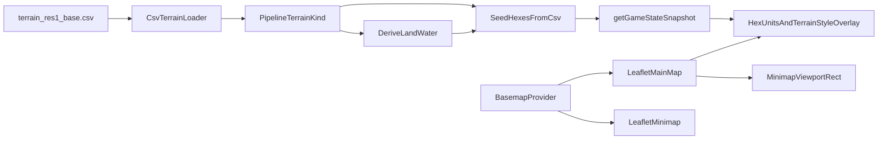

# World Map (H3 Res1) + Basemap + Minimap — Execution Plan

*Version 1.3 — March 2026*

This document is the **authoritative** execution plan for upgrading the main map to a world-scale H3 resolution 1 domain with a web basemap, hex/unit overlay, and minimap. It is written for a coding agent and is organized in phases that are **independently verifiable** or verifiable together with earlier phases only.

A Cursor-generated copy may exist under the editor’s plans folder; **this file in `.spec` is the source of truth** for the repository.

---

## Scope Summary

### In scope

1. **Main map:** World view, H3 resolution 1 hex network drawn over a zoomable/pannable web basemap.
2. **Zoom limits:** Minimum zoom shows the entire usable world extent; maximum zoom is approximately where **one resolution-1 hex fills the viewport** (tuned per screen size).
3. **Gameplay semantics:** Unit starts, movement validation, pathfinding, and tools remain as today except terrain source: **`ocean` ⇒ `water`**; **all other terrain categories ⇒ `land`**.
4. **Minimap:** Upper-left; fixed zoom showing full Earth; **same basemap**; **no** hex grid or units; when the main map is zoomed in beyond the global view, draw a **viewport rectangle** on the minimap.
5. **Map sizing:** Replace small/medium/large with **one fixed world map** (per product decision).
6. **Basemap preference vs constraints:** Prefer topographic/hillshade aesthetics (MapTiler hillshade, Stamen terrain, Mapbox Outdoors, OpenFreeMap). **Operational default:** keyless **OpenFreeMap** (or equivalent) with a **provider abstraction** so MapTiler/Stadia/Mapbox can be enabled later without refactors.
7. **Labels/boundaries:** Prefer minimal; strict elimination is not required if reliability is better.
8. **Terrain visualization (main map only):** Each hex is overlaid with **transparent fill and/or directional hatching** (or an equivalent two-layer cue: fill + pattern) so players can distinguish **pipeline terrain types** from `terrain_res1_base.csv`: `ocean`, `land`, `forest`, `mountain`, `desert`, `arctic`. This is **presentation only**; passability remains **land vs water** as in item 3.
9. **Terrain legend:** Include a compact **legend** mapping each `terrain_kind` to its overlay style (swatch + label). Product may remove it later — implement as a **small, isolated** block (dedicated container id or module) so deletion is trivial.

### Out of scope

- Multi-terrain **movement costs** or combat modifiers (forest/mountain/etc.): gameplay still treats every non-ocean cell as `land` and ocean as `water`.
- Terrain styling on the **minimap** (minimap stays basemap-only per original spec).
- Self-hosted tile servers or offline basemap bundles (may be noted as future work).
- Changing combat/order rules unrelated to map presentation.

---

## Reliability and Quality Constraints (Project Rules)

Implementing agents must:

1. **Logging:** New/updated public backend methods log at **debug** on entry; getter-style non-mutating methods log at **trace**; caught exceptions log at **error** with useful context. Use existing logging APIs (no redundant level checks unless building huge strings inline).
2. **Comments:** New/updated public, non-overriding methods have **orienting comments** (why/when/how/results/exceptions).
3. **Tests:** Happy paths + **essential** failure cases only; no over-testing REST-style delegation or boilerplate. Do not add renderer/E2E tests unless the plan explicitly calls for a **small, stable** pure-TS test target.
4. **Specs:** Design/execution guidance lives under `.spec` (this file).

---

## Stated Needs vs Plan Coverage

| Need | Covered in phases |
|------|-------------------|
| World + H3 res1 + basemap | 1–3 |
| Pan/zoom with min/max zoom | 1, 3 |
| Ocean/water vs all-other/land | 2 |
| Same movement/start semantics (binary passability) | 2 (data), 3 (interaction) |
| Minimap full Earth, same tiles, no hex/units, viewport rect | 4 |
| Keyless basemap preference + future swap | 1, 6 |
| Fixed world map (no size tiers) | 2 + UI/IPC cleanup (see addendum) |
| Terrain type shading/hatching on main map | 2 (data in snapshot), 3 (draw) |
| Terrain legend (removable later) | 3 |

**Visual expectation:** OpenFreeMap styles are **not** hillshade; they satisfy “web map + minimal labels” and your **no-key** constraint. MapTiler hillshade remains the documented **opt-in** when an API key is acceptable.

### Product decisions recorded (this revision)

- **Terrain CSV:** `terrain_res1_base.csv` **is bundled** with releases (see Phase 2 packaging).
- **Upgrades/migrations:** **None required** — greenfield; schema may change freely for this milestone without migration logic.
- **Legend:** **Include** in v1; may be removed in a future iteration — keep implementation **easy to strip** (single component / dedicated DOM subtree).
- **Terrain overlay accessibility:** **No** requirement for pattern-first distinction on **all six** land subtypes. **Acceptable bar:** mostly **low-opacity fill**, with **optional hatching** on some types; **ocean vs land** must read clearly at a glance. Stronger pattern differentiation remains a future polish option.

---

## Relevant Code and Data

| Area | Path |
|------|------|
| Renderer / interaction | [src/renderer/renderer.ts](../src/renderer/renderer.ts) |
| Hex geometry / legacy projection | [src/renderer/hexGrid.ts](../src/renderer/hexGrid.ts) |
| Shell / layout | [static/index.html](../static/index.html) |
| Map domain / hex enumeration | [src/main/mapData.ts](../src/main/mapData.ts) |
| DB seed, `map_size`, snapshots | [src/main/gameDb.ts](../src/main/gameDb.ts) |
| Pathfinding domain | [src/main/pathfinding.ts](../src/main/pathfinding.ts) |
| Tool routing | [src/main/tools/tool1Pathfinding.ts](../src/main/tools/tool1Pathfinding.ts) |
| Terrain CSV | [data/generated/terrain_res1_base.csv](../data/generated/terrain_res1_base.csv) |
| Packaged app files | [package.json](../package.json) `build.files` |
| Main process / BrowserWindow | [src/main/main.ts](../src/main/main.ts) (or equivalent entry) |
| IPC hex shape | [src/shared/ipcTypes.ts](../src/shared/ipcTypes.ts) |

---

## High-Level Architecture

**Data contract:** Persist **two** concepts at seed time: (1) **`terrain`** — `land` \| `water` for all existing gameplay, pathfinding, and validation; (2) **`terrain_kind`** (name TBD in code) — one of the pipeline enums (`ocean` \| `land` \| `forest` \| `mountain` \| `desert` \| `arctic`) for **rendering only**. Extend [src/shared/ipcTypes.ts](../src/shared/ipcTypes.ts) `hexes[]` to include the display kind; keep `terrain` as the passability field so tool and renderer validation codepaths that already read `terrain` stay stable.

---

## Phase 1: Basemap and Map Container Foundation

### Why

Establish tile loading, pan/zoom, and layout **before** changing world hex data or seeding.

### Planned work

- Add Leaflet (or equivalent) as a **bundled** dependency and ensure CSS loads with the renderer (avoid fragile CDN-only loading in packaged Electron unless explicitly justified).
- Refactor [static/index.html](../static/index.html) `#canvas-container` to host:
  - a **Leaflet map div** (full size of map pane),
  - a **transparent overlay** `<canvas>` (or layered canvas) for hexes, units, and hit-testing, with correct `pointer-events` and z-order so zoom/pan still reach the map where appropriate.
- Add `basemapProvider` module (renderer-side): URL template(s), attribution string, optional fallback list, and a single place to document **OpenFreeMap** vs **MapTiler** swap.
- Wire **Electron** so remote tiles load reliably:
  - Confirm `BrowserWindow` `webPreferences` (e.g. `webSecurity`) allow HTTPS tile requests.
  - If a strict CSP exists, update it for tile hosts only as needed.

### Verification gate

- App starts; world basemap visible; pan and wheel zoom work.
- Sidebar and non-map controls still work.
- Attribution visible and compliant with provider terms.

---

## Phase 2: World H3 Domain and Terrain CSV Integration

### Why

Authoritative terrain must come from `terrain_res1_base.csv` with the agreed binary mapping; synthetic blob water must be retired.

### Planned work

- [src/main/mapData.ts](../src/main/mapData.ts):
  - **`H3_RESOLUTION = 1`** for the playable world set.
  - Replace k-ring “patch” map with a **deterministic full res1 cell list** (fixed ordering documented in code comments — e.g. sorted H3 index strings or documented generation rule).
  - Audit callers of **`getRingForFlatIndex`** and **`getKRingForSize` / `MapSize`**: remove or repurpose for world mode; ensure no dead/incorrect ring logic remains.
  - Revisit **`LATLNG_DECIMAL_PLACES`** and comments: they currently assume res 3; update rationale for res 1 cell geometry so LLM round-trip via `resolveToH3` stays safe.
- CSV loader (main process):
  - Resolve CSV path for **dev** (`process.cwd()`/repo) vs **packaged** app (`app.getAppPath()` / `process.resourcesPath` — pick one documented strategy).
  - Parse `h3_index`, `terrain` (pipeline enum); validate row count and uniqueness against the expected res1 world list.
  - Derive **`land` \| `water`** for the existing `hexes.terrain` column: `ocean` → `water`, all other pipeline values → `land`.
  - Retain the **original pipeline label** for rendering (store as a second column, e.g. `terrain_kind`, or equivalent name — avoid overloading `terrain` with six values, which would break every `terrain === 'land'|'water'` check).
- [src/main/gameDb.ts](../src/main/gameDb.ts):
  - Extend `CREATE TABLE hexes` (greenfield — **no migration code required** per product decision) with the display column and appropriate `CHECK` or validated insert paths.
  - Replace blob `seedHexes` with CSV-driven inserts matching `getOrderedHexList()` order/coverage.
  - Update **`getGameState`** to populate `hexes[]` with both passability and display kind for the renderer.
  - **`map_size`:** remove UI and stop writing distinct sizes, **or** keep DB key as a fixed sentinel (document which). Update `getMapSize` / `resetGameForNewMatch` call sites accordingly.
- **Packaging (confirmed):** Extend [package.json](../package.json) `build.files` so **`terrain_res1_base.csv` ships in the app** (e.g. `data/generated/terrain_res1_base.csv` or a copied `resources/` path). Verify `npm run dist` output contains the file where the loader expects it.
- **SQLite / baseline:** Greenfield milestone — implement the schema you need (including `terrain_kind`). Bumping `user_version` or renaming `GAME_DB_FILE_NAME` is optional hygiene; **no upgrade/migration path** is required.

### Logging / comments

Apply project logging and orienting-comment rules to all new public backend surface area.

### Verification gate

- New game seeds all world hexes from CSV; DB **`terrain`** is only `land`/`water`; DB **`terrain_kind`** (or chosen name) matches CSV pipeline labels.
- `getGameState` exposes both fields on each hex row for the renderer.
- `getGameState` lists match map domain.
- `npm test` updated tests pass (see Phase 5).
- Packaged build (or dry-run path check) confirms CSV is found at runtime.

---

## Phase 3: Hex / Unit Overlay Seaport to Geographic Projection

### Why

Hex boundaries must align with the basemap across zoom levels; legacy equirectangular `view.scale` / `offset` must not fight Leaflet’s camera.

### Planned work

- Project H3 boundaries and centers using **lat/lng → map container pixel** transforms (Leaflet `latLngToContainerPoint` / layer APIs), not the old fit-scale model.
- Refactor [src/renderer/hexGrid.ts](../src/renderer/hexGrid.ts): keep **pure geometry** (cell boundary loops) separate from **screen projection** owned by the map module.
- Reconnect selection, double-click move, tooltips, order lines, combat overlays, and animations to the new projection.
- **Zoom bounds:** set `minZoom` / `maxZoom` (and optionally `maxBounds`) so min = full world; max ≈ one res1 hex fills view — may use a small calibration helper based on approximate hex span in degrees.
- Retire or isolate unused terrain cache paths in [src/renderer/renderer.ts](../src/renderer/renderer.ts) that assumed static canvas scaling, replacing with “redraw overlay on `moveend` / `zoomend` / animation frame” as needed.

**Terrain visualization (main map overlay):**

- After hex polygon projection, fill each cell using **`terrain_kind`** from the snapshot (not `terrain` passability alone).
- Use **low-opacity fills** (e.g. rgba) so the basemap remains readable; add **hatching or stipple patterns** (Canvas `createPattern` or pre-rendered small tiles) **where helpful** — not required for every subtype; prioritize **ocean vs non-ocean** legibility per product decision.
- Centralize a **single style table** in renderer code (or a tiny `terrainStyles.ts`): pipeline enum → `{ fillStyle, pattern?, stroke? }`. Document the mapping in a short comment block for future artists/designers.
- **Water:** can reuse `ocean` styling or align `water` passability with `ocean` kind visually (they should coincide when data is consistent).
- **Minimap:** intentionally **no** terrain fills or hatches — basemap only.
- **Legend (in scope):** Add a compact legend (sidebar strip or map corner — match existing layout density in [static/index.html](../static/index.html)). Each row: swatch matching canvas style + `terrain_kind` label. Use a dedicated wrapper (e.g. `#terrain-legend`) so the feature can be removed later without untangling unrelated UI.

### Verification gate

- Coastlines and hex edges line up at multiple zooms.
- Land subtypes are distinguishable enough for play at mid zoom **without** requiring pattern-only encoding for every type; **`ocean`/`water` vs land** is obvious.
- Legend matches on-map styles and remains readable; structure allows easy removal.
- Unit select / move orders behave as before.
- Performance acceptable when panning (no runaway tile or redraw storms); pattern creation is not per-frame expensive (cache patterns).

---

## Phase 4: Minimap with Main View Rectangle

### Why

Provides global context without duplicating game overlays.

### Planned work

- Upper-left minimap `div` in [static/index.html](../static/index.html), positioned above the main map (`z-index`), non-interactive or low-interaction (no stealing primary pan).
- Second Leaflet map instance; same `BasemapProvider`; fixed zoom showing full Earth.
- On main map `move` / `zoom`, compute lat/lng bounds of the main viewport and draw/update a **rectangle layer** on the minimap.
- Hide rectangle when main map is at (or near) the same global extent as minimap; show when zoomed in.

### Verification gate

- Minimap always shows full Earth; no hexes/units.
- Rectangle tracks pan/zoom accurately.
- No blocking of primary map interactions.

---

## Phase 5: Contract-Focused Testing and Regression Updates

### Why

Lock essential behavior without brittle UI tests.

### Planned work

- **Main process unit tests** (preferred):
  - CSV normalization: each pipeline terrain → `land`/`water`.
  - **`terrain_kind`** (or chosen column) preserved from CSV and surfaced in snapshot shape (fixture rows).
  - Loader rejects duplicate / missing indices relative to expected world list (essential failures).
  - Seeding uses CSV (assert no blob-only water pattern), with a **small fixture CSV** in-repo for tests (not the full world file if too heavy — optional: subset file under `src/main/fixtures/` or test temp dir).
- Update [src/main/gameDb.test.ts](../src/main/gameDb.test.ts) and any test assuming `map_size` or k-ring water blobs.
- **Renderer / minimap:** rely on **manual smoke checklist** unless a tiny pure function (e.g. bounds math) is extracted testably without Electron.

### Verification gate

- `npm test` green; `npm run lint` clean for touched files.
- Manual smoke: launch, new game, pan/zoom, select unit, issue move, verify minimap rect; confirm **terrain fill/hatch** and **legend** on main map only (no terrain styling on minimap).

---

## Phase 6: Hardening and Operational Fallbacks

### Why

External tiles and community-hosted services can fail; the game should degrade gracefully.

### Planned work

- Tile error handling (Leaflet `tileerror` or layer events): user-visible toast or status text; optional automatic fallback provider.
- Document in `.spec` (short addendum or section here): provider URLs, attribution, known limitations, how to enable MapTiler key path later.
- Performance: throttle overlay redraws during continuous pan if needed.

### Verification gate

- Simulated offline / blocked tile host: app remains usable for orders/state; user sees a clear basemap warning.

---

## Review Addendum — Gaps Closed in This Document

The following items were **not explicit** in the initial Cursor plan file and are **required** for reliable execution:

1. **Electron packaging:** Include terrain CSV in `electron-builder` `files` (or equivalent resource copy). **Confirmed:** bundle `terrain_res1_base.csv`.
2. **CSV path resolution:** Distinct dev vs packaged paths for `terrain_res1_base.csv`.
3. **SQLite / upgrades:** **Greenfield** — no migration narrative required; define schema that includes display terrain alongside passability.
4. **`map_size` removal:** UI ([static/index.html](../static/index.html)), IPC, and `gameDb` config must be updated consistently.
5. **`mapData` helpers:** `getRingForFlatIndex`, `LATLNG_DECIMAL_PLACES`, and k-ring sizing must be reconciled with world res1.
6. **Testing strategy:** Prefer main-process tests; do not imply full minimap or canvas-style automation unless extracted pure logic.
7. **Visual tradeoff:** Keyless default may not be hillshade; MapTiler hillshade is the documented upgrade path.
8. **Terrain visualization:** Dual-field hex model (passability vs display kind) and main-map-only styling (v1.2).
9. **Legend + accessibility bar:** Legend included, removable; ocean/land clarity over pattern-heavy encoding for all subtypes (v1.3).

---

## Resolved product choices (no blocking questions)

| Topic | Decision |
|-------|----------|
| Legend | **Ship** a compact legend in v1; may remove later — isolate in dedicated DOM/module. |
| Terrain overlay a11y | **Not** pattern-first for all six kinds; **fill + optional hatch** OK; **ocean vs land** must be obvious. |

---

## Phase Checklist (Agent Quick Reference)

| Phase | Delivers | Verify |
|-------|----------|--------|
| 1 | Leaflet + layout + provider config | Basemap pan/zoom, attribution |
| 2 | Res1 world list + CSV seed + `terrain_kind` + packaging | DB + snapshot fields, tests, packaged path |
| 3 | Projected overlay + terrain fill/hatch + legend + zoom limits | Alignment, visuals, legend, interactions |
| 4 | Minimap + viewport rect | Visual tracking, no overlay clutter |
| 5 | Tests + manual smoke | `npm test`, checklist |
| 6 | Fallbacks + docs | Degraded mode behavior |

---

## Implementation Order Discipline

- Do **not** change world hex enumeration and CSV seeding (Phase 2) before the basemap container exists (Phase 1), unless using a feature branch with coordinated merge — serial execution reduces integration risk.
- Do **not** tune minimap (Phase 4) before main map projection (Phase 3) is stable.
- **Draw order on the main overlay canvas:** basemap (Leaflet) → per-hex **terrain fill/pattern** → hex outlines → unit markers and lines → UI hit-targets unchanged. Keeps units readable on busy terrain.

---

*End of plan.*
