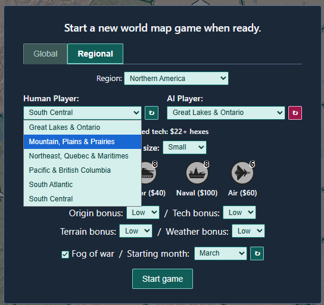
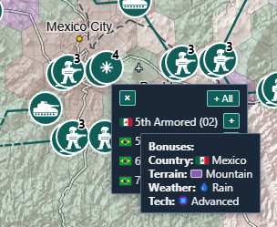
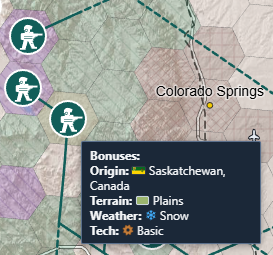

# How to play

This guide covers a match in the current build, from the new-game dialog to the end. Downloading the game and setting up the OpenRouter key for the opponent are covered under Play it in the root README of the private game tree. That section is not published here. The full rules are in [combat-rules-v3.md](combat-rules-v3.md).

## Starting a match

Each match starts on the new-game dialog, with a Global tab and a Regional tab. This regional setup puts South Central against Great Lakes & Ontario in Northern America, at Small size with fog of war, a March start, and every bonus at Low. The open list shows the region's other side groups. The badges over each unit type are the per-side caps for the chosen game size, and the prices follow the selected region.

## Playing a turn

1. **Pan:** Drag with the left mouse button, or use WASD / arrow keys.
2. **Zoom:** Mouse wheel (zooms toward the cursor). Zoomed in, contested strategic hexes show a marker that starts a tactical battle.
3. **Select units:** Click a teal (human) unit's icon. A lone unit is selected right away. A stack opens a list of its units, where you can pick one or use **+ All**.
4. **Issue a move order:** With units selected, double-click a destination hex (land/water/terrain rules apply). The order appears under "Movement orders." Standing march orders can also be set for multi-turn movement.
5. **Ranged attack (armor or naval on strategic; broader types on tactical):** With capable units selected, click **Ranged**, then double-click an enemy hex within range. An all-air selection shows **Strike** instead. Attacks are submitted with Ready.
6. **Ready:** Click **Ready** to submit orders and resolve the turn. A side wins by controlling the enemy home or wiping out its urban cells (rules in [region-vs-region.md](region-vs-region.md)), or by destroying every enemy unit. The new-game dialog then returns for the next match.
7. You can issue multiple movement and ranged orders (one per unit each) before clicking Ready.

## Unit bonuses

Hovering a unit's flag, in the stack list or anywhere else it appears, or the token of a one-unit hex, shows the bonuses that unit was born with. On the left, a stack near Mexico City is open, and the tooltip belongs to an armor unit born in the Mexican mountains in rain, with advanced tech. On the right, a lone unit near Colorado Springs was born on Saskatchewan plains in snow, with basic tech.

| Stack list near Mexico City | Lone unit near Colorado Springs |
| --- | --- |
|  |  |

## Where messages appear

- **Lower right of the map (map toast):** Errors, rejected orders, turn-loss summaries, and unknown-battle announcements. Use the × to dismiss; it also hides after a fixed interval, and a newer message replaces it.
- **Upper right of the map (AI strategy toast):** The opponent's Message and Strategy after a consultation. It dismisses and times out the same way.
- **Right panel, below the Tools and Model tabs (AI activity log):** AI interaction lines and errors, including a one-line copy of each turn update. Starting a new match clears it.

## UI controls summary

- Pan: drag with left mouse, or WASD / arrows.
- Zoom in/out: mouse wheel.
- Select units: click a unit icon; a stack opens its unit list.
- Add or remove a lone unit from the selection: Shift-click its icon.
- Clear the selection: right-click the map. Queued orders stay.
- Add move order: select units, then double-click the destination.
- Ranged attack: select capable units, click "Ranged", then double-click an enemy hex in range.
- Resolve turn: Ready button.
- See under the terrain: hold T. Terrain fill hides while the key is down, and on the strategic map hex codes and, where they apply, tech icons show.
- Close a popup or the unit list: Escape.
- New game: **New** on the Model tab during strategic planning, or the dialog that opens at game over.

The full input map, including the exceptions, is in [ux/input-map.md](ux/input-map.md).
