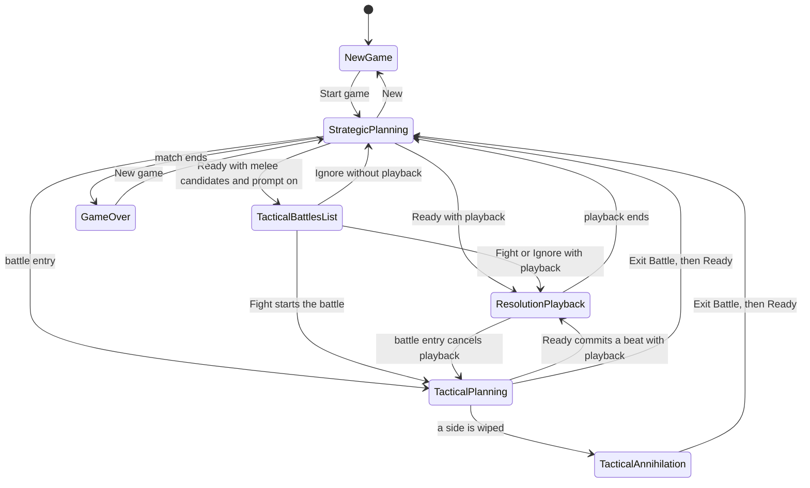

# Modes and Transitions

The desktop UI is in one primary mode at a time. A few conditions, such as waiting on the AI opponent, change a control inside a mode without replacing the mode.

## Purpose

Name the modes a player can be in, what starts and ends each one, and what planning state survives the change. Later documents use these names only.

## Mode List

### New game

The player sees the new-game overlay. The message is "Start the world map game when ready." when no match is loaded, and "Start a new world map game when ready." when the player opened the overlay from the Model tab during a match. The button reads "Start game". The player can choose home regions, game size, and fog of war, then start. The map and the right panel do not accept input. Ready is disabled. This mode ends when Start game succeeds and a match is loaded.

### Strategic planning

The player sees the strategic world map and the right panel. The game-state readout shows "Phase: Planning" and the strategic turn. The player can pan and zoom, select units, draft orders, open build and stack popups, and press Ready when it is enabled. Strategic planning is blocked while the new-game overlay, the game-over overlay, or the tactical annihilation dialog is open, and it is replaced while a tactical battle is active or the tactical battles list is open.

While the Run control is pressed and the opponent's precomputed orders are not ready yet, Ready is disabled and its label becomes "AI:" plus an elapsed time. The map stays usable. Pressing Ready in that condition shows a map toast that planning is still running and does not end the turn. After a failed AI planning request, Ready becomes usable again with an empty opponent plan.

While a Ready request is in flight, Ready stays disabled and keeps the label "Ready". A failed Ready request shows the reason on the map toast and returns the player to strategic planning.

### Tactical battles list

The player sees a dialog titled "Tactical Battles (N)", where N is the number of candidate hexes. Each row offers a choice, the hex information, a human unit summary, and an AI unit summary. Fight stays disabled until a row is chosen. Ignore is always available. The dialog covers the window on a dimmed backdrop. The map and the right panel stay as they were when Ready paused, and they do not receive pointer input. This dialog opens after Ready when the match reports melee candidates and the Tactical battles checkbox is checked. When that checkbox is unchecked, the dialog does not open and the turn continues as if the player chose Ignore.

Choosing Fight or Ignore closes the dialog. Escape and a click on the dimmed backdrop choose Ignore. Fight then starts a tactical battle on the chosen hex after the strategic turn finishes resolving. Ignore resolves melee without entering a tactical battle.

### Resolution playback

The player sees units and combat results animate on the current map. A map toast may summarize losses the player can see. Combat the player cannot see is announced as an unknown battle, with continent names when those names are available. Playback runs after Ready, or after a tactical Ready commit, when the resolved turn has movement or combat to show. It ends when the animation finishes.

Playback does not replace the underlying match: the game-state readout can already show the next planning turn while the animation is still running. Until the animation ends, map gestures that change orders or the selection are ignored. Pan, zoom, hex tooltips, and right-click still work, and the right panel keeps its own rules. Details are in [resolution-playback.md](resolution-playback.md). Starting a tactical battle cancels a strategic playback that is still running. Leaving a tactical battle also cancels playback.

Ready stays disabled while a deferred opponent consultation is still outstanding after playback was scheduled. The label stays "Ready" during that wait.

### Tactical planning

The player sees the battle map for one contested hex, the Exit Battle control, and the same right panel. The turn readout shows the tactical turn. The player drafts tactical orders and presses Ready to commit a beat. Exit Battle is enabled while the player drafts. It is disabled from the tactical Ready commit until that beat's playback ends, and hidden while the annihilation dialog is open. The phase line reads "Phase: Tactical planning" while drafting and "Phase: Tactical resolution" while a beat resolves.

Clicks outside the battle area show an error toast and do not issue an order. The right panel stays usable. Strategic drafts are hidden for the duration of the battle and restored when it ends, except drafts whose units no longer exist.

Tactical planning ends when the player exits, when the battle is reconciled away because the strategic turn no longer matches, or when annihilation opens.

While Run is pressed, opponent sub-units remain, and no opponent plan is buffered yet, Ready is disabled with the same "AI:" elapsed-time label used in strategic planning.

### Tactical annihilation

The player sees an overlay with "You win!", "You lose.", or "All units destroyed.", and an Exit Battle button. The map and the right panel do not accept input. The in-battle Exit Battle control is hidden, and Ready is disabled. Any in-flight AI planning request is cancelled. This mode ends when the player presses Exit Battle, which leaves the battle, returns to strategic planning, and then runs Ready.

### Game over

The player sees the same overlay as New game. The message is "You win!" or "You lose." The button reads "New game". The map and the right panel do not accept input, and Ready is disabled. Starting a new match leaves this mode for strategic planning.

## Transitions

- App start with no loaded match -> New game.
- New game -> Strategic planning: Start game succeeds.
- Strategic planning -> New game: New on the Model tab. In-flight AI planning is cancelled.
- Strategic planning -> Tactical battles list: Ready reports melee candidates and the Tactical battles checkbox is checked.
- Strategic planning -> Resolution playback: Ready succeeds and the turn has movement or combat to animate. If the Tactical battles checkbox is unchecked, melee is ignored without the list.
- Strategic planning -> Tactical planning: the player uses a tactical entry marker, or Fight auto-starts the chosen battle.
- Strategic planning -> Game over: the loaded match is over.
- Tactical battles list -> Strategic planning, Resolution playback, or Tactical planning: Ignore or Fight, as above. Fight can both play back the strategic turn and then enter the battle, which cancels leftover playback.
- Resolution playback -> Strategic planning: the animation finishes.
- Resolution playback -> Tactical planning: battle entry cancels playback.
- Tactical planning -> Resolution playback: Ready commits a beat that has movement or combat to animate.
- Tactical planning -> Tactical annihilation: the beat leaves at least one side with no units.
- Tactical planning -> Strategic planning: Exit Battle succeeds, then Ready runs. A failed exit shows an error toast and stays in tactical planning.
- Tactical annihilation -> Strategic planning: Exit Battle, then Ready runs.
- Game over -> Strategic planning: New game succeeds.
- A loaded tactical session that the strategic turn no longer matches -> Strategic planning: the battle view closes without the exit button.

## State Carried Across Transitions

- New game and Game over into Strategic planning: selection, hex selection, draft orders, the strategic-order stash, hover preview, the running AI cost, and the AI activity log are cleared. The map view is whatever the new match opens.
- Strategic planning into Tactical planning: strategic draft orders are stashed and the order lists empty. Ranged and Strike targeting turn off. The build popup closes. Selection is reconciled to units that exist in the battle, which is usually empty. The map view changes to the battle area.
- Tactical planning or Tactical annihilation into Strategic planning: tactical draft orders are cleared. Stashed strategic drafts return, minus drafts whose units are gone. The map view leaves the battle area. A failed exit does not clear the battle. A successful exit then runs Ready, using the same rules as pressing Ready in Strategic planning. That can submit the restored drafts, open the tactical battles list, or start resolution playback. It does nothing while a deferred consultation is outstanding, and it shows the AI-wait toast while opponent orders are not ready.
- Ready, in either theater: a successful commit clears the drafts that were just submitted. Grouped march and ferry commits also clear the selection. Hover preview is cleared after strategic Ready. Tactical march continuations can reappear as pending movement after a tactical commit.
- Resolution playback: it does not by itself clear the stash or restore drafts. Cancelling playback to enter a battle flushes a deferred consultation notice if one was waiting on the animation.
- Opening New during a match discards the stash instead of restoring it.

## Strategic and Tactical Theaters

Strategic means no tactical battle is active: the world map, strategic turns, and strategic orders. Tactical means a battle is active: the battle map, tactical turns, and tactical orders. Game over, New game, and the tactical battles list are strategic-side interruptions. Tactical annihilation is a tactical-side interruption. Resolution playback uses whichever map is current.

On the map, tactical play limits orders to the battle area and shows the battle turn. The right panel stays visible in both theaters; its turn readout and order lists follow the active theater. Build markers are hidden when a battle starts. Tactical entry markers are a strategic-planning affordance. Exit Battle and the annihilation dialog exist only in a battle. Details live in [map-surface.md](map-surface.md), [right-panel.md](right-panel.md), [tactical-entry-markers.md](tactical-entry-markers.md), and [tactical-battle-controls.md](tactical-battle-controls.md).

## Invariants

- The new-game overlay and the game-over overlay are the same surface. Only the message and the button label change. The three entry texts stay distinct so the player can tell startup, New, and game over apart.
- AI wait is a condition on Ready inside Strategic planning and Tactical planning, not a mode. It never locks the map or the right panel.
- Ready never ends the turn while the match is over, while a Ready request is in flight, while the annihilation dialog is open, or while a deferred post-resolution consultation is outstanding.
- Unchecking Tactical battles never opens the tactical battles list. Melee resolves as Ignore.
- Strategic draft orders are not discarded merely by entering a tactical battle. They return when the battle ends, except for units that no longer exist. A successful exit then runs Ready.
- A click outside the battle area during tactical planning never issues a strategic order.

## Open Questions

None.

## Code Entry Points

- `static/index.html` (`#game-over-overlay`, `#tactical-annihilation-overlay`, `#tactical-battle-hud`, `#ready-btn`)
- `src/renderer/core/uiState.ts`
- `src/renderer/gameplay/newGame.ts`
- `src/renderer/gameplay/readyHandler.ts`
- `src/renderer/gameplay/meleeInterceptModal.ts`
- `src/renderer/gameplay/tacticalBattlePromptPreference.ts`
- `src/renderer/openRouter/aiPlanningState.ts`
- `src/renderer/openRouter/openRouterUiHelpers.ts`
- `src/renderer/openRouter/resolutionPlaybackDeferral.ts`
- `src/renderer/rendering/resolutionPlayback.ts`
- `src/renderer/tactical/tacticalAnnihilationDialog.ts`
- `src/renderer/tactical/tacticalEntryFlow.ts`
- `src/renderer/tactical/tacticalExitFlow.ts`
- `src/renderer/tactical/tacticalIpcHandlers.ts`
- `src/renderer/tactical/tacticalStrategicOrderUiStash.ts`
- `src/renderer/tactical/tacticalUiGuards.ts`
- `src/renderer/tactical/tacticalUiOrchestration.ts`
- `src/renderer/tactical/tacticalExitButtonDom.ts`
